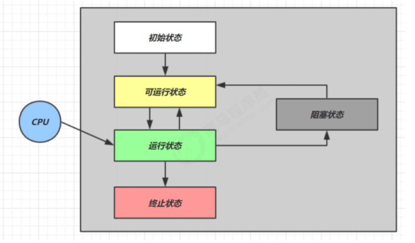
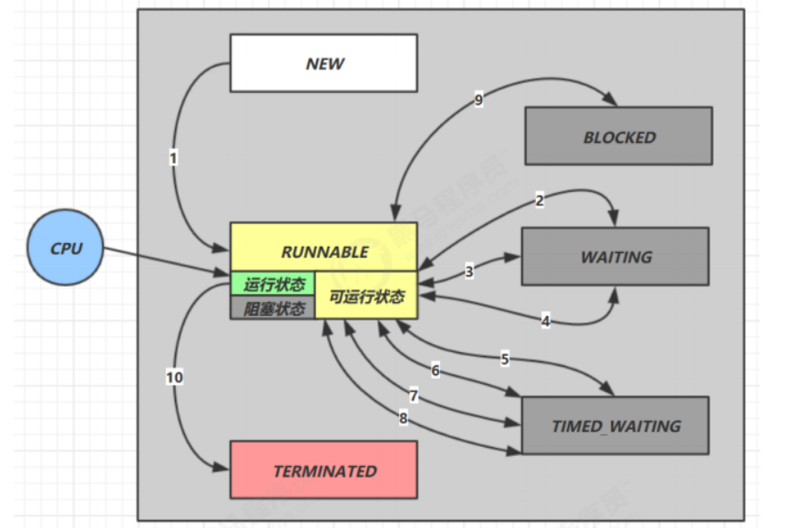
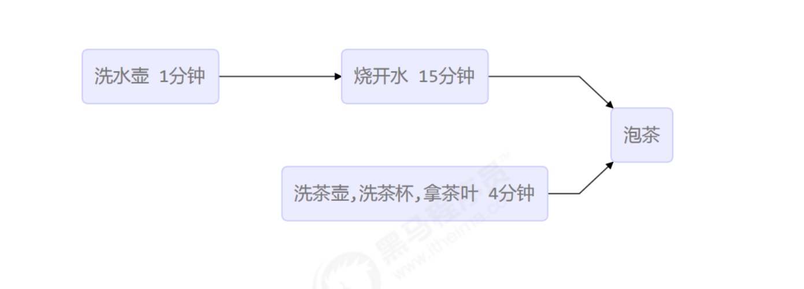

# Java线程

## 创建线程

### 一 、直接使用 Thread

继承 Thread 类并重写其 run 方法

```java
Thread t = new Thread("t1"){
	public void run(){
	// 执行任务
	}
};
// 启动线程
t.start();
```

### 二、使用 Runnable 配合 Thread

构造 Thread 对象并传入一个 Runnable 对象

优点：把【线程】和【任务】分开

- Thread 代表线程
- Runnable 可运行的任务(线程要执行的代码)

```java
Runnable r = new Runnable() {
	public void run(){

	}
}
Thread t = new Thread(r);
t.start
```

#### 原理之 Thread 与 Runnablede 关系

```java
public Thread(Runnable target) {  
    init(null, target, "Thread-" + nextThreadNum(), 0);  
}
```

在 Thread 的构造方法里会将 Runnable 对象作为 target 参数传入 init 方法， 在 init 方法中再将target 赋给实例变量 target

```java
/* What will be run. */
private Runnable target;
```

```java
private void init(ThreadGroup g, Runnable target,...){
	...
	this.target = target;
	...
}
```

在线程启动后调用 run 方法时，如果发现 Runnable 类型的 target 参数不为 null，则调用其 run 方法

```java
public void run() {
	if (target != null) {
		target.run();
	}
}
```

#### 小结

- 方式一是将线程和任务合并在了一起，方式二是将线程和任务分开了
- 方式一为继承方式，方式二为组合方法，组合优先于继承
- 用 Runnable 更容易与线程池等高级 API 配合
- 用 Runnable 让任务类脱离了 Thread 继承体系，更灵活

### 三、使用 Callable、FutureTask 配合 Thread

向 FutureTask 对象中传入 callable 对象 ，再将 FutureTask 对象传入 Thread对象中，可以处理有返回值的情况

```java
FutureTask<Integer> task = new FutureTask<>(() -> {  
	log.debug("running");  
	return 100;  
});  
Thread t = new Thread(task, "t");  
t.start();  
log.debug("res: {}", task.get());

```

## 查看进程线程的方法

### windows

- tasklist 查看进程
- taskkill /f /pid 强制终止进程

### linux

- ps -fe 查看所有进程
- ps -fT -p  [ PID ]  查看某个进程（PID）的所有线程
- top 动态查看所有进程
- top -H -p [ PID ] 动态 查看某个进程（PID）的所有线程

### Java

- jps -l 查看所有 Java 进程
- jstack [ PID ]  查看某个 Java 进程的所有线程状态
- jconsole 来查看某个 Java 进程中线程的运行情况（图形界面）

jconsole 远程监控配置

```linux
java
-Djava.rmi.server.hostname=`ip地址`
-Dcom.sun.management.jmxremote
-Dcom.sun.management.jmxremote.port=`连接端口`
-Dcom.sun.management.jmxremote.ssl=是否安全连接
-Dcom.sun.management.jmxremote.authenticate=是否认证 java类
```

## 栈与栈帧

Java Virtual Machine Stacks ( Java 虚拟机栈 )

JVM 由堆、栈、方法区组成，其中栈内存是给线程用的。每个线程启动后，虚拟机就会为其分配一块栈内存。

- 每个栈由多个栈帧( Frame ) 组成，对应着每次方法调用能时所占用的内存
- 每个线程只能有一个活动栈帧吗，对应着当前正在执行的方法

## 线程上下文切换 ( Thread Context Switch )

因为以下一些原因导致 cpu 不再执行当前的线程，转而执行另一个线程的代码

- 线程的 cpu 时间片用完
- 垃圾回收
- 有更高优先级的线程需要运行
- 线程自己调用了 sleep、yield、wait、park、synchronized、lock等方法

当 Context Switch 发生时，需要由操作系统保存当前线程的状态，并恢复另一个线程的状态，Java 中对应的概念就是程序计数器 ( Program Counter Register )，它的作用是记住下一条 jvm 指令的地址，是线程私有的

- 状态包括程序计数器、虚拟机栈中每个栈帧的信息，如局部变量、操作数栈、返回地址等
- Context Switch 频繁发生会影响性能

## 常见方法

| 方法名 | 功能说明 | 注意 |
| :----: | :-----: | :--: |
| start() | 启动一个新线程，在新的线程运行run方法中的代码 | start 方法只是让线程进入就绪，里面的代码不一定立刻就运行 ( cpu 的时间片还没分给它 )。每个线程对象的 start 方法只能调用一次，如果调用了多次会出现 IllegalThreadStateException
| run() | 新线程启动后会调用的方法 | 如果在构造 Thread 对象时传递了 Runnable 参数， 则线程启动后会调用 Runnable 中的 run 方法，否则默认不执行任何操作。但可以创建 Thread 的子类对象来覆盖默认行为
| join() | 等待调用线程运行结束 |
| join(long n) | 等待调用线程运行结束，最多等待 n 毫秒|
| getId() | 获取线程长整型的 id | id 唯一
| getName() | 获取线程名
| setName(String) | 修改线程名
| getPriority() | 获取线程优先级
| setPriority(int) | 修改线程优先级 | Java 中规定线程优先级是 1-10 的整数，较大的优先级能提高该线程被 CPU 调度的机率
| getState() | 获取线程状态 | Java 中的线程状态使用 6 个枚举表示， 分别分 NEW、Runnable、BLOCKED、WAITING、TIMED_WAITING、TERMINATED
| isInterrupted() | 判断是否被打断 | 不会清除**打断标记**
| isAlive() | 线程是否存活 (还没有运行完毕 )
| interrupt() | 打断线程 | 如果被打断的线程正在 sleep、wait、join， 会导致打断的线程抛出 InterruptedException， 并清除打断标记；如果打断正在运行的线程，则会设置打断标记；park 的线程被打断，也会清除打断标记
|interrupted() | 判断当前线程是否被打断 | 会清除打断标记
| currentThread() | 获取当前正在执行的线程
| sleep(long n) | 让当前线程休眠 n 毫秒，休眠时让出 cpu 的时间片给其他线程
| yield() | 提示线程调度器让出当前线程对 cpu 的使用 | 主要是为了测试和调试

## sleep 与 yiled

### sleep

- 调用 sleep 会让当前线程从 Running 进入 Timed Waiting 状态 ( **阻塞**)
- 其他线程可以使用 interrupt 方法打断正在睡眠的线程，这时 sleep 方法会抛出InterruptedException
- 睡眠结束后的线程未必会立刻得到执行，cpu 可能在执行其他线程，时间片还没有分给它
- 建议使用 TimeUnit 的 sleep 代替 Thread 的 sleep 来获得更好的可读性

### yield

- 调用 yield 会让当前线程从 Running 进入 Runnable 就绪状态，然后调度其他线程
- 具体的依赖于操作系统的任务调度器

### 二者区别

- yield 虽然会让当前线程进入就绪状态，但是可能会被任务调度器再一次调度，因为任务调度器在分时间片时会考虑就绪状态。而 sleep 是让线程进入阻塞状态，不会再次被调度

## 线程优先级

- 优先级范围

```java

/**
 * The minimum priority that a thread can have.
 */
public final static int MIN_PRIORITY = 1;

/**
 * The default priority that is assigned to a thread.
 */
public final static int NORM_PRIORITY = 5;

/**
 * The maximum priority that a thread can have.
 */
public final static int MAX_PRIORITY = 10;
```

- 线程优先级会提示( hint ) 调度器优先调度该线程，但它仅仅是一个提示，调度器可以忽略
- 如果 cpu 比较忙，那么高优先级的线程会获得更多的时间片，但是 cpu 闲时，优先级几乎没作用

## 案例-防止 cpu 占用100%

### sleep 实现

在没有利用 cpu 来计算时，不要让 while(true) 空转浪费 cpu， 这时可以使用yiled或 sleep 来让出来 cpu 的使用权给其他程序

```java
while(true){
	try{
		Thread.sleep(50);
	}catch(InterruptedException e){
		e.printStackTrace();
	}
}
```

- 可以用 wait 或条件变量达到类似效果
- 不同的是，后两种都需要加锁，并且需要相应的唤醒操作，一般适用于要进行同步的场景
- sleep 适用于无需锁同步的场景

## join方法详解

join 方法会让当前线程 (如 main) 去判断调用 join() 的线程对象(如 t.join() 的 t)是否 Runnable，如果正在 Runnable，那么 main 线程会进入 WAITING，直到阻塞时间到或者被 notify。t 线程执行完毕时，jvm 会调用 lock.notify_all(thread) 唤醒阻塞在 t 对象监视器上的所有线程，则 main 被唤醒继续执行

### 为什么需要join

下面的代码执行，打印 r 是什么？

```java
    static int r = 0;

    public static void main(String[] args) {
        test1();
    }

    private static void test1() {
        log.debug("start");
        Thread t1 = new Thread(() -> {
            log.debug("start");
            try {
                TimeUnit.SECONDS.sleep(1);
            } catch (InterruptedException e) {
                e.printStackTrace();
            }
            log.debug("end");
            r = 10;
        });

        t1.start();
        log.debug("res: {}", r);
        log.debug("end");
    }
```

分析

- 因为主线程和线程 t1 是并行执行的，t1 线程需要 1 秒之后才能算出 r = 10
- 而主线程一开始就会打印 r 的结果

解决方法

- 用 sleep 行不行，为什么
- 用 join， 加在 t1.start() 之后即可

## interrupt 方法详解

作用：打断当前线程，线程被打断后打断标志会置为 true

### 打断 slepp、wait、join 线程

这几个方法都会让线程进入阻塞状态

- 打断阻塞线程会清空打断标记再次置为 false，以 sleep 为例

 ```java
 private static void test() throws Exception {
     Thread t1 = new Thread(() -> {
         sleep(1);
     }, "t1");
     t1.start();
     sleep(0.5);
     t1.interrupt();
     log.debug("打断状态： {}", t1.isInterrupted());
 }
 ```

out：

```Java
[main] DEBUG com.gzc.InterruptDemo - 打断状态： false
```

### 打断正常线程

打断正常线程不会清楚打断标记，仅将打断标志置为 true

```Java
 public static void main(String[] args) throws InterruptedException {
        Thread t = new Thread(() -> {
            while (true) {
                if (Thread.currentThread().isInterrupted())
                    break;
            }
        });
        t.start();
        TimeUnit.SECONDS.sleep(1);
        log.info("interrupt");
        t.interrupt();

    }
```

通过判断打断标志来判断是否要终止线程

### 两阶段终止模式

在一个线程 T1 中如何“优雅”终止线程 T2 ？这里的优雅是给 T2 一个料理后事的机会

#### 错误思路

- 使用线程对象的 stop() 方法停止线程
  stop() 方法会真正杀死线程，如果这时线程锁住了共享资源，那么当它被杀死后就再也没有机会释放锁，其他线程将永远无法获取锁

- 使用 System.exit(init) 方法停止线程
  目的仅是停止一个线程，但这种做法会让整个程序停止

#### 设计两阶段终止模式


```java
@Slf4j
public class TwoPhaseTerminationDemo {

    public static void main(String[] args) throws InterruptedException {

        TwoPhaseTermination tpt = new TwoPhaseTermination();
        tpt.start();
        TimeUnit.SECONDS.sleep(10);
        tpt.stop();
    }
}

@Slf4j
class TwoPhaseTermination {

    private Thread monitor;

    // 启动监控线程
    public void start() {
        monitor = new Thread(() ->{
            while (true){
                Thread current = Thread.currentThread();
                if(current.isInterrupted()){
                    log.info("料理后事");
                    break;
                }
                try {
                    TimeUnit.SECONDS.sleep(2);
                    log.info("执行监控");
                } catch (InterruptedException e) {
                    e.printStackTrace();
                    // 重新设置打断标志
                    current.interrupt();
                }
            }
        });
        monitor.start();
    }

    // 停止监控线程
    public void stop() {
        monitor.interrupt();
    }
}
```

### 打断 park 线程

使用 isInterrupted() 打断 park 线程，不会清除打断标记

```java
 public static void main(String[] args) throws InterruptedException {
        Thread t = new Thread(() -> {
            log.info("park.....");
            LockSupport.park();
            log.info("un park......");
            log.info("打断状态：{}", Thread.currentThread().isInterrupted());
        });

        t.start();
        TimeUnit.SECONDS.sleep(1);
        t.interrupt();
    }
```

out:

```java
[Thread-0] INFO com.gzc.InterruptParkDemo - park.....
[Thread-0] INFO com.gzc.InterruptParkDemo - un park......
[Thread-0] INFO com.gzc.InterruptParkDemo - 打断状态：true
```

打断标记为 true 的状态下，park 会失效

```java
 public static void main(String[] args) throws InterruptedException {
        Thread t = new Thread(() -> {
            log.info("park.....");
            LockSupport.park();
            log.info("un park......");
            log.info("打断状态：{}", Thread.currentThread().isInterrupted());
            LockSupport.park();
            log.info("un park......");
        });

        t.start();
        TimeUnit.SECONDS.sleep(1);
        t.interrupt();
    }
```

```java
[Thread-0] INFO com.gzc.InterruptParkDemo - park.....
[Thread-0] INFO com.gzc.InterruptParkDemo - un park......
[Thread-0] INFO com.gzc.InterruptParkDemo - 打断状态：true
[Thread-0] INFO com.gzc.InterruptParkDemo - un park......
```
可以使用 **Thread.interrupted()** 清楚打断状态

## 不推荐的方法

还有一些不推荐使用的方法，这些方法已过时，容易破环同步代码块，造成线程死锁

| 方法名 | 功能说明 |
| ----- | --------|
| stop() | 停止线程运行 |
| suspend() | 挂起（暂停）线程运行 |
| resume() | 恢复线程运行 |

## 主线程与守护线程

默认情况下，Java 进程需要等待所有线程都运行结束，才会结束。
有一种特殊的线程叫做守护线程，只要非守护线程运行结束了，即使守护线程的代码没有执行完，也会强制结束。

```java

 public static void main(String[] args) {
        log.info("开始运行...");
        Thread t1 = new Thread(() -> {
            log.info("开始运行...");
            sleep(2);
            log.info("运行结束...");
        }, "daemon");
        // 设置该线程为守护线程
        t1.setDaemon(true);
        t1.start();
        sleep(1);
        log.info("运行结束...");
    }
```

out:

```java
[main] INFO com.gzc.InterruptParkDemo - 开始运行...
[daemon] INFO com.gzc.InterruptParkDemo - 开始运行...
[main] INFO com.gzc.InterruptParkDemo - 运行结束...
```

### 注意

- 垃圾回收器就是一种守护线程
- Tomcat 中的Acceptor 和 Poller 线程都是守护线程，所以 Tomcat 接收到 shutdown 命令后，不会等待她们处理完当前请求
  
## 五种状态

这是从操作系统层面来描述的



- 【初始状态】仅是在语言层面创建了线程对象，还未与操作系统线程关联
- 【可运行状态】(就绪状态)指该线程已经被创建(与操作系统相关联)，可由 cpu 调度执行
- 【运行状态】指获取了 CPU 时间片运行中的状态
  - 当 CPU 时间片用完，会从【运行状态】 转换至【可运行状态】，会导致线程的上下文切换
- 【阻塞状态】
  - 如果调用了阻塞 API，如  BIO 读写文件，这是该线程实际不会用到 CPU，会导致线程上下文切换，进入【阻塞状态】
  - 等 BIO 结束，会由操作系统唤醒阻塞的线程，转换至【可运行状态】
  - 与【可运行状态】的区别是，对【阻塞状态】的线程来说只要它们一直不被唤醒，调度器就是一直不会考虑调度它们
- 【终止状态】表示线程已经执行完毕，生命周期已经结束，不会再转换为其他状态

## 六种状态

这是从 Java API 层面来描述

根据 Thread.State 枚举，分为六种状态：



- 【NEW】线程刚被创建，但是还没有调用 start() 方法
- 【RUNNABLE】当调用了 start() 方法后，注意 **Java API** 层面的 RUNNABLE 状态涵盖了**操作系统** 层面的【可运行状态】、【运行状态】、【阻塞状态】
   (由于 BIO 导致的线程阻塞，在 Java 里无法区分，仍然认为是可运行)
- 【BLOCKED】、【WAITING】、【TIMED_WAITING】都是 JavaApI 层面对【阻塞状态】的细分，后面会在状态转换一节详述
- 【TERMINATED】当线程代码执行结束

```java
 public static void main(String[] args) {

        // NEW
        Thread t1 = new Thread(() -> log.info("running..."), "t1");

        // RUNNABLE
        Thread t2 = new Thread(() -> {
            while (true){}
        }, "t2");
        t2.start();

        // TERMINATED
        Thread t3 = new Thread(() -> log.info("running..."), "t3");
        t3.start();

        // TIMED_WAITING
        Thread t4 = new Thread(() -> {
            synchronized (ThreadStateDemo.class) {
                sleep(100000);
            }
        });
        t4.start();

        // WAITING
        Thread t5 = new Thread(() -> {
            try {
                t2.join();
            } catch (InterruptedException e) {
                e.printStackTrace();
            }
        }, "t5");
        t5.start();

        // BLOCKED
        Thread t6 = new Thread(() -> {
            synchronized (ThreadStateDemo.class) {
                sleep(1000000);
            }
        }, "t6");
        t6.start();

        sleep(500);

        log.info("t1 state: {}", t1.getState());
        log.info("t2 state: {}", t2.getState());
        log.info("t3 state: {}", t3.getState());
        log.info("t4 state: {}", t4.getState());
        log.info("t5 state: {}", t5.getState());
        log.info("t6 state: {}", t6.getState());
    }
```

out：

```java
[main] INFO com.gzc.ThreadStateDemo - t1 state: NEW
[main] INFO com.gzc.ThreadStateDemo - t2 state: RUNNABLE
[main] INFO com.gzc.ThreadStateDemo - t3 state: TERMINATED
[main] INFO com.gzc.ThreadStateDemo - t4 state: TIMED_WAITING
[main] INFO com.gzc.ThreadStateDemo - t5 state: WAITING
[main] INFO com.gzc.ThreadStateDemo - t6 state: BLOCKED
```

## 案例：烧水泡茶



### 解法一：join

```java
public static void main(String[] args) {
        Thread t1 = new Thread(() -> {
            log.info("洗水壶");
            sleep(1);
            log.info("烧开水");
            sleep(5);
        }, "t1");

        Thread t2 = new Thread(() -> {
            log.info("洗茶壶");
            sleep(1);
            log.info("洗茶杯");
            sleep(2);
            log.info("拿茶叶");
            sleep(1);
            try {
                t1.join();
            } catch (InterruptedException e) {
                e.printStackTrace();
            }
            log.info("泡茶");
        }, "t2");
        t1.start();
        t2.start();
    }
```

out：

```java
[t1] INFO Case1 - 洗水壶
[t2] INFO Case1 - 洗茶壶
[t1] INFO Case1 - 烧开水
[t2] INFO Case1 - 洗茶杯
[t2] INFO Case1 - 拿茶叶
[t2] INFO Case1 - 泡茶
```
