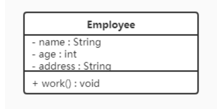
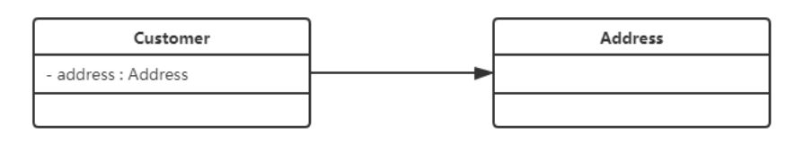
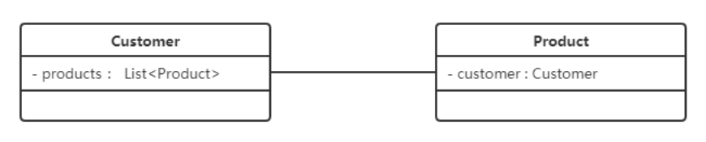
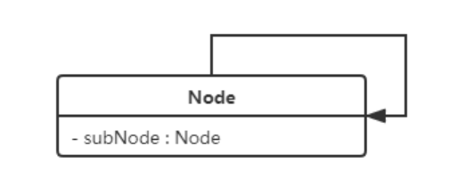
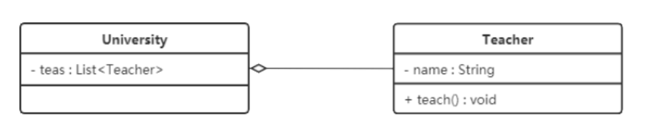
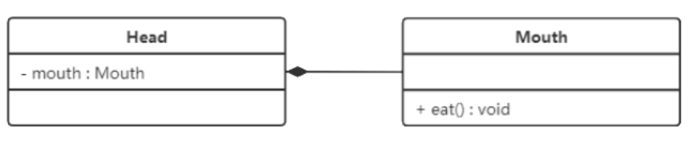
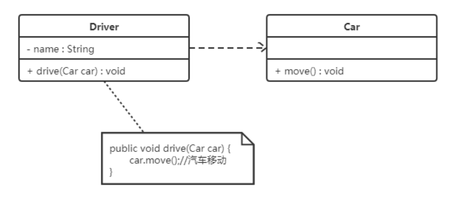
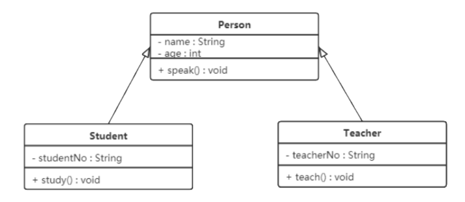
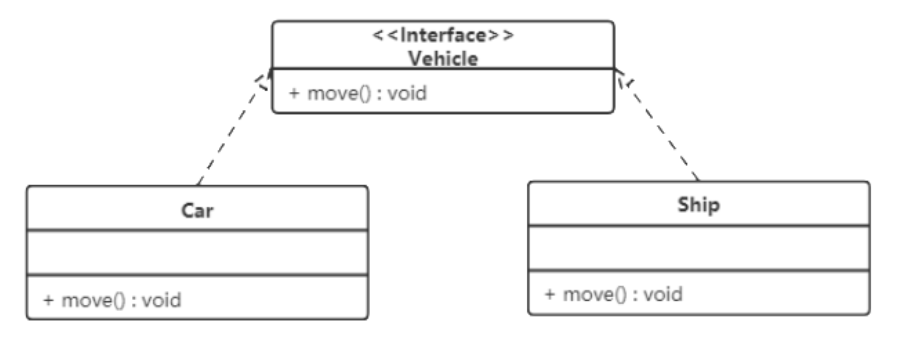

# 设计模式

## 设计模式概述

设计分为三大类

- 创建型模式

  用于描述怎样创建对象，它的主要特点是将对象的创建与使用分离。共 5 种
  - 单例
  - 原型
  - 工厂方法
  - 抽象工厂
  - 建造者

- 结构型模式

  用于描述如何将类或对象按某种布局组成更大的结构。共 7 种
  - 代理
  - 适配器
  - 桥接
  - 装饰者
  - 外观
  - 享元
  - 组合

- 行为型模式

  用于描述类或对象之间怎样相互协作共同完成单个对象无法单独完成的任务，以及怎样分配职责。共 11 种
  - 模版方法
  - 策略
  - 命令
  - 责任链
  - 状态
  - 观察者
  - 中介者
  - 迭代器
  - 访问者
  - 备忘录
  - 解释器

## UML 图

统一建模语言(Unified Modeling Language,UML) 是用来设计软件的可视化建模语言。特点是简单、统一、图形化、能表达软件设计中的动态与静态信息。

UML 从目标系统的不同角度出发，定义了 9 种图，分为用例图、类图、对象图、状态图、活动图、时序图、协作图、构件图、部署图。

### 类图概述

类图显示模型的静态结构，特别是模型中存在的类、类的内部结构以及它们与其他类的关系。类图不显示暂时性的信息，是面向对象建模的主要组成部分

### 类图表示法

在 UML 类图中，类使用包含类名、属性(field)、方法(method) 且带有分割线的矩形来表示，比如下图表示一个 Employee 类，它包含 name、age、address 3 个属性，以及 work() 方法

  

属性\方法名称前面加的加号、减号表示了这个属性\方法的可见性，UML 类图中表示可见性的符号分为三种

- +：表示 public
- -: 表示 private
- #: 表示 protected

属性的完整表示方式是：可见性 名称 : 类型 【 = 缺省值 】
方法的完整表示方式是：可见性 名称(参数列表) 【: 返回类型 】

> 注意
>
> 1. 【】 中的内容表示可选
>
> 2. 类型也可以放在变量名的前面，返回类型也可以放在方法名的前面

### 类与类之间关系的表示方式

#### 关联关系

关联关系是对象之间的一种引用关系，用于表示一类对象与另一类对象之间的联系，如老师和学生、师傅和徒弟等。

关联关系是类与类之间最常用一种关系，分为一般关系、聚合关系、组合关系

关联关系又分为单向关联、双向关联、自关联

- 单向关联

  

在 UML 类图中，单向关联用一个带箭头的实线表示。

- 双向关联

  

在 UML 类图中，双向关联用一个不带箭头的实线表示。

- 自关联

  

在 UML 类图中，自关联用一个带箭头且指向自身的实线表示。

#### 聚合关系

聚合关系是关联关系的一种，是强关联关系，是整体和部分之间的关系

聚合关系也是通过成员对象来实现的，其中成员对象是整体对象的一部分，但是成员对象可以脱离整体对象而独立存在。

例如，学校与老师的关系，学校包含老师，但如果学校停办了，老师依然存在

在 UML 类图中，聚合关系使用带空心菱形的实现来表示，菱形指向整体。

  

#### 组合关系

组合表示类之间的整体与部分的关系，但它是一种更强烈的聚合关系

在组合关系中，整体对象可以控制部分对象的生命周期，一旦整体对象不存在，部分对象也将不存在。

在 UML 类图中，组合关系用带实心菱形的实线来表示。菱形指向整体。

  

#### 依赖关系

依赖关系是一种使用关系，它是对象之间耦合度最弱的一种关联方式，是临时性的关联。在代码中，某个类的方法通过局部变量、方法的参数或对静态方法的调用来访问另一个类中的某些方法来完成一些职责

在 UML 类图中，依赖关系使用带箭头的虚线来表示。箭头从实用类指向被依赖类。

  

#### 继承关系

继承关系是对象之间耦合度最大的一种关联方法。表示一般与特殊的关系，是父类与子类之间的关系。

在 UML 类图中，泛化关系(即继承关系)用带空心的三角箭头的实线来表示。箭头从子类指向父类。

  

#### 实现关系

实现关系是接口与实现类之间的关系。在这种关系中，类实现了接口，类中的操作实现了接口中所声明的所有抽象操作。

在 UML 类图中，实现关系使用带空心三角箭头的虚线来表示。箭头从实现类指向接口。

  

## 软件设计原则

### 开闭原则

对扩展开放，对修改关闭。

在程序需要进行扩展的时候，不能去修改原有的代码，实现一个热插拔的效果。简言之，是为了使程序的扩展性好，易于维护和升级。

### 里氏代换原则

里氏代换原则是面向对象设计的基本原则之一。

即任何基类可以出现的地方，子类一定可以出现。通俗理解，子类可以扩展父类的功能，但不能改变父类原有的功能。也就是，子类继承父类时，除添加新方法完成新增功能外，尽量不要重写父类的方法。

### 依赖倒转原则

高层模块不应该依赖底层模块，两者都应该依赖其抽象；抽象不因该依赖实现，实现应该依赖抽象。简言之，面向抽象编程。

### 接口隔离原则

客户端不应该被迫依赖它不使用的方法；一个类对另一个类的依赖应该建立在最小的接口上。

### 迪米特法则

又称最小知识原则。

Talk only to your immediate friends and not to strangers. (只和你的直接朋友交谈，不跟“陌生人”说话)

即如果两个软件实现无须直接通信，那么就不应该发生直接的相互调用，可以通过第三方转发。其目的是降低类之间的耦合度，提高模块的相对独立性。

迪米特法则中的“朋友”是指：当前对象本身、当前对象的成员对象、当前对象所创建的对象、当前对象的方法参数等，这些对象同当前对象存在关联、聚合或者组合关系，可以直接方法这些对象的方法。

### 合成复用原则

即尽量使用组合或者聚合等关联关系来实现，其次才考虑继承关系来实现。

通常类的复用分为继承复用和合成复用两种。

继承复用虽然有简单和易实现的优点，但存在以下缺点：

- 继承复用破坏了类的封装性。因为继承会将父类的实现细节暴露给子类，父类对子类是透明的，所以这种复用又称为“白箱”复用。
- 子类与父类的耦合度高。父类的实现的任何改变都会导致子类的实现发生变化，不利于类的扩展和维护。
- 限制了复用的灵活性。从父类继承的实现是静态的，在编译时已经定义，所以在运行时不能发生变化、

采用组合或聚合复用时，可以将已有对象纳入新对象中，使之成为新对象的一部分，新对象可以调用已有对象的功能，它有以下优点：

- 维持了类的封装性。因为成分对象的内部细节是新对象看不见的，所以这种复用又称为“黑箱”复用。
- 对象间的耦合度低。可以在类的成员位置声明抽象。
- 复用的灵活性高。这用复用可以在运行时动态进行，新对象可以动态引用与成分对象类型相同的对象。

## 创建者模式

创建者模式的主要关注点是怎么创建对象，主要特点是将对象的创建与使用分离

这样可以降低系统的耦合度，使用者不需要关注对象的创建细节

### 单例模式 [( singleton )](https://github.com/CheneyKwok/java-notes/blob/main/design-patterns/src/main/java/com/gzc/singleton/App.java)

单例模式(Singleton Pattern) 是 Java 中最简单的设计模式之一。它提供了一种创建对象的最佳方式。

单例模式确保对象只有一个实例，并提供一个全局访问点。

#### 饿汉式

```java
/**
 * 饿汉式线程安全单例实现
 */
public final class IvoryTower {

    private IvoryTower() {
    }

    private static final IvoryTower INSTANCE = new IvoryTower();

    public static IvoryTower getInstance() {
        return INSTANCE;
    }
}
```

#### 饿汉式-枚举

```java
/**
 * 基于枚举的线程安全单例实现
 */
public enum EnumIvoryTower {

    INSTANCE;

    @Override
    public String toString() {
        return getDeclaringClass().getCanonicalName() + "@" + hashCode();
    }
}
```

#### 懒汉式-synchronized

```java
/**
 * 线程安全的懒汉式单例实现
 *
 * 每次获取单例都会加锁
 */
public class ThreadSafeLazyIvoryTower {

    private static ThreadSafeLazyIvoryTower INSTANCE;

    private ThreadSafeLazyIvoryTower() {
    }

    public static synchronized ThreadSafeLazyIvoryTower getInstance() {
        ThreadSafeLazyIvoryTower result = INSTANCE;
        if (result == null) {
            INSTANCE = result = new ThreadSafeLazyIvoryTower();
        }
        return result;
    }
}
```

#### 懒汉式-静态内部类

```java
/**
 * 基于静态内部类实现的懒汉式线程安全单例实现
 * 内部类的引用不早于 getInstance() 的调用，且是线程安全的
 *
 */
public final class InitializingOnInnerClassLazyIvoryTower {

    private InitializingOnInnerClassLazyIvoryTower() {
    }

    public static InitializingOnInnerClassLazyIvoryTower getInstance() {
        return HelperHolder.INSTANCE;
    }

    /**
     * 提供延迟加载的单实例
     */
    private static class HelperHolder {
        private static final InitializingOnInnerClassLazyIvoryTower INSTANCE = new InitializingOnInnerClassLazyIvoryTower();
    }
}
```

#### 懒汉式-双重检查锁定

```java
/**
 * 线程安全的双重检查锁定的单例实现
 *
 * 使用 volatile 锁定，禁止指令重排
 *
 * 只有初始化的时候才会加锁，后续获取不会加锁
 */
public final class ThreadSafeDoubleCheckLockingLazyIvoryTower {

    private static volatile ThreadSafeDoubleCheckLockingLazyIvoryTower INSTANCE;

    private ThreadSafeDoubleCheckLockingLazyIvoryTower() {
        // 防止通过反射调用实例化
        if (INSTANCE == null) {
            INSTANCE = this;
        } else {
            throw new IllegalStateException("Already initialized");
        }
    }

    public static ThreadSafeDoubleCheckLockingLazyIvoryTower getInstance() {
        ThreadSafeDoubleCheckLockingLazyIvoryTower result = INSTANCE;

        if (result == null) {
            synchronized (ThreadSafeDoubleCheckLockingLazyIvoryTower.class) {
                result = INSTANCE;
                if (result == null) {
                    INSTANCE = result = new ThreadSafeDoubleCheckLockingLazyIvoryTower();
                }
            }
        }
        return result;
    }

    /**
     * 防反序列化
     */
    public Object readResolve() {
        return INSTANCE;
    }
}
```

#### 简单工厂模式 [( factory )](https://github.com/CheneyKwok/java-notes/blob/main/design-patterns/src/main/java/com/gzc/factory/App.java)

简单工厂实际不属于 23 种设计模式，反而像一种编程习惯。

简单工厂结构：

- 抽象产品：定义了产品的规范，描述了产品的主要特性和功能。
- 具体产品：实现或继承抽象产品的子类。
- 具体工厂：提供创建产品的方法。

优点：提供一个静态方法来创建和返回不同类的对象，以隐藏实现逻辑并使客户端代码专注于使用而不是对象的初始化和管理。
缺点：增加新类型的对象时需要修改工厂类的方法，违背了`开闭原则`。
