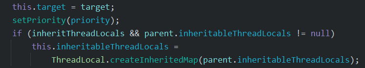
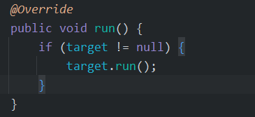

  # JUC

## 进程与线程

### 进程
- 程序：由指令和数据组成，但这些指令要运行，数据要读写，就必须将指令加载至CPU，数据加载至内存。
在指令运行过程中还需要用到磁盘、网络等设备。进程就是用来加载指令、管理内存、管理IO的
- 当一个程序被运行，从磁盘加载这个程序的代码至内存，这就开启了一个进程。
- 进程可以视为程序的一个实例。大部分程序可以同时运行多个实例进程(例如记事本、画图、浏览器)，也有程序只能启动一个实例进程(例如网易云音乐)

### 线程
- 一个进程之内可以分为一到多个线程
- 一个线程就是一个指令流，将指令流中的一条条指定以一定的顺序交给 CPU 执行
- Java中， 线程作为最小调度单位，进程作为资源分配的最小单位。在windows中进程是不活动的，只是作为线程的容器


**二者对比**
- 进程基本上相互独立的，而线程存在于进程内，是进程的一个子集
- 进程拥有共享的资源，如内存空间等，供其内部的线程共享
- 进程间通信较为复杂
  - 同一台计算机的进程通信称为 IPC (Inter-process communication)
  - 不同计算机之间的进程通信，需要通过网路，并遵守共同的协议，例如 HTTP
- 线程通讯相对简单，因为它们共享进程内的内存，一个例子是多个线程可以访问同一个共享变量
- 线程更轻量，线程上下文切换成本一般上要比进程上下文切换低

## 并行与并发

单核 cpu 下，线程实际还是**串行执行**。操作系统中有一个组件叫做任务调度器，将 cpu 的时间片(Windows 下时间约为15ms)非分给不同的线程使用，
只是由于 cpu 在线程间(时间片很短)的切换非常快，人类的感觉是**同时运行的**。总结一句话为：**微观串行，宏观并行**

一般将这种**线程轮流使用** cpu 的做法叫做**并发**(concurrent)

多核cpu下，每个核(core)都可以调度运行线程，这些时候线程可以是**并行**(parallel)的

引用 Rob Pike的一段描述：
- 并发(concurrent)是同一时间应对(dealing with)多件事情的能力
- 并行(parallel)是同一时间动手做(doing)多件事情的能力

## Java 线程

### 创建线程

#### 一 、直接使用 Thread

继承 Thread 类并重写其 run 方法

```java
    Thread t = new Thread("t1"){
        public void run(){
           // 执行任务
        }
    };
	// 启动线程
    t.start();
```

#### 二、使用 Runnable 配合 Thread

构造 Thread 对象并传入一个 Runnable 对象

优点：把 【线程】和【任务】分开
- Thread 代表线程
- Runnable 可运行的任务(线程要执行的代码)

```java
	Runnable r = new Runnable() {
		public void run(){
		}
	}
	Thread t = new Thread(r);
	t.start
```

**原理之 Thread 与 Runnablede 关系**

```java
	public Thread(Runnable target) {  
    	init(null, target, "Thread-" + nextThreadNum(), 0);  
	}
```

在 Thread 的构造方法里会将 Runnable 对象作为 target 参数传入 init 方法， 在 init 方法中再将target 赋给实例变量 target




在线程启动后调用 run 方法时，如果发现 Runnable 类型的 target 参数不为 null，则调用其 run 方法



**小结**
- 方式一是将线程和任务合并在了一起，方式二是将线程和任务分开了
- 方式一为继承方式，方式二为组合方法，组合优先于继承
- 用 Runnable 更容易与线程池等高级 API 配合
- 用 Runnable 让任务类脱离了 Thread 继承体系，更灵活

#### 三、使用 Callable、FutureTask 配合 Thread

向 FutureTask 对象中传入 callable 对象 ，再将 FutureTask 对象传入 Thread对象中，可以处理有返回值的情况

```java
	FutureTask<Integer> task = new FutureTask<>(() -> {  
   		log.debug("running");  
    	return 100;  
	});  
	Thread t = new Thread(task, "t");  
	t.start();  
  
	log.debug("res: {}", task.get());

```

### 查看进程线程的方法

#### windows

- tasklist 查看进程
- taskkill /f /pid 强制终止进程

#### linux 
-  ps -fe 查看所有进程
-  ps -fT -p  [ PID ]  查看某个进程（PID）的所有线程
-  top 动态查看所有进程
- top -H -p [ PID ] 动态 查看某个进程（PID）的所有线程

#### Java

- jps -l 查看所有 Java 进程
- jstack [ PID ]  查看某个 Java 进程的所有线程状态
- jconsole 来查看某个 Java 进程中线程的运行情况（图形界面）

jconsole 远程监控配置

```linux
java 
-Djava.rmi.server.hostname=`ip地址` 
-Dcom.sun.management.jmxremote 
-Dcom.sun.management.jmxremote.port=`连接端口` 
-Dcom.sun.management.jmxremote.ssl=是否安全连接 
-Dcom.sun.management.jmxremote.authenticate=是否认证 java类
```

### 栈与栈帧

Java Virtual Machine Stacks ( Java 虚拟机栈 )

JVM 由堆、栈、方法区组成，其中栈内存是给线程用的。每个线程启动后，虚拟机就会为其分配一块栈内存。
- 每个栈由多个栈帧( Frame ) 组成，对应着每次方法调用能时所占用的内存 
-  每个线程只能有一个活动栈帧吗，对应着当前正在执行的方法

### 线程上下文切换 ( Thread Context Switch )

因为以下一些原因导致 cpu 不再执行当前的线程，转而执行另一个线程的代码
- 线程的 cpu 时间片用完
- 垃圾回收
- 有更高优先级的线程需要运行
- 线程自己调用了 sleep、yield、wait、park、synchronized、lock等方法

当 Context Switch 发生时，需要由操作系统保存当前线程的状态，并恢复另一个线程的状态，Java 中对应的概念就是程序计数器 ( Program Counter Register )，它的作用是记住下一条 jvm 指令的地址，是线程私有的
- 状态包括程序计数器、虚拟机栈中每个栈帧的信息，如局部变量、操作数栈、返回地址等
- Context Switch 频繁发生会影响性能