# 内存结构

## 程序计数器(Program Counter Register)

### 定义

程序计数器是存放下一条指令所在的单元的地址的地方

### 作用

当执行一条指令时，首先需要根据PC中存放的指令地址，将指令由内存取到指令寄存器中，此过程称为“取指令”。与此同时，PC中的地址或自动加1或由转移指针给出下一条指令的地址。此后经过分析指令，执行指令。完成第一条指令的执行，而后根据PC取出第二条指令的地址，如此循环，执行每一条指令


程序计数器会将 jvm 指令交给解释器解释为机器码，再将机器码将给 cpu 执行

### 特点

- 每个线程私有
- 不会存在内存溢出

## 虚拟机栈

Java Virtual Machine Stacks (Java 虚拟机栈)

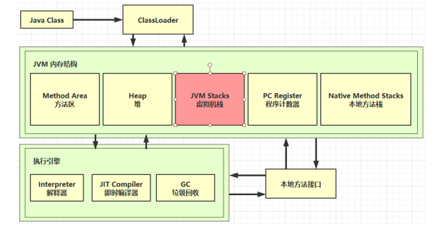  

**栈帧：** 栈帧存在与 Java 虚拟机栈中，是 Java 虚拟机栈中的单位元素，每个线程中调用同一个方法或者不用的方法，都会创建不同的栈帧

**特点：**

- 虚拟机栈是 Java 方法执行的内存模型，用于存储栈帧
- 每个线程私有的，生命周期随着线程，线程启动而产生，线程结束而消亡
- 每个线程只能有一个活动栈帧，对应着当前正在执行的那个方法
- 如果线程请求分配的栈容量超过了 Java 虚拟机允许的最大容量，会抛出 StackOverflowError 异常
- 如果 Java 虚拟机可以动态扩展，并且在尝试扩展时无法申请到足够的内存，或者在创建新的线程时没有足够的内存去创建对应的虚拟机栈，那么会抛出 OutOfMemoryError 异常

**问题辨析：**

- 垃圾回收是否涉及栈内存
  
  垃圾回收不涉及也不需要处理栈内存

- 栈内存分配越大越好吗
  
  可以通过 `-Xss` 指定栈内存大小。栈内存分配越大，只是能够进行更多次的方法递归调用，但线程数会变少，并不一定会越来越好，反而可能影响性能

- 方法内的局部变量是否线程安全
  
  - 如果方法内局部变量没有逃离方法的作用范围，它是线程安全的
  - 如果是局部变量引用了对象，并逃离了方法的作用范围，需要考虑线程安全

### 栈内存溢出

- 栈帧过多导致栈内存溢出
- 栈帧多大导致内存溢出

```java
public class Demo1 {
    private static int count;

    public static void main(String[] args) {
            try {
                method1();
            } catch (Throwable e) {
                e.printStackTrace();
                System.out.println(count);
            }
    }

    private static void method1() {
        count++;
        method1();
    }
}
```

输出

```java
java.lang.StackOverflowError
	at com.gzc.stack.Demo1.method1(Demo1.java:21)
	at com.gzc.stack.Demo1.method1(Demo1.java:21)
	at com.gzc.stack.Demo1.method1(Demo1.java:21)
	at com.gzc.stack.Demo1.method1(Demo1.java:21)
24870
```

### 栈内存诊断(线程运行诊断)

案例1：cpu 占用过高

```java
public class Demo2 {

    public static void main(String[] args) {
        new Thread(null, () -> {
            System.out.println("1...");
            while(true) {

            }
        }, "thread1").start();


        new Thread(null, () -> {
            System.out.println("2...");
            try {
                Thread.sleep(1000000L);
            } catch (InterruptedException e) {
                e.printStackTrace();
            }
        }, "thread2").start();

        new Thread(null, () -> {
            System.out.println("3...");
            try {
                Thread.sleep(1000000L);
            } catch (InterruptedException e) {
                e.printStackTrace();
            }
        }, "thread3").start();
    }
}
```

使用 `top` 命令查看 cpu 使用情况

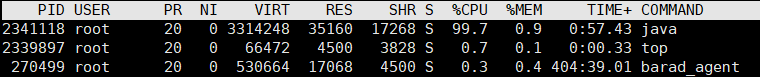  

通过 `ps` 命令根据 pid 查看进程中线程的使用情况，可以发现线程 `2341130` 导致 cpu 占用过多

```java
ps H -eo pid,tid,%cpu | grep 2341118
```

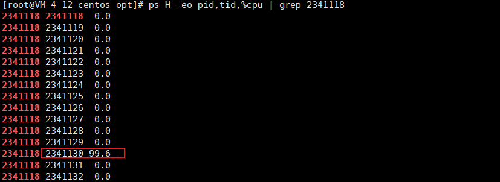  

通过 `jstack` 命令分析进程中的线程

```java
jstack 2341118
```

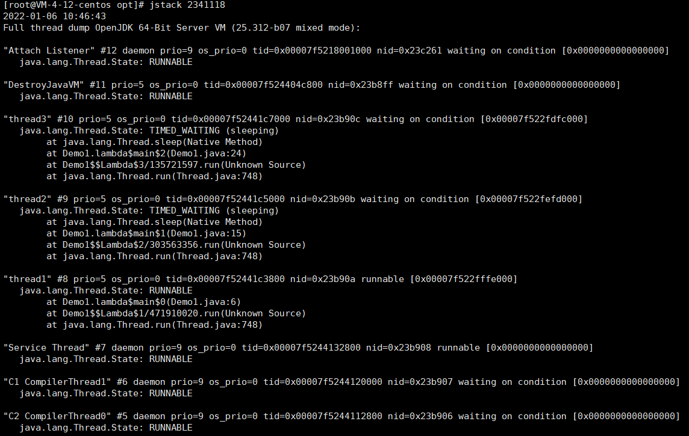  

将 `2341130` 转为16进制 `23b90a`，发现是以下线程

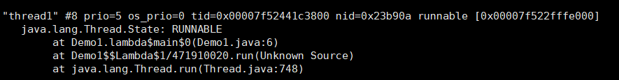  

由此可以看出是 `Demo1.java` 中第 6 行有问题

案例2：程序很长时间没有反应

```java
/**
 * 演示线程死锁
 */
class A{};
class B{};
public class Demo3 {
    static A a = new A();
    static B b = new B();

    public static void main(String[] args) throws InterruptedException {
        new Thread(()->{
            synchronized (a) {
                try {
                    Thread.sleep(2000);
                } catch (InterruptedException e) {
                    e.printStackTrace();
                }
                synchronized (b) {
                    System.out.println("我获得了 a 和 b");
                }
            }
        }).start();
        Thread.sleep(1000);
        new Thread(()->{
            synchronized (b) {
                synchronized (a) {
                    System.out.println("我获得了 a 和 b");
                }
            }
        }).start();
    }
}
```

通过 `jstack` 命令查看并分析

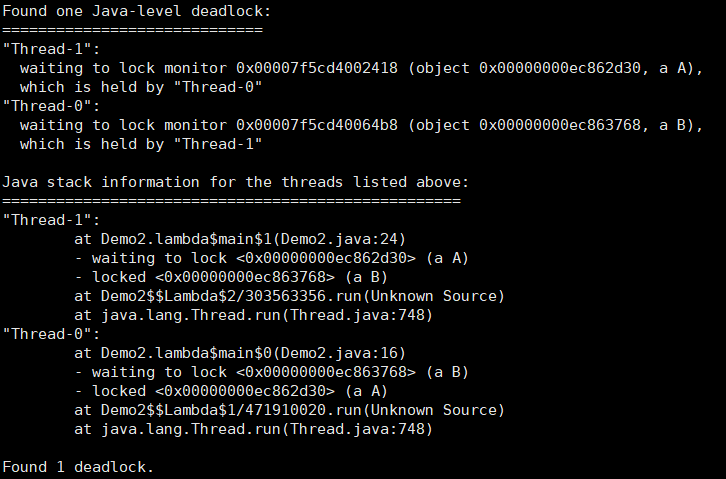  

发现是有一个死锁导致

## 本地方法栈(Native Method Stacks)

为虚拟机使用到的 Native 方法服务

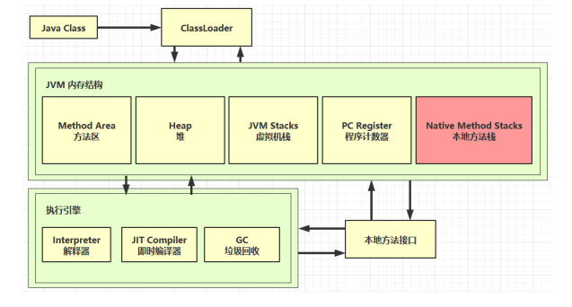  

- Navtive 方法是 Java 通过 JNI 直接调用本地 C/C++ 库，可以认为是 Native 方法相当于 C/C++ 暴露给 Java的一个接口，Java 通过调用这个接口从而调用到 CC/C++ 方法
  
- 当线程调用 Java 方法时，虚拟机会创建一个栈帧并压入虚拟机栈。然而当它调用的是 Native 方法时，虚拟机会保持 Java 虚拟机栈不变，也不会压入新的栈帧，虚拟机只是简单的动态连接并直接调用指定的 Native 方法

- 本地方法栈会抛出 StackOverflowError 和 OutOfMemoryError 异常

- 每个线程私有的，生命周期随着线程，线程启动而产生，线程结束而消亡

## 堆 (Heap)

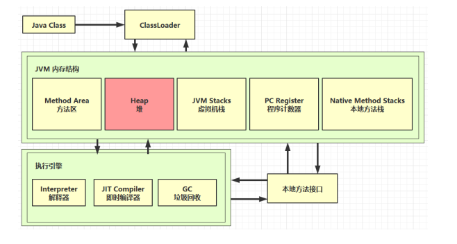  

**特点：**

- Java 堆是所有线程共享的一块内存区域，在虚拟机启动时创建，此内存区域的唯一目的就是存放对象实例
- Java 堆是垃圾收集器管理的内存区域，即 “GC堆”
- 堆内存分为新生代(Young)和老年代(Old)
- Java 堆既可以被实现成固定大小的，也可以是可扩展的，通过参数 `-Xmx` 和 `-Xms` 设定。如果 Java 堆中没有足够内存完成实例分配，并且堆也无法载扩展时，将会抛出 OutOfMemoryError 异常

### 堆内存溢出

```java
/**
 * 演示堆内存溢出
 * -Xmx8m
 */
public class Demo1 {

    public static void main(String[] args) {
        int i = 0;
        try {
            List<String> list = new ArrayList<>();
            String a = "hello";
            while (true) {
                list.add(a);
                a = a + a;
                i++;
            }
        } catch (Throwable e) {
            System.out.println(i);
            e.printStackTrace();
        }
    }
}
```
输出

```java
26
java.lang.OutOfMemoryError: Java heap space
	at java.util.Arrays.copyOf(Arrays.java:3332)
	at java.lang.AbstractStringBuilder.ensureCapacityInternal(AbstractStringBuilder.java:124)
	at java.lang.AbstractStringBuilder.append(AbstractStringBuilder.java:448)
	at java.lang.StringBuilder.append(StringBuilder.java:136)
	at com.gzc.heap.Demo1.main(Demo1.java:19)
```

### 堆内存诊断

- `jps`  查看当前系统中与哪些 Java 进程 jps -l (显示启动类完整类名)
- `jmap`  查看堆内存占用情况 jmap -head【PID】
- `jconsole`  图形界面的，多功能的监测工具，可以连续监测

```java
/**
 * 演示堆内存
 */
public class Demo2 {

    public static void main(String[] args) {
        System.out.println("1......");
        Sleeper.sleep(30);
        byte[] array = new byte[1024 * 1024 * 10]; // 10M
        System.out.println("2....");
        Sleeper.sleep(30);
        array = null;
        System.gc();
        System.out.println("3.......");
        Sleeper.sleep(1000);
    }
}
```

使用 jmap -head 查看堆内存占用情况

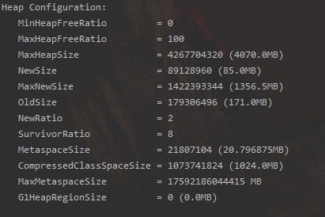  

```java
/**
 * 演示查看对象个数 堆转储 dump
 */
public class Demo3 {
    
   static class Student {
        private byte[] big = new byte[1024*1024];
    }

    public static void main(String[] args) throws InterruptedException {
        List<Student> students = new ArrayList<>();
        for (int i = 0; i < 200; i++) {
            students.add(new Student());
        }
        Thread.sleep(1000000000L);
    }
}
```

使用 jvisualvm 查看堆转储(dump)

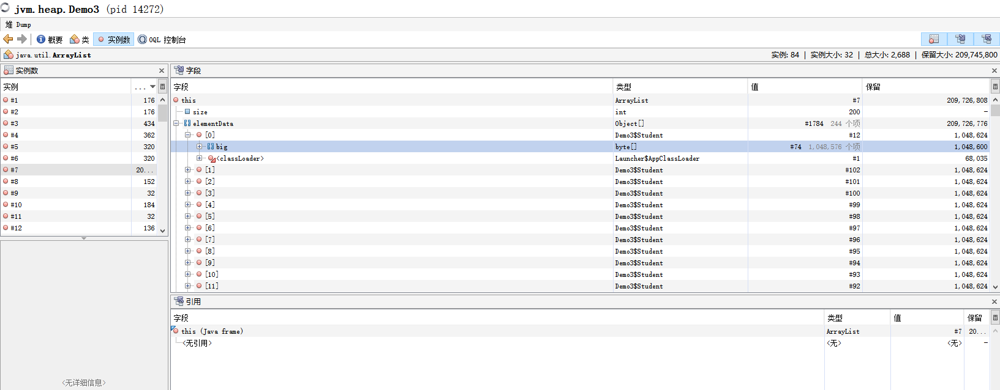  

## 方法区 (Method Area)

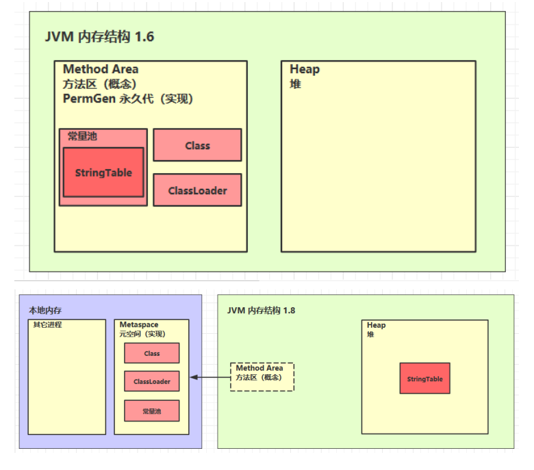  

**特点：**

- 方法区与 Java 堆一样，是各个线程共享的内存区域，在虚拟机启动时创建
- 方法区存储被虚拟机加载的每个类的结构信息，如**运行时常量池**、字段和方法数据，以及方法和构造函数的代码，包括类和实例初始化以及接口初始化中使用的特殊方法
- 方法区是一个规范
  - JDK1.8 以前的实现称为永久代，为堆上的一块空间，通过参数 `-XX:PermSize` 和 `-XX:MaxPermSize` 调节
  - JDK1.8以后的实现为元空间(Metaspace)，使用的是本地内存，通过参数 `-XX:MetaspaceSize` 和 `-XX:MaxMetaspaceSize` 调节

### 方法区内存溢出

```java
/**
 * 演示元空间内存溢出 java.lang.OutOfMemoryError: Metaspace
 * -XX:MaxMetaspaceSize=8m
 */
public class Demo1 extends ClassLoader {

    public static void main(String[] args) {
        int j = 0;
        try {
            Demo1 demo1 = new Demo1();
            for (int i = 0; i < 10000; i++, j++) {
                // 作用是生成类的二进制字节码
                ClassWriter cw = new ClassWriter(0);
                // 版本号、访问修饰符、类名、包名、父类、接口
                cw.visit(Opcodes.V1_8, Opcodes.ACC_PUBLIC, "Class" + i, null, "java/lang/Object", null);
                // 返回 byte[]
                byte[] code = cw.toByteArray();
                // 执行类的加载
                demo1.defineClass("Class" + i, code, 0, code.length);
            }

        }finally {
            System.out.println(j);
        }
    }
}
```

输出

```java
5411
Exception in thread "main" java.lang.OutOfMemoryError: Metaspace
	at java.lang.ClassLoader.defineClass1(Native Method)
	at java.lang.ClassLoader.defineClass(ClassLoader.java:763)
	at java.lang.ClassLoader.defineClass(ClassLoader.java:642)
	at com.gzc.metaspace.Demo1.main(Demo1.java:25)
```

- 1.8 以前会导致永久代内存溢出

```java
 * 演示永久代内存溢出 java.lang.OutOfMemoryError: PremGen space
 * -XX:MaxPermSize=8m
```

- 1.8 以后会导致元空间内存溢出

```java
 * 演示元空间内存溢出 java.lang.OutOfMemoryError: Metaspace
 * -XX:MaxMetaspaceSize=8m
```

### 运行时常量池

- 常量池
  就是一张表，虚拟机指令根据这张常量表找到要执行的类名、方法名、参数类型、字面量等信息

  ```java
  // 二进制字节码(类基本信息，常量池，类方法定义(包含了虚拟机指令))
  public class Demo {
    public static void main(String[] args) {
        System.out.println("Hello World");
    }
  }
  ```

  使用 javap 指令反编译 Demo.java 类
  
  ```java
  javap -v Demo.class
  ```

  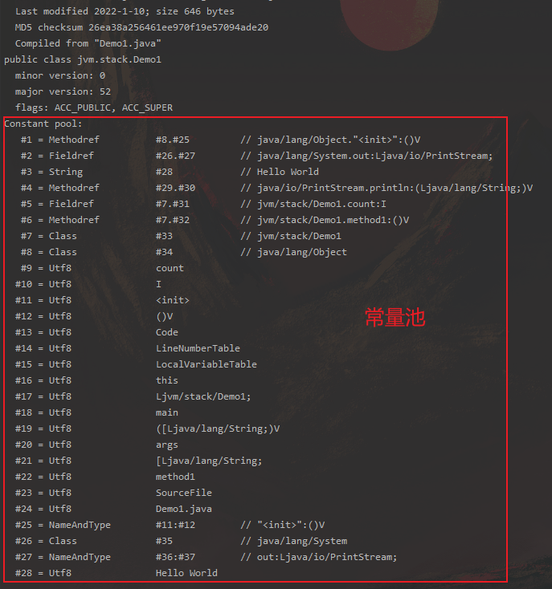  

- 运行时常量池
  常量池是 *.class 文件中的，当该类被加载，其常量池就会放入运行时常量池，并把里面的符号地址变为真实地址

### StringTable

StringTable 在 1.8 后存在于堆中，并且可以被垃圾回收

```java
public static void main(String[] args) {
    String s1 = "a";
    String s2 = "b";
    String s3 = "ab";
    String s4 = s1 + s2;
    System.out.println(s3 == s4);
}
```

反编译的结果为

```java
0: ldc           #2        // String a
2: astore_1
3: ldc           #3        // String b
5: astore_2
6: ldc           #4        // String ab
8: astore_3
9: new           #5        // class java/lang/StringBuilder
12: dup
13: invokespecial #6        // Method java/lang/StringBuilder."<init>":()V
16: aload_1
17: invokevirtual #7        // Method java/lang/StringBuilder.append:(Ljava/lang/String;)Ljava/lang/StringBuilder;
20: aload_2
```

常量池中的信息都会被加载到运行时常量池中，这时 a、b、ab 都是常量池中的符号，还没有变为 Java 字符串对象

- ldc #2 会把 a 符号变为 "a" 字符串对象
- ldc #3 会把 b 符号变为 "b" 字符串对象
- ldc #4 会把 ab 符号变为 "ab" 字符串对象

最后放入 StringTable["a", "b", "ab"] 中

比较 s3 与 s4 是否地址相等

```java
String s4 = s1 + s2;
System.out.println(s3 == s4);
```

```java
9: new           #5        // class java/lang/StringBuilder
12: dup
13: invokespecial #6        // Method java/lang/StringBuilder."<init>":()V
16: aload_1
17: invokevirtual #7        // Method java/lang/StringBuilder.append:(Ljava/lang/String;)Ljava/lang/StringBuilder;
20: aload_2
```

则 `String s4 = s1 + s2;` 这段代码相当于

```java
new StringBuilder().append(s1).append(s2).toString();
```

而 StringBuilder 的 toString() 为

```java
public String toString() {
    // Create a copy, don't share the array
    return new String(value, 0, count);
}
```

故 s3、s4虽然都在堆中，但 s3 是在串池中的字符串对象，而 s4 是新创建 String 对象，地址不相等

比较 s3 与 s5 是否地址相等

```java
String s5 = "a" + "b"; 
System.out.println(s3 == s5);
```

```java
51: ldc      #4    // String ab
53: astore   5
```

从 jvm 指令可以看出 s5 直接找的就是符号变量 #4(ab)，与 s3 一样

因为 javac 在编译期间的优化，结果已经在编译器确定为 ab，如果给 s1、s2 加上 final，那么 s4 也是确定的 ab，即 s3 == s4

特性

- 常量池中的字符串仅是符号，第一次用到时才变为对象
- 利用串池的机制，来避免重复创建字符串对象
- 字符串**变量**拼接的原理是 StringBuilder(1.8)
- 字符串**常量**拼接的原理是编译器优化
- 可以使用 intern() 方法主动将串池中还没有的字符串对象放入串池
  - 1.8 将这个字符串对象尝试放入串池，如果有则并不会放入，如果没有则放入串池，返回串池中的对象
  - 1.6 将这个字符串对象尝试放入串池，如果有则并不会放入，如果没有则**会把此对象复制一份**，放入串池，返回串池中的对象

#### intern()

```java
// 堆 new String("a") new String("b") 再由 StringBuilder 拼接为 new String("ab")
String s = new String("a") + new String("b");
// 而 "ab" 是常量池中的符号，运行时在串池中，s 指向堆中 ab 对象的引用，二者地址不等
String s2 = s.intern();
System.out.println(s == "ab");
System.out.println(s2 == "ab");
```

执行 s.intern() 之前，串池中还没有 "ab"，执行 ss.intern() 之后会将 s 指向的 String 对象 ab 放入串池，并返回给 s2

```java
true
true
```

```java
 // 堆 new String("a") new String("b") 再由 StringBuilder 拼接为 new String("ab")
 String s = new String("a") + new String("b");
 // 而 "ab" 是常量池中的符号，运行时在串池中，s 指向堆中 ab 对象的引用，二者地址不等
 System.out.println(s == "ab");
 String s2 = s.intern();
 System.out.println(s == "ab");
 System.out.println(s2 == "ab");
```

执行 s.intern() 之前，串池中已经放入 "ab"，执行 s.intern() 之后不会将 s 指向的 String 对象 ab 放入串池，而是直接返回已有串池中已有的 "ab" 给 s2

```java
false
false
true
```

#### StringTable 性能调优

- 调整 -XX:StringTableSize  = 桶个数
- 如果堆中存在大量重复的字符串对象，可以考虑调用 intern() 方法放入串池中节省堆内存

## 直接内存

直接内存并不属于 JVM 的内存结构，它是物理机的内存，但是 JVM 虚拟机可以调用该部分内存

定义：

- 常见于 NIO 操作时，用于数据缓冲区
- 分配回收成本较高，但读写性能高
- 不受 JVM 内存回收管理

分配和回收原理：

- 使用了 Unsafe 对象完成直接内存的分配回收，并且回收需要主动调用 freeMemory 方法
- ByteBuffer 的实现类内部，使用了 Cleaner (虚引用) 来监测 ByteBuffer 对象，一旦 ByteBuffer 对象被垃圾回收，那么就会由 ReferenceHandler 线程通过 Cleaner 的 clean 方法调用 freeMemory 来释放直接内存

正常 IO 读取：

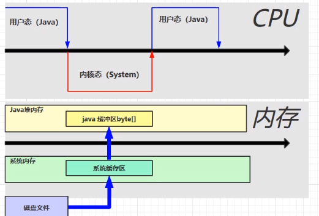  

从上图结构可以看出，当 Java 程序需要读取文件时：

- 首先会在 Java 堆内存中开辟一个缓冲区，
- 然后系统内存从磁盘中读取
- 再将系统缓冲区中的字节流复制到 Java 堆内存的缓冲区中，由 Java 程序调用

直接内存读取：

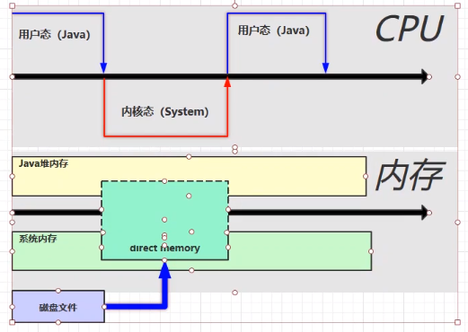  

当 Java 程序使用直接内存读取文件时：

- 首先会在系统内存中分配一块直接内存，这一内存是系统内存和 Java 堆内存共享的，都可以直接访问
- 当系统内存将文件从磁盘读取到直接内存中后，Java 程序可以直接使用，节约了时间开销
