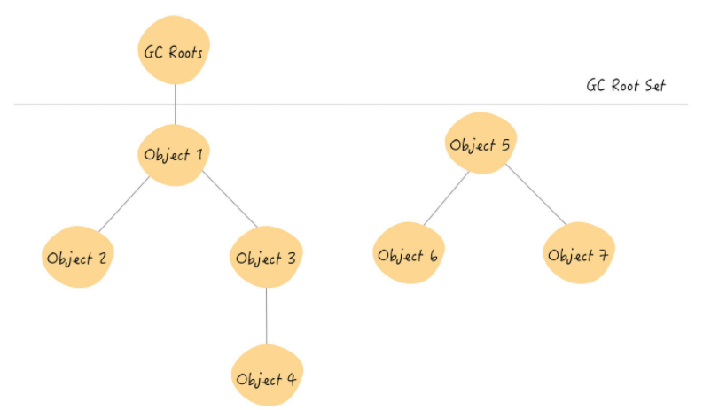

# 垃圾回收

## 如何判断对象可以回收

### 引用计数法

给对象中添加一个引用计数器，每当有一个地方引用它时，计数器就 + 1，当引用失效时，计数器 -1 。任何时刻计数器为 0 的对象就是不再被使用的。

但是引用计数法无法解决对象之间相互循环引用问题，所以，JVM 没有采用引用计数法来管理内存

### 可达性分析算法

通过一系列称为 `GC Roots` 的对象为起始点，从这些节点开始向下搜索，搜索走过的路径就被称为`引用链`，当一个对象到 `GC Roots` 之间没有任何引用链时，则证明此对象不再被使用

  

并不是所有对象都可以作为 `GC Roots` 对象，只有下列对象可以作为 `GC Roots` 的对象:

- 虚拟机(栈帧中的本地变量表)中引用的对象
- 方法区中的类静态属性引用的对象
- 方法区中常量引用的对象
- 本地方法栈 JNI (即一般说的 Native 方法) 引用的对象

### 四种引用

- 强引用 (不回收)：类似 Object obj = new Object(); 这类的引用，只要强引用还在，垃圾收集器永远不会回收掉被引用的对象。

- 软引用 (内存不足即回收)：用来描述一些还有用但并非必需的对象，对于软引用关联着的对象，在系统将要发生内存溢出异常之前，将会把这些对象列进回收范围进行第二次回收哦。如果这次回收还没有足够的内存，才会抛出内存溢出的异常，JDK 提供 SoftReference 类来实现软引用。

- 弱引用 (发现即回收)：也是用来描述一些还有用但并非必需的对象，但是它的强度比软引用更弱一些，被引用关联的对象，只能生存到下一次垃圾收集发生之前。当垃圾收集器工作时，无论当前内存是否足够，都会回收掉只被弱引用关联的对象。JDK 提供 WeakReference 类来实现弱引用。

- 虚引用 (对象回收跟踪)：它是最弱的一种引用关系。一个对象是否有虚引用的存在，完全不会对其生存时间构成影响，也无法通过虚引用取得一个对象实例。为一个对象设置虚引用关联的唯一目的就是能在这个对象被收集器回收之前收到一个系统通知。JDK 提供 PhantomReference 类来实现虚引用。

- 终结器引用：用以实现对象的 finalize() 方法，其内部配合引用队列使用，在 GC 时，终结器引用入队，由 Finalizer 线程通过终结器引用找到被引用对象并调用它的 finalize() 方法，第二次 GC 时才能回收被引用对象。
