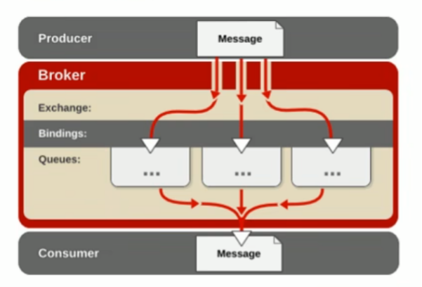
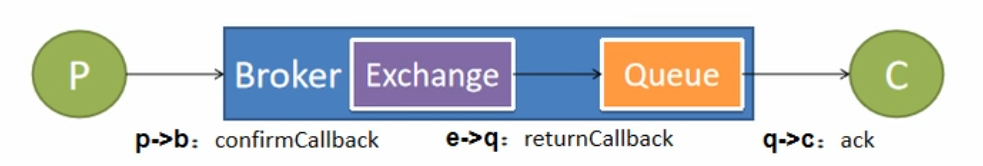

# RabbitMQ

## 运行机制

  


AMQP 中消息路由：

AMQP 中的消息路由过程和 JMS 存在一些差别，AMQP 中增加了 Exchange 和 Binding 的角色。

生产者把消息发布到 Exchange 上，消息最终到达队列并被消费者接受，而 Binding 决定交换机的消息应该发送到哪个队列

## Exchange 类型

分为 direct(直连)、fanout(扇形)、topic(主题)、headers(头部) 四种。其中 headers 匹配 AMQP 消息的 headr 而不是路由键，headers 交换机 和 direct 完全一致，但性能却差很多，目前几乎用不到。

- direct Exchange
  
  消息中的路由键(routing key) 如果和 Binding 中的 binding key 一致，交换机就将消息发到对应的队列中。
  路由键与队列需完全匹配，如果一个队列绑定到交换机要求路由键为 "dog"，则只转发 routing key 为 "dog" 的消息，不会转发 "dog.puppy"，"dog.guard" 等。它是完全匹配、单播模式。

- fanout Exchange
  
  每个发到 fanout 类型交换机的消息都会分到所有绑定的队列上去。fanout 作为交换机不处理路由键，只是简单的将队列绑定到交换机上，很像子网广播，每台子网内的主机都获得了一份辅助的消息。fanout 类型转发消息是最快的。

- Topic Exchange
  
  topic 交换机通过模式匹配分配消息的路由键属性，将路由键和某个模式进行匹配，此时队列需要绑定到一个模式上。它将路由键和绑定键的字符串切分成单词，这些单次之间用点隔开。它同样也会识别两个通配符："#"(匹配 0 或多个单词)、"*"(匹配一个单词)

## 消息确认机制

保证消息不丢失，可靠抵达，可以使用事务消息，但是性能会下降 250 倍。

为此引入确认机制：

- publisher confirmCallback 确认模式
- publisher returnCallback 未投递到 queue 退回模式
- consumer ack 机制

  

### confirmCallback

开启：

- spring.rabbitmq.publisher-confirm-type: correlated

消息只要被 broker 接受到就会执行 confirmCallback，如果是集群模式，需要所有 broker 接收到才会调用 confirmCallback。

被 broker 接收到只能表示 messge 已达到服务器，并不能保证一定会被投递到目标 queue 中。

```java
 rabbitTemplate.setConfirmCallback(new RabbitTemplate.ConfirmCallback() {
     /**
      *
      * @param correlationData 对象内部只有一个 id 属性，用来表示当前消息的唯一性
      * @param ack 对象内部只有一个 id 属性，用来表示当前消息的唯一性
      * @param cause 表示投递失败的原因。
      */
     @Override
     public void confirm(CorrelationData correlationData, boolean ack, String cause) {
         log.info("confirm correlationData={}, ack={}, cause={}", correlationData, ack, cause);
     }
 });
```

### returnCallback

开启：

- spring.rabbitmq.publisher-returns: true

- spring.rabbitmq.template.mandatory: true ( 指定消息在没有被队列接受时是否强制退回还是丢弃 )

如果消息未能投递到目标 queue，将调用 returnCallback，可以进行记录。定期的巡检或者自动纠错都需要这些数据

```java
rabbitTemplate.setReturnCallback(new RabbitTemplate.ReturnCallback() {
    /**
     *
     * @param message the returned message.
     * @param replyCode the reply code.
     * @param replyText the reply text.
     * @param exchange the exchange.
     * @param routingKey the routing key.
     */
    @Override
    public void returnedMessage(Message message, int replyCode, String replyText, String exchange, String routingKey) {
        log.info("message={}", message);
        log.info("replyText={}", replyText);
        log.info("exchange={}", exchange);
        log.info("routingKey={}", routingKey);
    }
});
```

tips:
> spring.rabbitmq.template.mandatory属性的优先级高于spring.rabbitmq.publisher-returns的优先级
>
> spring.rabbitmq.template.mandatory属性可能会返回三种值null、false、true
>
> spring.rabbitmq.template.mandatory结果为true、false时会忽略掉spring.rabbitmq.publisher-returns属性的值
>
> spring.rabbitmq.template.mandatory结果为null（即不配置）时结果由spring.rabbitmq.publisher-returns确定

### Ack 机制

消费者获取到消息后，默认回复 ack 给 broker，broker 将消息从 queue 中移除。

> 自动 ack 可能会产生消息丢失问题：当 consumer 接受多个消息后，只要进入 channel， 即使未处理完发生宕机，也会全部 ack，即从 broker 中删除。

开启手动 ack：

- spring.rabbitmq.listener.simple.acknowledge-mode: manual

通过 channel 手动 ack

- basicAck：确认 ack 消息，如果 multiple，则 deliveryTag 之前的消息全部确认 ack
- basicNack： 否认 ack 消息，如果 multiple，则 deliveryTag 之前的消息全部否认 ack，requeue 表示否认之后是否退回 queue，不退回则直接丢弃
- basicReject： 同 basicNack，但不能批量

```java
void basicAck(long deliveryTag, boolean multiple)
void basicNack(long deliveryTag, boolean multiple, boolean requeue)
void basicReject(long deliveryTag, boolean requeue)
```

> 如果 consumer 一直没有 ack 或者 nack，broker 会认为此消息正在被处理，则不会投递给别人，但 consumer 断开后，消息不回被 broker 移除，会投递给别人

## 如何保证消息可靠性

### 消息丢失

- 消息发送出去，由于网络问题没有抵达服务器
  - 做好容错方法（try-catch），发送消息可能会网络失败，失败后要有重试机制
  - 做好日志记录，每个消息状态是否被服务器收到都应该记录
  - 做好定期重发，如果消息没有发送成功，定期去数据库扫描未成功的消息进行重发
- 生产端确认
- 消费端确认

### 消息重复

消息消费成功，事务已经提交，ack 时宕机，Broker 的消息重新由 unack 变为 ready，并发送给其他消费者

消息消费成功，由于重试机制，自动又将消息发送出去

- 消费者的业务消费接口应该设计为幂等性的，比如扣库存有工作单的状态标志
- 使用防重表(redis/mysql)，发送消息每一个业务都有唯一的标识，处理过就不处理
- RabbitMQ 的每一个消息都有 redelivered 字段，可以判断是否是重新投递的消息

### 消息积压

消费者宕机积压、消费能力不足积压、生产者发送流量太大积压

- 上线更多的消费者，进行正常消费
- 上线专门的队列消费服务，将消息先批量取出来，记录数据库，离线慢慢处理
