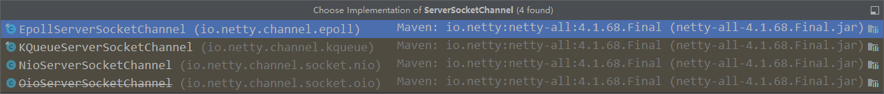
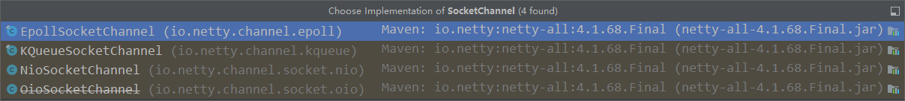

# Netty 入门

## 概述

Netty 是什么

```java
Netty is an asynchronous event-driven network application framework for rapid development of maintainable high perform protocol servers & clients.
```

Netty 是一个异步的、基于事件驱动的网络应用框架，用于快速开发可维护、高性能的网络服务器和客户端。

Netty 的优势

- Netty VS NIO
  - 工作量大，bug多
  - 需要自己构建协议
  - 解决 TCP 传输问题，如黏包、半包
  - epoll 空轮询导致 CPU 100%
  - 对 API 进行增强，使之更易用，如 FastThreadLocal => ThreadLocal，ByteBuf => ByteBuffer
- Netty VS 其他网络应用框架
  -Mina 由 apache 维护，将来 3.x 版本可能会有较大重构，破坏 API 向下兼容性，Netty 的开发迭代更迅速，API 更简洁、文档更优秀
  - 久经考验，16年
    - 2.x 2004
    - 3.x 2008
    - 4.x 2013
    - 5.x 已废弃（没有明显的性能提升，维护成本高）

## Hello World

### 目标

开发一个简单的服务器端和客户端

- 客户端向服务器发送 hello, world
- 服务器仅接收，不返回

加入依赖

```java
<dependency>
    <groupId>io.netty</groupId>
    <artifactId>netty-all</artifactId>
    <version>4.1.39.Final</version>
</dependency>
```

### 服务器端

```java
public class HelloServer {
    public static void main(String[] args) {
        new ServerBootstrap()
                .group(new NioEventLoopGroup()) // 1
                .channel(NioServerSocketChannel.class) // 2
                .childHandler(new ChannelInitializer<NioSocketChannel>() { // 3
                    @Override
                    protected void initChannel(NioSocketChannel ch) throws Exception {
                        ch.pipeline().addLast(new StringDecoder()); // 5
                        ch.pipeline().addLast(new ChannelInboundHandlerAdapter() { // 6
                            @Override
                            public void channelRead(ChannelHandlerContext ctx, Object msg) throws Exception {
                                System.out.println(msg);
                            }
                        });
                    }
                })
                .bind(6666); // 4

    }
}
```

代码解读：

1. 创建 NioEventLoopGroup，可以简单理解为 线程池 + Selector
2. 选择服务器 Socket 实现类，其中 NioServerSocketChannel 表示基于 NIO 的服务器端实现，其他实现还有

     
3. 方法叫 childHandler, 是接下来添加的处理器都是给 SocketChannel 用的，而不是给 ServerSocketChannel。ChannelInitializer 处理器（仅执行一次），它的作用是等待客户端 SocketChannel 建立连接后，执行 initChannel 以便添加更多的处理器
4. ServerSocketChannel 绑定的监听端口
5. SocketChannel 的处理器，序列化 ByteBuf => String
6. SocketChannel 的业务处理器，使用上一个处理器的处理结果

### 客户端

```java
new Bootstrap()
    .group(new NioEventLoopGroup()) // 1
    .channel(NioSocketChannel.class) // 2
    .handler(new ChannelInitializer<Channel>() { // 3
        @Override
        protected void initChannel(Channel ch) {
            ch.pipeline().addLast(new StringEncoder()); // 8
        }
    })
    .connect("127.0.0.1", 8080) // 4
    .sync() // 5
    .channel() // 6
    .writeAndFlush(new Date() + ": hello world!"); // 7
```

代码解读：

1. 创建 NioEventLoopGroup，同 Server
2. 选择客户端 Socket 实现类，NioSocketChannel 表示基于 NIO 的客户端实现，其他实现还有

     
3. 添加 SocketChannel 的处理器，ChannelInitializer 处理器（仅执行一次），它的作用是待客户端 SocketChannel 建立连接后，执行 initChannel 以便添加更多的处理器
4. 指定要连接的服务器和端口
5. Netty 中很多方法都是异步的，如 connect，这时需要使用 sync 方法等待 connect 建立连接完毕
6. 获取 channel 对象，它即为通道抽象，可以进行数据读写操作
7. 写入消息并清空缓冲区
8. 消息会经过通道 handler 处理，这里即序列化
9. 数据经过网络传输，到达服务器端，服务器端 5 和 6 处的 handler 先后被触发，走完一个流程

#### 💡 提示

> 一开始需要树立正确的数据通道
>
> - 把 channel 理解为数据的通道
> - 把 msg 理解为流动的数据，最开始输入是 ByteBuf，但经过 pipeline 的加工，会变成其他类型对象，最后输出又变成 ByteBuf
> - 把 handler 理解为数据的处理工序
>   - 工序有多道，合在一起就是 pipeline，pipeline 负责发布事件，传播给每个 handler，handler 对自己感兴趣的事件进行处理（重写了相应事件处理方法）
>   - handler 分为 Inbound（入站）和 Outbound（出站）
> 把 EventLoop 理解为处理数据的工人
> - 工人可以管理多个 channel 的 io 操作，并且一旦工人负责了某个 channel，就要负责到底（绑定）
> - 工人既可以执行 io 操作，也可以进行任务处理，每位工人有任务队列，队列里可以堆放多个 channel 待处理任务，任务分为普通任务、定时任务
> - 工人按照 pipeline 顺序，一次按照 handler 的规划处理数据，可以为每道工序执行不同的工人

## 组件

### EventLoop

事件循环对象

EventLoop 本质是一个单线程执行器（同时维护了一个 Selector），里面有 run 方法处理 Channel 上源源不断的 io 事件
它的继承关系比较复杂

- 一条线是继承自 j.u.c.ScheduledExecutorService，因此包含了线程池中所有方法
- 另一条线是继承自 Netty 自己的 OrderedEeventExecutor
  - 提供了 boolean inEventLoop(Thread thread) 方法判断一个线程是否属于此 EventLoop
  - 提供了 parent 方法来查看自己属于哪个 EventLoopGroup

事件循环组

EventLoopGroup 是一组 EventLoop，Channel 一般会调用 EventLoopGroup 的 register 方法来绑定一个 EventLoop，后续这个 Channel 上的 io 事件都由此 EventLoop 来处理（保证了 io 事件处理时的线程安全）

- 继承自 netty 自己的 EventLoopGroup
  - 实现了 Iterable 接口提供 EventLoop 的能力
  - 另有 next 方法获取集合中下一个 EventLoop

以一个简单的实现为例：

```java
// 内部创建了两个 EventLoop, 每个 EventLoop 维护一个线程
DefaultEventLoopGroup group = new DefaultEventLoopGroup(2);
System.out.println(group.next());
System.out.println(group.next());
System.out.println(group.next());
```

也可以使用 for 循环

```java
DefaultEventLoopGroup group = new DefaultEventLoopGroup(2);
for (EventExecutor eventLoop : group) {
    System.out.println(eventLoop);
}
```

#### 💡 优雅关闭

shutdownGracefully 方法。该方法首先切换 EventLoopGroup 到关闭状态从而拒绝新的任务的加入，然后当任务队列中的任务都处理完后，停止线程的执行，从而确保整体应用是在正常有序的状态下退出的

#### 演示 NioEventLoop 处理 io 事件

服务器端一个 boss 两个 worker

```java
public class EventLoopServer {

    public static void main(String[] args) throws InterruptedException {
        new ServerBootstrap()
                // Boss 和 Worker
                .group(new NioEventLoopGroup(), new NioEventLoopGroup(2))
                .channel(NioServerSocketChannel.class)
                .childHandler(new ChannelInitializer<NioSocketChannel>() {
                    @Override
                    protected void initChannel(NioSocketChannel ch) throws Exception {
                        ch.pipeline().addLast(new ChannelInboundHandlerAdapter() {
                            @Override
                            public void channelRead(ChannelHandlerContext ctx, Object msg) throws Exception {
                                ByteBuf buf = (ByteBuf) msg;
                                log.info(buf.toString(StandardCharsets.UTF_8));
                                ctx.fireChannelRead(msg);
                            }
                        }).addLast(new DefaultEventLoopGroup(), "defaultHandler", new ChannelInboundHandlerAdapter() {
                            @Override
                            public void channelRead(ChannelHandlerContext ctx, Object msg) throws Exception {
                                ByteBuf buf = (ByteBuf) msg;
                                log.info(buf.toString(StandardCharsets.UTF_8));
                            }
                        });
                    }
                })
                .bind(8080);
    }
}
```

客户端

```java
public class EventLoopClient {

    public static void main(String[] args) throws Exception {
        Channel channel = new Bootstrap()
                .group(new NioEventLoopGroup(1))
                .channel(NioSocketChannel.class)
                .handler(new ChannelInitializer<NioSocketChannel>() {
                    @Override
                    protected void initChannel(NioSocketChannel ch) throws Exception {
                        ch.pipeline().addLast(new StringEncoder());
                    }
                })
                .connect(new InetSocketAddress(8080))
                .sync()
                .channel();
        System.out.println(channel);
        BufferedReader reader = new BufferedReader(new InputStreamReader(System.in));
        String str;
        while ((str = reader.readLine()) != null) {
            channel.writeAndFlush(str);
        }
    }
}
```

#### 💡 handler 执行中如何换人

关键代码 `io.netty.channel.AbstractChannelHandlerContext#invokeChannelRead()`

```java
static void invokeChannelRead(final AbstractChannelHandlerContext next, Object msg) {
    final Object m = next.pipeline.touch(ObjectUtil.checkNotNull(msg, "msg"), next);
    // 下一个 handler 的 EventLoop
    EventExecutor executor = next.executor();
    // 如果下一个 handler 的 EventLoop 与当前的 EventLoop 是同一个线程，直接调用
    if (executor.inEventLoop()) {
        next.invokeChannelRead(m);
    }
    // 否则，将要执行的任务提交给下一个 EventLoop（换人）
    else {
        executor.execute(() -> next.invokeChannelRead(m));
    }
}
```
