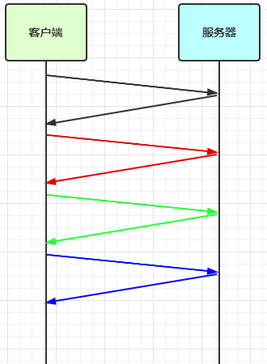
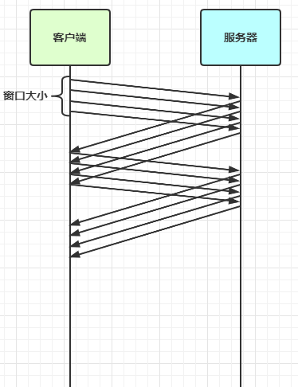
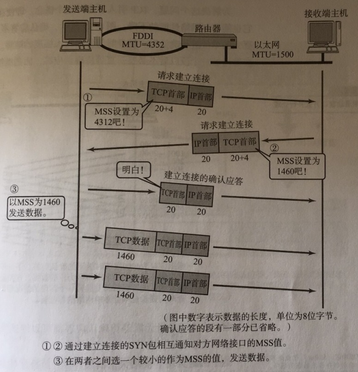

# Netty 进阶

## 粘包与半包

### 粘包现象

服务端代码

```java
public class HelloWordServer {

    void start() {
        NioEventLoopGroup boss = new NioEventLoopGroup();
        NioEventLoopGroup worker = new NioEventLoopGroup();
        try {

            ChannelFuture channelFuture = new ServerBootstrap()
                    .group(boss, worker)
                    .channel(NioServerSocketChannel.class)
                    .childHandler(new ChannelInitializer<NioSocketChannel>() {
                        @Override
                        protected void initChannel(NioSocketChannel ch) throws Exception {
                            ch.pipeline()
                                    .addLast(new LoggingHandler(LogLevel.DEBUG))
                                    .addLast(new ChannelInboundHandlerAdapter() {
                                        @Override
                                        public void channelActive(ChannelHandlerContext ctx) throws Exception {
                                            log.info("connected {}", ctx.channel());
                                            super.channelActive(ctx);
                                        }

                                        @Override
                                        public void channelInactive(ChannelHandlerContext ctx) throws Exception {
                                            log.info("disconnected {}", ctx.channel());
                                            super.channelInactive(ctx);
                                        }
                                    });
                        }
                    })
                    .bind(8080);
            Channel channel = channelFuture.channel();
            log.info("{} binding ...", channel);
            channelFuture.sync();
            log.info("{} bound ...", channel);
            channel.closeFuture().sync();
        } catch (Exception e) {
            log.error(e.getMessage());
        }finally {
            boss.shutdownGracefully();
            worker.shutdownGracefully();
            log.info("stopped");
        }
    }

    public static void main(String[] args) {
        new HelloWordServer().start();
    }
}
```

客户端代码

发送 10 个 消息，每个消息 16 字节

```java
public class HelloWorldClient {

    public static void main(String[] args) {
        NioEventLoopGroup worker = new NioEventLoopGroup();
        try {
            ChannelFuture channelFuture = new Bootstrap()
                    .group(worker)
                    .channel(NioSocketChannel.class)
                    .handler(new ChannelInitializer<NioSocketChannel>() {
                        @Override
                        protected void initChannel(NioSocketChannel ch) throws Exception {
                            ch.pipeline()
                                    .addLast(new LoggingHandler(LogLevel.DEBUG))
                                    .addLast(new ChannelInboundHandlerAdapter() {
                                        @Override
                                        public void channelActive(ChannelHandlerContext ctx) throws Exception {
                                            log.info("sending...");
                                            Random random = new Random();
                                            char c = 'a';
                                            for (int i = 0; i < 10; i++) {
                                                ByteBuf buffer = ctx.alloc().buffer();
                                                byte[] bytes = new byte[16];
                                                for (int j = 0; j < 15; j++) {
                                                    bytes[j] = (byte) j;
                                                }
                                                buffer.writeBytes(bytes);
                                                ctx.writeAndFlush(buffer);
                                            }
                                        }
                                    });
                        }
                    })
                    .connect(new InetSocketAddress(8080));
            channelFuture.sync();
            channelFuture.channel().closeFuture().sync();
        } catch (Exception e) {
            log.error(e.getMessage());
        } finally {
            worker.shutdownGracefully();
        }
    }
}
```

服务端出现一次接受 32 字节的情况

```java
15:43:25.078 [nioEventLoopGroup-3-2] DEBUG io.netty.handler.logging.LoggingHandler - [id: 0xd9aae970, L:/192.168.1.236:8080 - R:/192.168.1.236:49654] READ COMPLETE
15:43:25.078 [nioEventLoopGroup-3-2] DEBUG io.netty.handler.logging.LoggingHandler - [id: 0xd9aae970, L:/192.168.1.236:8080 - R:/192.168.1.236:49654] READ: 32B
         +-------------------------------------------------+
         |  0  1  2  3  4  5  6  7  8  9  a  b  c  d  e  f |
+--------+-------------------------------------------------+----------------+
|00000000| 00 01 02 03 04 05 06 07 08 09 0a 0b 0c 0d 0e 00 |................|
|00000010| 00 01 02 03 04 05 06 07 08 09 0a 0b 0c 0d 0e 00 |................|
+--------+-------------------------------------------------+----------------+
```

### 半包现象


客户端发送 1 消息，大小为 160 字节

代码改为

```java
ByteBuf buffer = ctx.alloc().buffer();
for (int i = 0; i < 10; i++) {
    buffer.writeBytes(new byte[]{0, 1, 2, 3, 4, 5, 6, 7, 8, 9, 10, 11, 12, 13, 14, 15});
}
ctx.writeAndFlush(buffer);
```

为现象明显，修改服务器的缓冲区大小

```java
serverBootstrap.option(ChannelOption.SO_RCVBUF, 10)
```

服务器端可以看到接收的消息被分为两节，第一次 20 字节，第二次 140 字节

```java
15:56:21.845 [nioEventLoopGroup-3-2] DEBUG io.netty.handler.logging.LoggingHandler - [id: 0x49d5b335, L:/192.168.1.236:8080 - R:/192.168.1.236:49844] READ: 20B
         +-------------------------------------------------+
         |  0  1  2  3  4  5  6  7  8  9  a  b  c  d  e  f |
+--------+-------------------------------------------------+----------------+
|00000000| 00 01 02 03 04 05 06 07 08 09 0a 0b 0c 0d 0e 0f |................|
|00000010| 00 01 02 03                                     |....            |
+--------+-------------------------------------------------+----------------+
15:56:21.845 [nioEventLoopGroup-3-2] DEBUG io.netty.channel.DefaultChannelPipeline - Discarded inbound message PooledUnsafeDirectByteBuf(ridx: 0, widx: 20, cap: 2048) that reached at the tail of the pipeline. Please check your pipeline configuration.
15:56:21.845 [nioEventLoopGroup-3-2] DEBUG io.netty.channel.DefaultChannelPipeline - Discarded message pipeline : [LoggingHandler#0, HelloWordServer$1$1#0, DefaultChannelPipeline$TailContext#0]. Channel : [id: 0x49d5b335, L:/192.168.1.236:8080 - R:/192.168.1.236:49844].
15:56:21.845 [nioEventLoopGroup-3-2] DEBUG io.netty.handler.logging.LoggingHandler - [id: 0x49d5b335, L:/192.168.1.236:8080 - R:/192.168.1.236:49844] READ COMPLETE
15:56:21.845 [nioEventLoopGroup-3-2] DEBUG io.netty.handler.logging.LoggingHandler - [id: 0x49d5b335, L:/192.168.1.236:8080 - R:/192.168.1.236:49844] READ: 140B
         +-------------------------------------------------+
         |  0  1  2  3  4  5  6  7  8  9  a  b  c  d  e  f |
+--------+-------------------------------------------------+----------------+
|00000000| 04 05 06 07 08 09 0a 0b 0c 0d 0e 0f 00 01 02 03 |................|
|00000010| 04 05 06 07 08 09 0a 0b 0c 0d 0e 0f 00 01 02 03 |................|
|00000020| 04 05 06 07 08 09 0a 0b 0c 0d 0e 0f 00 01 02 03 |................|
|00000030| 04 05 06 07 08 09 0a 0b 0c 0d 0e 0f 00 01 02 03 |................|
|00000040| 04 05 06 07 08 09 0a 0b 0c 0d 0e 0f 00 01 02 03 |................|
|00000050| 04 05 06 07 08 09 0a 0b 0c 0d 0e 0f 00 01 02 03 |................|
|00000060| 04 05 06 07 08 09 0a 0b 0c 0d 0e 0f 00 01 02 03 |................|
|00000070| 04 05 06 07 08 09 0a 0b 0c 0d 0e 0f 00 01 02 03 |................|
|00000080| 04 05 06 07 08 09 0a 0b 0c 0d 0e 0f             |............    |
+--------+-------------------------------------------------+----------------+
```

> **注意**
> serverBootstrap.option(ChannelOption.SO_RCVBUF, 10) 影响的是底层接收缓冲区（即滑动窗口）大小，仅决定了 netty 读取的最小单位，netty 实际每次读取的一般是其整数倍

### 现象分析

黏包

- 现象：发送 abc def，接受 abcdef
- 原因
  - 应用层：接收方 ByteBuf 设置太大 (Netty 默认 1024)
  - 滑动窗口：假设发送方 256 表示一个完整报文，但由于接收方处理不及时且滑动窗口足够大，这 256 字节就会缓冲在接收方的窗口中，当窗口缓冲了多个报文就会粘包
  - Nagle 算法会造成粘包

半包

- 现象：发送 abcdef，接受 abc def
- 原因
  - 应用层：接收方 Bytebuf 小于实际发送数量
  - 滑动窗口：假设接收方的窗口只剩了 128 字节，发送方的报文大小是 256 字节，这是无法放下，只能先发送前 128，等待 ack 后才能发送剩余部分，造成半包
  - MSS 限制：当发送的数据超过 MSS 限制后，会将数据切分发送，造成半包

本质是因为 TCP 是流式协议，消息无边界

> 滑动窗口
> TCP 一个段 (segment) 为单位，每发送一个段就需要进行一次确认 (ack) 处理，但是这样做的缺点是包的往返时间越长性能越差
>
>   
>
> 为了解决此问题，引入了窗口概念，即决定了无需等待应答而可以继续发送的数据最大值
>
>  
>
> - 窗口实际起到一个缓冲区的作用，同时也能起到流量控制的作用
>
> MSS 限制
>
> - 链路层对一次能够发送的最大数据有限制，这个限制称之为 MTU (maximum transmission unit)，不同的链路设备的 MTU 值也有所不同，例如
>   - 以太网的 MTU 是 1500
>   - FDDI（光纤分布式数据接口）是 4352
>   - 本地回环地址是 65535，不走网卡
> - MSS 是最大段长度 (maximum segment size)，它是 MTU 刨去 tcp 头和 ip 头后剩余能够作为数据传输的字节数
>   - ipv4 tcp 头占用 20 bytes，ip 头占用 20 bytes，因此以太网 MSS 的值为 1500 - 40 = 1460
>   - TCP 在传递大量数据时，会按照 MSS 大小将数据进行分割发送
>   - MSS 的值在第三次握手时通知对方自己的 MSS 值，然后在两者之间选一个最小值作为 MSS
>
>   
>
> Nagle 算法
>
> - 即使发送一个字节，也需要加入 tcp 头和 ip 头，也就是总字节数会使用 41 字节，非常不经济。因此为了提高网络利用率, tcp 希望尽可能发送足够大的数据，这就是 Nagle 算法产生的原因
> - 该算法指的是：发送端即使还有应该发送的数据，但如果这部分数据很少的话，则进行延迟发送
>   - 如果 SO_SNDBUF 的数据达到 MSS，则需要发送
>   - 如果 SO_SNDBUF 中含有 FIN (表示需要连接关闭)，这时将剩余数据发送，再关闭
>   - 如果 TCP_NODELAY = true，则需要发送
>   - 已发送的数据都收到 ack，则需要发送
>   - 上述条件不满足，但发生超市，则需要发送
>   - 除上述情况，延迟发送

### 解决方案

1. 短链接，发一个包建立一次连接，这样连接建立到连接断开之间就是消息的边界，缺点效率太低
2. 每一条消息采用固定长度，缺点浪费空间
3. 每一个消息采用分隔符，例如 \n，缺点需要转义
4. 每一条消息分为 head 和 body，head 中包含 body 的长度

#### 方法1：短链接

短链接可以解决粘包，不能避免半包

```java
public class Client1 {

    public static void main(String[] args) {
        for (int i = 0; i < 10; i++) {
            send();
        }
        log.info("send end");
    }

    private static void send() {
        NioEventLoopGroup worker = new NioEventLoopGroup();
        try {
            new Bootstrap()
                    .group(worker)
                    .channel(NioSocketChannel.class)
                    .handler(new ChannelInitializer<NioSocketChannel>() {
                        @Override
                        protected void initChannel(NioSocketChannel ch) throws Exception {
                            ch.pipeline()
                                    .addLast(new LoggingHandler(LogLevel.DEBUG))
                                    .addLast(new ChannelInboundHandlerAdapter() {
                                        @Override
                                        public void channelActive(ChannelHandlerContext ctx) throws Exception {
                                            log.info("sending...");
                                            ByteBuf buffer = ctx.alloc().buffer();
                                            buffer.writeBytes(new byte[]{0, 1, 2, 3, 4, 5, 6, 7, 8, 9, 10, 11, 12, 13, 14, 15});
                                            ctx.writeAndFlush(buffer);
                                            ctx.close();
                                        }
                                    });
                        }
                    })
                    .connect(new InetSocketAddress(8080))
                    .sync()
                    .channel()
                    .closeFuture()
                    .sync();
        } catch (InterruptedException e) {
            log.error(e.getMessage());
        } finally {
            worker.shutdownGracefully();
        }
    }
}
```

#### 方法2，固定长度

让所有数据包长度固定（假设长度为 8 字节），服务器端加入

```java
ch.pipeline().addLast(new FixedLengthFrameDecoder(8));
```

客户端测试代码，注意, 采用这种方法后，客户端什么时候 flush 都可以

```java
public class Client2 {

    public static void main(String[] args) {
        NioEventLoopGroup worker = new NioEventLoopGroup();
        try {
            ChannelFuture channelFuture = new Bootstrap()
                    .group(worker)
                    .channel(NioSocketChannel.class)
                    .handler(new ChannelInitializer<NioSocketChannel>() {
                        @Override
                        protected void initChannel(NioSocketChannel ch) throws Exception {
                            ch.pipeline()
                                    .addLast(new LoggingHandler(LogLevel.DEBUG))
                                    .addLast(new ChannelInboundHandlerAdapter() {
                                        @Override
                                        public void channelActive(ChannelHandlerContext ctx) throws Exception {
                                            log.info("send...");
                                            Random r = new Random();
                                            char c = 'a';
                                            ByteBuf buffer = ctx.alloc().buffer();
                                            for (int i = 0; i < 10; i++) {
                                                byte[] bytes = new byte[8];
                                                for (int j = 0; j < r.nextInt(8); j++) {
                                                    bytes[j] = (byte) c;
                                                }
                                                c++;
                                                buffer.writeBytes(bytes);
                                            }
                                            ctx.writeAndFlush(buffer);
                                        }
                                    });
                        }
                    })
                    .connect(new InetSocketAddress(8080))
                    .sync();
            Channel channel = channelFuture.channel();
            log.info("connect {}", channel);
            channel.closeFuture().sync();
        } catch (InterruptedException e) {
            throw new RuntimeException(e);
        } finally {
            worker.shutdownGracefully();
        }
    }
}
```

客户端输出

```java
15:01:46.825 [nioEventLoopGroup-2-1] DEBUG io.netty.handler.logging.LoggingHandler - [id: 0xea0f9146, L:/172.21.32.1:65328 - R:0.0.0.0/0.0.0.0:8080] WRITE: 80B
         +-------------------------------------------------+
         |  0  1  2  3  4  5  6  7  8  9  a  b  c  d  e  f |
+--------+-------------------------------------------------+----------------+
|00000000| 00 00 00 00 00 00 00 00 62 00 00 00 00 00 00 00 |........b.......|
|00000010| 63 63 63 63 63 00 00 00 64 64 64 64 64 00 00 00 |ccccc...ddddd...|
|00000020| 65 65 00 00 00 00 00 00 66 66 66 00 00 00 00 00 |ee......fff.....|
|00000030| 67 67 00 00 00 00 00 00 68 68 00 00 00 00 00 00 |gg......hh......|
|00000040| 69 69 69 69 69 69 00 00 6a 6a 6a 00 00 00 00 00 |iiiiii..jjj.....|
+--------+-------------------------------------------------+----------------+
15:01:46.826 [nioEventLoopGroup-2-1] DEBUG io.netty.handler.logging.LoggingHandler - [id: 0xea0f9146, L:/172.21.32.1:65328 - R:0.0.0.0/0.0.0.0:8080] FLUSH
```

服务端输出

```java
15:01:46.864 [nioEventLoopGroup-3-1] DEBUG io.netty.handler.logging.LoggingHandler - [id: 0x243044ac, L:/172.21.32.1:8080 - R:/172.21.32.1:65328] READ: 8B
         +-------------------------------------------------+
         |  0  1  2  3  4  5  6  7  8  9  a  b  c  d  e  f |
+--------+-------------------------------------------------+----------------+
|00000000| 00 00 00 00 00 00 00 00                         |........        |
+--------+-------------------------------------------------+----------------+
15:01:46.864 [nioEventLoopGroup-3-1] DEBUG io.netty.channel.DefaultChannelPipeline - Discarded inbound message PooledSlicedByteBuf(ridx: 0, widx: 8, cap: 8/8, unwrapped: PooledUnsafeDirectByteBuf(ridx: 8, widx: 80, cap: 2048)) that reached at the tail of the pipeline. Please check your pipeline configuration.
15:01:46.865 [nioEventLoopGroup-3-1] DEBUG io.netty.channel.DefaultChannelPipeline - Discarded message pipeline : [FixedLengthFrameDecoder#0, LoggingHandler#0, DefaultChannelPipeline$TailContext#0]. Channel : [id: 0x243044ac, L:/172.21.32.1:8080 - R:/172.21.32.1:65328].
15:01:46.865 [nioEventLoopGroup-3-1] DEBUG io.netty.handler.logging.LoggingHandler - [id: 0x243044ac, L:/172.21.32.1:8080 - R:/172.21.32.1:65328] READ: 8B
         +-------------------------------------------------+
         |  0  1  2  3  4  5  6  7  8  9  a  b  c  d  e  f |
+--------+-------------------------------------------------+----------------+
|00000000| 62 00 00 00 00 00 00 00                         |b.......        |
+--------+-------------------------------------------------+----------------+
15:01:46.865 [nioEventLoopGroup-3-1] DEBUG io.netty.channel.DefaultChannelPipeline - Discarded inbound message PooledSlicedByteBuf(ridx: 0, widx: 8, cap: 8/8, unwrapped: PooledUnsafeDirectByteBuf(ridx: 16, widx: 80, cap: 2048)) that reached at the tail of the pipeline. Please check your pipeline configuration.
15:01:46.865 [nioEventLoopGroup-3-1] DEBUG io.netty.channel.DefaultChannelPipeline - Discarded message pipeline : [FixedLengthFrameDecoder#0, LoggingHandler#0, DefaultChannelPipeline$TailContext#0]. Channel : [id: 0x243044ac, L:/172.21.32.1:8080 - R:/172.21.32.1:65328].
15:01:46.865 [nioEventLoopGroup-3-1] DEBUG io.netty.handler.logging.LoggingHandler - [id: 0x243044ac, L:/172.21.32.1:8080 - R:/172.21.32.1:65328] READ: 8B
         +-------------------------------------------------+
         |  0  1  2  3  4  5  6  7  8  9  a  b  c  d  e  f |
+--------+-------------------------------------------------+----------------+
|00000000| 63 63 63 63 63 00 00 00                         |ccccc...        |
+--------+-------------------------------------------------+----------------+
15:01:46.865 [nioEventLoopGroup-3-1] DEBUG io.netty.channel.DefaultChannelPipeline - Discarded inbound message PooledSlicedByteBuf(ridx: 0, widx: 8, cap: 8/8, unwrapped: PooledUnsafeDirectByteBuf(ridx: 24, widx: 80, cap: 2048)) that reached at the tail of the pipeline. Please check your pipeline configuration.
15:01:46.865 [nioEventLoopGroup-3-1] DEBUG io.netty.channel.DefaultChannelPipeline - Discarded message pipeline : [FixedLengthFrameDecoder#0, LoggingHandler#0, DefaultChannelPipeline$TailContext#0]. Channel : [id: 0x243044ac, L:/172.21.32.1:8080 - R:/172.21.32.1:65328].
15:01:46.865 [nioEventLoopGroup-3-1] DEBUG io.netty.handler.logging.LoggingHandler - [id: 0x243044ac, L:/172.21.32.1:8080 - R:/172.21.32.1:65328] READ: 8B
         +-------------------------------------------------+
         |  0  1  2  3  4  5  6  7  8  9  a  b  c  d  e  f |
+--------+-------------------------------------------------+----------------+
|00000000| 64 64 64 64 64 00 00 00                         |ddddd...        |
+--------+-------------------------------------------------+----------------+
15:01:46.865 [nioEventLoopGroup-3-1] DEBUG io.netty.channel.DefaultChannelPipeline - Discarded inbound message PooledSlicedByteBuf(ridx: 0, widx: 8, cap: 8/8, unwrapped: PooledUnsafeDirectByteBuf(ridx: 32, widx: 80, cap: 2048)) that reached at the tail of the pipeline. Please check your pipeline configuration.
15:01:46.865 [nioEventLoopGroup-3-1] DEBUG io.netty.channel.DefaultChannelPipeline - Discarded message pipeline : [FixedLengthFrameDecoder#0, LoggingHandler#0, DefaultChannelPipeline$TailContext#0]. Channel : [id: 0x243044ac, L:/172.21.32.1:8080 - R:/172.21.32.1:65328].
15:01:46.865 [nioEventLoopGroup-3-1] DEBUG io.netty.handler.logging.LoggingHandler - [id: 0x243044ac, L:/172.21.32.1:8080 - R:/172.21.32.1:65328] READ: 8B
         +-------------------------------------------------+
         |  0  1  2  3  4  5  6  7  8  9  a  b  c  d  e  f |
+--------+-------------------------------------------------+----------------+
|00000000| 65 65 00 00 00 00 00 00                         |ee......        |
+--------+-------------------------------------------------+----------------+
15:01:46.865 [nioEventLoopGroup-3-1] DEBUG io.netty.channel.DefaultChannelPipeline - Discarded inbound message PooledSlicedByteBuf(ridx: 0, widx: 8, cap: 8/8, unwrapped: PooledUnsafeDirectByteBuf(ridx: 40, widx: 80, cap: 2048)) that reached at the tail of the pipeline. Please check your pipeline configuration.
15:01:46.865 [nioEventLoopGroup-3-1] DEBUG io.netty.channel.DefaultChannelPipeline - Discarded message pipeline : [FixedLengthFrameDecoder#0, LoggingHandler#0, DefaultChannelPipeline$TailContext#0]. Channel : [id: 0x243044ac, L:/172.21.32.1:8080 - R:/172.21.32.1:65328].
15:01:46.865 [nioEventLoopGroup-3-1] DEBUG io.netty.handler.logging.LoggingHandler - [id: 0x243044ac, L:/172.21.32.1:8080 - R:/172.21.32.1:65328] READ: 8B
         +-------------------------------------------------+
         |  0  1  2  3  4  5  6  7  8  9  a  b  c  d  e  f |
+--------+-------------------------------------------------+----------------+
|00000000| 66 66 66 00 00 00 00 00                         |fff.....        |
+--------+-------------------------------------------------+----------------+
15:01:46.865 [nioEventLoopGroup-3-1] DEBUG io.netty.channel.DefaultChannelPipeline - Discarded inbound message PooledSlicedByteBuf(ridx: 0, widx: 8, cap: 8/8, unwrapped: PooledUnsafeDirectByteBuf(ridx: 48, widx: 80, cap: 2048)) that reached at the tail of the pipeline. Please check your pipeline configuration.
15:01:46.865 [nioEventLoopGroup-3-1] DEBUG io.netty.channel.DefaultChannelPipeline - Discarded message pipeline : [FixedLengthFrameDecoder#0, LoggingHandler#0, DefaultChannelPipeline$TailContext#0]. Channel : [id: 0x243044ac, L:/172.21.32.1:8080 - R:/172.21.32.1:65328].
15:01:46.865 [nioEventLoopGroup-3-1] DEBUG io.netty.handler.logging.LoggingHandler - [id: 0x243044ac, L:/172.21.32.1:8080 - R:/172.21.32.1:65328] READ: 8B
         +-------------------------------------------------+
         |  0  1  2  3  4  5  6  7  8  9  a  b  c  d  e  f |
+--------+-------------------------------------------------+----------------+
|00000000| 67 67 00 00 00 00 00 00                         |gg......        |
+--------+-------------------------------------------------+----------------+
15:01:46.866 [nioEventLoopGroup-3-1] DEBUG io.netty.channel.DefaultChannelPipeline - Discarded inbound message PooledSlicedByteBuf(ridx: 0, widx: 8, cap: 8/8, unwrapped: PooledUnsafeDirectByteBuf(ridx: 56, widx: 80, cap: 2048)) that reached at the tail of the pipeline. Please check your pipeline configuration.
15:01:46.866 [nioEventLoopGroup-3-1] DEBUG io.netty.channel.DefaultChannelPipeline - Discarded message pipeline : [FixedLengthFrameDecoder#0, LoggingHandler#0, DefaultChannelPipeline$TailContext#0]. Channel : [id: 0x243044ac, L:/172.21.32.1:8080 - R:/172.21.32.1:65328].
15:01:46.866 [nioEventLoopGroup-3-1] DEBUG io.netty.handler.logging.LoggingHandler - [id: 0x243044ac, L:/172.21.32.1:8080 - R:/172.21.32.1:65328] READ: 8B
         +-------------------------------------------------+
         |  0  1  2  3  4  5  6  7  8  9  a  b  c  d  e  f |
+--------+-------------------------------------------------+----------------+
|00000000| 68 68 00 00 00 00 00 00                         |hh......        |
+--------+-------------------------------------------------+----------------+
15:01:46.866 [nioEventLoopGroup-3-1] DEBUG io.netty.channel.DefaultChannelPipeline - Discarded inbound message PooledSlicedByteBuf(ridx: 0, widx: 8, cap: 8/8, unwrapped: PooledUnsafeDirectByteBuf(ridx: 64, widx: 80, cap: 2048)) that reached at the tail of the pipeline. Please check your pipeline configuration.
15:01:46.866 [nioEventLoopGroup-3-1] DEBUG io.netty.channel.DefaultChannelPipeline - Discarded message pipeline : [FixedLengthFrameDecoder#0, LoggingHandler#0, DefaultChannelPipeline$TailContext#0]. Channel : [id: 0x243044ac, L:/172.21.32.1:8080 - R:/172.21.32.1:65328].
15:01:46.866 [nioEventLoopGroup-3-1] DEBUG io.netty.handler.logging.LoggingHandler - [id: 0x243044ac, L:/172.21.32.1:8080 - R:/172.21.32.1:65328] READ: 8B
         +-------------------------------------------------+
         |  0  1  2  3  4  5  6  7  8  9  a  b  c  d  e  f |
+--------+-------------------------------------------------+----------------+
|00000000| 69 69 69 69 69 69 00 00                         |iiiiii..        |
+--------+-------------------------------------------------+----------------+
15:01:46.866 [nioEventLoopGroup-3-1] DEBUG io.netty.channel.DefaultChannelPipeline - Discarded inbound message PooledSlicedByteBuf(ridx: 0, widx: 8, cap: 8/8, unwrapped: PooledUnsafeDirectByteBuf(ridx: 72, widx: 80, cap: 2048)) that reached at the tail of the pipeline. Please check your pipeline configuration.
15:01:46.866 [nioEventLoopGroup-3-1] DEBUG io.netty.channel.DefaultChannelPipeline - Discarded message pipeline : [FixedLengthFrameDecoder#0, LoggingHandler#0, DefaultChannelPipeline$TailContext#0]. Channel : [id: 0x243044ac, L:/172.21.32.1:8080 - R:/172.21.32.1:65328].
15:01:46.866 [nioEventLoopGroup-3-1] DEBUG io.netty.handler.logging.LoggingHandler - [id: 0x243044ac, L:/172.21.32.1:8080 - R:/172.21.32.1:65328] READ: 8B
         +-------------------------------------------------+
         |  0  1  2  3  4  5  6  7  8  9  a  b  c  d  e  f |
+--------+-------------------------------------------------+----------------+
|00000000| 6a 6a 6a 00 00 00 00 00                         |jjj.....        |
+--------+-------------------------------------------------+----------------+
```

缺点是，数据包的大小不好把握

- 长度定的太大，浪费
- 长度定的太小，对某些数据包又显得不够

#### 方法3：固定分隔符

服务端加入，默认以 \n 或 \r\n 作为分隔符，如果超出指定长度仍未出现分隔符，则抛出异常

```java
ch.pipeline().addLast(new LineBasedFrameDecoder(1024));
```

客户端在每条消息之后，加入 \n 分隔符

```java
public class Client3 {

    public static void main(String[] args) {
        NioEventLoopGroup worker = new NioEventLoopGroup();
        try {
            new Bootstrap()
                    .group(worker)
                    .channel(NioSocketChannel.class)
                    .handler(new ChannelInitializer<NioSocketChannel>() {
                        @Override
                        protected void initChannel(NioSocketChannel ch) throws Exception {
                            ch.pipeline()
                                    .addLast(new LoggingHandler(LogLevel.DEBUG))
                                    .addLast(new ChannelInboundHandlerAdapter() {
                                        @Override
                                        public void channelActive(ChannelHandlerContext ctx) throws Exception {
                                            log.info("send...");
                                            Random r = new Random();
                                            char c = 'a';
                                            ByteBuf buffer = ctx.alloc().buffer();
                                            for (int i = 0; i < 10; i++) {
                                                for (int j = 0; j < r.nextInt(16) + 1; j++) {
                                                    buffer.writeByte((byte) c);
                                                }
                                                buffer.writeByte('\n');
                                                c++;
                                            }
                                            ctx.writeAndFlush(buffer);
                                        }
                                    });
                        }
                    })
                    .connect(new InetSocketAddress(8080))
                    .sync()
                    .channel()
                    .closeFuture()
                    .sync();
        } catch (InterruptedException e) {
            throw new RuntimeException(e);
        } finally {
            worker.shutdownGracefully();
        }

    }
}
```

客户端输出

```java
16:09:33.695 [nioEventLoopGroup-2-1] DEBUG io.netty.handler.logging.LoggingHandler - [id: 0xe4592c38, L:/172.21.32.1:49418 - R:0.0.0.0/0.0.0.0:8080] WRITE: 47B
         +-------------------------------------------------+
         |  0  1  2  3  4  5  6  7  8  9  a  b  c  d  e  f |
+--------+-------------------------------------------------+----------------+
|00000000| 61 0a 62 62 62 62 0a 63 63 63 0a 64 64 64 64 64 |a.bbbb.ccc.ddddd|
|00000010| 64 64 64 64 0a 65 65 65 65 0a 66 66 66 0a 67 67 |dddd.eeee.fff.gg|
|00000020| 67 0a 68 68 68 68 0a 69 69 0a 6a 6a 6a 6a 0a    |g.hhhh.ii.jjjj. |
+--------+-------------------------------------------------+----------------+
```

服务端输出

```java
16:09:33.741 [nioEventLoopGroup-3-1] DEBUG io.netty.handler.logging.LoggingHandler - [id: 0xeec0c5ce, L:/172.21.32.1:8080 - R:/172.21.32.1:49418] READ: 1B
         +-------------------------------------------------+
         |  0  1  2  3  4  5  6  7  8  9  a  b  c  d  e  f |
+--------+-------------------------------------------------+----------------+
|00000000| 61                                              |a               |
+--------+-------------------------------------------------+----------------+
16:09:33.741 [nioEventLoopGroup-3-1] DEBUG io.netty.channel.DefaultChannelPipeline - Discarded inbound message PooledSlicedByteBuf(ridx: 0, widx: 1, cap: 1/1, unwrapped: PooledUnsafeDirectByteBuf(ridx: 2, widx: 47, cap: 2048)) that reached at the tail of the pipeline. Please check your pipeline configuration.
16:09:33.741 [nioEventLoopGroup-3-1] DEBUG io.netty.channel.DefaultChannelPipeline - Discarded message pipeline : [LineBasedFrameDecoder#0, LoggingHandler#0, DefaultChannelPipeline$TailContext#0]. Channel : [id: 0xeec0c5ce, L:/172.21.32.1:8080 - R:/172.21.32.1:49418].
16:09:33.741 [nioEventLoopGroup-3-1] DEBUG io.netty.handler.logging.LoggingHandler - [id: 0xeec0c5ce, L:/172.21.32.1:8080 - R:/172.21.32.1:49418] READ: 4B
         +-------------------------------------------------+
         |  0  1  2  3  4  5  6  7  8  9  a  b  c  d  e  f |
+--------+-------------------------------------------------+----------------+
|00000000| 62 62 62 62                                     |bbbb            |
+--------+-------------------------------------------------+----------------+
16:09:33.741 [nioEventLoopGroup-3-1] DEBUG io.netty.channel.DefaultChannelPipeline - Discarded inbound message PooledSlicedByteBuf(ridx: 0, widx: 4, cap: 4/4, unwrapped: PooledUnsafeDirectByteBuf(ridx: 7, widx: 47, cap: 2048)) that reached at the tail of the pipeline. Please check your pipeline configuration.
16:09:33.741 [nioEventLoopGroup-3-1] DEBUG io.netty.channel.DefaultChannelPipeline - Discarded message pipeline : [LineBasedFrameDecoder#0, LoggingHandler#0, DefaultChannelPipeline$TailContext#0]. Channel : [id: 0xeec0c5ce, L:/172.21.32.1:8080 - R:/172.21.32.1:49418].
16:09:33.741 [nioEventLoopGroup-3-1] DEBUG io.netty.handler.logging.LoggingHandler - [id: 0xeec0c5ce, L:/172.21.32.1:8080 - R:/172.21.32.1:49418] READ: 3B
         +-------------------------------------------------+
         |  0  1  2  3  4  5  6  7  8  9  a  b  c  d  e  f |
+--------+-------------------------------------------------+----------------+
|00000000| 63 63 63                                        |ccc             |
+--------+-------------------------------------------------+----------------+
16:09:33.741 [nioEventLoopGroup-3-1] DEBUG io.netty.channel.DefaultChannelPipeline - Discarded inbound message PooledSlicedByteBuf(ridx: 0, widx: 3, cap: 3/3, unwrapped: PooledUnsafeDirectByteBuf(ridx: 11, widx: 47, cap: 2048)) that reached at the tail of the pipeline. Please check your pipeline configuration.
16:09:33.741 [nioEventLoopGroup-3-1] DEBUG io.netty.channel.DefaultChannelPipeline - Discarded message pipeline : [LineBasedFrameDecoder#0, LoggingHandler#0, DefaultChannelPipeline$TailContext#0]. Channel : [id: 0xeec0c5ce, L:/172.21.32.1:8080 - R:/172.21.32.1:49418].
16:09:33.741 [nioEventLoopGroup-3-1] DEBUG io.netty.handler.logging.LoggingHandler - [id: 0xeec0c5ce, L:/172.21.32.1:8080 - R:/172.21.32.1:49418] READ: 9B
         +-------------------------------------------------+
         |  0  1  2  3  4  5  6  7  8  9  a  b  c  d  e  f |
+--------+-------------------------------------------------+----------------+
|00000000| 64 64 64 64 64 64 64 64 64                      |ddddddddd       |
+--------+-------------------------------------------------+----------------+

...
```

#### 方法4：预设长度

服务端增加

```java
// 最大长度、长度偏移量、长度占用字节、长度调整补偿值、需要跳过的字节数
.addLast(new LengthFieldBasedFrameDecoder(1024, 0, 1, 0, 1))
```

客户端

```java
public class Client4 {

    public static void main(String[] args) {
        NioEventLoopGroup worker = new NioEventLoopGroup();
        try {
            new Bootstrap()
                    .group(worker)
                    .channel(NioSocketChannel.class)
                    .handler(new ChannelInitializer<NioSocketChannel>() {
                        @Override
                        protected void initChannel(NioSocketChannel ch) throws Exception {
                            ch.pipeline()
                                    .addLast(new LoggingHandler(LogLevel.DEBUG))
                                    .addLast(new ChannelInboundHandlerAdapter() {
                                        @Override
                                        public void channelActive(ChannelHandlerContext ctx) throws Exception {
                                            log.info("send...");
                                            Random r = new Random();
                                            char c = 'a';
                                            ByteBuf buffer = ctx.alloc().buffer();
                                            for (int i = 0; i < 10; i++) {
                                                byte length = (byte) (r.nextInt(16) + 1);
                                                buffer.writeByte(length);
                                                for (int j = 0; j < length; j++) {
                                                    buffer.writeByte((byte) c);
                                                }
                                                c++;
                                            }
                                            ctx.writeAndFlush(buffer);
                                        }
                                    });
                        }
                    })
                    .connect(new InetSocketAddress(8080))
                    .sync()
                    .channel()
                    .closeFuture()
                    .sync();
        } catch (InterruptedException e) {
            throw new RuntimeException(e);
        } finally {
            worker.shutdownGracefully();
        }

    }
}
```

客户端输出

```java
17:22:14.322 [nioEventLoopGroup-2-1] DEBUG io.netty.handler.logging.LoggingHandler - [id: 0x99c2f6fe, L:/172.21.32.1:49971 - R:0.0.0.0/0.0.0.0:8080] WRITE: 93B
         +-------------------------------------------------+
         |  0  1  2  3  4  5  6  7  8  9  a  b  c  d  e  f |
+--------+-------------------------------------------------+----------------+
|00000000| 07 61 61 61 61 61 61 61 0a 62 62 62 62 62 62 62 |.aaaaaaa.bbbbbbb|
|00000010| 62 62 62 0d 63 63 63 63 63 63 63 63 63 63 63 63 |bbb.cccccccccccc|
|00000020| 63 0a 64 64 64 64 64 64 64 64 64 64 0a 65 65 65 |c.dddddddddd.eee|
|00000030| 65 65 65 65 65 65 65 01 66 07 67 67 67 67 67 67 |eeeeeee.f.gggggg|
|00000040| 67 07 68 68 68 68 68 68 68 06 69 69 69 69 69 69 |g.hhhhhhh.iiiiii|
|00000050| 0c 6a 6a 6a 6a 6a 6a 6a 6a 6a 6a 6a 6a          |.jjjjjjjjjjjj   |
+--------+-------------------------------------------------+----------------+
```

服务端输出

```java
17:22:14.371 [nioEventLoopGroup-3-1] DEBUG io.netty.handler.logging.LoggingHandler - [id: 0xda71d47c, L:/172.21.32.1:8080 - R:/172.21.32.1:49971] READ: 7B
         +-------------------------------------------------+
         |  0  1  2  3  4  5  6  7  8  9  a  b  c  d  e  f |
+--------+-------------------------------------------------+----------------+
|00000000| 61 61 61 61 61 61 61                            |aaaaaaa         |
+--------+-------------------------------------------------+----------------+
17:22:14.371 [nioEventLoopGroup-3-1] DEBUG io.netty.channel.DefaultChannelPipeline - Discarded inbound message PooledSlicedByteBuf(ridx: 0, widx: 7, cap: 7/7, unwrapped: PooledUnsafeDirectByteBuf(ridx: 8, widx: 93, cap: 2048)) that reached at the tail of the pipeline. Please check your pipeline configuration.
17:22:14.371 [nioEventLoopGroup-3-1] DEBUG io.netty.channel.DefaultChannelPipeline - Discarded message pipeline : [LengthFieldBasedFrameDecoder#0, LoggingHandler#0, DefaultChannelPipeline$TailContext#0]. Channel : [id: 0xda71d47c, L:/172.21.32.1:8080 - R:/172.21.32.1:49971].
17:22:14.371 [nioEventLoopGroup-3-1] DEBUG io.netty.handler.logging.LoggingHandler - [id: 0xda71d47c, L:/172.21.32.1:8080 - R:/172.21.32.1:49971] READ: 10B
         +-------------------------------------------------+
         |  0  1  2  3  4  5  6  7  8  9  a  b  c  d  e  f |
+--------+-------------------------------------------------+----------------+
|00000000| 62 62 62 62 62 62 62 62 62 62                   |bbbbbbbbbb      |
+--------+-------------------------------------------------+----------------+
17:22:14.371 [nioEventLoopGroup-3-1] DEBUG io.netty.channel.DefaultChannelPipeline - Discarded inbound message PooledSlicedByteBuf(ridx: 0, widx: 10, cap: 10/10, unwrapped: PooledUnsafeDirectByteBuf(ridx: 19, widx: 93, cap: 2048)) that reached at the tail of the pipeline. Please check your pipeline configuration.
17:22:14.371 [nioEventLoopGroup-3-1] DEBUG io.netty.channel.DefaultChannelPipeline - Discarded message pipeline : [LengthFieldBasedFrameDecoder#0, LoggingHandler#0, DefaultChannelPipeline$TailContext#0]. Channel : [id: 0xda71d47c, L:/172.21.32.1:8080 - R:/172.21.32.1:49971].
17:22:14.371 [nioEventLoopGroup-3-1] DEBUG io.netty.handler.logging.LoggingHandler - [id: 0xda71d47c, L:/172.21.32.1:8080 - R:/172.21.32.1:49971] READ: 13B
         +-------------------------------------------------+
         |  0  1  2  3  4  5  6  7  8  9  a  b  c  d  e  f |
+--------+-------------------------------------------------+----------------+
|00000000| 63 63 63 63 63 63 63 63 63 63 63 63 63          |ccccccccccccc   |
+--------+-------------------------------------------------+----------------+
17:22:14.371 [nioEventLoopGroup-3-1] DEBUG io.netty.channel.DefaultChannelPipeline - Discarded inbound message PooledSlicedByteBuf(ridx: 0, widx: 13, cap: 13/13, unwrapped: PooledUnsafeDirectByteBuf(ridx: 33, widx: 93, cap: 2048)) that reached at the tail of the pipeline. Please check your pipeline configuration.
17:22:14.372 [nioEventLoopGroup-3-1] DEBUG io.netty.channel.DefaultChannelPipeline - Discarded message pipeline : [LengthFieldBasedFrameDecoder#0, LoggingHandler#0, DefaultChannelPipeline$TailContext#0]. Channel : [id: 0xda71d47c, L:/172.21.32.1:8080 - R:/172.21.32.1:49971].
17:22:14.372 [nioEventLoopGroup-3-1] DEBUG io.netty.handler.logging.LoggingHandler - [id: 0xda71d47c, L:/172.21.32.1:8080 - R:/172.21.32.1:49971] READ: 10B
         +-------------------------------------------------+
         |  0  1  2  3  4  5  6  7  8  9  a  b  c  d  e  f |
+--------+-------------------------------------------------+----------------+
|00000000| 64 64 64 64 64 64 64 64 64 64                   |dddddddddd      |
+--------+-------------------------------------------------+----------------+

...
```