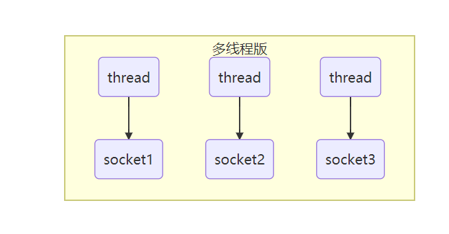
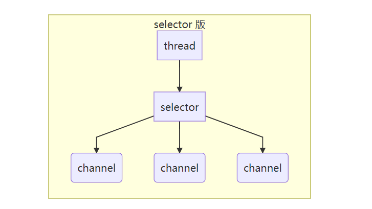

# NIO 基础

non-blocking io 非阻塞 IO

## 三大组件

### Channel & Buffer

channel 有点类似于stream，它就是读写数据的双向通道，可以从 channel 将数据读入 buffer，也可以从 buffer 将数据读入 channel，而之前的 stream 要么是输入，要么是输出，channel 比 straam 更为底层


常见的 Channel：

- FileChannel (文件)
- DatagramChannel (UDP)
- SocketChannel (TCP 客户端、服务器都可以用)
- ServerSocketChannel (TCP 服务器用)
  
Buffer 则用来缓冲读写数据，常见的 buffer：

- ByteBuffer
  - MappedByteBuffer
  - DirectByteBuffer
  - HeapByteBuffer
- ShortBuffer
- IntBuffer
- LongBuffer
- FloatBuffer
- DoubleBuffer
- CharBuffer
  
### Selector

selector 单从字面意思不好意思理解，需要结合服务器的设计演化来理解它的用途

#### 多线程版设计



**多线程版的缺点：**

- 内存占用高 (一个线程占用1M，1000个线程占用1G)
- 线程上下文切换成本高
- 只适合连接数少的场景

#### 线程池版设计


**线程池版缺点：**

- 阻塞模式下，线程仅能处理一个 socket 连接
- 仅适合短连接的场景

### Selector 版设计

selector 的作用就是配置一个线程来管理多个 channel，获取这些 channel 上发生的事件，这些 channel 工作在非阻塞模式下，不会让线程吊死在一个 channel 上。适合连接数特别多，但流量低的场景 (low traffic)



调用 selector 的 select() 会阻塞直到 channel 发生了读写就绪事件，这些事件发生，select 方法就会返回这些事件交给 thread 处理

## ByteBuffer

### 使用

1. 向 buffer 写入数据，例如调用 channel.read(buffer)
2. 调用 flip() 切换至读模式
3. 从 buffer 读取数据，例如调用 buffer.get()
4. 调用 clear() 或 compact() 切换至写模式
5. 重复 1-4 步骤

例如有一文件 data.txt，内容为

```java
1234567890abc
```

使用 FileChannel 来读取文件内容

```java
 public static void main(String[] args) {
        // FileChannel
        // 获取方式：1. 输入输出流 2. new RandomAccessFile("data.txt", "r").getChannel()
        // 将文件写入 channel
        try (FileChannel channel = new FileInputStream("data.txt").getChannel()) {
            // 申请缓冲区
            ByteBuffer buffer = ByteBuffer.allocate(10);
            while (true) {
                //将 channel 中的数据读出，向 buffer 写入
                int len = channel.read(buffer);
                if (len == -1) // 读完
                    break;
                log.info(" read byte count：{}", len);
                // 切换至读出模式
                buffer.flip();
                // 是否还有剩余未读数据
                while (buffer.hasRemaining()) {
                    byte b = buffer.get();
                    log.info("read byte：{}", (char) b);
                }
                // 切换至写入模式
                buffer.clear();
            }
        } catch (IOException e) {
            e.printStackTrace();
        }
    }
```

### ByteBuffer 结构

ByteBuffer 有以下重要属性

- capacity
- position
- limit

初始化时


写模式下，position 是写入位置，limit 等于容量，下图表示写入了 4 个节点的状态


flip 动作发生后，position 切换为读取位置，limit 切换为读取限制


读取 4 个字节后


clear 动作发生后


compact() 方法是把未读完的部分向前压缩，然后切换至读取模式


### ByteBuffer 常见方法

#### 分配空间

可以使用 allocate 方法为 ByteBuffer 分配空间，其它 buffer 类也有该方法

```java
Bytebuffer buf = ByteBuffer.allocate(16);
```

class java.nio.HeapByteBuffer    - java 堆内存 读写效率较低 受 GC 影响
class java.nio.DirectByteBuffer  - 直接内存 读写效率高（少一次拷贝） 不受 GC 影响

#### 向 buffer 写入数据

有两种办法

- 调用 channel 的 read 方法
- 调用 buffer 自己的 put 方法

```java
int readBytes = channel.read(buf);
```

和

```java
buf.put((byte)127);
```

#### 从 buffer 读取数据

同样有两种办法

- 调用 channel 的 write 方法
- 调用 buffer 自己的 get 方法

```java
int writeBytes = channel.write(buf);
```

和

```java
byte b = buf.get();
```

get 方法会让 position 读指针向后走，如果想重复读取数据

- 可以调用 rewind 方法将 position 重新置为 0
- 或者调用 get(int i) 方法获取索引 i 的内容，它不会移动读指针

#### mark 和 reset

mark 是在读取时，做一个标记，即使 position 改变，只要调用 reset 就能回到 mark 的位置

> **注意**
>
> rewind 和 flip 都会清除 mark 位置

#### 字符串与 ByteBuffer 互转

```java
public class ByteBufferStringTest {

    public static void main(String[] args) {
        // 字符串转 ByteBuffer
        ByteBuffer buffer1 = ByteBuffer.allocate(16);
        buffer1.put("hello".getBytes());
        debugAll(buffer1);

        // Charset auto flip
        ByteBuffer buffer2 = StandardCharsets.UTF_8.encode("hello");
        debugAll(buffer2);
        // wrap auto flip
        ByteBuffer buffer3 = ByteBuffer.wrap("hello".getBytes());
        debugAll(buffer3);

        String s = StandardCharsets.UTF_8.decode(buffer2).toString();
        System.out.println(s);
    }

```

#### ⚠️ Buffer 的线程安全

> Buffer 是**非线程安全的**

## 文件编程

### FileChannel

#### ⚠️ FileChannel 工作模式

> FileChannel 只能工作在阻塞模式下
-#### 获取

不能直接打开 FileChannel，必须通过 FileInputStream、FileOutputStream 或者 RandomAccessFile 来获取 FileChannel，它们都有 getChannel 方法

- 通过 FileInputStream 获取的 channel 只能读
- 通过 FileOutputStream 获取的 channel 只能写
- 通过 RandomAccessFile 是否能读写根据构造 RandomAccessFile 时的读写模式决定

#### 读取

会从 channel 读取数据填充 ByteBuffer，返回值表示读到了多少字节，-1 表示到达了文件的末尾

```java
int readBytes = channel.read(buffer);
```

#### 写入

写入的正确姿势如下， SocketChannel

```java
ByteBuffer buffer = ...;
buffer.put(...); // 存入数据
buffer.flip();   // 切换读模式

while(buffer.hasRemaining()) {
    channel.write(buffer);
}
```

在 while 中调用 channel.write 是因为 write 方法并不能保证一次将 buffer 中的内容全部写入 channel

#### 关闭

channel 必须关闭，不过调用了 FileInputStream、FileOutputStream 或者 RandomAccessFile 的 close 方法会间接地调用 channel 的 close 方法

#### 位置

获取当前位置

```java
long pos = channel.position();
```

设置当前位置

```java
long newPos = ...;
channel.position(newPos);
```

设置当前位置时，如果设置为文件的末尾

- 这时读取会返回 -1 
- 这时写入，会追加内容，但要注意如果 position 超过了文件末尾，再写入时在新内容和原末尾之间会有空洞（00）

#### 大小

使用 size 方法获取文件的大小

#### 强制写入

操作系统出于性能的考虑，会将数据缓存，不是立刻写入磁盘。可以调用 force(true)  方法将文件内容和元数据（文件的权限等信息）立刻写入磁盘