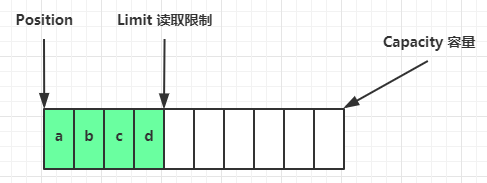

# NIO 基础

non-blocking io 非阻塞 IO

## 三大组件

### Channel & Buffer

channel 有点类似于stream，它就是读写数据的双向通道，可以从 channel 将数据读入 buffer，也可以从 buffer 将数据读入 channel，而之前的 stream 要么是输入，要么是输出，channel 比 straam 更为底层


常见的 Channel：

- FileChannel (文件)
- DatagramChannel (UDP)
- SocketChannel (TCP 客户端、服务器都可以用)
- ServerSocketChannel (TCP 服务器用)
  
Buffer 则用来缓冲读写数据，常见的 buffer：

- ByteBuffer
  - MappedByteBuffer
  - DirectByteBuffer
  - HeapByteBuffer
- ShortBuffer
- IntBuffer
- LongBuffer
- FloatBuffer
- DoubleBuffer
- CharBuffer
  
### Selector

selector 单从字面意思不好意思理解，需要结合服务器的设计演化来理解它的用途

#### 多线程版设计


**多线程版的缺点：**

- 内存占用高 (一个线程占用1M，1000个线程占用1G)
- 线程上下文切换成本高
- 只适合连接数少的场景

#### 线程池版设计


**线程池版缺点：**

- 阻塞模式下，线程仅能处理一个 socket 连接
- 仅适合短连接的场景

### Selector 版设计

selector 的作用就是配置一个线程来管理多个 channel，获取这些 channel 上发生的事件，这些 channel 工作在非阻塞模式下，不会让线程吊死在一个 channel 上。适合连接数特别多，但流量低的场景 (low traffic)


调用 selector 的 select() 会阻塞直到 channel 发生了读写就绪事件，这些事件发生，select 方法就会返回这些事件交给 thread 处理

## ByteBuffer

### 使用

1. 向 buffer 写入数据，例如调用 channel.read(buffer)
2. 调用 flip() 切换至读模式
3. 从 buffer 读取数据，例如调用 buffer.get()
4. 调用 clear() 或 compact() 切换至写模式
5. 重复 1-4 步骤

例如有一文件 data.txt，内容为

```java
1234567890abc
```

使用 FileChannel 来读取文件内容

```java
 public static void main(String[] args) {
        // FileChannel
        // 获取方式：1. 输入输出流 2. new RandomAccessFile("data.txt", "r").getChannel()
        // 将文件写入 channel
        try (FileChannel channel = new FileInputStream("data.txt").getChannel()) {
            // 申请缓冲区
            ByteBuffer buffer = ByteBuffer.allocate(10);
            while (true) {
                //将 channel 中的数据读出，向 buffer 写入
                int len = channel.read(buffer);
                if (len == -1) // 读完
                    break;
                log.info(" read byte count：{}", len);
                // 切换至读出模式
                buffer.flip();
                // 是否还有剩余未读数据
                while (buffer.hasRemaining()) {
                    byte b = buffer.get();
                    log.info("read byte：{}", (char) b);
                }
                // 切换至写入模式
                buffer.clear();
            }
        } catch (IOException e) {
            e.printStackTrace();
        }
    }
```

## ByteBuffer 结构

ByteBuffer 有以下重要属性

- capacity
- position
- limit

初始化时


写模式下，position 是写入位置，limit 等于容量，下图表示写入了 4 个节点的状态


flip 动作发生后，position 切换为读取位置，limit 切换为读取限制



读取 4 个字节后


clear 动作发生后


compact() 方法是把未读完的部分向前压缩，然后切换至读取模式

