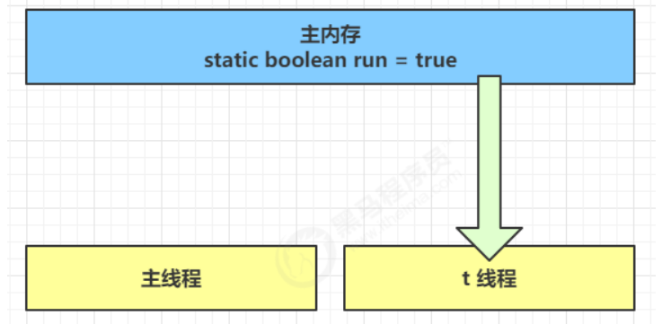
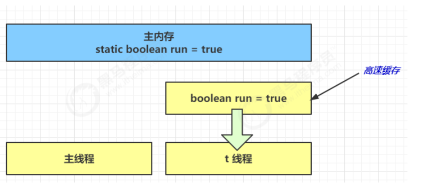
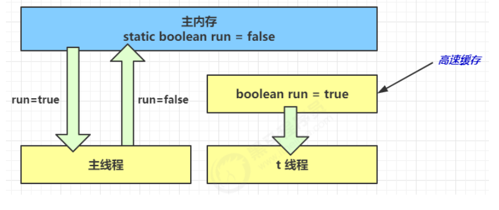
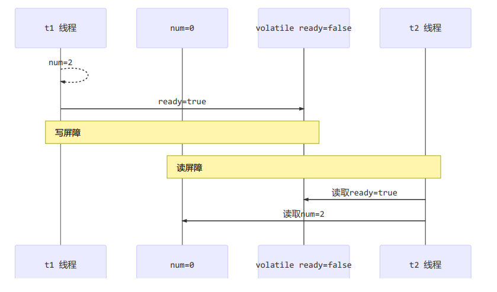
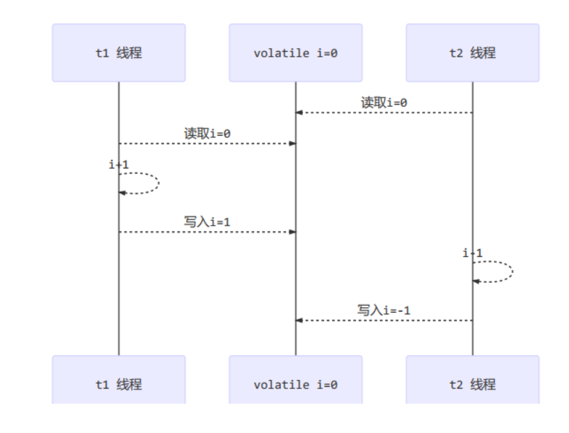
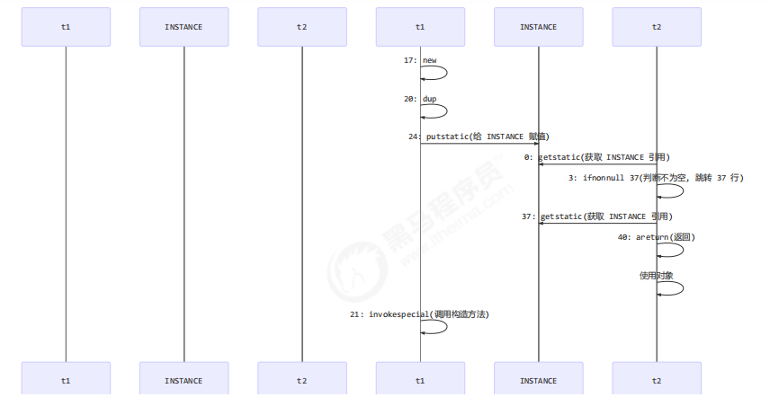

# 共享模型之内存

共享变量在多线程之间的`可见性`与多条指令执行时的`有序性`问题

## Java 内存模型

 JMM 即 Java Memory Model，它定义了内存、工作内存抽象概念，底层对应着 CPU 寄存器、缓存、硬件内存、CPU 指令优化等

 JMM 体现在以下几个方面

- 原子性-保证指令不受线程上下文切换的影响
- 可见性-保证指令不受 CPU 缓存的影响
- 有序性-保证指令不受 CPU 指令并行优化的影响

## 可见性

### 退不出的循环

有这样一个现象，main 线程对 run 变量的修改对于 t 线程不可见，导致了t 线程无法停止

```java
start boolean run = true;

public start void main(String[] args) throws InterruptedException {
    Thread t = new Thread(() -> {
        while(run){
            // ..
        }
    });
    t.start();
    sleep(1);
    run = false; // 线程 t 不会如预想般停下来
}
```

分析：

- 初始状态， t 线程刚从主内存读取了 run 的值到工作内存

  

- 因为 t 线程要频繁从主内存中读取 run 的值，JIT 编译器会将 run 的值缓存至自己工作内存中的高速缓存中，减少对主内存中 run 的访问，提高效率

  

- 1 秒之后，main 线程修改了 run 的值，并同步至主内存，而 t 是从自己工作内存中的高速缓存中读取这个变量的值，结果永远是旧值

  

### 解決方法

volatile (易变关键字)，可以用来修饰成员变量和静态成员变量，避免线程从自己的工作缓存中查找变量的值，必须到主内存中获取它的值，线程操作 volatile 变量都是直接操作主内存

### 可见性 VS 原子性

前面例子体现的实际是可见性，它保证的是多个线程之间，一个线程对 volatile 变量的修改对另一个线程可见，不能保证原子性，仅用在一个写线程，多个读线程的情况。上例从字节码理解是这样的

```java
getstatic run // 线程 t 获取 run true 
getstatic run // 线程 t 获取 run true 
getstatic run // 线程 t 获取 run true 
getstatic run // 线程 t 获取 run true 
putstatic run // 线程 main 修改 run 为 false， 仅此一次
getstatic run // 线程 t 获取 run false
```

比较一下之前线程安全举的例子：两个线程一个 i++ 一个 i-- ，只能保证看到最新值，不能解决指令交错

```java
// 假设i的初始值为0 
getstatic i // 线程2-获取静态变量i的值 线程内i=0 
getstatic i // 线程1-获取静态变量i的值 线程内i=0 
iconst_1 // 线程1-准备常量1 
iadd // 线程1-自增 线程内i=1 
putstatic i // 线程1-将修改后的值存入静态变量i 静态变量i=1 
iconst_1 // 线程2-准备常量1 
isub // 线程2-自减 线程内i=-1 
putstatic i // 线程2-将修改后的值存入静态变量i 静态变量i=-1
```

**注意：**

synchronized 语句块既可以保证代码块的原子性，也同时保证代码块内变量的可见性，但缺点是 synchronized 是属于重量级操作，性能相对更低

加 System.out.println() 打印也可以保证正确看到 run 的修改，因为其底层 加了 synchronized 关键字

```java
private void newLine() {
        try {
            synchronized (this) {
                ensureOpen();
                textOut.newLine();
                textOut.flushBuffer();
                charOut.flushBuffer();
                if (autoFlush)
                    out.flush();
            }
        }
        catch (InterruptedIOException x) {
            Thread.currentThread().interrupt();
        }
        catch (IOException x) {
            trouble = true;
        }
    }
```

### volatile 改进两阶段终止模式

```java
public class TwoPhaseTerminationDemo2 {

    public static void main(String[] args) throws InterruptedException {

        TwoPhaseTermination2 tpt = new TwoPhaseTermination2();
        tpt.start();
        TimeUnit.SECONDS.sleep(10);
        log.info("停止监控");
        tpt.stop();
    }
}

@Slf4j
class TwoPhaseTermination2 {

    private Thread monitor;

    private volatile boolean stop;

    // 启动监控线程
    public void start() {
        monitor = new Thread(() ->{
            while (true){
                if(stop){
                    log.info("料理后事");
                    break;
                }
                try {
                    TimeUnit.SECONDS.sleep(2);
                    log.info("执行监控");
                } catch (InterruptedException e) {
                }
            }
        });
        monitor.start();
    }

    // 停止监控线程
    public void stop() {
        stop = true;
        monitor.interrupt();
    }
}
```

### 同步模式之 Balking

1、定义

Balking(犹豫)模式用在一个线程发现另一个线程或本线程已经做了某一件相同的事，那么本线程就无需做了，直接结束返回

2、实现

例如：

```java
public class MonitorService {
    // 用来表示是否已经有线程在执行启动了
    private volatile boolean starting;

    public void start(){
        log.info("尝试启动监控线程...");
        synchronized (this) {
            if(starting){
                return;
            }
            starting = true;
        }
        // 真正启动监控线程..
    }
}
```

实现线程安全的单利

```java
public final class Singleton {
    public Singleton() {}

    private static Singleton INSTANCE = null;


    public static synchronized Singleton getInstance () {
        if(INSTANCE != null) {
            return INSTANCE;
        }
        INSTANCE = new Singleton();
        return INSTANCE;
    }
}
```

对比保护性暂停模式：保护性暂停模式用在一个线程等待另一个线程的执行结果，当条件不满足时线程等待

## 有序性

JVM 会在不影响正确性的前提下，可以调整语句的执行顺序，例如

```java
static int i;
static int j;
// 在某个线程内执行如下赋值操作
i = ...;
j = ...;
```

上面代码真正执行时，既可以是

```java
i = ...;
j = ...;
```

也可以是

```java
j = ...;
i = ...;
```

这种特性称之为指令重排，多线程下的指令重排会影响正确性。

## volatile 原理

volatile 的底层实现原理是内存屏障，Memory Barrier

- 对 volatile 变量的写指令后会加入写屏障
- 对 volatile 变量的读指令前会加入读屏障

### 如何保证可见性

- 写屏障( sfence ) 保证在该屏障之前的，对共享变量的改动，都同步到主内存中

```java
public void actor2(I_Result r){
    num = 2;
    ready = true; // ready 是 volatile 赋值，带写屏障
    // 写屏障
}
```

- 而读屏障( lfence ) 保证在该屏障之后，对共享变量的读取，加载的是内存中的最新的数据

```java
public void actor1(I_Result r){
    // 读屏障
    // ready 是 volatile 读取 带读屏障
    if(ready) {
        r.r1 = num + num;
    }else{
        r.r1 = 1;
    }
}
```

  

### 如何保证有序性

- 写屏障会确保指令重排序时，不会将写屏障之前的代码排在写屏障之后

```java
public void actor2(I_Result) {
    num = 2;
    ready = true; // ready 是 volatile 赋值，带写屏障
    // 写屏障
}
```

- 读屏障会确保指令重排序时，不会将读屏障之后的代码排在读屏障之前

```java
public void actor1(I_Result r){
    // 读屏障
    // ready 是 volatile 读取 带读屏障
    if(ready) {
        r.r1 = num + num;
    }else{
        r.r1 = 1;
    }
}
```

总结: 不能解决指令交错（原子性）

- 写屏障仅仅是保证之后的读能够读到最新的结果，但不能保证读跑到它前面去
- 而有序性的保证也只是保证了本线程内的相关代码不被重排序

  

### double-checked locking 问题

以著名的 double-checked locking 单例模式为例

```java
public final class Singleton {
    private Singleton() {}
    private static Singleton INSTANCE = null;
    public static Singleton getInstance() {
        if (INSTANCE == null) {
            synchronized (Singleton.class) {
                if (INSTANCE == null){
                    INSTANCE = new Singleton();
                }
            }
        }
        return INSTANCE;
    }
}
```

以上实现的特点是：

- 懒惰实例化
- 首次使用 getInstance() 才使用 synchronized 加锁，后续使用时无需加锁
- 有隐含的，但很关键的一点: 第一个 if 使用了 INSTANCE 变量，是在同步代码块之外

但在多线程环境下，上面的代码时有问题的，getInstance() 方法对应的字节码为：

```
0: getstatic #2 // Field INSTANCE:Lcn/itcast/n5/Singleton;
3: ifnonnull 37
6: ldc #3 // class cn/itcast/n5/Singleton
8: dup
9: astore_0
10: monitorenter
11: getstatic #2 // Field INSTANCE:Lcn/itcast/n5/Singleton;
14: ifnonnull 27
17: new #3 // class cn/itcast/n5/Singleton
20: dup
21: invokespecial #4 // Method "<init>":()V
24: putstatic #2 // Field INSTANCE:Lcn/itcast/n5/Singleton;
27: aload_0
28: monitorexit
29: goto 37
32: astore_1
33: aload_0
34: monitorexit
35: aload_1
36: athrow
37: getstatic #2 // Field INSTANCE:Lcn/itcast/n5/Singleton;
40: areturn
```

其中关键在于以下几行

- 17 表示创建对象，将对象引用入栈 // new Singleton
- 20 表示复制一份对象引用 // 引用地址
- 21 表示利用一个对象引用，调用构造方法
- 24 表示利用一个对象引用，赋值给 static INSTANCE

也许 jvm 会优化为：先执行 24 ，再执行 21， 如果两个线程 t1，t2 按如下时间序列执行：

  

关键在于0：getstatic 这行代码在 monitor 控制之外，可以越过 monitor 读取 INSTANCE 变量的值

这时 t1 还未完全将构造方法执行完毕，如果在构造方法中要执行很多的初始化操作，那么 t2 拿到的就是一个未初始化完毕的单例

#### double-checked locking 解决

对 INSTANCE 使用volatile 即可，可以禁用指令重排，但要注意在 JDK1.5 以上的版本的 volatile 才会真正有效

```java
public final class Singleton {
    private Singleton() {}
    private static Singleton INSTANCE = null;
    public static Singleton getInstance() {
        if (INSTANCE == null) {
            synchronized (Singleton.class) {
                if (INSTANCE == null){
                    INSTANCE = new Singleton();
                }
            }
        }
        return INSTANCE;
    }
}
```

字节码上看不出来 volatile 指令效果

```java
// -------------------------------------> 加入对 INSTANCE 变量的读屏障
0: getstatic #2 // Field INSTANCE:Lcn/itcast/n5/Singleton;
3: ifnonnull 37
6: ldc #3 // class cn/itcast/n5/Singleton
8: dup
9: astore_0
10: monitorenter -----------------------> 保证原子性、可见性
11: getstatic #2 // Field INSTANCE:Lcn/itcast/n5/Singleton;
14: ifnonnull 27
17: new #3 // class cn/itcast/n5/Singleton
20: dup
21: invokespecial #4 // Method "<init>":()V
24: putstatic #2 // Field INSTANCE:Lcn/itcast/n5/Singleton;
// -------------------------------------> 加入对 INSTANCE 变量的写屏障
27: aload_0
28: monitorexit ------------------------> 保证原子性、可见性
29: goto 37
32: astore_1
33: aload_0
34: monitorexit
35: aload_1
36: athrow
37: getstatic #2 // Field INSTANCE:Lcn/itcast/n5/Singleton;
40: areturn
```

如上面的注释内容所示，读写 volatile 变量时会加入内存屏障 ( Memory Barrier)，保证下面两点：

- 可见性
  - 写屏障( sfence ) 保证在该屏障之前的 t1 对共享变量的改动，都同步到主内存中
  - 读屏障( lfence ) 保证在该屏障之后的 t2 对共享变量的读取，加载的是内存中最新数据

- 有序性
  - 写屏障会确保指令重排序时，不会将写屏障之前的代码排在写屏障之后
  - 读屏障会确保指令重排序时，不会将读屏障之后的代码排在读屏障之前

- 更底层的是读写变量时使用 lock 指令多核 CPU 之间的可见性与有序性

## happens-before

happens-before 规定了对共享变量的写操作对其他线程的读写可见，它是可见性与有序性的一套规则总结，抛开以下 happens-before 规则，JMM 并不能保证一个线程对共享变量的写，对于其他线程对该变量的读可见

- 线程解锁 m 之前对变量的写，对于接下来对 m 加锁的其他线程对该变量的读可见

```java
static int x;
static Object m = new Object();
new Thread(() -> {
    synchronized(m) {
        x = 10;
    }
},"t1").start();
new Thread(() -> {
    synchronized(m) {
        System.out.println(x);
    }
},"t2").start();
```

- 线程对 volatile 变量的写，对于接下来其他线程对该变量的读可见

```java
volatile static int x;

new Thread(()->{
 x = 10;
},"t1").start();

new Thread(()->{
 System.out.println(x);
},"t2").start()
```

- 线程 start 前对变量的写，对该线程开始后对该变量的读可见

```java
static int x;

x = 10;

new Thread(() -> {
    System.out.println(x);
}, "t1").start();
```

- 线程结束前对变量的写，对其他线程得知它结束后的读可见（比如其他线程调用t1.isAlive() 或 t1.join() 等待它结束)

```java
static int x;

Thread t1 = new Thread(() -> {
    x = 10;
}).start();

t1.join();
System.out.print(x);
```

- 线程 t1 打断 t2 (interrupt) 前对变量的写，对于其他线程得知 t2 被打断后对变量的读可见

```java
static int x;

public static void main(String[] args) {
    Thread t2 = new Thread(() -> {
        while (true) {
            if (Thread.currentThread().isInterrupted()) {
                System.out.println(x);
                break;
            }
        }
    }, "t2");
    t2.start();

    new Thread(() -> {
        sleep(1);
        x = 10;
        t2.interrupt();
    }, "t1").start();

    while(!t2.isInterrupted()){
        Thread.yield();
    }

    System.out.println(x);
}
```

- 对变量默认值(0, false, null) 的写，对其他线程对该变量的读可见

- 具有传递性，配合 volatile 的指令重排

```java
volatile static int x ;

static int y;

new Thread(() -> {
    y = 20;
    x = 10;
    // 写屏障保证写屏障之前变量修改都会同步到主内存中
}, "t1").start();

new Thread(() -> {
    // x 对 t2 可见 同时 y 对 t2 也可见
    System.out.println(x);
}, "t2").start();
```
