# 共享模型之工具

## 线程池

### 自定义线程池

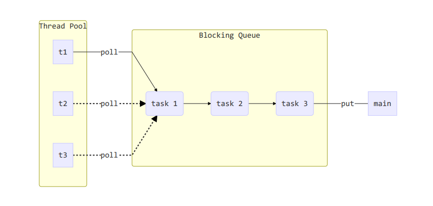  

自定义任务队列：

```java
class BlockingQueue<T> {

    /** 任务队列 */
    private final Deque<T> queue = new ArrayDeque<>();

    /** 锁 */
    private ReentrantLock lock = new ReentrantLock();

    /** 生产者条件变量 */
    private Condition fullWaitSet = lock.newCondition();

    /** 消费者条件变量 */
    private Condition emptyWaitSet = lock.newCondition();

    /** 容量 */
    private final int capacity;

    public BlockingQueue(int capacity) {
        this.capacity = capacity;
    }

    /** 阻塞获取 */
    public T take() {
        lock.lock();
        try {
            while (queue.isEmpty()) {
                try {
                    emptyWaitSet.await();
                } catch (InterruptedException e) {
                    e.printStackTrace();
                }
            }
            T t = queue.removeFirst();
            fullWaitSet.signal();
            return t;
        } finally {
            lock.unlock();
        }

    }

    /** 带超时的阻塞获取 */
    public T poll(long timeOut, TimeUnit unit) {
        lock.lock();
        try {
            long nanos = unit.toNanos(timeOut);
            while (queue.isEmpty()) {
                try {
                    if (nanos <= 0) return null;
                    nanos = emptyWaitSet.awaitNanos(nanos);
                } catch (InterruptedException e) {
                    e.printStackTrace();
                }
            }
            T t = queue.removeFirst();
            fullWaitSet.signal();
            return t;
        }finally {
            lock.unlock();
        }
    }

    /** 阻塞添加 */
    public void put(T task) {
        lock.lock();
        try {
            while (queue.size() == capacity) {
                try {
                    fullWaitSet.await();
                } catch (InterruptedException e) {
                    e.printStackTrace();
                }
            }
            queue.addLast(task);
            emptyWaitSet.signal();
        } finally {
            lock.unlock();
        }

    }

    public void tryPut(RejectPolicy<T> rejectPolicy, T task) {

        lock.lock();
        try {
            if (queue.size() == capacity) {
                rejectPolicy.reject(this, task);
            } else {
                queue.addLast(task);
                emptyWaitSet.signal();
            }

        }finally {
            lock.unlock();
        }

    }

    /** 带超时时间的添加 */
    public boolean offer(T element, long timeOut, TimeUnit unit) {
        lock.lock();
        try {
            long nanos = unit.toNanos(timeOut);
            while (queue.size() == capacity) {
                try {
                    if (nanos <= 0) {
                        return false;
                    }
                    nanos = fullWaitSet.awaitNanos(nanos);
                    return false;
                } catch (InterruptedException e) {
                    e.printStackTrace();
                }
            }
            queue.addLast(element);
            emptyWaitSet.signal();
            return true;
        }finally {
            lock.unlock();
        }
    }

    /** 获取容量 */
    public int size() {
        lock.lock();
        try {
            return queue.size();
        }finally {
            lock.unlock();
        }
    }


}
```

自定义线程池

```java

/** 拒绝策略 */
@FunctionalInterface
interface RejectPolicy<T> {
    void reject(BlockingQueue<T> queue, T task);
}

@Slf4j
class ThreadPool {
    /** 任务队列 */
    private final BlockingQueue<Runnable> taskQueue ;

    /** 线程集合 */
    private final HashSet<Worker> workers = new HashSet<>();

    /** 核心线程数*/
    private int coreSize;

    /** 获取任务的超时时间 */
    private long timeOut;

    private TimeUnit unit;

    /** 拒绝策略 */
    private final RejectPolicy<Runnable> rejectPolicy;

    public ThreadPool(int coreSize, long timeOut, TimeUnit unit, int queueCapacity, RejectPolicy<Runnable> rejectPolicy) {
        this.taskQueue = new BlockingQueue<>(queueCapacity);
        this.coreSize = coreSize;
        this.timeOut = timeOut;
        this.unit = unit;
        this.rejectPolicy = rejectPolicy;
    }

    // 执行任务
    public void execute(Runnable task) {
        synchronized (workers) {
            if (workers.size() < coreSize) {
                Worker worker = new Worker(task);
                log.info("新建线程:{}", worker);
                worker.start();
                workers.add(worker);
            } else {
                log.info("加入队列：{}", task);
//                taskQueue.put(task);
                // 1) 死等
                // 2) 带超时等待
                // 3) 让调用者放弃任务
                // 4) 让调用者抛出异常
                // 5) 让调用者自己执行任务
                taskQueue.tryPut(rejectPolicy, task);
            }
        }

    }

    class Worker extends Thread {

        private Runnable task;
        public Worker() {

        }

        public Worker(Runnable task) {
            this.task = task;
        }

        @Override
        public void run() {
//            while (task != null || (task = taskQueue.take()) != null) {
            while (task != null || (task = taskQueue.poll(timeOut, unit)) != null) {
                // 有任务则执行
                try {
                    log.info("正在执行....{}", task);
                    task.run();
                } catch (Exception e) {
                    e.getStackTrace();
                } finally {
                    task = null;
                }
            }

            synchronized (workers) {
                workers.remove(this);
                log.info("worker 被移除 {}", this);
            }
        }
    }
}
```

测试

```java
@Slf4j
public class ThreadPoolDemo{
    public static void main(String[] args) {
        ThreadPool threadPool = new ThreadPool(2, 1, TimeUnit.SECONDS, 5, ((queue, task) -> {
            // 1) 死等
//            queue.put(task);
            // 2) 带超时等待
//            queue.offer(task, 1500, TimeUnit.MILLISECONDS);
            // 3) 让调用者放弃任务
//            log.info("放弃 {}", task);
            // 4) 让调用者抛出异常
//            throw new RuntimeException("任务执行失败 " + task);
            // 5) 让调用者自己执行任务
            task.run();
        }));
        for (int i = 0; i < 5; i++) {
            int finalI = i;
            threadPool.execute(() -> log.info("{}", finalI));
        }
    }
}
```

### ThreadPoolExecutor

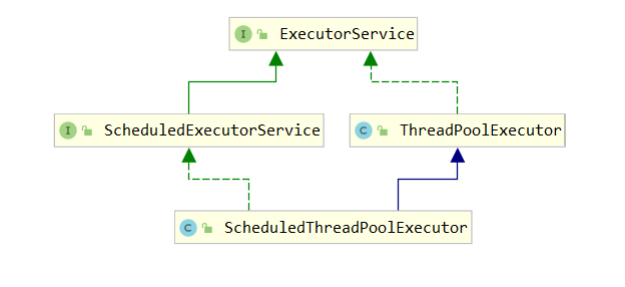  

#### 线程池状态

ThreadPoolExecutor 使用 int 的高3位来表示线程池状态，低29位表示线程数量

| 状态名 | 高3位| 接受新任务 | 处理阻塞队列任务 | 说明 |
| :---: | :---: | :---: |:---: |:---: |
| RUNNING |  111 | Y | Y | |
| SHUTDOWN |  000 | N | Y | 不会接受新任务，但会处理阻塞队列剩余任务 |
| STOP |  001 | N | N | 会中断正在执行的任务，并会抛弃阻塞队列任务 |
| TIDYING |  010 | - | - | 任务全执行完毕 ，活动线程为0即将进入终结 |
| TERMINATED |  011 | - | - | 终结状态 |

从数字上比较, TERMINATED > TIDYING > STOP > SHUTDOWN > RUNNING(-1)

这些信息存储在一个原子变量ctl 中，目的是将线程池状态与线程个数合二为一，这样就可以用一次 cas 原子操作进行赋值

```java

// c 为旧值，ctlOf 返回结果为新值
ctl.compareAndSet(c, ctlOf(targetState, workerCountOf(c))))

// rs 为高3位代表线程池状态，wc 为低29位代表线程个数，ctl 是合并它们
private static int ctlOf(int rs, int wc){
    return rs | wc;
}
```

#### 构造状态

```java
public ThreadPoolExecutor(int corePoolSize, int maximumPoolSize, long keepAliveTime, TimeUnit unit, BlockingQueue<Runnable> workQueue, ThreadFactory threadFactory, RejectExceptionsHandler handler)
```

- corePoolSize 核心线程数目（最多保留的线程数）
- maximumPoolSize 最大线程数目
- keepAliveTime 生存时间-针对救急线程
- unit 时间单位-针对救急线程
- workQueue 阻塞队列
- threadFactory 线程工厂-可以为线程创建时起个好名字
- handler 拒绝策略

工作方式

- 当一个任务提交给线程池后，如果当前线程数没有达到 corePoolSize 并且没有线程空闲，线程池会创建一个新线程来执行任务
- 当线程数达到 corePoolSize 并且没有线程空闲，这时再加入任务，新加的任务会被加入 workQueue 队列排队，直到有空闲的线程
- 如果有队列选择了有界队列，那么任务超过了队列大小时，会创建 maximumPoolSize - corePoolSize 的数目的线程来救急，即**救急线程**
- 如果线程达到 maximumPoolSize 仍然有新任务加入时会执行拒绝策略。拒绝策略 jdk 提供了4中实现，其他著名框架也提供了实现
  - AbortPolicy 让调用者抛出 RejectExecutionException 异常，这是默认策略
  - CallerRunsPolicy 让调用者自己执行任务
  - DiscardPolicy 放弃任务
  - DiscardOldestPolicy 放弃队列中最早的任务，本任务取而代之
  - Dubbo 的实现，在抛出 RejectExecutionException 异常之前会记录日志，并 dump 线程栈信息，方便定位问题
  - Netty 的实现，是创建一个新线程来执行任务
  - ActiveMQ 的实现，带超时等待 (60s) 尝试放入队列，类似之前自定义的拒绝策略
  - PinPoint 的实现，它使用了一个拒绝策略链，会逐一尝试策略链中每种拒绝策略
- 当高峰过去后，超过 corePoolSize 的救急线程如果一段时间没有任务做，需要结束节省资源，这个时间由 keepAliveTime 和 unit 来控制

JDK Executors 类中提供了众多工厂方法来创建各种用途的线程池

#### newFixedThreadPool

```java
public static ExecutorService newFixedThreadPool(int nThreads) {
    return new ThreadPoolExecutor(nThreads, nThreads, 0L, TimeUnit.MILLISECONDS, new LinkedBlockingQueue<Runnable>());
}
```

特点

- 核心线程数 == 最大线程数（没有救急线程被创建），因此也无需超时时间
- 阻塞队列是无界的，可以放任意数量的任务

评价：适用于任务量已知，相对耗时的任务

#### newCachedThreadPool

```java
public static ExecutorService newCachedThreadPool(){
    return new ThreadPoolExecutor(0, Integer.MAX_VALUE,60L, TimeUnit.SECONDS, new SynchronousQueue<Runnable>());
}
```

特点

- 核心线程数是0，最大线程数是 Integer.MAX_VALUE，救急线程的空闲生存时间是 60s，意味着
  - 全部是救急线程(60s 后可以回收)
  - 救急线程可以无限创建
- 队列采用了 SynchronousQueue，其特点是没有容量，没有线程来取是放不进去的

```java
SynchronousQueue<Integer> queue = new SynchronousQueue<>();
new Thread(() -> {
    try {
        log.info("putting...{}", 1);
        queue.put(1);
        log.info("putted...{}", 1);
        log.info("putting...{}", 2);
        queue.put(2);
        log.info("putted...{}", 2);
    } catch (Exception e) {
        e.printStackTrace();
    }
}).start();
Sleeper.sleep(1);
new Thread(() -> {
    try {
        log.info("take..{}", 1);
        queue.take();
    } catch (InterruptedException e) {
        e.printStackTrace();
    }
}).start();
```

输出

```java
 [Thread-0] INFO juc.code.threadpool.ExecutorsDemo - putting...1
 [Thread-1] INFO juc.code.threadpool.ExecutorsDemo - take..1
 [Thread-0] INFO juc.code.threadpool.ExecutorsDemo - putted...1
 [Thread-0] INFO juc.code.threadpool.ExecutorsDemo - putting...2
```

评价：整个线程池表现为线程数会根据任务量不断增长，没有上限，当任务执行完毕，空闲1分钟后释放线程。适合任务量比较密集，但每个任务执行时间较短的情况

#### newSingleThreadExecutor

```java
public static ExecutorService newSingleThreadExecutor() {
    return new FinalizaleDelegateExecutorService(new ThreadPoolExecutor(1, 1, 0L, TimeUnit.MILLISECONDS, new LinkedBlockingQueue<Runnable>()));
}
```

使用场景：希望多个任务排队执行。线程数固定为1，任务数多于1时，会放入无界队列。任务执行完毕，这唯一的线程也不会被释放。

与自己创建一个线程的区别：

- 自己创建一个单线程执行任务，如果任务执行失败而终止那么没有任何补救措施，而线程池还会创建一个线程，保证池的正常工作
- Executor.newSingleThreadExecutor() 线程个数始终为1，不能修改
  - FinalizaleDelegateExecutorService 应用的是装饰者模式，只对外暴露了ExecutorService 接口，因此不能调用 ThreadPoolExecutor 中特有的方法
- Eexcutor.newFixedThreadPool(1) 初始为1，以后可以修改
  - 对外暴露的是 ThreadPoolExecutor 对象，可以强转后调用 setCorePoolSize 等方法进行修改

#### 提交任务

```java
// 执行任务
void execute(Runnable command);

// 提交任务 task，用返回值 Future 获得任务执行结果
<T> Future<T> submit(Callable<T> task);

// 提交 tasks 中所有任务
<T> List<Future<T>> invokeAll(Collection<? extends Callable<T>> tasks) throws InterruptedException;

// 提交 tasks 中所有任务，带超时时间
<T> List<Future<T>> invokeAll(Collection<? extends Callable<T>> tasks, long timeout, TimeUnit unit) throws InterruptedException;

// 提交 tasks 中所有任务，哪个任务先成功执行完毕，返回此任务执行结果，其他任务取消
<T> T invokeAny(Collection<? extends Callable<T>> tasks) throws InterruptedException, ExecutionException;

// 提交 tasks 中所有任务，哪个任务先成功执行完毕，返回此任务执行结果，其他任务取消，带超时时间
<T> T invokeAny(Collection<? extends Callable<T>> tasks, long timeout, TimeUnit unit) throws InterruptedException, ExecutionException;
```

#### 关闭线程池

##### shutdown

```java
/**
 * 线程池状态变为 SHUTDOWN
 * 不会接受新任务
 * 但已提交的任务会执行完
 * 此方法不会阻塞调用线程的执行
 */
void shutdown();
```

```java
public void shutdown() {
    final ReentrantLock mainLock = this.mainLock;
    mainLock.lock();
    try {
        checkShutdownAccess();
        // 修改线程状态
        advanceRunState(SHUTDOWN);
        // 仅会打断空闲线程
        interruptIdleWorkers();
        onShutdown(); // 拓展点 ScheduledThreadPoolExecutor
    }finally {
        mainLock.unlock();
    }
    // 尝试终结(没有运行的线程可以立刻终结，如果还有运行的线程也不会等)
    tryTerminate();
}
```

##### shutdownNow

```java
/**
 * 线程池状态变为 STOP
 * 不会接受新任务
 * 会将队列中任务返回
 * 并用 interrupt 的方式中断正在运行的任务
 */
List<Runnable> shutdownNow();
```

```java
public List<Runnable> shutdownNow() {
    List<Runnable> tasks;
    final ReentrantLock mainLock = this.mainLock;
    mainLock.lock();
    try {
        checkShutdownAccess();
        // 修改线程状态
        advanceRunState(STOP);
        // 打断所有线程
        interruptWorkers();
        // 获取队列中剩余任务
        tasks = drainQueue();
    } finally {
        mainLock.unlock();
    }
    // 尝试终结
    tryTerminate();
    return tasks;
}
```

##### 其他方法

```java
// 不在 RUNNING 状态的线程池，此方法就返回 false
boolean isShutdown();
// 线程池状态是否是 TERMINATED
boolean isTerminated();
// 调用 shutdown 后，由于调用线程并不会等待所有任务运行结束，因此如果它想在线程池 TERMINATED 后做些事情，可以利用此方法
boolean awaitTermination(long timeout, TimeUnit unit)
        throws InterruptedException;
```

#### 异步模式之工作线程

**定义：**

让有限的工作线程(Worker Thread) 来轮流异步处理无限多的任务。也可以将其归类为分工模式。它的典型实现就是线程池，也体现了经典设计模式中的享元模式。

例如，海底捞的服务员（线程），轮流处理每位客人的点餐（任务），如果为每位客人都配一名专属的服务员，那
么成本就太高了（对比另一种多线程设计模式：Thread-Per-Message）

注意，不同任务类型应该使用不同的线程池，这样能够避免饥饿，并能提升效率

例如，如果一个餐馆的工人既要招呼客人（任务类型A），又要到后厨做菜（任务类型B）显然效率不咋地，分成
服务员（线程池A）与厨师（线程池B）更为合理，当然你能想到更细致的分工

**饥饿：**

固定大小线程池会有饥饿现象

- 两个工人是同一个线程池中的两个线程
- 他们要做的事是：为客人点餐和后厨做菜，这是两个阶段的工作
  - 客人点餐：必须先点完餐，等才做好，上菜，在此期间点餐的工人必须等待
- 比如工人A处理了点餐任务，接下来要的等着工人B把菜做好，然后上菜
- 但现在同时来了两个客人，这个时候工人A和工人B都去处理点餐了，没人做饭，即饥饿

```java
public class WorkerThreadDemo {

    static final List<String> MENU = Arrays.asList("地三鲜", "宫保鸡丁", "辣子鸡丁");
    static Random RANDOM = new Random();
    static String cooking() {
        return MENU.get(RANDOM.nextInt(MENU.size()));
    }

    public static void main(String[] args) {
        ExecutorService pool = Executors.newFixedThreadPool(2);

        pool.execute(() -> {
            log.info("处理点餐...");
            Future<String> future = pool.submit(() -> {
                log.info("做菜");
                return cooking();
            });
            try {
                log.info("上菜...{}", future.get());
            } catch (InterruptedException | ExecutionException e) {
                e.printStackTrace();
            }
        });

        pool.execute(() -> {
            log.info("处理点餐...");
            Future<String> future = pool.submit(() -> {
                log.info("做菜");
                return cooking();
            });
            try {
                log.info("上菜...{}", future.get());
            } catch (InterruptedException | ExecutionException e) {
                e.printStackTrace();
            }
        });
    }
}
```

输出

```java
[pool-1-thread-2] INFO juc.code.threadpool.WorkerThreadDemo - 处理点餐...
[pool-1-thread-1] INFO juc.code.threadpool.WorkerThreadDemo - 处理点餐...
```

解决方法可以增加线程池的大小，不过不是根本解决方案

而是不同任务类型，采用不同的线程池

```java
ExecutorService cookPool = Executors.newFixedThreadPool(1);
ExecutorService waiterPool = Executors.newFixedThreadPool(1);
waiterPool.execute(() -> {
    log.info("处理点餐...");
    Future<String> future = cookPool.submit(() -> {
        log.info("做菜");
        return cooking();
    });
    try {
        log.info("上菜...{}", future.get());
    } catch (InterruptedException | ExecutionException e) {
        e.printStackTrace();
    }
});
waiterPool.execute(() -> {
    log.info("处理点餐...");
    Future<String> future = cookPool.submit(() -> {
        log.info("做菜");
        return cooking();
    });
    try {
        log.info("上菜...{}", future.get());
    } catch (InterruptedException | ExecutionException e) {
        e.printStackTrace();
    }
});
```

```java
[pool-2-thread-1] INFO juc.code.threadpool.WorkerThreadDemo - 处理点餐...
[pool-1-thread-1] INFO juc.code.threadpool.WorkerThreadDemo - 做菜
[pool-2-thread-1] INFO juc.code.threadpool.WorkerThreadDemo - 上菜...地三鲜
[pool-2-thread-1] INFO juc.code.threadpool.WorkerThreadDemo - 处理点餐...
[pool-1-thread-1] INFO juc.code.threadpool.WorkerThreadDemo - 做菜
[pool-2-thread-1] INFO juc.code.threadpool.WorkerThreadDemo - 上菜...辣子鸡丁
```

##### 创建多少线程池合适

- 过小会导致程序不能充分地利用系统资源、容易导致饥饿
- 过大会导致更多的线程上下文切换，占用更多的内存

###### cpu 密集型运算

通常采用 cpu 核数 + 1 能够实现最优的 CPU 利用率，+ 1时保证当前线程由于页缺失故障(操作系统)或其他原因导致暂停时，额外的这个线程就能够顶上去，保证 CPU 时钟周期不被浪费

###### I/O 密集型运算

CPU 不总是处于繁忙状态，例如，当你执行业务计算时，这时候会使用 CPU 资源，但当你执行I/O操作时、远程RPC调用时，包括进行数据库操作时，这时CPU就闲下来了，你可以利用多线程提高它的利用率

经验公式如下

线程数 = 核数 * 期望 CPU 利用率 * 总时间(CPU 计算时间 + 等待时间) / CPU 计算时间

例如 4 核 CPU 计算时间是 50%，其他等待时间是50%，期望 CPU 被 100% 利用，套用公式：

```java
4 * 100% * 100% / 50% = 8
```

例如 4 核 CPU 计算时间是 10%，其他等待时间是50%，期望 CPU 被 100% 利用，套用公式：

```java
4 * 100% * 100% / 10% = 40
```

#### 任务调度线程池

在任务调度线程池功能加入之前，可以使用 java.util.Timer 来实现定时功能，Timer的优点在于简单易用，但由于所有任务都是同一个线程来调度，因此所有任务都是串行的，同一时间只能有一个任务在执行，前一个任务的延迟或异常都将影响之后的任务

```java
Timer timer = new Timer();
log.info("start....");
TimerTask task1 = new TimerTask() {
    @Override
    public void run() {
        log.info("run task1....");
        Sleeper.sleep(2);
    }
};
TimerTask task2 = new TimerTask() {
    @Override
    public void run() {
        log.info("run task2....");
    }
};
// 希望两个任务都在 1s 后运行
timer.schedule(task1, 1000);
timer.schedule(task2, 1000);
```

输出

```java
14:57:01.713 [main] INFO juc.code.threadpool.TimerDemo - start....
14:57:02.718 [Timer-0] INFO juc.code.threadpool.TimerDemo - run task1....
14:57:04.720 [Timer-0] INFO juc.code.threadpool.TimerDemo - run task2....
```


使用 ScheduleExecutorSerivice 改写

```java
ScheduledExecutorService pool = Executors.newScheduledThreadPool(2);
log.info("start...");
pool.schedule(() -> log.info("run task1..."), 1, TimeUnit.SECONDS);
pool.schedule(() -> log.info("run task2..."), 1, TimeUnit.SECONDS);
```

输出

```java
14:57:56.064 [main] INFO juc.code.threadpool.ScheduledExecutorServiceDemo - start...
14:57:57.135 [pool-1-thread-2] INFO juc.code.threadpool.ScheduledExecutorServiceDemo - run task2...
14:57:57.135 [pool-1-thread-1] INFO juc.code.threadpool.ScheduledExecutorServiceDemo - run task1...
```

scheduleAtFixedRate 的例子

```java
ScheduledExecutorService pool = Executors.newScheduledThreadPool(1);
log.info("start....");
pool.scheduleAtFixedRate(() -> {
    log.info("run....");
    Sleeper.sleep(2);
}, 1, 1, TimeUnit.SECONDS);
```

输出

```java
15:00:48.422 [main] INFO juc.code.threadpool.ScheduledExecutorServiceDemo - start....
15:00:49.494 [pool-1-thread-1] INFO juc.code.threadpool.ScheduledExecutorServiceDemo - run....
15:00:51.495 [pool-1-thread-1] INFO juc.code.threadpool.ScheduledExecutorServiceDemo - run....
15:00:53.496 [pool-1-thread-1] INFO juc.code.threadpool.ScheduledExecutorServiceDemo - run....
15:00:55.497 [pool-1-thread-1] INFO juc.code.threadpool.ScheduledExecutorServiceDemo - run....
15:00:57.497 [pool-1-thread-1] INFO juc.code.threadpool.ScheduledExecutorServiceDemo - run....
15:00:59.499 [pool-1-thread-1] INFO juc.code.threadpool.ScheduledExecutorServiceDemo - run....
```

scheduleWithFixedDelay 的例子

```java
ScheduledExecutorService pool = Executors.newScheduledThreadPool(1);
log.info("start....");
pool.scheduleWithFixedDelay(() -> {
    log.info("run...");
    Sleeper.sleep(2);
}, 2, 1, TimeUnit.SECONDS);
```

输出

```java
15:02:45.141 [main] INFO juc.code.threadpool.ScheduledExecutorServiceDemo - start....
15:02:47.204 [pool-1-thread-1] INFO juc.code.threadpool.ScheduledExecutorServiceDemo - run...
15:02:50.207 [pool-1-thread-1] INFO juc.code.threadpool.ScheduledExecutorServiceDemo - run...
15:02:53.208 [pool-1-thread-1] INFO juc.code.threadpool.ScheduledExecutorServiceDemo - run...
15:02:56.215 [pool-1-thread-1] INFO juc.code.threadpool.ScheduledExecutorServiceDemo - run...
```

评价：整个线程池表现为：线程数固定，任务数多于线程数时，会放入无界队列排队。任务执行完毕行，这些线程也不会被释放，用来执行延迟或反复执行的任务

#### 正确处理执行任务异常

方法1：主动捕捉异常

```java
ExecutorService pool = Executors.newFixedThreadPool(1);
pool.submit(() -> {
    try {
        log.info("task");
        int i = 1 / 0;
    } catch (Exception e) {
        log.error("error:", e);
    }
});
```

输出

```java
17:47:01.270 [pool-1-thread-1] INFO juc.code.threadpool.TaskCatchExceptionDemo - task
17:47:01.275 [pool-1-thread-1] ERROR juc.code.threadpool.TaskCatchExceptionDemo - error:
java.lang.ArithmeticException: / by zero
	at juc.code.threadpool.TaskCatchExceptionDemo.lambda$main$0(TaskCatchExceptionDemo.java:16)
	at java.util.concurrent.Executors$RunnableAdapter.call(Executors.java:511)
	at java.util.concurrent.FutureTask.run(FutureTask.java:266)
	at java.util.concurrent.ThreadPoolExecutor.runWorker(ThreadPoolExecutor.java:1142)
	at java.util.concurrent.ThreadPoolExecutor$Worker.run(ThreadPoolExecutor.java:617)
	at java.lang.Thread.run(Thread.java:745)
```

方法2：使用Future

```java
ExecutorService pool = Executors.newFixedThreadPool(1);
Future<Boolean> result = pool.submit(() -> {
    log.info("task");
    int i = 1 / 0;
    return true;
});
log.info("result:{}", result.get());
```

输出

```java
17:50:32.888 [pool-1-thread-1] INFO juc.code.threadpool.TaskCatchExceptionDemo - task
Exception in thread "main" java.util.concurrent.ExecutionException: java.lang.ArithmeticException: / by zero
	at java.util.concurrent.FutureTask.report(FutureTask.java:122)
	at java.util.concurrent.FutureTask.get(FutureTask.java:192)
	at juc.code.threadpool.TaskCatchExceptionDemo.main(TaskCatchExceptionDemo.java:21)
Caused by: java.lang.ArithmeticException: / by zero
	at juc.code.threadpool.TaskCatchExceptionDemo.lambda$main$0(TaskCatchExceptionDemo.java:18)
	at java.util.concurrent.FutureTask.run(FutureTask.java:266)
	at java.util.concurrent.ThreadPoolExecutor.runWorker(ThreadPoolExecutor.java:1142)
	at java.util.concurrent.ThreadPoolExecutor$Worker.run(ThreadPoolExecutor.java:617)
	at java.lang.Thread.run(Thread.java:745)
```

#### 定时任务

```java
 LocalDateTime now = LocalDateTime.now();
        // 每周五 10:04:00 触发
        LocalDateTime time = now.withHour(10).withMinute(4).withSecond(0).withNano(0).with(DayOfWeek.FRIDAY);
        if (now .compareTo(time) > 0) {
            time = time.plusWeeks(1);
        }
        long initialDelay = Duration.between(now, time).toMillis();
        long delay = 1000 * 60 * 60 * 24 * 7;
        ScheduledExecutorService pool = Executors.newScheduledThreadPool(1);
        pool.scheduleWithFixedDelay(() -> log.info("running..."), initialDelay, delay, TimeUnit.MILLISECONDS);
```

输出

```java
10:04:00.028 [pool-1-thread-1] INFO juc.code.threadpool.ScheduledExecutorServiceDemo - running...
```

#### Tomcat 线程池

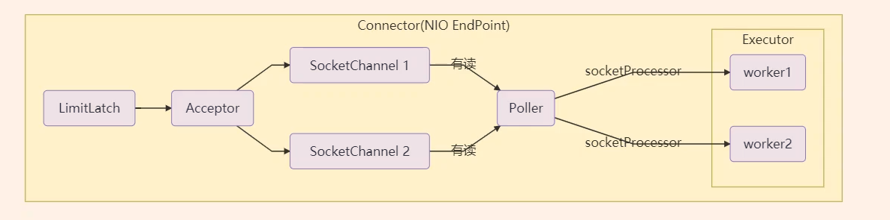  

- LimitLatch 用来限流，可以控制最大连接个数，类似 Semaphore
- Acceptor 只负责【接受新的 socket 连接】
- Poller 只负责监听 socket channel 是否有【可读的 I/O 事件】
- 一旦可读，封装一个任务对象( socketProcessor)，提交 Executor 线程池处理
- Executor 线程池中的工作线程最终负责【处理请求】

Tomcat 线程池扩展了 ThreadPoolExecutor，行为稍有不同

- 如果总线程数达到 maximumPoolSize
  - 这时不会立刻抛出 RejectExecutionException 异常
  - 而是再次尝试将任务放入队列，如果还失败，才抛出 RejectExecutionException 异常

源码 tomcat-7.0.42

```java
public void execute(Runnable command, long timeout, TimeUnit unit) {
    submittedCount.incrementAndGet();
    try {
        super.execute(command);
    } catch(RejectExecutionException rx) {
        if(super.getQueue() instanceof TaskQueue) {
            final TaskQueue queue = (TaskQueue)super.getQueue();
            try {
                if(!queue.force(command, timeout, unit)){
                    submittedCount.decrementAndGet();
                    throw new RejectExecutionException("Queue capacity is full");
                }
            } catch(InterruptedException x) {
                submittedCount.decrementAndGet();
                Thread.interrupted();
                throw new RejectExecutionException(x);
            }
        }else {
            submittedCount.decrementAndGet();
            throw rx;
        }
    }
}
```

TaskQueue.java

```java
public boolean force(Runnable o, long timeout, TimeUnit unit) throws InterruptedException {
    if(parent.isShutdown()) {
        throw new RejectExecutionException("Executor not running, can't force a command into the queue");
    }
    return super.offer(o, timeout, unit);
}
```

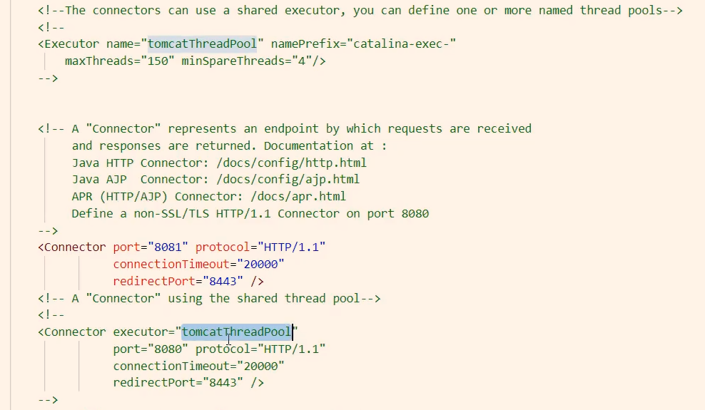  

Connector 配置

| 配置项 | 默认值 | 说明 |
| :--- | :---: | :--- |
| acceptorThreadCount | 1| acceptor 线程数量 |
| pollerThreadCount | 1| poller 线程数量 |
| minSpareThreads | 10| 核心线程数，即 corePoolSize |
| maxThreads | 200| 最大线程数，即 maximumPoolSize |
| executor | -| Executor 名称，用来引用下面的Executor |

Executor 线程配置

| 配置项 | 默认值 | 说明 |
| :--- | :---: | :--- |
| threadPriority | 5 | 线程优先级 |
| daemon | true | 是否守护线程 |
| minSpareThreads | 25 | 核心线程数，即 corePoolSize|
| maxThreads | 200 | 最大线程数，即 maximumPoolSize |
| maxIdleTime | 60000 | 线程生存时间，单位毫秒，默认值即1分钟 |
| maxQueueSize | Integer.MAX_VALUE | 队列长度 |
| prestartminSpareThreads | false | 核心线程是否在服务器启动时启动 |

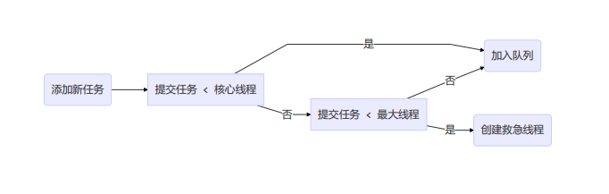  

### Fork/Join

- 概念

  Fork/Join 是 JDK1.7 加入的新的线程池实现，它的体现是一中分治思想，适用于能够进行任务拆分的 cpu 密集型运算

  所谓的任务拆分，是将一个大任务拆分为算法上相同的小任务，直至不能拆分可以注解求解。跟递归相关的一些计算，如归并排序、斐波那契数列，都可以用分治思想进行求解

  Fork/Join 在分治的基础上加入了多线程，可以把每个任务的分解和合并交给不同的线程来完成，进一步提升了运算的效率

  Fork/Join 默认会创建与 CPU 核心数大小相同的线程池

- 使用
  
  提交给Fork/Join 线程池的任务需要继承 RecursiveTask(有返回值) 或 RecursiveAction(无返回值)，例如下面定义一个对 1-n 之间的整数求和的任务

  ```java
  class MyTask extends RecursiveTask<Integer> {

    int target;

    public MyTask(int target) {
        this.target = target;
    }

    @Override
    public String toString() {
        return target + "";
    }

    @Override
    protected Integer compute() {
        if (target == 1) {
            return target;
        }
        MyTask t1 = new MyTask(target - 1);
        t1.fork();
        int result = t1.join() + target;
        log.info("join() {} + {} = {}", target, t1.join(), result);
        return result;
    }
   }
  ```

  然后提交给ForkJoinPool来执行

  ```java
  public static void main(String[] args) {
    ForkJoinPool pool = new ForkJoinPool(4);
    System.out.println(pool.invoke(new MyTask(5)));
  }
  ```

  输出

  ```java
  [ForkJoinPool-1-worker-1] INFO juc.code.threadpool.MyTask - join() 2 + 1 = 3
  [ForkJoinPool-1-worker-1] INFO juc.code.threadpool.MyTask - join() 3 + 3 = 6
  [ForkJoinPool-1-worker-1] INFO juc.code.threadpool.MyTask - join() 4 + 6 = 10
  [ForkJoinPool-1-worker-1] INFO juc.code.threadpool.MyTask - join() 5 + 10 = 15
  ```

  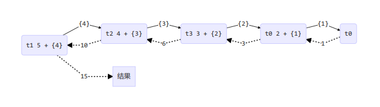  

- 改进
  
  ```java
  class AddTask extends RecursiveTask<Integer> {
    int begin;
    int end;
    public AddTask(int begin, int end) {
        this.begin = begin;
        this.end = end;
    }
    @Override
    protected Integer compute() {
        if (begin == end) {
            return begin;
        }
        if (end - begin == 1) {
            return end + begin;
        }
        int mid = (begin + end) / 2;
        AddTask t1 = new AddTask(begin, mid);
        AddTask t2 = new AddTask(mid + 1, end);
        t1.fork();
        t2.fork();
        int result = t1.join() + t2.join();
        log.info("join() {} + {} = {}", begin, mid, t1.join());
        log.info("join() {} + {} = {}", mid + 1, end, t2.join());
        log.info("join() {} + {} = {}", t1.join(), t2.join(), result);
        return result;
    }
  }
  ```

  输出

  ```java
  [ForkJoinPool-1-worker-2] INFO juc.code.threadpool.AddTask - join() 1 + 2 = 3
  [ForkJoinPool-1-worker-2] INFO juc.code.threadpool.AddTask - join() 3 + 3 = 3
  [ForkJoinPool-1-worker-2] INFO juc.code.threadpool.AddTask - join() 3 + 3 = 6
  [ForkJoinPool-1-worker-1] INFO juc.code.threadpool.AddTask - join() 1 + 3 = 6
  [ForkJoinPool-1-worker-1] INFO juc.code.threadpool.AddTask - join() 4 + 5 = 9
  [ForkJoinPool-1-worker-1] INFO juc.code.threadpool.AddTask - join() 6 + 9 = 15
  ```

  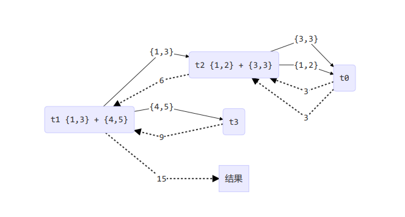  

## J.U.C

### AQS 原理

**概述：**
全称是 AbstractQueuedSynchronizer，是阻塞式锁和相关的同步器工具的框架

特点：

- 用 state属性来表示资源的状态(分独占模式和共享模式)，子类需要定义如何维护这个状态，控制如何获取锁和释放锁
  - getState() - 获取 state 状态
  - setState() - 设置 state 状态
  - compareAndSetState -cas 机制设置 state 状态
  - 独占模式是只有一个线程能够访问资源，而共享模式可以允许多个线程访问资源
- 提供了基于 FIFO 的等待队列，类似于 Monitor 的 EntryList
- 条件变量来实现等待、唤醒机制，支持多个条件变量，类似于 Monitor 的 WaitSet

子类主要实现以下方法(默认抛出 UnsupportedOperationException)

- tryAcquire
- tryRelease
- tryAcquireShared
- tryReleaseShared
- isHeldExclusively

获取锁的姿势

```java
public final void acquire(int arg) {
    // 如果获取锁失败，进入等待队列，可以选择阻塞当前线程 park、unpark
    if (!tryAcquire(arg) && acquireQueued(addWaiter(Node.EXCLUSIVE), arg))
        selfInterrupt();
}
```

释放锁的姿势

```java
public final boolean release(int arg) {
    // 如果释放锁成功
    if (tryRelease(arg)) {
        Node h = head;
        if (h != null && h.waitStatus != 0)
            // 让阻塞线程恢复运行
            unparkSuccessor(h);
        return true;
    }
    return false;
}
```

**实现不可重入锁：**

- 自定义同步器

```java
class MySync extends AbstractQueuedSynchronizer {
    @Override
    protected boolean tryAcquire(int arg) {
        if (compareAndSetState(0, 1)) {
            setExclusiveOwnerThread(Thread.currentThread());
            return true;
        }
        return false;
    }
    @Override
    protected boolean tryRelease(int arg) {
        setExclusiveOwnerThread(null);
        // 注意 exclusiveOwnerThread 无 volatile 修饰，而 state 有 volatile 修饰，会在 setState() 后加写屏障
        // 所以setExclusiveOwnerThread() 需放在 setState() 方法之前保证一个线程对exclusiveOwnerThread的修改对其他所有线程可见
        setState(0);
        return true;
    }
    @Override
    protected boolean isHeldExclusively() {
        return getState() == 1;
    }
    protected Condition newCondition() {
        return new ConditionObject();
    }
}
```

- 自定义锁

```java
// 自定义锁（不可重入锁）
class MyLock implements Lock {

    private MySync sync = new MySync();

    // 尝试，不成功，进入等待队列
    @Override
    public void lock() {
        sync.acquire(1);
    }

    // 尝试，不成功，进入等待队列，可打断
    @Override
    public void lockInterruptibly() throws InterruptedException {
        sync.acquireInterruptibly(1);

    }

    // 尝试一次，不成功返回，不进入等待队列
    @Override
    public boolean tryLock() {
        return sync.tryAcquire(1);
    }

    // 尝试一次，不成功返回，不进入等待队列，有时限
    @Override
    public boolean tryLock(long time, TimeUnit unit) throws InterruptedException {
        return sync.tryAcquireNanos(1, unit.toNanos(time));
    }

    // 释放锁
    @Override
    public void unlock() {
        sync.release(0);
    }

    // 生成条件变量
    @Override
    public Condition newCondition() {
        return sync.newCondition();
    }
}
```

- 测试

```java
public class AQSDemo {

    public static void main(String[] args) {
        MyLock lock = new MyLock();
        new Thread(() -> {
            lock.lock();
            try {
                log.info("lock....");
                Sleeper.sleep(1);
            } finally {
                lock.unlock();
                log.info("unlock....");
            }
        }, "t1").start();

        new Thread(() -> {
            lock.lock();
            try {
                log.info("lock....");
            } finally {
                lock.unlock();
                log.info("unlock....");
            }
        }, "t2").start();
    }
}
```

输出

```java
14:55:47.683 [t1] INFO juc.code.tool.AQSDemo - lock....
14:55:48.687 [t1] INFO juc.code.tool.AQSDemo - unlock....
14:55:48.687 [t2] INFO juc.code.tool.AQSDemo - lock....
14:55:48.687 [t2] INFO juc.code.tool.AQSDemo - unlock....
```

如果改为下面尝试重入操作的代码，会发现自己也会被挡住(只会打印一次log)

```java
lock.lock();
log.info("locking.....");
lock.lock();
log.info("locking.....");
```

```java
15:15:16.354 [t2] INFO juc.code.tool.AQSDemo - lock....
15:15:16.357 [t2] INFO juc.code.tool.AQSDemo - unlock....
15:15:16.358 [t1] INFO juc.code.tool.AQSDemo - locking.....
```

### ReentrantLock 原理

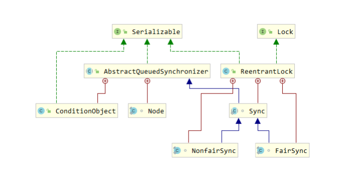  
  
#### 非公平锁实现原理

**加锁解锁流程：**

先从构造器看，默认为非公平锁实现

```java
public ReentrantLock() {
    sync = new NonfairSync();
}
```

NonfairSync 继承自 AbstractQueuedSynchronizer

- 当没有竞争时
  
  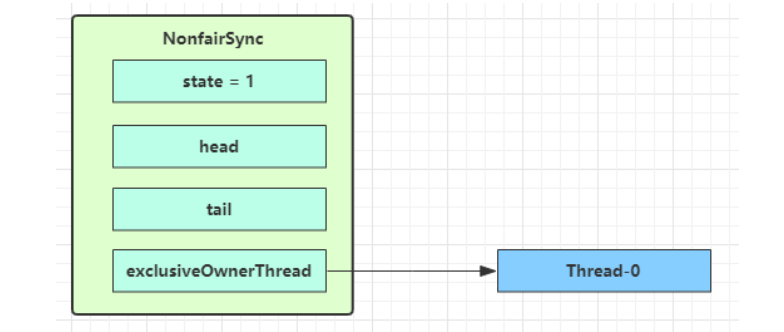  

- 第一个竞争出现时

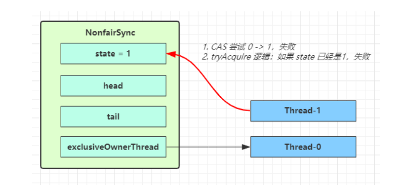  

Thread-1 执行以下代码

```java
final void lock() {
    if (compareAndSetState(0, 1))
        setExclusiveOwnerThread(Thread.currentThread());
    else
        acquire(1);
}
```

1. CAS 尝试将 state 由 0 改为 1，结果失败
2. 进入 acquire() -> tryAcquire() 逻辑，此时 state 为 1，结果仍然为失败
3. 接下来进入 addWaiter() 逻辑， 构造 Node 队列
   - 图中黄色三角形表示该 Node 的 waitStatus 状态，其中 0 为 默认正常状态
   - Node 的创建是懒惰的
   - 其中第一个 Node 称为 Dummy (哑元) 或哨兵，并不关联线程

   ```java
   队列需要一个虚拟头节点才能启动。 但是我们不会在构建时创建它们，因为如果从不存在争用，那将是浪费精力。 相反，在第一次争用时构造节点并设置头和尾指针
   ```

   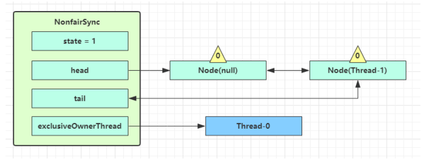  

4. 接着线程 Thread-1 进入 acquireQueued() 逻辑

   ```java
   final boolean acquireQueued(final Node node, int arg) {
    boolean failed = true;
    try {
        boolean interrupted = false;
        // 一直循环
        for (;;) {
            // 获取前驱节点
            final Node p = node.predecessor();
            // 前驱节点为头结点时再次尝试获取锁
            if (p == head && tryAcquire(arg)) {
                setHead(node);
                p.next = null; // help GC
                failed = false;
                return interrupted;
            }
            if (shouldParkAfterFailedAcquire(p, node) &&
                parkAndCheckInterrupt())
                interrupted = true;
        }
    } finally {
        if (failed)
            cancelAcquire(node);
    }
   }
   ```

   - acquireQueued 会在一个死循环中不断尝试获得锁，失败后进入 park 阻塞
   - 如果自己时紧邻着 head (排在第二位)，那么再次 tryAcquire() 尝试获取锁，当然这时 state 仍然为 1，结果仍然为失败
   - 进入 shouldParkAfterFailedAcquire() 逻辑，将前驱 node，即 head 的 waitStatus 置为 -1(表示该节点有责任唤醒其后继节点)，返回 false
  
   ```java
   private static boolean shouldParkAfterFailedAcquire(Node pred, Node node) {
    int ws = pred.waitStatus;
    if (ws == Node.SIGNAL)
        return true;
    if (ws > 0) {
        do {
            node.prev = pred = pred.prev;
        } while (pred.waitStatus > 0);
        pred.next = node;
    } else {
        // 将 waitStatus 置为 Node.SIGNAL = -1
        compareAndSetWaitStatus(pred, ws, Node.SIGNAL);
    }
    return false;
   }
   ```
  
   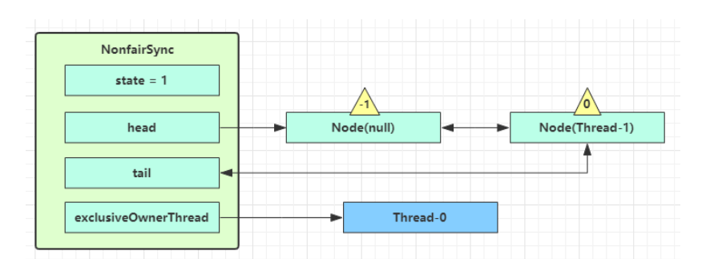

   - shouldParkAfterFailedAcquire() 返回 false 之后执行完毕，再次进入循环，继续尝试 tryAcquire()，这时 state 仍为                                            1，结果仍然为失败
   - 当再次进入 shouldParkAfterFailedAcquire() 时，此时其前驱节点 node 的 waitStatus 已经是 -1，返回 true
   - 进入 parkAndCheckInterrupt ()，将线程 Thread -1 park(灰色表示)，该线程到此阻塞
  
    ```java
    private final boolean parkAndCheckInterrupt() {
        LockSupport.park(this);
    return Thread.interrupted();
    }
    ```

    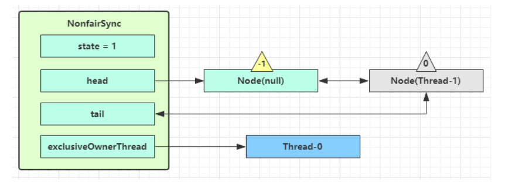  
5. 但多个线程经历上述过程竞争失败时，如下图

   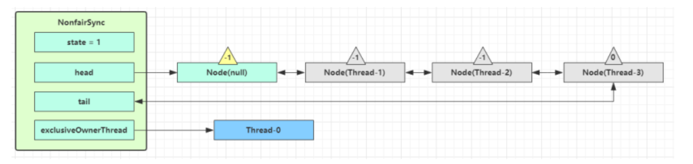  
6. 当 Thread-0 释放锁，进入 tryRelease()，如果成功
   - 设置 exclusiveOwnerThread = null
   - state = 0

   ```java
   public final boolean release(int arg) {
    if (tryRelease(arg)) {
        Node h = head;
        if (h != null && h.waitStatus != 0)
            unparkSuccessor(h);
        return true;
    }
    return false;
   ```

   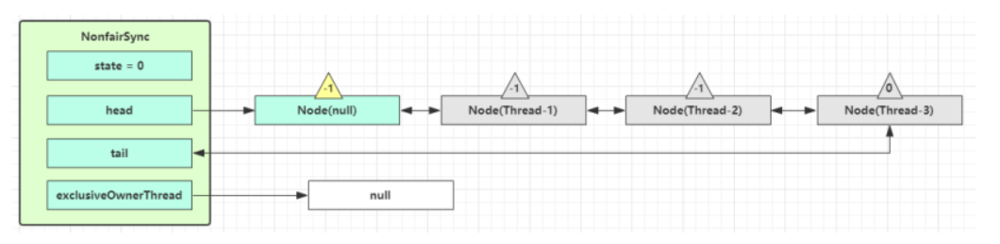

7. 当前队列不为 null，并且 head 的 waitStatus = -1，进入 unparkSuccessor()
8. 找到队列中 离 head 最近的一个 Node(没取消的)，unpark 恢复运行，即 Thread-1

   ```java
   private void unparkSuccessor(Node node) {
    int ws = node.waitStatus;
    // 如果状态为 SIGNAL，尝试 CAS 为 0，不成功也可以
    if (ws < 0)
        compareAndSetWaitStatus(node, ws, 0);
    Node s = node.next;
    // 如果后继节点被取消
    if (s == null || s.waitStatus > 0) {
        s = null;
        // 不考虑取消的后继，从同步队列从后往前一直查找需要的节点
        for (Node t = tail; t != null && t != node; t = t.prev)
            if (t.waitStatus <= 0)
                s = t;
    }
    if (s != null)
        LockSupport.unpark(s.thread);
   }
   ```

9. 如果 Thread-1 竞争锁成功，则会设置
   - exclusiveOwnerThread 为 Thread-1，state = 1
   - head 指向刚刚 Thread-1 所在的 Node，该 Node 清空 Thread
   - 原本的 head 因为从链表断开，会被 GC

   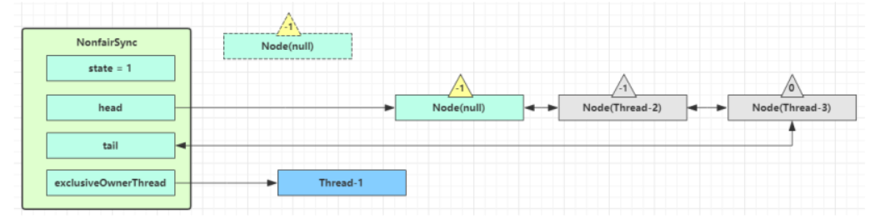  

10. 如果这时候有其他线程来竞争(非公平的体现)，例如 Thread-4 来了，并且不巧占了锁，则会
    - 设置exclusiveOwnerThread 为 Thread-4，state = 1
    - Thread-1 再次进入 acquireQueued() 流程，获取锁失败，重新进入 park 阻塞
  
   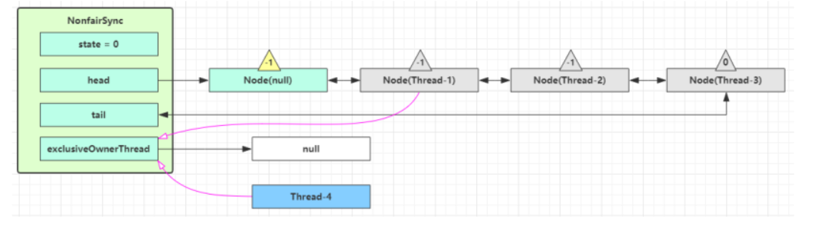  

#### 可重入原理

```java
// 获取锁
final boolean nonfairTryAcquire(int acquires) {
    final Thread current = Thread.currentThread();
    int c = getState();
    if (c == 0) {
        if (compareAndSetState(0, acquires)) {
            setExclusiveOwnerThread(current);
            return true;
        }
    }
    // 如果已经获得了锁，线程还是当前线程，表示发生了锁重入
    else if (current == getExclusiveOwnerThread()) {
        // 将 state ++
        int nextc = c + acquires;
        if (nextc < 0) // overflow
            throw new Error("Maximum lock count exceeded");
        setState(nextc);
        return true;
    }
    return false;
}
// 释放锁
protected final boolean tryRelease(int releases) {
    // state --
    int c = getState() - releases;
    if (Thread.currentThread() != getExclusiveOwnerThread())
        throw new IllegalMonitorStateException();
    boolean free = false;
    // 支持锁重入，只有 state 减为 0，才会释放锁
    if (c == 0) {
        free = true;
        setExclusiveOwnerThread(null);
    }
    setState(c);
    return free;
}
```

**注意：**

```java
递归会导致 state 一直 ++，最大为 Integer.MAX_VALUE
```

#### 可打断原理

##### 不可打断模式

在此模式下，在队列中的线程即使被打断，仍会驻留在 AQS 队列中，一直要等到获得锁之后才能得知被打断

```java

private final boolean parkAndCheckInterrupt() {
    // 如果打断标记已经是 true，则 park 会失效
    LockSupport.park(this);
    // interrupted 会清除打断标记
    return Thread.interrupted();
}


final boolean acquireQueued(final Node node, int arg) {
    boolean failed = true;
    try {
        boolean interrupted = false;
        for (;;) {
            final Node p = node.predecessor();
            if (p == head && tryAcquire(arg)) {
                setHead(node);
                p.next = null; // help GC
                failed = false;
                // 需要获得锁后，才能返回打断状态
                return interrupted;
            }
            if (shouldParkAfterFailedAcquire(p, node) &&
                parkAndCheckInterrupt())
                // 如果是因为 interrupt 被唤醒，将打断状态置为 true
                interrupted = true;
        }
    } finally {
        if (failed)
            cancelAcquire(node);
    }
}

public final void acquire(int arg) {
    if (!tryAcquire(arg) &&
        acquireQueued(addWaiter(Node.EXCLUSIVE), arg))
        // 如果返回的打断状态为 true，则重新产生一次打断
        selfInterrupt();
}

static void selfInterrupt() {
    // 重新产生一次打断
    Thread.currentThread().interrupt();
}
```

##### 可打断模式

```java
public void lockInterruptibly() throws InterruptedException {
    sync.acquireInterruptibly(1);
}

public final void acquireInterruptibly(int arg)
        throws InterruptedException {
    if (Thread.interrupted())
        throw new InterruptedException();
    if (!tryAcquire(arg))
        // 如果获取锁失败，则进入可打断的获取锁流程
        doAcquireInterruptibly(arg);
}

private void doAcquireInterruptibly(int arg)
    throws InterruptedException {
    final Node node = addWaiter(Node.EXCLUSIVE);
    boolean failed = true;
    try {
        for (;;) {
            final Node p = node.predecessor();
            if (p == head && tryAcquire(arg)) {
                setHead(node);
                p.next = null; // help GC
                failed = false;
                return;
            }
            if (shouldParkAfterFailedAcquire(p, node) &&
                parkAndCheckInterrupt())
                // park 过程中如果被 interrupt 会进入此
                // 直接抛出异常，不会再进入循环
                throw new InterruptedException();
        }
    } finally {
        if (failed)
            cancelAcquire(node);
    }
}
```

#### 公平锁实现原理

```java
// 公平锁主要实现
protected final boolean tryAcquire(int acquires) {
    final Thread current = Thread.currentThread();
    int c = getState();
    if (c == 0) {
        // 先检查 AQS 队列中是否有前驱节点，没有才去竞争
        if (!hasQueuedPredecessors() &&
            compareAndSetState(0, acquires)) {
            setExclusiveOwnerThread(current);
            return true;
        }
    }
    else if (current == getExclusiveOwnerThread()) {
        int nextc = c + acquires;
        if (nextc < 0)
            throw new Error("Maximum lock count exceeded");
        setState(nextc);
        return true;
    }
    return false;
}
```

查询是否有任何线程获取锁的优先级高于当前线程

```java
public final boolean hasQueuedPredecessors() {

    Node t = tail; // 以反向初始化顺序读取字段
    Node h = head;
    Node s;
    return h != t &&
        ((s = h.next) == null || s.thread != Thread.currentThread());
}
```

以下代码的顺序不可变

```java
Node t = tail;
Node h = head;
```

结合队列的初始化分析

```java
private Node enq(final Node node) {
    for (;;) {
        Node t = tail;
        if (t == null) {
            if (compareAndSetHead(new Node()))
                tail = head;
        } else {
            node.prev = t;
            if (compareAndSetTail(t, node)) {
                t.next = node;
                return t;
            }
        }
    }
}
```

假设 Thread-1 按【 Node h = head;Node t = tail;】顺序来赋值时，如果此时有其他线程 Thread-2 正在入队，并且正在初始化队列，那么有以下情况

- Thread-1 先赋值【Node h = head;】，队列此时未初始化，head = null，即 h = null，接着 Thread-2 执行完 compareAndSetHead(new Node()) 并且赋值【tail = head;】，Thread-1 再赋值【Node t = tail;】，即 t != null，那么后面 h != t 条件成立，执行 s = h.next，将会发生 NPE 异常

对 `h != t && ((s = h.next) == null || s.thread != Thread.currentThread())` 的情况进行分析

- `h != t` 不成立，返回 false
  - t、h 都为 null。此时说明队列为空，无需等待直接去竞争锁
  - t、h 都为指向同一个 Node。此时说明队列中只有一个dummy node，说明没有线程在队列中。
- `h != t` 成立且 `(s = h.next) == null` 成立，返回 true
  - t = null、h != null，说明有其他线程正在初始化队列，刚执行完 compareAndSetHead(new Node())，即 head != null，head.next = null，还未赋值 tail = head，即 tail = null,那这个线程都已经开始执行 enq()，而当前线程还未执行 enq()，所以当前线程肯定要排在别人后面
- `h != t` 成立且 `(s = h.next) == null` 不成立且`s.thread != Thread.currentThread())`成立，返回 true
  - tail、head 都不为 null，且 head.next 也不为 null，说明队列中已经有一个非 dummy 节点，并且该节点上的线程也不是当前线程，所以当前线程需等待

#### 条件变量实现原理

每个条件变量就对应着一个等待队列，其实现类是 ConditionObject

##### await 原理

```java
public final void await() throws InterruptedException {
    if (Thread.interrupted())
        throw new InterruptedException();
    // 当前线程节点放入等待队列
    Node node = addConditionWaiter();
    // 释放锁
    int savedState = fullyRelease(node);
    int interruptMode = 0;
    // 循环检测是否在同步队列中。只要没有被 signal() 加入到同步队列，就阻塞，除非被中断
    while (!isOnSyncQueue(node)) {
        // 阻塞当前线程
        LockSupport.park(this);
        // 检查线程被唤醒是否是因为被打断，如果是则加入同步队列并且结束循环，interruptMode 置为 -1(THROW_IE) 或 1(REINTERRUPT)
        if ((interruptMode = checkInterruptWhileWaiting(node)) != 0)
            break;
    }
    // 如果获取锁的过程中被打断了，并且 之前的interruptMode != THROW_IE，那么也视为在 signal() 之后被打断，设为 REINTERRUPT
    if (acquireQueued(node, savedState) && interruptMode != THROW_IE)
        interruptMode = REINTERRUPT;
    // 如果在 signal() 前被取消的线程在等待队列中还留有节点
    if (node.nextWaiter != null)
    // 执行一次清理操作将所有取消的线程节点清理掉
        unlinkCancelledWaiters();
    if (interruptMode != 0)
        // 抛出异常 或 重置中断标识位
        reportInterruptAfterWait(interruptMode);
}

/**
 * 如果没有被打断，返回 0
 * 如果在 signal() 之前打断了，返回 THROW_IE，表示需要抛出异常
 * 如果在 signal() 之后打断了，返回 REINTERRUPT，表示不抛出，只恢复中断位
 */
private int checkInterruptWhileWaiting(Node node) {
    return Thread.interrupted() ?
        (transferAfterCancelledWait(node) ? THROW_IE : REINTERRUPT) :
        0;
}

final boolean transferAfterCancelledWait(Node node) {
    // 如果 CAS 成功了，说明还没有被 signal() 加入同步队列
    if (compareAndSetWaitStatus(node, Node.CONDITION, 0)) {
        // 由于没有 signal()就被打断，则需要加入同步队列，之后才能竞争锁
        enq(node);
        return true;
    }
     // 说明已经开始 signal() 了，防止还没被加入到同步队列的情况
    while (!isOnSyncQueue(node))
        Thread.yield();
    return false;
}

```

假设开始 thread-0 持有锁，调用 await()，进入 addConditionWaiter()逻辑

- 创建新的 Node，状态为 -2(Node.CONDITION)，关联 Thread-0，加入等待队列尾部

  ```java
  private Node addConditionWaiter() {
    Node t = lastWaiter;
    // 如果 lastWaiter 被取消了，执行一次清理操作将所有取消的线程节点清理掉，然后重新定义 lastWaiter
    if (t != null && t.waitStatus != Node.CONDITION) {
        unlinkCancelledWaiters();
        t = lastWaiter;
    }
    // 新建节点
    Node node = new Node(Thread.currentThread(), Node.CONDITION);
    if (t == null)
        firstWaiter = node;
    else
        t.nextWaiter = node;
    // 将新建的节点插入队列的尾部
    lastWaiter = node;
    return node;
  }

  private void unlinkCancelledWaiters() {
    Node t = firstWaiter;
    Node trail = null;
    // 从头开始遍历等待队列，将已经中断的线程节点从等待队列中移除
    while (t != null) {
        Node next = t.nextWaiter;
        if (t.waitStatus != Node.CONDITION) {
            t.nextWaiter = null;
            if (trail == null)
                firstWaiter = next;
            else
                trail.nextWaiter = next;
            if (next == null)
                // 重新定义 lastWaiter
                lastWaiter = trail;
        }
        else
            trail = t;
        t = next;
    }
  }
  ```

  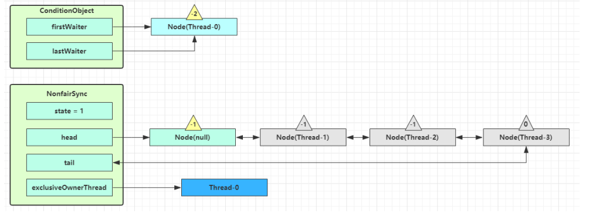  

接着进入 AQS 的 fullyRelease() 流程，释放同步器上的锁，调用独占锁的 release()，即一次释放所有的重入锁，并 unpark 同步队列中头节点的后继节点

```java
final int fullyRelease(Node node) {
    boolean failed = true;
    try {
        // 当前同步状态
        int savedState = getState();
        if (release(savedState)) {
            failed = false;
            return savedState;
        } else {
            throw new IllegalMonitorStateException();
        }
    } finally {
        if (failed)
            // 如果 release 失败，将节点的 waitStatus 置为 CANCELLED
            node.waitStatus = Node.CANCELLED;
    }
}
```

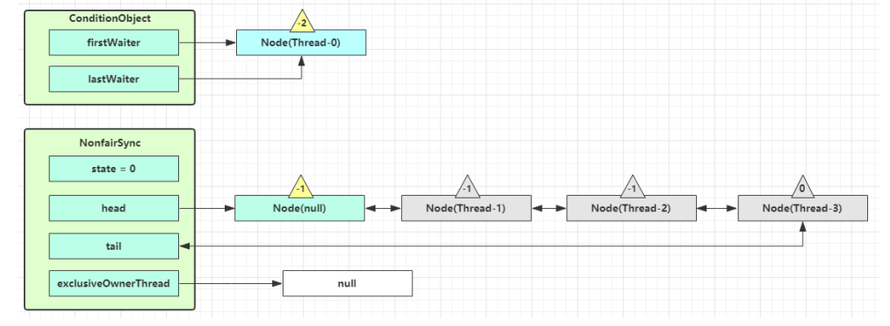

如果没有其他线程竞争，那么 Thread-1 获得锁

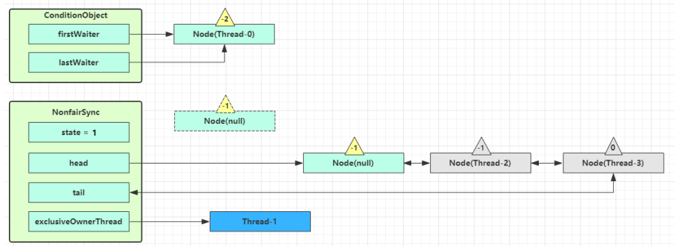  

之后进入 while (!isOnSyncQueue(node)) 逻辑，循环检测该线程是否被 singal() 加入同步队列中，没有就阻塞

```java
final boolean isOnSyncQueue(Node node) {
    // 如果 waitStatus 为 CONDITION 或者前驱节点为 null，则必然不在队列中
    if (node.waitStatus == Node.CONDITION || node.prev == null)
        return false;
    if (node.next != null) // 如果有后继节点，则一定在队列中
        return true;
    // 从同步队列尾节点开始向前遍历查找是否存在该线程节点
    return findNodeFromTail(node);
}
```

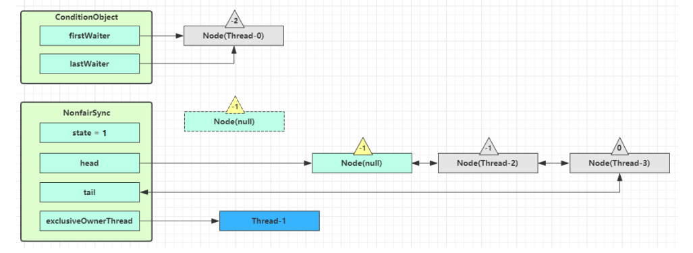  

##### singal 原理

```java
public final void signal() {
    if (!isHeldExclusively())
        throw new IllegalMonitorStateException();
    Node first = firstWaiter;
    if (first != null)
        doSignal(first);
}
```

假设 Thread-1 要来唤醒 Thread-0

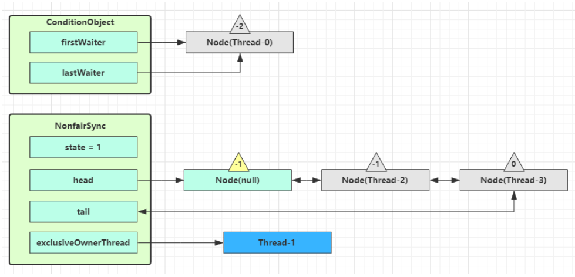  

先进入 isHeldExclusively() 检查是否 Thread-1 是否持有锁，接着进入 doSignal() 唤醒条件队列的头节点

doSignal() 中会先将头节点 first的后继节点作为新的头节点，并将 first 从条件队列断开，接着执行 transferForSignal() 逻辑尝试将 first 移动至同步队列，如果失败继续移动新的头节点

```java
private void doSignal(Node first) {
    do {
        // firstWaiter 指向 first 的后继，如果后继为 null，lastWaiter 置空
        if ( (firstWaiter = first.nextWaiter) == null)
            lastWaiter = null;
        // first 从队列中断开
        first.nextWaiter = null;
    } while (!transferForSignal(first) &&
             (first = firstWaiter) != null);// transferForSignal() 失败，将 first 指向新的 firstWaiter，如果不为 null，继续循环
}

final boolean transferForSignal(Node node) {
    // 如果 CAS 失败，说明该线程节点被取消了，返回 false
    if (!compareAndSetWaitStatus(node, Node.CONDITION, 0))
        return false;
    // 将该线程节点加入同步队列，返回其前驱节点
    Node p = enq(node);
    int ws = p.waitStatus;
    // 如果前驱节点被取消，或者 CAS 其 waitStatus 为 -1(SIGNAL) 失败，说明前驱节点无法去唤醒该线程节点，则直接 unpark 该线程，否则由其前驱节点来唤醒
    if (ws > 0 || !compareAndSetWaitStatus(p, ws, Node.SIGNAL))
        LockSupport.unpark(node.thread);
    return true;
}
```

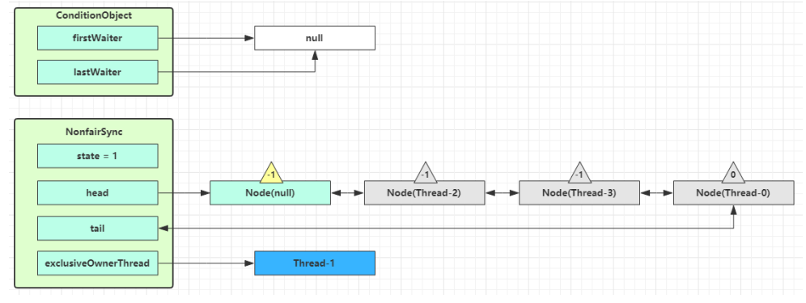  

被唤醒后线程 Thread-0，将会从 await() 方法的 while 循环中退出(isOnSyncQueue() 返回 true)，进而调用同步器的 acquireQueued() 方法加入到获取锁的竞争中

成功获取锁之后，被唤醒的线程将从之前的调用的 await() 方法返回，此时线程已经成功获取了锁

singalAll() 方法，相当于对等待队列中的每个节点均执行一次 signal() 方法，效果就是将所有节点全部移动到同步队列中，并唤醒每个节点的线程
