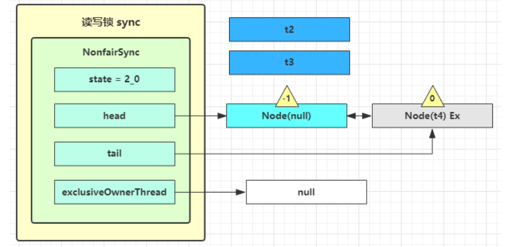
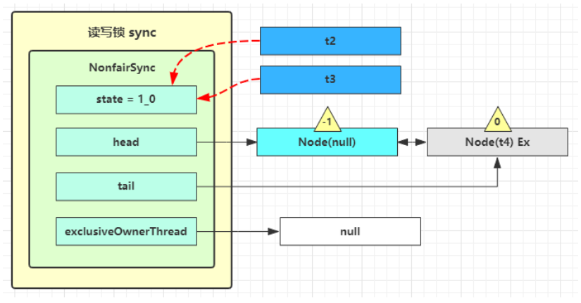

# 共享模型之工具

## 线程池

### 自定义线程池

  

自定义任务队列：

```java
class BlockingQueue<T> {

    /** 任务队列 */
    private final Deque<T> queue = new ArrayDeque<>();

    /** 锁 */
    private ReentrantLock lock = new ReentrantLock();

    /** 生产者条件变量 */
    private Condition fullWaitSet = lock.newCondition();

    /** 消费者条件变量 */
    private Condition emptyWaitSet = lock.newCondition();

    /** 容量 */
    private final int capacity;

    public BlockingQueue(int capacity) {
        this.capacity = capacity;
    }

    /** 阻塞获取 */
    public T take() {
        lock.lock();
        try {
            while (queue.isEmpty()) {
                try {
                    emptyWaitSet.await();
                } catch (InterruptedException e) {
                    e.printStackTrace();
                }
            }
            T t = queue.removeFirst();
            fullWaitSet.signal();
            return t;
        } finally {
            lock.unlock();
        }

    }

    /** 带超时的阻塞获取 */
    public T poll(long timeOut, TimeUnit unit) {
        lock.lock();
        try {
            long nanos = unit.toNanos(timeOut);
            while (queue.isEmpty()) {
                try {
                    if (nanos <= 0) return null;
                    nanos = emptyWaitSet.awaitNanos(nanos);
                } catch (InterruptedException e) {
                    e.printStackTrace();
                }
            }
            T t = queue.removeFirst();
            fullWaitSet.signal();
            return t;
        }finally {
            lock.unlock();
        }
    }

    /** 阻塞添加 */
    public void put(T task) {
        lock.lock();
        try {
            while (queue.size() == capacity) {
                try {
                    fullWaitSet.await();
                } catch (InterruptedException e) {
                    e.printStackTrace();
                }
            }
            queue.addLast(task);
            emptyWaitSet.signal();
        } finally {
            lock.unlock();
        }

    }

    public void tryPut(RejectPolicy<T> rejectPolicy, T task) {

        lock.lock();
        try {
            if (queue.size() == capacity) {
                rejectPolicy.reject(this, task);
            } else {
                queue.addLast(task);
                emptyWaitSet.signal();
            }

        }finally {
            lock.unlock();
        }

    }

    /** 带超时时间的添加 */
    public boolean offer(T element, long timeOut, TimeUnit unit) {
        lock.lock();
        try {
            long nanos = unit.toNanos(timeOut);
            while (queue.size() == capacity) {
                try {
                    if (nanos <= 0) {
                        return false;
                    }
                    nanos = fullWaitSet.awaitNanos(nanos);
                    return false;
                } catch (InterruptedException e) {
                    e.printStackTrace();
                }
            }
            queue.addLast(element);
            emptyWaitSet.signal();
            return true;
        }finally {
            lock.unlock();
        }
    }

    /** 获取容量 */
    public int size() {
        lock.lock();
        try {
            return queue.size();
        }finally {
            lock.unlock();
        }
    }


}
```

自定义线程池

```java

/** 拒绝策略 */
@FunctionalInterface
interface RejectPolicy<T> {
    void reject(BlockingQueue<T> queue, T task);
}

@Slf4j
class ThreadPool {
    /** 任务队列 */
    private final BlockingQueue<Runnable> taskQueue ;

    /** 线程集合 */
    private final HashSet<Worker> workers = new HashSet<>();

    /** 核心线程数*/
    private int coreSize;

    /** 获取任务的超时时间 */
    private long timeOut;

    private TimeUnit unit;

    /** 拒绝策略 */
    private final RejectPolicy<Runnable> rejectPolicy;

    public ThreadPool(int coreSize, long timeOut, TimeUnit unit, int queueCapacity, RejectPolicy<Runnable> rejectPolicy) {
        this.taskQueue = new BlockingQueue<>(queueCapacity);
        this.coreSize = coreSize;
        this.timeOut = timeOut;
        this.unit = unit;
        this.rejectPolicy = rejectPolicy;
    }

    // 执行任务
    public void execute(Runnable task) {
        synchronized (workers) {
            if (workers.size() < coreSize) {
                Worker worker = new Worker(task);
                log.info("新建线程:{}", worker);
                worker.start();
                workers.add(worker);
            } else {
                log.info("加入队列：{}", task);
//                taskQueue.put(task);
                // 1) 死等
                // 2) 带超时等待
                // 3) 让调用者放弃任务
                // 4) 让调用者抛出异常
                // 5) 让调用者自己执行任务
                taskQueue.tryPut(rejectPolicy, task);
            }
        }

    }

    class Worker extends Thread {

        private Runnable task;
        public Worker() {

        }

        public Worker(Runnable task) {
            this.task = task;
        }

        @Override
        public void run() {
//            while (task != null || (task = taskQueue.take()) != null) {
            while (task != null || (task = taskQueue.poll(timeOut, unit)) != null) {
                // 有任务则执行
                try {
                    log.info("正在执行....{}", task);
                    task.run();
                } catch (Exception e) {
                    e.getStackTrace();
                } finally {
                    task = null;
                }
            }

            synchronized (workers) {
                workers.remove(this);
                log.info("worker 被移除 {}", this);
            }
        }
    }
}
```

测试

```java
@Slf4j
public class ThreadPoolDemo{
    public static void main(String[] args) {
        ThreadPool threadPool = new ThreadPool(2, 1, TimeUnit.SECONDS, 5, ((queue, task) -> {
            // 1) 死等
//            queue.put(task);
            // 2) 带超时等待
//            queue.offer(task, 1500, TimeUnit.MILLISECONDS);
            // 3) 让调用者放弃任务
//            log.info("放弃 {}", task);
            // 4) 让调用者抛出异常
//            throw new RuntimeException("任务执行失败 " + task);
            // 5) 让调用者自己执行任务
            task.run();
        }));
        for (int i = 0; i < 5; i++) {
            int finalI = i;
            threadPool.execute(() -> log.info("{}", finalI));
        }
    }
}
```

### ThreadPoolExecutor

  

#### 线程池状态

ThreadPoolExecutor 使用 int 的高3位来表示线程池状态，低29位表示线程数量

| 状态名 | 高3位| 接受新任务 | 处理阻塞队列任务 | 说明 |
| :---: | :---: | :---: |:---: |:---: |
| RUNNING |  111 | Y | Y | |
| SHUTDOWN |  000 | N | Y | 不会接受新任务，但会处理阻塞队列剩余任务 |
| STOP |  001 | N | N | 会中断正在执行的任务，并会抛弃阻塞队列任务 |
| TIDYING |  010 | - | - | 任务全执行完毕 ，活动线程为0即将进入终结 |
| TERMINATED |  011 | - | - | 终结状态 |

从数字上比较, TERMINATED > TIDYING > STOP > SHUTDOWN > RUNNING(-1)

这些信息存储在一个原子变量ctl 中，目的是将线程池状态与线程个数合二为一，这样就可以用一次 cas 原子操作进行赋值

```java

// c 为旧值，ctlOf 返回结果为新值
ctl.compareAndSet(c, ctlOf(targetState, workerCountOf(c))))

// rs 为高3位代表线程池状态，wc 为低29位代表线程个数，ctl 是合并它们
private static int ctlOf(int rs, int wc){
    return rs | wc;
}
```

#### 构造状态

```java
public ThreadPoolExecutor(int corePoolSize, int maximumPoolSize, long keepAliveTime, TimeUnit unit, BlockingQueue<Runnable> workQueue, ThreadFactory threadFactory, RejectExceptionsHandler handler)
```

- corePoolSize 核心线程数目（最多保留的线程数）
- maximumPoolSize 最大线程数目
- keepAliveTime 生存时间-针对救急线程
- unit 时间单位-针对救急线程
- workQueue 阻塞队列
- threadFactory 线程工厂-可以为线程创建时起个好名字
- handler 拒绝策略

工作方式

- 当一个任务提交给线程池后，如果当前线程数没有达到 corePoolSize 并且没有线程空闲，线程池会创建一个新线程来执行任务
- 当线程数达到 corePoolSize 并且没有线程空闲，这时再加入任务，新加的任务会被加入 workQueue 队列排队，直到有空闲的线程
- 如果有队列选择了有界队列，那么任务超过了队列大小时，会创建 maximumPoolSize - corePoolSize 的数目的线程来救急，即**救急线程**
- 如果线程达到 maximumPoolSize 仍然有新任务加入时会执行拒绝策略。拒绝策略 jdk 提供了4中实现，其他著名框架也提供了实现
  - AbortPolicy 让调用者抛出 RejectExecutionException 异常，这是默认策略
  - CallerRunsPolicy 让调用者自己执行任务
  - DiscardPolicy 放弃任务
  - DiscardOldestPolicy 放弃队列中最早的任务，本任务取而代之
  - Dubbo 的实现，在抛出 RejectExecutionException 异常之前会记录日志，并 dump 线程栈信息，方便定位问题
  - Netty 的实现，是创建一个新线程来执行任务
  - ActiveMQ 的实现，带超时等待 (60s) 尝试放入队列，类似之前自定义的拒绝策略
  - PinPoint 的实现，它使用了一个拒绝策略链，会逐一尝试策略链中每种拒绝策略
- 当高峰过去后，超过 corePoolSize 的救急线程如果一段时间没有任务做，需要结束节省资源，这个时间由 keepAliveTime 和 unit 来控制

JDK Executors 类中提供了众多工厂方法来创建各种用途的线程池

#### newFixedThreadPool

```java
public static ExecutorService newFixedThreadPool(int nThreads) {
    return new ThreadPoolExecutor(nThreads, nThreads, 0L, TimeUnit.MILLISECONDS, new LinkedBlockingQueue<Runnable>());
}
```

特点

- 核心线程数 == 最大线程数（没有救急线程被创建），因此也无需超时时间
- 阻塞队列是无界的，可以放任意数量的任务

评价：适用于任务量已知，相对耗时的任务

#### newCachedThreadPool

```java
public static ExecutorService newCachedThreadPool(){
    return new ThreadPoolExecutor(0, Integer.MAX_VALUE,60L, TimeUnit.SECONDS, new SynchronousQueue<Runnable>());
}
```

特点

- 核心线程数是0，最大线程数是 Integer.MAX_VALUE，救急线程的空闲生存时间是 60s，意味着
  - 全部是救急线程(60s 后可以回收)
  - 救急线程可以无限创建
- 队列采用了 SynchronousQueue，其特点是没有容量，没有线程来取是放不进去的

```java
SynchronousQueue<Integer> queue = new SynchronousQueue<>();
new Thread(() -> {
    try {
        log.info("putting...{}", 1);
        queue.put(1);
        log.info("putted...{}", 1);
        log.info("putting...{}", 2);
        queue.put(2);
        log.info("putted...{}", 2);
    } catch (Exception e) {
        e.printStackTrace();
    }
}).start();
Sleeper.sleep(1);
new Thread(() -> {
    try {
        log.info("take..{}", 1);
        queue.take();
    } catch (InterruptedException e) {
        e.printStackTrace();
    }
}).start();
```

输出

```java
 [Thread-0] INFO juc.code.threadpool.ExecutorsDemo - putting...1
 [Thread-1] INFO juc.code.threadpool.ExecutorsDemo - take..1
 [Thread-0] INFO juc.code.threadpool.ExecutorsDemo - putted...1
 [Thread-0] INFO juc.code.threadpool.ExecutorsDemo - putting...2
```

评价：整个线程池表现为线程数会根据任务量不断增长，没有上限，当任务执行完毕，空闲1分钟后释放线程。适合任务量比较密集，但每个任务执行时间较短的情况

#### newSingleThreadExecutor

```java
public static ExecutorService newSingleThreadExecutor() {
    return new FinalizaleDelegateExecutorService(new ThreadPoolExecutor(1, 1, 0L, TimeUnit.MILLISECONDS, new LinkedBlockingQueue<Runnable>()));
}
```

使用场景：希望多个任务排队执行。线程数固定为1，任务数多于1时，会放入无界队列。任务执行完毕，这唯一的线程也不会被释放。

与自己创建一个线程的区别：

- 自己创建一个单线程执行任务，如果任务执行失败而终止那么没有任何补救措施，而线程池还会创建一个线程，保证池的正常工作
- Executor.newSingleThreadExecutor() 线程个数始终为1，不能修改
  - FinalizaleDelegateExecutorService 应用的是装饰者模式，只对外暴露了ExecutorService 接口，因此不能调用 ThreadPoolExecutor 中特有的方法
- Eexcutor.newFixedThreadPool(1) 初始为1，以后可以修改
  - 对外暴露的是 ThreadPoolExecutor 对象，可以强转后调用 setCorePoolSize 等方法进行修改

#### 提交任务

```java
// 执行任务
void execute(Runnable command);

// 提交任务 task，用返回值 Future 获得任务执行结果
<T> Future<T> submit(Callable<T> task);

// 提交 tasks 中所有任务
<T> List<Future<T>> invokeAll(Collection<? extends Callable<T>> tasks) throws InterruptedException;

// 提交 tasks 中所有任务，带超时时间
<T> List<Future<T>> invokeAll(Collection<? extends Callable<T>> tasks, long timeout, TimeUnit unit) throws InterruptedException;

// 提交 tasks 中所有任务，哪个任务先成功执行完毕，返回此任务执行结果，其他任务取消
<T> T invokeAny(Collection<? extends Callable<T>> tasks) throws InterruptedException, ExecutionException;

// 提交 tasks 中所有任务，哪个任务先成功执行完毕，返回此任务执行结果，其他任务取消，带超时时间
<T> T invokeAny(Collection<? extends Callable<T>> tasks, long timeout, TimeUnit unit) throws InterruptedException, ExecutionException;
```

#### 关闭线程池

##### shutdown

```java
/**
 * 线程池状态变为 SHUTDOWN
 * 不会接受新任务
 * 但已提交的任务会执行完
 * 此方法不会阻塞调用线程的执行
 */
void shutdown();
```

```java
public void shutdown() {
    final ReentrantLock mainLock = this.mainLock;
    mainLock.lock();
    try {
        checkShutdownAccess();
        // 修改线程状态
        advanceRunState(SHUTDOWN);
        // 仅会打断空闲线程
        interruptIdleWorkers();
        onShutdown(); // 拓展点 ScheduledThreadPoolExecutor
    }finally {
        mainLock.unlock();
    }
    // 尝试终结(没有运行的线程可以立刻终结，如果还有运行的线程也不会等)
    tryTerminate();
}
```

##### shutdownNow

```java
/**
 * 线程池状态变为 STOP
 * 不会接受新任务
 * 会将队列中任务返回
 * 并用 interrupt 的方式中断正在运行的任务
 */
List<Runnable> shutdownNow();
```

```java
public List<Runnable> shutdownNow() {
    List<Runnable> tasks;
    final ReentrantLock mainLock = this.mainLock;
    mainLock.lock();
    try {
        checkShutdownAccess();
        // 修改线程状态
        advanceRunState(STOP);
        // 打断所有线程
        interruptWorkers();
        // 获取队列中剩余任务
        tasks = drainQueue();
    } finally {
        mainLock.unlock();
    }
    // 尝试终结
    tryTerminate();
    return tasks;
}
```

##### 其他方法

```java
// 不在 RUNNING 状态的线程池，此方法就返回 false
boolean isShutdown();
// 线程池状态是否是 TERMINATED
boolean isTerminated();
// 调用 shutdown 后，由于调用线程并不会等待所有任务运行结束，因此如果它想在线程池 TERMINATED 后做些事情，可以利用此方法
boolean awaitTermination(long timeout, TimeUnit unit)
        throws InterruptedException;
```

#### 异步模式之工作线程

**定义：**

让有限的工作线程(Worker Thread) 来轮流异步处理无限多的任务。也可以将其归类为分工模式。它的典型实现就是线程池，也体现了经典设计模式中的享元模式。

例如，海底捞的服务员（线程），轮流处理每位客人的点餐（任务），如果为每位客人都配一名专属的服务员，那
么成本就太高了（对比另一种多线程设计模式：Thread-Per-Message）

注意，不同任务类型应该使用不同的线程池，这样能够避免饥饿，并能提升效率

例如，如果一个餐馆的工人既要招呼客人（任务类型A），又要到后厨做菜（任务类型B）显然效率不咋地，分成
服务员（线程池A）与厨师（线程池B）更为合理，当然你能想到更细致的分工

**饥饿：**

固定大小线程池会有饥饿现象

- 两个工人是同一个线程池中的两个线程
- 他们要做的事是：为客人点餐和后厨做菜，这是两个阶段的工作
  - 客人点餐：必须先点完餐，等才做好，上菜，在此期间点餐的工人必须等待
- 比如工人A处理了点餐任务，接下来要的等着工人B把菜做好，然后上菜
- 但现在同时来了两个客人，这个时候工人A和工人B都去处理点餐了，没人做饭，即饥饿

```java
public class WorkerThreadDemo {

    static final List<String> MENU = Arrays.asList("地三鲜", "宫保鸡丁", "辣子鸡丁");
    static Random RANDOM = new Random();
    static String cooking() {
        return MENU.get(RANDOM.nextInt(MENU.size()));
    }

    public static void main(String[] args) {
        ExecutorService pool = Executors.newFixedThreadPool(2);

        pool.execute(() -> {
            log.info("处理点餐...");
            Future<String> future = pool.submit(() -> {
                log.info("做菜");
                return cooking();
            });
            try {
                log.info("上菜...{}", future.get());
            } catch (InterruptedException | ExecutionException e) {
                e.printStackTrace();
            }
        });

        pool.execute(() -> {
            log.info("处理点餐...");
            Future<String> future = pool.submit(() -> {
                log.info("做菜");
                return cooking();
            });
            try {
                log.info("上菜...{}", future.get());
            } catch (InterruptedException | ExecutionException e) {
                e.printStackTrace();
            }
        });
    }
}
```

输出

```java
[pool-1-thread-2] INFO juc.code.threadpool.WorkerThreadDemo - 处理点餐...
[pool-1-thread-1] INFO juc.code.threadpool.WorkerThreadDemo - 处理点餐...
```

解决方法可以增加线程池的大小，不过不是根本解决方案

而是不同任务类型，采用不同的线程池

```java
ExecutorService cookPool = Executors.newFixedThreadPool(1);
ExecutorService waiterPool = Executors.newFixedThreadPool(1);
waiterPool.execute(() -> {
    log.info("处理点餐...");
    Future<String> future = cookPool.submit(() -> {
        log.info("做菜");
        return cooking();
    });
    try {
        log.info("上菜...{}", future.get());
    } catch (InterruptedException | ExecutionException e) {
        e.printStackTrace();
    }
});
waiterPool.execute(() -> {
    log.info("处理点餐...");
    Future<String> future = cookPool.submit(() -> {
        log.info("做菜");
        return cooking();
    });
    try {
        log.info("上菜...{}", future.get());
    } catch (InterruptedException | ExecutionException e) {
        e.printStackTrace();
    }
});
```

```java
[pool-2-thread-1] INFO juc.code.threadpool.WorkerThreadDemo - 处理点餐...
[pool-1-thread-1] INFO juc.code.threadpool.WorkerThreadDemo - 做菜
[pool-2-thread-1] INFO juc.code.threadpool.WorkerThreadDemo - 上菜...地三鲜
[pool-2-thread-1] INFO juc.code.threadpool.WorkerThreadDemo - 处理点餐...
[pool-1-thread-1] INFO juc.code.threadpool.WorkerThreadDemo - 做菜
[pool-2-thread-1] INFO juc.code.threadpool.WorkerThreadDemo - 上菜...辣子鸡丁
```

##### 创建多少线程池合适

- 过小会导致程序不能充分地利用系统资源、容易导致饥饿
- 过大会导致更多的线程上下文切换，占用更多的内存

###### cpu 密集型运算

通常采用 cpu 核数 + 1 能够实现最优的 CPU 利用率，+ 1时保证当前线程由于页缺失故障(操作系统)或其他原因导致暂停时，额外的这个线程就能够顶上去，保证 CPU 时钟周期不被浪费

###### I/O 密集型运算

CPU 不总是处于繁忙状态，例如，当你执行业务计算时，这时候会使用 CPU 资源，但当你执行I/O操作时、远程RPC调用时，包括进行数据库操作时，这时CPU就闲下来了，你可以利用多线程提高它的利用率

经验公式如下

线程数 = 核数 * 期望 CPU 利用率 * 总时间(CPU 计算时间 + 等待时间) / CPU 计算时间

例如 4 核 CPU 计算时间是 50%，其他等待时间是50%，期望 CPU 被 100% 利用，套用公式：

```java
4 * 100% * 100% / 50% = 8
```

例如 4 核 CPU 计算时间是 10%，其他等待时间是50%，期望 CPU 被 100% 利用，套用公式：

```java
4 * 100% * 100% / 10% = 40
```

#### 任务调度线程池

在任务调度线程池功能加入之前，可以使用 java.util.Timer 来实现定时功能，Timer的优点在于简单易用，但由于所有任务都是同一个线程来调度，因此所有任务都是串行的，同一时间只能有一个任务在执行，前一个任务的延迟或异常都将影响之后的任务

```java
Timer timer = new Timer();
log.info("start....");
TimerTask task1 = new TimerTask() {
    @Override
    public void run() {
        log.info("run task1....");
        Sleeper.sleep(2);
    }
};
TimerTask task2 = new TimerTask() {
    @Override
    public void run() {
        log.info("run task2....");
    }
};
// 希望两个任务都在 1s 后运行
timer.schedule(task1, 1000);
timer.schedule(task2, 1000);
```

输出

```java
14:57:01.713 [main] INFO juc.code.threadpool.TimerDemo - start....
14:57:02.718 [Timer-0] INFO juc.code.threadpool.TimerDemo - run task1....
14:57:04.720 [Timer-0] INFO juc.code.threadpool.TimerDemo - run task2....
```


使用 ScheduleExecutorSerivice 改写

```java
ScheduledExecutorService pool = Executors.newScheduledThreadPool(2);
log.info("start...");
pool.schedule(() -> log.info("run task1..."), 1, TimeUnit.SECONDS);
pool.schedule(() -> log.info("run task2..."), 1, TimeUnit.SECONDS);
```

输出

```java
14:57:56.064 [main] INFO juc.code.threadpool.ScheduledExecutorServiceDemo - start...
14:57:57.135 [pool-1-thread-2] INFO juc.code.threadpool.ScheduledExecutorServiceDemo - run task2...
14:57:57.135 [pool-1-thread-1] INFO juc.code.threadpool.ScheduledExecutorServiceDemo - run task1...
```

scheduleAtFixedRate 的例子

```java
ScheduledExecutorService pool = Executors.newScheduledThreadPool(1);
log.info("start....");
pool.scheduleAtFixedRate(() -> {
    log.info("run....");
    Sleeper.sleep(2);
}, 1, 1, TimeUnit.SECONDS);
```

输出

```java
15:00:48.422 [main] INFO juc.code.threadpool.ScheduledExecutorServiceDemo - start....
15:00:49.494 [pool-1-thread-1] INFO juc.code.threadpool.ScheduledExecutorServiceDemo - run....
15:00:51.495 [pool-1-thread-1] INFO juc.code.threadpool.ScheduledExecutorServiceDemo - run....
15:00:53.496 [pool-1-thread-1] INFO juc.code.threadpool.ScheduledExecutorServiceDemo - run....
15:00:55.497 [pool-1-thread-1] INFO juc.code.threadpool.ScheduledExecutorServiceDemo - run....
15:00:57.497 [pool-1-thread-1] INFO juc.code.threadpool.ScheduledExecutorServiceDemo - run....
15:00:59.499 [pool-1-thread-1] INFO juc.code.threadpool.ScheduledExecutorServiceDemo - run....
```

scheduleWithFixedDelay 的例子

```java
ScheduledExecutorService pool = Executors.newScheduledThreadPool(1);
log.info("start....");
pool.scheduleWithFixedDelay(() -> {
    log.info("run...");
    Sleeper.sleep(2);
}, 2, 1, TimeUnit.SECONDS);
```

输出

```java
15:02:45.141 [main] INFO juc.code.threadpool.ScheduledExecutorServiceDemo - start....
15:02:47.204 [pool-1-thread-1] INFO juc.code.threadpool.ScheduledExecutorServiceDemo - run...
15:02:50.207 [pool-1-thread-1] INFO juc.code.threadpool.ScheduledExecutorServiceDemo - run...
15:02:53.208 [pool-1-thread-1] INFO juc.code.threadpool.ScheduledExecutorServiceDemo - run...
15:02:56.215 [pool-1-thread-1] INFO juc.code.threadpool.ScheduledExecutorServiceDemo - run...
```

评价：整个线程池表现为：线程数固定，任务数多于线程数时，会放入无界队列排队。任务执行完毕行，这些线程也不会被释放，用来执行延迟或反复执行的任务

#### 正确处理执行任务异常

方法1：主动捕捉异常

```java
ExecutorService pool = Executors.newFixedThreadPool(1);
pool.submit(() -> {
    try {
        log.info("task");
        int i = 1 / 0;
    } catch (Exception e) {
        log.error("error:", e);
    }
});
```

输出

```java
17:47:01.270 [pool-1-thread-1] INFO juc.code.threadpool.TaskCatchExceptionDemo - task
17:47:01.275 [pool-1-thread-1] ERROR juc.code.threadpool.TaskCatchExceptionDemo - error:
java.lang.ArithmeticException: / by zero
	at juc.code.threadpool.TaskCatchExceptionDemo.lambda$main$0(TaskCatchExceptionDemo.java:16)
	at java.util.concurrent.Executors$RunnableAdapter.call(Executors.java:511)
	at java.util.concurrent.FutureTask.run(FutureTask.java:266)
	at java.util.concurrent.ThreadPoolExecutor.runWorker(ThreadPoolExecutor.java:1142)
	at java.util.concurrent.ThreadPoolExecutor$Worker.run(ThreadPoolExecutor.java:617)
	at java.lang.Thread.run(Thread.java:745)
```

方法2：使用Future

```java
ExecutorService pool = Executors.newFixedThreadPool(1);
Future<Boolean> result = pool.submit(() -> {
    log.info("task");
    int i = 1 / 0;
    return true;
});
log.info("result:{}", result.get());
```

输出

```java
17:50:32.888 [pool-1-thread-1] INFO juc.code.threadpool.TaskCatchExceptionDemo - task
Exception in thread "main" java.util.concurrent.ExecutionException: java.lang.ArithmeticException: / by zero
	at java.util.concurrent.FutureTask.report(FutureTask.java:122)
	at java.util.concurrent.FutureTask.get(FutureTask.java:192)
	at juc.code.threadpool.TaskCatchExceptionDemo.main(TaskCatchExceptionDemo.java:21)
Caused by: java.lang.ArithmeticException: / by zero
	at juc.code.threadpool.TaskCatchExceptionDemo.lambda$main$0(TaskCatchExceptionDemo.java:18)
	at java.util.concurrent.FutureTask.run(FutureTask.java:266)
	at java.util.concurrent.ThreadPoolExecutor.runWorker(ThreadPoolExecutor.java:1142)
	at java.util.concurrent.ThreadPoolExecutor$Worker.run(ThreadPoolExecutor.java:617)
	at java.lang.Thread.run(Thread.java:745)
```

#### 定时任务

```java
 LocalDateTime now = LocalDateTime.now();
        // 每周五 10:04:00 触发
        LocalDateTime time = now.withHour(10).withMinute(4).withSecond(0).withNano(0).with(DayOfWeek.FRIDAY);
        if (now .compareTo(time) > 0) {
            time = time.plusWeeks(1);
        }
        long initialDelay = Duration.between(now, time).toMillis();
        long delay = 1000 * 60 * 60 * 24 * 7;
        ScheduledExecutorService pool = Executors.newScheduledThreadPool(1);
        pool.scheduleWithFixedDelay(() -> log.info("running..."), initialDelay, delay, TimeUnit.MILLISECONDS);
```

输出

```java
10:04:00.028 [pool-1-thread-1] INFO juc.code.threadpool.ScheduledExecutorServiceDemo - running...
```

#### Tomcat 线程池

  

- LimitLatch 用来限流，可以控制最大连接个数，类似 Semaphore
- Acceptor 只负责【接受新的 socket 连接】
- Poller 只负责监听 socket channel 是否有【可读的 I/O 事件】
- 一旦可读，封装一个任务对象( socketProcessor)，提交 Executor 线程池处理
- Executor 线程池中的工作线程最终负责【处理请求】

Tomcat 线程池扩展了 ThreadPoolExecutor，行为稍有不同

- 如果总线程数达到 maximumPoolSize
  - 这时不会立刻抛出 RejectExecutionException 异常
  - 而是再次尝试将任务放入队列，如果还失败，才抛出 RejectExecutionException 异常

源码 tomcat-7.0.42

```java
public void execute(Runnable command, long timeout, TimeUnit unit) {
    submittedCount.incrementAndGet();
    try {
        super.execute(command);
    } catch(RejectExecutionException rx) {
        if(super.getQueue() instanceof TaskQueue) {
            final TaskQueue queue = (TaskQueue)super.getQueue();
            try {
                if(!queue.force(command, timeout, unit)){
                    submittedCount.decrementAndGet();
                    throw new RejectExecutionException("Queue capacity is full");
                }
            } catch(InterruptedException x) {
                submittedCount.decrementAndGet();
                Thread.interrupted();
                throw new RejectExecutionException(x);
            }
        }else {
            submittedCount.decrementAndGet();
            throw rx;
        }
    }
}
```

TaskQueue.java

```java
public boolean force(Runnable o, long timeout, TimeUnit unit) throws InterruptedException {
    if(parent.isShutdown()) {
        throw new RejectExecutionException("Executor not running, can't force a command into the queue");
    }
    return super.offer(o, timeout, unit);
}
```

  

Connector 配置

| 配置项 | 默认值 | 说明 |
| :--- | :---: | :--- |
| acceptorThreadCount | 1| acceptor 线程数量 |
| pollerThreadCount | 1| poller 线程数量 |
| minSpareThreads | 10| 核心线程数，即 corePoolSize |
| maxThreads | 200| 最大线程数，即 maximumPoolSize |
| executor | -| Executor 名称，用来引用下面的Executor |

Executor 线程配置

| 配置项 | 默认值 | 说明 |
| :--- | :---: | :--- |
| threadPriority | 5 | 线程优先级 |
| daemon | true | 是否守护线程 |
| minSpareThreads | 25 | 核心线程数，即 corePoolSize|
| maxThreads | 200 | 最大线程数，即 maximumPoolSize |
| maxIdleTime | 60000 | 线程生存时间，单位毫秒，默认值即1分钟 |
| maxQueueSize | Integer.MAX_VALUE | 队列长度 |
| prestartminSpareThreads | false | 核心线程是否在服务器启动时启动 |

  

### Fork/Join

- 概念

  Fork/Join 是 JDK1.7 加入的新的线程池实现，它的体现是一中分治思想，适用于能够进行任务拆分的 cpu 密集型运算

  所谓的任务拆分，是将一个大任务拆分为算法上相同的小任务，直至不能拆分可以注解求解。跟递归相关的一些计算，如归并排序、斐波那契数列，都可以用分治思想进行求解

  Fork/Join 在分治的基础上加入了多线程，可以把每个任务的分解和合并交给不同的线程来完成，进一步提升了运算的效率

  Fork/Join 默认会创建与 CPU 核心数大小相同的线程池

- 使用
  
  提交给Fork/Join 线程池的任务需要继承 RecursiveTask(有返回值) 或 RecursiveAction(无返回值)，例如下面定义一个对 1-n 之间的整数求和的任务

  ```java
  class MyTask extends RecursiveTask<Integer> {

    int target;

    public MyTask(int target) {
        this.target = target;
    }

    @Override
    public String toString() {
        return target + "";
    }

    @Override
    protected Integer compute() {
        if (target == 1) {
            return target;
        }
        MyTask t1 = new MyTask(target - 1);
        t1.fork();
        int result = t1.join() + target;
        log.info("join() {} + {} = {}", target, t1.join(), result);
        return result;
    }
   }
  ```

  然后提交给ForkJoinPool来执行

  ```java
  public static void main(String[] args) {
    ForkJoinPool pool = new ForkJoinPool(4);
    System.out.println(pool.invoke(new MyTask(5)));
  }
  ```

  输出

  ```java
  [ForkJoinPool-1-worker-1] INFO juc.code.threadpool.MyTask - join() 2 + 1 = 3
  [ForkJoinPool-1-worker-1] INFO juc.code.threadpool.MyTask - join() 3 + 3 = 6
  [ForkJoinPool-1-worker-1] INFO juc.code.threadpool.MyTask - join() 4 + 6 = 10
  [ForkJoinPool-1-worker-1] INFO juc.code.threadpool.MyTask - join() 5 + 10 = 15
  ```

    

- 改进
  
  ```java
  class AddTask extends RecursiveTask<Integer> {
    int begin;
    int end;
    public AddTask(int begin, int end) {
        this.begin = begin;
        this.end = end;
    }
    @Override
    protected Integer compute() {
        if (begin == end) {
            return begin;
        }
        if (end - begin == 1) {
            return end + begin;
        }
        int mid = (begin + end) / 2;
        AddTask t1 = new AddTask(begin, mid);
        AddTask t2 = new AddTask(mid + 1, end);
        t1.fork();
        t2.fork();
        int result = t1.join() + t2.join();
        log.info("join() {} + {} = {}", begin, mid, t1.join());
        log.info("join() {} + {} = {}", mid + 1, end, t2.join());
        log.info("join() {} + {} = {}", t1.join(), t2.join(), result);
        return result;
    }
  }
  ```

  输出

  ```java
  [ForkJoinPool-1-worker-2] INFO juc.code.threadpool.AddTask - join() 1 + 2 = 3
  [ForkJoinPool-1-worker-2] INFO juc.code.threadpool.AddTask - join() 3 + 3 = 3
  [ForkJoinPool-1-worker-2] INFO juc.code.threadpool.AddTask - join() 3 + 3 = 6
  [ForkJoinPool-1-worker-1] INFO juc.code.threadpool.AddTask - join() 1 + 3 = 6
  [ForkJoinPool-1-worker-1] INFO juc.code.threadpool.AddTask - join() 4 + 5 = 9
  [ForkJoinPool-1-worker-1] INFO juc.code.threadpool.AddTask - join() 6 + 9 = 15
  ```

    

## J.U.C

### AQS 原理

**概述：**
全称是 AbstractQueuedSynchronizer，是阻塞式锁和相关的同步器工具的框架

特点：

- 用 state属性来表示资源的状态(分独占模式和共享模式)，子类需要定义如何维护这个状态，控制如何获取锁和释放锁
  - getState() - 获取 state 状态
  - setState() - 设置 state 状态
  - compareAndSetState -cas 机制设置 state 状态
  - 独占模式是只有一个线程能够访问资源，而共享模式可以允许多个线程访问资源
- 提供了基于 FIFO 的等待队列，类似于 Monitor 的 EntryList
- 条件变量来实现等待、唤醒机制，支持多个条件变量，类似于 Monitor 的 WaitSet

子类主要实现以下方法(默认抛出 UnsupportedOperationException)

- tryAcquire
- tryRelease
- tryAcquireShared
- tryReleaseShared
- isHeldExclusively

获取锁的姿势

```java
public final void acquire(int arg) {
    // 如果获取锁失败，进入等待队列，可以选择阻塞当前线程 park、unpark
    if (!tryAcquire(arg) && acquireQueued(addWaiter(Node.EXCLUSIVE), arg))
        selfInterrupt();
}
```

释放锁的姿势

```java
public final boolean release(int arg) {
    // 如果释放锁成功
    if (tryRelease(arg)) {
        Node h = head;
        if (h != null && h.waitStatus != 0)
            // 让阻塞线程恢复运行
            unparkSuccessor(h);
        return true;
    }
    return false;
}
```

**实现不可重入锁：**

- 自定义同步器

```java
class MySync extends AbstractQueuedSynchronizer {
    @Override
    protected boolean tryAcquire(int arg) {
        if (compareAndSetState(0, 1)) {
            setExclusiveOwnerThread(Thread.currentThread());
            return true;
        }
        return false;
    }
    @Override
    protected boolean tryRelease(int arg) {
        setExclusiveOwnerThread(null);
        // 注意 exclusiveOwnerThread 无 volatile 修饰，而 state 有 volatile 修饰，会在 setState() 后加写屏障
        // 所以setExclusiveOwnerThread() 需放在 setState() 方法之前保证一个线程对exclusiveOwnerThread的修改对其他所有线程可见
        setState(0);
        return true;
    }
    @Override
    protected boolean isHeldExclusively() {
        return getState() == 1;
    }
    protected Condition newCondition() {
        return new ConditionObject();
    }
}
```

- 自定义锁

```java
// 自定义锁（不可重入锁）
class MyLock implements Lock {

    private MySync sync = new MySync();

    // 尝试，不成功，进入等待队列
    @Override
    public void lock() {
        sync.acquire(1);
    }

    // 尝试，不成功，进入等待队列，可打断
    @Override
    public void lockInterruptibly() throws InterruptedException {
        sync.acquireInterruptibly(1);

    }

    // 尝试一次，不成功返回，不进入等待队列
    @Override
    public boolean tryLock() {
        return sync.tryAcquire(1);
    }

    // 尝试一次，不成功返回，不进入等待队列，有时限
    @Override
    public boolean tryLock(long time, TimeUnit unit) throws InterruptedException {
        return sync.tryAcquireNanos(1, unit.toNanos(time));
    }

    // 释放锁
    @Override
    public void unlock() {
        sync.release(0);
    }

    // 生成条件变量
    @Override
    public Condition newCondition() {
        return sync.newCondition();
    }
}
```

- 测试

```java
public class AQSDemo {

    public static void main(String[] args) {
        MyLock lock = new MyLock();
        new Thread(() -> {
            lock.lock();
            try {
                log.info("lock....");
                Sleeper.sleep(1);
            } finally {
                lock.unlock();
                log.info("unlock....");
            }
        }, "t1").start();

        new Thread(() -> {
            lock.lock();
            try {
                log.info("lock....");
            } finally {
                lock.unlock();
                log.info("unlock....");
            }
        }, "t2").start();
    }
}
```

输出

```java
14:55:47.683 [t1] INFO juc.code.aqs.AQSDemo - lock....
14:55:48.687 [t1] INFO juc.code.aqs.AQSDemo - unlock....
14:55:48.687 [t2] INFO juc.code.aqs.AQSDemo - lock....
14:55:48.687 [t2] INFO juc.code.aqs.AQSDemo - unlock....
```

如果改为下面尝试重入操作的代码，会发现自己也会被挡住(只会打印一次log)

```java
lock.lock();
log.info("locking.....");
lock.lock();
log.info("locking.....");
```

```java
15:15:16.354 [t2] INFO juc.code.aqs.AQSDemo - lock....
15:15:16.357 [t2] INFO juc.code.aqs.AQSDemo - unlock....
15:15:16.358 [t1] INFO juc.code.aqs.AQSDemo - locking.....
```

### ReentrantLock 原理

  
  
#### 非公平锁实现原理

**加锁解锁流程：**

先从构造器看，默认为非公平锁实现

```java
public ReentrantLock() {
    sync = new NonfairSync();
}
```

NonfairSync 继承自 AbstractQueuedSynchronizer

- 当没有竞争时
  
    

- 第一个竞争出现时

  

Thread-1 执行以下代码

```java
final void lock() {
    if (compareAndSetState(0, 1))
        setExclusiveOwnerThread(Thread.currentThread());
    else
        acquire(1);
}
```

1. CAS 尝试将 state 由 0 改为 1，结果失败
2. 进入 acquire() -> tryAcquire() 逻辑，此时 state 为 1，结果仍然为失败
3. 接下来进入 addWaiter() 逻辑， 构造 Node 队列
   - 图中黄色三角形表示该 Node 的 waitStatus 状态，其中 0 为 默认正常状态
   - Node 的创建是懒惰的
   - 其中第一个 Node 称为 Dummy (哑元) 或哨兵，并不关联线程

   ```java
   队列需要一个虚拟头节点才能启动。 但是我们不会在构建时创建它们，因为如果从不存在争用，那将是浪费精力。 相反，在第一次争用时构造节点并设置头和尾指针
   ```

     

4. 接着线程 Thread-1 进入 acquireQueued() 逻辑

   ```java
   final boolean acquireQueued(final Node node, int arg) {
    boolean failed = true;
    try {
        boolean interrupted = false;
        // 一直循环
        for (;;) {
            // 获取前驱节点
            final Node p = node.predecessor();
            // 前驱节点为头结点时再次尝试获取锁
            if (p == head && tryAcquire(arg)) {
                setHead(node);
                p.next = null; // help GC
                failed = false;
                return interrupted;
            }
            if (shouldParkAfterFailedAcquire(p, node) &&
                parkAndCheckInterrupt())
                interrupted = true;
        }
    } finally {
        if (failed)
            cancelAcquire(node);
    }
   }
   ```

   - acquireQueued 会在一个死循环中不断尝试获得锁，失败后进入 park 阻塞
   - 如果自己时紧邻着 head (排在第二位)，那么再次 tryAcquire() 尝试获取锁，当然这时 state 仍然为 1，结果仍然为失败
   - 进入 shouldParkAfterFailedAcquire() 逻辑，将前驱 node，即 head 的 waitStatus 置为 -1(表示该节点有责任唤醒其后继节点)，返回 false
  
   ```java
   private static boolean shouldParkAfterFailedAcquire(Node pred, Node node) {
    int ws = pred.waitStatus;
    if (ws == Node.SIGNAL)
        return true;
    if (ws > 0) {
        do {
            node.prev = pred = pred.prev;
        } while (pred.waitStatus > 0);
        pred.next = node;
    } else {
        // 将 waitStatus 置为 Node.SIGNAL = -1
        compareAndSetWaitStatus(pred, ws, Node.SIGNAL);
    }
    return false;
   }
   ```
  
   

   - shouldParkAfterFailedAcquire() 返回 false 之后执行完毕，再次进入循环，继续尝试 tryAcquire()，这时 state 仍为                                            1，结果仍然为失败
   - 当再次进入 shouldParkAfterFailedAcquire() 时，此时其前驱节点 node 的 waitStatus 已经是 -1，返回 true
   - 进入 parkAndCheckInterrupt ()，将线程 Thread -1 park(灰色表示)，该线程到此阻塞
  
    ```java
    private final boolean parkAndCheckInterrupt() {
        LockSupport.park(this);
    return Thread.interrupted();
    }
    ```

      
5. 但多个线程经历上述过程竞争失败时，如下图

     
6. 当 Thread-0 释放锁，进入 tryRelease()，如果成功
   - 设置 exclusiveOwnerThread = null
   - state = 0

   ```java
   public final boolean release(int arg) {
    if (tryRelease(arg)) {
        Node h = head;
        if (h != null && h.waitStatus != 0)
            unparkSuccessor(h);
        return true;
    }
    return false;
   ```

   

7. 当前队列不为 null，并且 head 的 waitStatus = -1，进入 unparkSuccessor()
8. 找到队列中 离 head 最近的一个 Node(没取消的)，unpark 恢复运行，即 Thread-1

   ```java
   private void unparkSuccessor(Node node) {
    int ws = node.waitStatus;
    // 如果状态为 SIGNAL，尝试 CAS 为 0，不成功也可以
    if (ws < 0)
        compareAndSetWaitStatus(node, ws, 0);
    Node s = node.next;
    // 如果后继节点被取消
    if (s == null || s.waitStatus > 0) {
        s = null;
        // 不考虑取消的后继，从同步队列从后往前一直查找需要的节点
        for (Node t = tail; t != null && t != node; t = t.prev)
            if (t.waitStatus <= 0)
                s = t;
    }
    if (s != null)
        LockSupport.unpark(s.thread);
   }
   ```

9. 如果 Thread-1 竞争锁成功，则会设置
   - exclusiveOwnerThread 为 Thread-1，state = 1
   - head 指向刚刚 Thread-1 所在的 Node，该 Node 清空 Thread
   - 原本的 head 因为从链表断开，会被 GC

     

10. 如果这时候有其他线程来竞争(非公平的体现)，例如 Thread-4 来了，并且不巧占了锁，则会
    - 设置exclusiveOwnerThread 为 Thread-4，state = 1
    - Thread-1 再次进入 acquireQueued() 流程，获取锁失败，重新进入 park 阻塞
  
     

#### 可重入原理

```java
// 获取锁
final boolean nonfairTryAcquire(int acquires) {
    final Thread current = Thread.currentThread();
    int c = getState();
    if (c == 0) {
        if (compareAndSetState(0, acquires)) {
            setExclusiveOwnerThread(current);
            return true;
        }
    }
    // 如果已经获得了锁，线程还是当前线程，表示发生了锁重入
    else if (current == getExclusiveOwnerThread()) {
        // 将 state ++
        int nextc = c + acquires;
        if (nextc < 0) // overflow
            throw new Error("Maximum lock count exceeded");
        setState(nextc);
        return true;
    }
    return false;
}
// 释放锁
protected final boolean tryRelease(int releases) {
    // state --
    int c = getState() - releases;
    if (Thread.currentThread() != getExclusiveOwnerThread())
        throw new IllegalMonitorStateException();
    boolean free = false;
    // 支持锁重入，只有 state 减为 0，才会释放锁
    if (c == 0) {
        free = true;
        setExclusiveOwnerThread(null);
    }
    setState(c);
    return free;
}
```

**注意：**

```java
递归会导致 state 一直 ++，最大为 65535
```

#### 可打断原理

##### 不可打断模式

在此模式下，在队列中的线程即使被打断，仍会驻留在 AQS 队列中，一直要等到获得锁之后才能得知被打断

```java

private final boolean parkAndCheckInterrupt() {
    // 如果打断标记已经是 true，则 park 会失效
    LockSupport.park(this);
    // interrupted 会清除打断标记
    return Thread.interrupted();
}


final boolean acquireQueued(final Node node, int arg) {
    boolean failed = true;
    try {
        boolean interrupted = false;
        for (;;) {
            final Node p = node.predecessor();
            if (p == head && tryAcquire(arg)) {
                setHead(node);
                p.next = null; // help GC
                failed = false;
                // 需要获得锁后，才能返回打断状态
                return interrupted;
            }
            if (shouldParkAfterFailedAcquire(p, node) &&
                parkAndCheckInterrupt())
                // 如果是因为 interrupt 被唤醒，将打断状态置为 true
                interrupted = true;
        }
    } finally {
        if (failed)
            cancelAcquire(node);
    }
}

public final void acquire(int arg) {
    if (!tryAcquire(arg) &&
        acquireQueued(addWaiter(Node.EXCLUSIVE), arg))
        // 如果返回的打断状态为 true，则重新产生一次打断
        selfInterrupt();
}

static void selfInterrupt() {
    // 重新产生一次打断
    Thread.currentThread().interrupt();
}
```

##### 可打断模式

```java
public void lockInterruptibly() throws InterruptedException {
    sync.acquireInterruptibly(1);
}

public final void acquireInterruptibly(int arg)
        throws InterruptedException {
    if (Thread.interrupted())
        throw new InterruptedException();
    if (!tryAcquire(arg))
        // 如果获取锁失败，则进入可打断的获取锁流程
        doAcquireInterruptibly(arg);
}

private void doAcquireInterruptibly(int arg)
    throws InterruptedException {
    final Node node = addWaiter(Node.EXCLUSIVE);
    boolean failed = true;
    try {
        for (;;) {
            final Node p = node.predecessor();
            if (p == head && tryAcquire(arg)) {
                setHead(node);
                p.next = null; // help GC
                failed = false;
                return;
            }
            if (shouldParkAfterFailedAcquire(p, node) &&
                parkAndCheckInterrupt())
                // park 过程中如果被 interrupt 会进入此
                // 直接抛出异常，不会再进入循环
                throw new InterruptedException();
        }
    } finally {
        if (failed)
            cancelAcquire(node);
    }
}
```

#### 公平锁实现原理

```java
// 公平锁主要实现
protected final boolean tryAcquire(int acquires) {
    final Thread current = Thread.currentThread();
    int c = getState();
    if (c == 0) {
        // 先检查 AQS 队列中是否有前驱节点，没有才去竞争
        if (!hasQueuedPredecessors() &&
            compareAndSetState(0, acquires)) {
            setExclusiveOwnerThread(current);
            return true;
        }
    }
    else if (current == getExclusiveOwnerThread()) {
        int nextc = c + acquires;
        if (nextc < 0)
            throw new Error("Maximum lock count exceeded");
        setState(nextc);
        return true;
    }
    return false;
}
```

查询是否有任何线程获取锁的优先级高于当前线程

```java
public final boolean hasQueuedPredecessors() {

    Node t = tail; // 以反向初始化顺序读取字段
    Node h = head;
    Node s;
    return h != t &&
        ((s = h.next) == null || s.thread != Thread.currentThread());
}
```

以下代码的顺序不可变

```java
Node t = tail;
Node h = head;
```

结合队列的初始化分析

```java
private Node enq(final Node node) {
    for (;;) {
        Node t = tail;
        if (t == null) {
            if (compareAndSetHead(new Node()))
                tail = head;
        } else {
            node.prev = t;
            if (compareAndSetTail(t, node)) {
                t.next = node;
                return t;
            }
        }
    }
}
```

假设 Thread-1 按【 Node h = head;Node t = tail;】顺序来赋值时，如果此时有其他线程 Thread-2 正在入队，并且正在初始化队列，那么有以下情况

- Thread-1 先赋值【Node h = head;】，队列此时未初始化，head = null，即 h = null，接着 Thread-2 执行完 compareAndSetHead(new Node()) 并且赋值【tail = head;】，Thread-1 再赋值【Node t = tail;】，即 t != null，那么后面 h != t 条件成立，执行 s = h.next，将会发生 NPE 异常

对 `h != t && ((s = h.next) == null || s.thread != Thread.currentThread())` 的情况进行分析

- `h != t` 不成立，返回 false
  - t、h 都为 null。此时说明队列为空，无需等待直接去竞争锁
  - t、h 都为指向同一个 Node。此时说明队列中只有一个dummy node，说明没有线程在队列中。
- `h != t` 成立且 `(s = h.next) == null` 成立，返回 true
  - t = null、h != null，说明有其他线程正在初始化队列，刚执行完 compareAndSetHead(new Node())，即 head != null，head.next = null，还未赋值 tail = head，即 tail = null,那这个线程都已经开始执行 enq()，而当前线程还未执行 enq()，所以当前线程肯定要排在别人后面
- `h != t` 成立且 `(s = h.next) == null` 不成立且`s.thread != Thread.currentThread())`成立，返回 true
  - tail、head 都不为 null，且 head.next 也不为 null，说明队列中已经有一个非 dummy 节点，并且该节点上的线程也不是当前线程，所以当前线程需等待

#### 条件变量实现原理

每个条件变量就对应着一个等待队列，其实现类是 ConditionObject

##### await 原理

```java
public final void await() throws InterruptedException {
    if (Thread.interrupted())
        throw new InterruptedException();
    // 当前线程节点放入等待队列
    Node node = addConditionWaiter();
    // 释放锁
    int savedState = fullyRelease(node);
    int interruptMode = 0;
    // 循环检测是否在同步队列中。只要没有被 signal() 加入到同步队列，就阻塞，除非被中断
    while (!isOnSyncQueue(node)) {
        // 阻塞当前线程
        LockSupport.park(this);
        // 检查线程被唤醒是否是因为被打断，如果是则加入同步队列并且结束循环，interruptMode 置为 -1(THROW_IE) 或 1(REINTERRUPT)
        if ((interruptMode = checkInterruptWhileWaiting(node)) != 0)
            break;
    }
    // 如果获取锁的过程中被打断了，并且 之前的interruptMode != THROW_IE，那么也视为在 signal() 之后被打断，设为 REINTERRUPT
    if (acquireQueued(node, savedState) && interruptMode != THROW_IE)
        interruptMode = REINTERRUPT;
    // 如果在 signal() 前被取消的线程在等待队列中还留有节点
    if (node.nextWaiter != null)
    // 执行一次清理操作将所有取消的线程节点清理掉
        unlinkCancelledWaiters();
    if (interruptMode != 0)
        // 抛出异常 或 重置中断标识位
        reportInterruptAfterWait(interruptMode);
}

/**
 * 如果没有被打断，返回 0
 * 如果在 signal() 之前打断了，返回 THROW_IE，表示需要抛出异常
 * 如果在 signal() 之后打断了，返回 REINTERRUPT，表示不抛出，只恢复中断位
 */
private int checkInterruptWhileWaiting(Node node) {
    return Thread.interrupted() ?
        (transferAfterCancelledWait(node) ? THROW_IE : REINTERRUPT) :
        0;
}

final boolean transferAfterCancelledWait(Node node) {
    // 如果 CAS 成功了，说明还没有被 signal() 加入同步队列
    if (compareAndSetWaitStatus(node, Node.CONDITION, 0)) {
        // 由于没有 signal()就被打断，则需要加入同步队列，之后才能竞争锁
        enq(node);
        return true;
    }
     // 说明已经开始 signal() 了，防止还没被加入到同步队列的情况
    while (!isOnSyncQueue(node))
        Thread.yield();
    return false;
}

```

假设开始 thread-0 持有锁，调用 await()，进入 addConditionWaiter()逻辑

- 创建新的 Node，状态为 -2(Node.CONDITION)，关联 Thread-0，加入等待队列尾部

  ```java
  private Node addConditionWaiter() {
    Node t = lastWaiter;
    // 如果 lastWaiter 被取消了，执行一次清理操作将所有取消的线程节点清理掉，然后重新定义 lastWaiter
    if (t != null && t.waitStatus != Node.CONDITION) {
        unlinkCancelledWaiters();
        t = lastWaiter;
    }
    // 新建节点
    Node node = new Node(Thread.currentThread(), Node.CONDITION);
    if (t == null)
        firstWaiter = node;
    else
        t.nextWaiter = node;
    // 将新建的节点插入队列的尾部
    lastWaiter = node;
    return node;
  }

  private void unlinkCancelledWaiters() {
    Node t = firstWaiter;
    Node trail = null;
    // 从头开始遍历等待队列，将已经中断的线程节点从等待队列中移除
    while (t != null) {
        Node next = t.nextWaiter;
        if (t.waitStatus != Node.CONDITION) {
            t.nextWaiter = null;
            if (trail == null)
                firstWaiter = next;
            else
                trail.nextWaiter = next;
            if (next == null)
                // 重新定义 lastWaiter
                lastWaiter = trail;
        }
        else
            trail = t;
        t = next;
    }
  }
  ```

    

接着进入 AQS 的 fullyRelease() 流程，释放同步器上的锁，调用独占锁的 release()，即一次释放所有的重入锁，并 unpark 同步队列中头节点的后继节点

```java
final int fullyRelease(Node node) {
    boolean failed = true;
    try {
        // 当前同步状态
        int savedState = getState();
        if (release(savedState)) {
            failed = false;
            return savedState;
        } else {
            throw new IllegalMonitorStateException();
        }
    } finally {
        if (failed)
            // 如果 release 失败，将节点的 waitStatus 置为 CANCELLED
            node.waitStatus = Node.CANCELLED;
    }
}
```


如果没有其他线程竞争，那么 Thread-1 获得锁

  

之后进入 while (!isOnSyncQueue(node)) 逻辑，循环检测该线程是否被 singal() 加入同步队列中，没有就阻塞

```java
final boolean isOnSyncQueue(Node node) {
    // 如果 waitStatus 为 CONDITION 或者前驱节点为 null，则必然不在队列中
    if (node.waitStatus == Node.CONDITION || node.prev == null)
        return false;
    if (node.next != null) // 如果有后继节点，则一定在队列中
        return true;
    // 从同步队列尾节点开始向前遍历查找是否存在该线程节点
    return findNodeFromTail(node);
}
```

  

##### singal 原理

```java
public final void signal() {
    if (!isHeldExclusively())
        throw new IllegalMonitorStateException();
    Node first = firstWaiter;
    if (first != null)
        doSignal(first);
}
```

假设 Thread-1 要来唤醒 Thread-0

  

先进入 isHeldExclusively() 检查是否 Thread-1 是否持有锁，接着进入 doSignal() 唤醒条件队列的头节点

doSignal() 中会先将头节点 first的后继节点作为新的头节点，并将 first 从条件队列断开，接着执行 transferForSignal() 逻辑尝试将 first 移动至同步队列，如果失败继续移动新的头节点

```java
private void doSignal(Node first) {
    do {
        // firstWaiter 指向 first 的后继，如果后继为 null，lastWaiter 置空
        if ( (firstWaiter = first.nextWaiter) == null)
            lastWaiter = null;
        // first 从队列中断开
        first.nextWaiter = null;
    } while (!transferForSignal(first) &&
             (first = firstWaiter) != null);// transferForSignal() 失败，将 first 指向新的 firstWaiter，如果不为 null，继续循环
}

final boolean transferForSignal(Node node) {
    // 如果 CAS 失败，说明该线程节点被取消了，返回 false
    if (!compareAndSetWaitStatus(node, Node.CONDITION, 0))
        return false;
    // 将该线程节点加入同步队列，返回其前驱节点
    Node p = enq(node);
    int ws = p.waitStatus;
    // 如果前驱节点被取消，或者 CAS 其 waitStatus 为 -1(SIGNAL) 失败，说明前驱节点无法去唤醒该线程节点，则直接 unpark 该线程，否则由其前驱节点来唤醒
    if (ws > 0 || !compareAndSetWaitStatus(p, ws, Node.SIGNAL))
        LockSupport.unpark(node.thread);
    return true;
}
```

  

被唤醒后线程 Thread-0，将会从 await() 方法的 while 循环中退出(isOnSyncQueue() 返回 true)，进而调用同步器的 acquireQueued() 方法加入到获取锁的竞争中

成功获取锁之后，被唤醒的线程将从之前的调用的 await() 方法返回，此时线程已经成功获取了锁

singalAll() 方法，相当于对等待队列中的每个节点均执行一次 signal() 方法，效果就是将所有节点全部移动到同步队列中，并唤醒每个节点的线程

### 读写锁

#### ReentrantReadWriteLock

当读操作远远高于写操作时，这时候使用**读写锁**让**读-读**可以并发，从而提高性能。类似于数据库中的 `select ... from ... lock in share mode`

提供一个数据容器类，内部分别使用读锁保护数据的 read() 方法，写锁保护 write() 方法

```java
class DataContainer {
    private Object data;
    private ReentrantReadWriteLock rw = new ReentrantReadWriteLock();
    private ReentrantReadWriteLock.ReadLock r = rw.readLock();
    private ReentrantReadWriteLock.WriteLock w = rw.writeLock();

    public Object read() {
        log.info("获取读锁...");
        r.lock();
        try {
            log.info("读取");
            Sleeper.sleep(1);
            return data;
        } finally {
            log.info("释放读锁...");
            r.unlock();
        }
    }

    public void write(Object data) {
        log.info("获取写锁");
        w.lock();
        try {
            log.info("写入");
            this.data = data;
            Sleeper.sleep(1);
        } finally {
            log.info("释放写锁...");
            w.unlock();
        }

    }
}
```

- 测试**读-写**相互阻塞

```java
DataContainer container = new DataContainer();
new Thread(container::read, "t1").start();
new Thread(() -> container.write(1), "t2").start();
```

输出

```java
14:53:58.685 [t2] INFO juc.code.reentrantlock.DataContainer - 获取写锁
14:53:58.689 [t2] INFO juc.code.reentrantlock.DataContainer - 写入
14:53:58.685 [t1] INFO juc.code.reentrantlock.DataContainer - 获取读锁...
14:53:59.692 [t2] INFO juc.code.reentrantlock.DataContainer - 释放写锁...
14:53:59.692 [t1] INFO juc.code.reentrantlock.DataContainer - 读取
14:54:00.693 [t1] INFO juc.code.reentrantlock.DataContainer - 释放读锁...
```

测试**读-读**可以并发

```java
DataContainer container = new DataContainer();
new Thread(container::read, "t1").start();
new Thread(container::read, "t2").start();
```

输出

```java
14:56:46.815 [t2] INFO juc.code.reentrantlock.DataContainer - 获取读锁...
14:56:46.815 [t1] INFO juc.code.reentrantlock.DataContainer - 获取读锁...
14:56:46.818 [t1] INFO juc.code.reentrantlock.DataContainer - 读取
14:56:46.818 [t2] INFO juc.code.reentrantlock.DataContainer - 读取
14:56:47.820 [t1] INFO juc.code.reentrantlock.DataContainer - 释放读锁...
14:56:47.820 [t2] INFO juc.code.reentrantlock.DataContainer - 释放读锁...
```

测试**写-写**相互阻塞

```java
DataContainer container = new DataContainer();
new Thread(() -> container.write(1), "t1").start();
new Thread(() -> container.write(2), "t2").start();
```

输出

```java
14:59:24.492 [t2] INFO juc.code.reentrantlock.DataContainer - 获取写锁
14:59:24.492 [t1] INFO juc.code.reentrantlock.DataContainer - 获取写锁
14:59:24.495 [t1] INFO juc.code.reentrantlock.DataContainer - 写入
14:59:25.496 [t1] INFO juc.code.reentrantlock.DataContainer - 释放写锁...
14:59:25.496 [t2] INFO juc.code.reentrantlock.DataContainer - 写入
14:59:26.497 [t2] INFO juc.code.reentrantlock.DataContainer - 释放写锁...
```

**注意事项：**

- 读锁不支持条件变量
- 重入时升级不支持：即持有读锁的情况去获取写锁，会导致获取写永久等待

```java
r.lock();
try {
    //...
    w.lock();
    try {
        //...
    }finally {
        w.unlock();
    }
}finally {
    r.unlock();
}
```

- 重入时降级支持：即持有写锁的情况下去获取读锁，可以成功

```java
public class CachedData {
    Object data;
    // 是否有效，如果失效，需要重新计算 data
    volatile boolean cacheValid;
    final ReentrantReadWriteLock r = new ReentrantReadWriteLock();

    void processCachedData() {
        r.readLock().lock();
        if (!cacheValid) {
            // 读取写锁前必须释放读锁
            r.readLock().unlock();
            r.writeLock().lock();
            try {
                // 判断是否有其他线程已经获取了写锁、更新了缓存，避免重复更新
                if (!cacheValid) {
                    // data =...
                    cacheValid = true;
                }
                // 降级为读锁，释放写锁，这样能够让其他线程读取缓存
                r.readLock().lock();
            } finally {
                r.writeLock().unlock();
            }
        }
        // 自己用完数据，释放读锁
        try {
            // use(data)
        }finally {
            r.readLock().unlock();
        }
    }
}
```

#### 读写锁缓存应用

##### 缓存更新策略

更新时，是先清缓存还是先更新数据库

- 先清缓存
  - Threa-B 清空缓存
  - Thread-A 查询缓存，为空，查询数据库
  - Thread-A 将查询结果放入缓存，此时放入的还是旧值
  - Thread-B 将新值存入库
  - 后续查询将一直是旧值

  

- 先更新数据库
  - Thread-B 将新值存入库
  - Thread-A 查询缓存，不为空，此时查询的是旧值
  - Thread-B 清空缓存
  - Thread-A 查询缓存，为空，查询数据库
  - Thread-A 将查询结果放入缓存，此时放入的还是新值

  

- 特殊情况(出现几率极低)
  - Thread-A 查询缓存，此时缓存恰好过期失效，为空，查询数据库
  - Thread-B 将新值存入库
  - Thread-B 清空缓存
  - Thread-A 将查询结果放入缓存，此时放入的还是旧值
  - 后续查询将一直是旧值

##### 读写锁实现一致性缓存

使用读写锁实现一个简单的按需加载缓存

```java
class GenericCachedDao<T> {
    // HashMap 作为缓存非线程安全, 需要保护
    HashMap<SqlPair, T> map = new HashMap<>();
    ReentrantReadWriteLock lock = new ReentrantReadWriteLock();
    GenericDao genericDao = new GenericDao();

    public int update(String sql, Object... params) {
        SqlPair key = new SqlPair(sql, params);
        // 加写锁，防止其他线程对缓存读取和修改
        lock.writeLock().lock();
        try {
            int rows = genericDao.update(sql, params);
            map.clear();
            return rows;
        }finally {
            lock.writeLock().unlock();
        }
    }

    public T queryOne(Class<T> beanClass, String sql, Object... params) {
        SqlPair key = new SqlPair(sql, params);
        // 加读锁，防止其他线程对缓存修改
        lock.readLock().lock();
        try {
            T value = map.get(key);
            if (value != null) {
                return value;
            }
        }finally {
            lock.readLock().unlock();
        }
        // 加写锁，防止其他线程对缓存读取和修改
        lock.writeLock().lock();
        try {
            // 双重检验，防止多个线程重复查询数据库
            T value = map.get(key);
            if (value == null) {
                value = genericDao.queryOne(beanClass, sql, params);
                map.put(key, value);
            }
            return value;
        }finally {
            lock.writeLock().unlock();
        }
    }
}

// 作为 key 保证其是不可变的
@Data
class SqlPair {
    private String sql;
    private Object[] params;
}
```

**注意：**

- 以上实现体现的是读写锁的应用，保证缓存和数据库的一致性，但有下面的问题没有考虑
  - 适合读多写少，如果写操作比较频繁，以上实现性能低
  - 没有考虑缓存容量
  - 没有考虑缓存过期望
  - 只适合单机
  - 并发性还是低，目前所有表只会用一把锁
  - 更新方法太过简单，清空了所有key(考虑按类型区分或重新设计key)
- 乐观锁实现：用 CAS 去更新

#### 读写锁原理

读锁与写锁的主体都是 Sync，但读锁和写锁的加锁方式不一样。读锁是共享锁，写锁是独占锁。读锁的共享锁可以保证并发读非常高效，而读写、写读、写写的过程互斥，并发性相比于一般的互斥锁有了很大提升。

AQS 中的 state 字段(int 类型，32位)，在读写锁中被“按位分割”切成了两个部分，高 16 位表示读锁状态(读锁个数)，低 16 位表示写锁状态(写锁个数)

  

- 写锁加锁

```java
protected final boolean tryAcquire(int acquires) {
   
    Thread current = Thread.currentThread();
    // 获取当前锁的个数
    int c = getState();
    // 获取写锁的个数
    int w = exclusiveCount(c);
    // 如果已经有线程持有了锁
    if (c != 0) {
        // 如果写锁个数为零(即存在读锁)，或者持有锁的线程不是当前线程，返回 false
        if (w == 0 || current != getExclusiveOwnerThread())
            return false;
        // 如果写入锁的数量大于最大数 65535(2的16次方-1)，抛出一个 Error
        if (w + exclusiveCount(acquires) > MAX_COUNT)
            throw new Error("Maximum lock count exceeded");
        // 写锁重入，写入数量
        setState(c + acquires);
        return true;
    }
    // 判断写锁是否阻塞(公平锁去判断同步队列是否有排队线程，非公平锁无需阻塞)，或者尝试 CAS 失败，返回 false
    if (writerShouldBlock() ||
        !compareAndSetState(c, c + acquires))
        return false;
    setExclusiveOwnerThread(current);
    return true;
}
```

- 写锁解锁

```java
protected final boolean tryRelease(int releases) {
    // 判断当前线程是否持有锁
    if (!isHeldExclusively())
        throw new IllegalMonitorStateException();
    // 释放写锁的数量 
    int nextc = getState() - releases;
    // 因为可重入的原因，写锁计数为 0时才释放锁
    boolean free = exclusiveCount(nextc) == 0;
    if (free)
        setExclusiveOwnerThread(null);
    setState(nextc);
    return free;
}
```

- 读锁加锁

```java

public final void acquireShared(int arg) {
    if (tryAcquireShared(arg) < 0)
        // 获取失败则继续尝试 2次 获取，都失败后阻塞
        doAcquireShared(arg);
}

protected final int tryAcquireShared(int unused) {
    
    Thread current = Thread.currentThread();
    // 获取当前锁的个数
    int c = getState();
    // 如果存在独占锁(即写锁)并且持有者不是非当前线程，返回 -1(失败)，存在锁降级
    if (exclusiveCount(c) != 0 &&
        getExclusiveOwnerThread() != current)
        return -1;
    // 获取共享锁的个数
    int r = sharedCount(c);
    // 判断否需要阻塞(公平锁去判断同步队列是否有排队线程，非公平锁判断同步队列中的首后继节点是否为独占锁)，
    // 并且小于锁计数最大值
    // 尝试 CAS 成功
    if (!readerShouldBlock() &&
        r < MAX_COUNT &&
        compareAndSetState(c, c + SHARED_UNIT)) {
        if (r == 0) {
            firstReader = current;
            firstReaderHoldCount = 1;
        } else if (firstReader == current) {
            firstReaderHoldCount++;
        } else {
            HoldCounter rh = cachedHoldCounter;
            if (rh == null || rh.tid != getThreadId(current))
                cachedHoldCounter = rh = readHolds.get();
            else if (rh.count == 0)
                readHolds.set(rh);
            rh.count++;
        }
        // 1表示获取锁成功
        return 1;
    }
    // 如果需要阻塞，或者或者CAS失败，继续进行尝试获取锁
    return fullTryAcquireShared(current);
}

final int fullTryAcquireShared(Thread current) {

    HoldCounter rh = null;
    for (;;) {
        int c = getState();
        if (exclusiveCount(c) != 0) {
            if (getExclusiveOwnerThread() != current)
                return -1;
        } else if (readerShouldBlock()) {
            // 如果当前线程就是 firstReader，那么它一定是重入读，不让它失败，而是重新 loop 直到不阻塞为止
            if (firstReader == current) {
            } else {
                if (rh == null) {
                    rh = cachedHoldCounter;
                    if (rh == null || rh.tid != getThreadId(current)) {
                        rh = readHolds.get();
                        if (rh.count == 0)
                            readHolds.remove();
                    }
                }
                // 当前线程既不是重入读，并且也被判断需要阻塞，那么返回失败
                if (rh.count == 0)
                    return -1;
            }
        }
        if (sharedCount(c) == MAX_COUNT)
            throw new Error("Maximum lock count exceeded");
        // 如果是因为 CAS 失败，那就一直 loop 尝试 CAS 直到成功为止
        if (compareAndSetState(c, c + SHARED_UNIT)) {
            if (sharedCount(c) == 0) {
                firstReader = current;
                firstReaderHoldCount = 1;
            } else if (firstReader == current) {
                firstReaderHoldCount++;
            } else {
                if (rh == null)
                    rh = cachedHoldCounter;
                if (rh == null || rh.tid != getThreadId(current))
                    rh = readHolds.get();
                else if (rh.count == 0)
                    readHolds.set(rh);
                rh.count++;
                cachedHoldCounter = rh; // cache for release
            }
            return 1;
        }
    }
}

private void doAcquireShared(int arg) {
    final Node node = addWaiter(Node.SHARED);
    boolean failed = true;
    try {
        boolean interrupted = false;
        // 循环尝试获取锁
        for (;;) {
            // 前驱节点
            final Node p = node.predecessor();
            // 前驱节点为 head，则有资格去获取锁
            if (p == head) {
                int r = tryAcquireShared(arg);
                // 获取锁成功，设置新 head 和共享传播（唤醒后继共享节点）
                if (r >= 0) {
                    setHeadAndPropagate(node, r);
                    p.next = null; // help GC
                    if (interrupted)
                        selfInterrupt();
                    failed = false;
                    return;
                }
            }
            if (shouldParkAfterFailedAcquire(p, node) &&
                parkAndCheckInterrupt())
                interrupted = true;
        }
    } finally {
        if (failed)
            cancelAcquire(node);
    }
}

private void setHeadAndPropagate(Node node, int propagate) {
    Node h = head;
    // 设置新的 head
    setHead(node);
    // ReentrantReadWriteLock 走到这里 propagate 一定大于 0，后面的条件判断短路
    if (propagate > 0 || h == null || h.waitStatus < 0 ||
        (h = head) == null || h.waitStatus < 0) {
        Node s = node.next;
        if (s == null || s.isShared())
            // 唤醒后继共享节点
            doReleaseShared();
    }
}

private void doReleaseShared() {
   
    for (;;) {
        Node h = head;
        // 只需要处理头节点和尾节点都存在，且队列内的节点总数超过1个的情况
        if (h != null && h != tail) {
            int ws = h.waitStatus;
            // SIGNAL信号来判断是否唤醒后继节点
            if (ws == Node.SIGNAL) {
                // 如果CAS操作失败了就继续循环
                if (!compareAndSetWaitStatus(h, Node.SIGNAL, 0))
                    continue;
                // CAS操作成功后，唤醒后继节点的线程来竞争共享锁
                unparkSuccessor(h);
            }
            // 如果状态为 0，说明 head 的后继线程已经被唤醒或即将被唤醒，之后要么竞争锁成功成为 head(只要不为队尾也是 SIGNAL)，要么竞争锁失败再次设置为 SIGNAL，设置为 PROPAGATE 保证共享传播性
            else if (ws == 0 &&
                     !compareAndSetWaitStatus(h, 0, Node.PROPAGATE))
                continue;
        }
        // 保证了只要在某个循环的过程中有线程获取了锁且设置了新 head，就会再次循环。目的是为了再次执行 unparkSuccessor()，即唤醒队列中第一个等待的线程。
        if (h == head)
            break;
    }
}
```

- 读锁释放

```java
public final boolean releaseShared(int arg) {
    if (tryReleaseShared(arg)) {
        doReleaseShared();
        return true;
    }
    return false;
}

protected final boolean tryReleaseShared(int unused) {
    Thread current = Thread.currentThread();
    if (firstReader == current) {
        // assert firstReaderHoldCount > 0;
        if (firstReaderHoldCount == 1)
            firstReader = null;
        else
            firstReaderHoldCount--;
    } else {
        HoldCounter rh = cachedHoldCounter;
        if (rh == null || rh.tid != getThreadId(current))
            rh = readHolds.get();
        int count = rh.count;
        if (count <= 1) {
            readHolds.remove();
            if (count <= 0)
                throw unmatchedUnlockException();
        }
        --rh.count;
    }
    for (;;) {
        int c = getState();
        int nextc = c - SHARED_UNIT;
        if (compareAndSetState(c, nextc))
            // 读锁的计数不会影响其他读锁，但会影响其他获取写锁线程
            // 计数为 0 才是真正释放
            return nextc == 0;
    }
}
```

#### 流程分析

- t1 w.lock,t2 r.lock
  - t1 成功上写锁，流程与 ReentrantLock 加锁相比，不同是写锁状态占了 state 的低 16 位，而读锁使用的是 state 的高 16 位
  
    

  - t2 执行 r.lock，这时进入读锁的 sync.acquireShared(1) 流程，首先会进入 tryAcquireShared() 流程，如果有写锁占据，那么 tryAcquireShared 返回 -1 表示失败
  
    

  - 这时会进入 doAcquireShared() 流程，首先也是调用 addWaiter() 添加节点，不同之处在于节点被设置为 Node.SHARED 模式而非 Node.EXCLUSIVE 模式，注意此时 t2 仍为活跃状态
  
    

  - t2 会检测自己的前驱是否为头节点，如果是，还会再次调用 tryAcquireShared(1) 来尝试获取锁
  - 如果没有成功，在 doAcquireShared 内循环一次，把前驱的 waitStatus 置为 -1，再循环一次尝试 tryAcquireShared(1)，如果还不成功，那么会在 parkAndCheckInterrupt() 处 park
  
    

- t3 r.lock，t4 w.lock

这种状态下假设又有 t3 加读锁和 t4 加写锁，这期间 t1 仍然持有写锁(独占锁)，则 t3、t4 都会阻塞

  

- t1 w.unlock

t1 执行完毕后释放写锁，调用 tryRelease(1) 成功

  

接下来执行唤醒流程 unparkSuccessor()，即让头节点后的后继线程恢复运行，这时 t2 在 doAcquireShared() 内 parkAndCheckInterrupt() 处恢复运行

t2 再次循环执行 tryAcquireShared()，成功则让读锁计数 +1，共享锁并不设置 exclusiveOwnerThread

  

接着 t2 调用 setHeadAndPropagate(Node, 1)，它原本所在节点被置为新的头节点

  

在 setHeadAndPropagate() 方法内还会检查下一个节点是否是 shared，如果是则调用 doReleaseShared() 将 head 的状态从 -1 置为 0，并唤后继 t3，t3 在 doAcquireShared() 内 parkAndCheckInterrupt() 处恢复运行

  

t3 再次 循环一次执行 tryAcquireShared()，成功则让读锁计数 +1

  

接着 t3 调用 setHeadAndPropagate(Node, 1)，它原本所在节点被置为新的头节点

  

下一节点 t4 不是 shared 类型，因此不会继续唤醒 t4

- t2 r.unlock, t3 r.unlock

t2 进入 releaseShared(1) 中，调用 tryReleaseShared(1) 让计数减一，但此时计数还不为 0

  

t3 进入 releaseShared(1) 中，调用 tryReleaseShared(1) 让计数减一，此时计数为 0，进入 doReleaseShared() 将头节点从 -1 改为 0，并唤醒后继 t4

  

接着 t4 在 acquireQueued() 中 parkAndCheckInterrupt() 处恢复运行，再次循环，这次自己是首个后继节点，并没有其他线程竞争，tryAcquire(1) 成功，设置 exclusiveOwnerThread = t4，修改头节点，流程结束

  

#### StampedLock

该类自 JDK8 加入，是为了进一步优化读性能，使用于读多写少的场景。其特点是在使用读锁、写锁时都必须配合**戳**使用

加解读锁

```java
long stamp = lock.readLock();
lock.unlockRead(stamp);
```

加解写锁

```java
long stamp = lock.writeLock()
lock.unlockWrite(stamp);
```

乐观读，StampedLock 支持 tryOptimisticRead() 方法(乐观读)，读取完毕后需要一次戳校验，如果校验通过，表示这期间确实没有写操作，数据可以安全使用。如果校验没有通过，需要重新获取读锁，保证数据的安全。

```java
long stamp = lock.tryOptimisticRead();
// 验戳
if(!lock.validate(stamp)){
    // 锁升级
}
```

使用：

```java
class DataContainStamped {
    private Object data;
    private final StampedLock lock = new StampedLock();

    public DataContainStamped(Object data) {
        this.data = data;
    }

    public Object read(int readTime) {
        long stamp = lock.tryOptimisticRead();
        log.info("optimistic read locking....{}", stamp);
        Sleeper.sleep(readTime);
        if (lock.validate(stamp)) {
            log.info("read finish....{}", stamp);
            return data;
        }
        // 锁升级
        log.info("updating to read lock....{}", stamp);
        try {
            stamp = lock.readLock();
            log.info("read lock...{}", stamp);
            Sleeper.sleep(readTime);
            log.info("read finish...{}", stamp);
            return data;
        }finally {
            log.info("read unlock...{}", stamp);
            lock.unlockRead(stamp);
        }
    }

    public void write(Object data) {
        long stamp = lock.writeLock();
        log.info("write lock...{}", stamp);
        try {
            Sleeper.sleep(3);
            this.data = data;
        } finally {
            log.info("write unlock....{}", stamp);
            lock.unlockWrite(stamp);
        }
    }
}
```

测试读-读无锁：

```java
DataContainStamped containStamped = new DataContainStamped(1);
// 读-读
new Thread(() -> containStamped.read(1), "t1").start();
new Thread(() -> containStamped.read(1), "t2").start();
```

输出

```java
14:21:15.460 [t1] INFO juc.code.reentrantlock.DataContainStamped - optimistic read locking....256
14:21:15.465 [t1] INFO juc.code.reentrantlock.DataContainStamped - optimistic read finish....256
14:21:15.469 [t2] INFO juc.code.reentrantlock.DataContainStamped - optimistic read locking....256
14:21:15.469 [t2] INFO juc.code.reentrantlock.DataContainStamped - optimistic read finish....256
```

测试读-写，读补加读锁

```java
DataContainStamped containStamped = new DataContainStamped(1);
// 读-写
new Thread(() -> containStamped.read(1), "t1").start();
Thread t2 = new Thread(() -> containStamped.write(2), "t2");
t2.start();
t2.join();
new Thread(() -> containStamped.read(1), "t3").start();
```

输出

```java
14:22:58.274 [t1] INFO juc.code.reentrantlock.DataContainStamped - optimistic read locking....256
14:22:58.274 [t2] INFO juc.code.reentrantlock.DataContainStamped - write lock...384
14:22:58.278 [t1] INFO juc.code.reentrantlock.DataContainStamped - updating to read lock....256
14:23:01.279 [t2] INFO juc.code.reentrantlock.DataContainStamped - write unlock....384
14:23:01.279 [t1] INFO juc.code.reentrantlock.DataContainStamped - read lock...513
14:23:01.280 [t3] INFO juc.code.reentrantlock.DataContainStamped - optimistic read locking....512
14:23:01.280 [t3] INFO juc.code.reentrantlock.DataContainStamped - optimistic read finish....512
14:23:02.280 [t1] INFO juc.code.reentrantlock.DataContainStamped - read finish...513
14:23:02.280 [t1] INFO juc.code.reentrantlock.DataContainStamped - read unlock...513
```

当写锁释放后，读就又可以乐观读

注意

- StampedLock 不支持条件变量
- StampedLock 不支持可重入

### Semaphore

通常叫做信号量，用来限制能同时访问共享资源的线程上限

使用

```java
public class SemaphoreDemo {

    public static void main(String[] args) {
        Semaphore semaphore = new Semaphore(3);
        for (int i = 0; i < 6; i++) {
            new Thread(() -> {
                try {
                    // 获取许可
                    semaphore.acquire();
                } catch (InterruptedException e) {
                    e.printStackTrace();
                }
                try {
                    log.info("run...");
                    Sleeper.sleep(1);
                    log.info("end");
                } finally {
                    // 释放许可
                    semaphore.release();
                }
            }).start();
        }
    }
}
```

```java
14:42:23.237 [Thread-1] INFO juc.code.tool.SemaphoreDemo - run...
14:42:23.237 [Thread-2] INFO juc.code.tool.SemaphoreDemo - run...
14:42:23.237 [Thread-0] INFO juc.code.tool.SemaphoreDemo - run...
14:42:24.244 [Thread-1] INFO juc.code.tool.SemaphoreDemo - end
14:42:24.245 [Thread-3] INFO juc.code.tool.SemaphoreDemo - run...
14:42:24.245 [Thread-2] INFO juc.code.tool.SemaphoreDemo - end
14:42:24.247 [Thread-4] INFO juc.code.tool.SemaphoreDemo - run...
14:42:24.247 [Thread-0] INFO juc.code.tool.SemaphoreDemo - end
14:42:24.247 [Thread-5] INFO juc.code.tool.SemaphoreDemo - run...
14:42:25.245 [Thread-3] INFO juc.code.tool.SemaphoreDemo - end
14:42:25.247 [Thread-4] INFO juc.code.tool.SemaphoreDemo - end
14:42:25.248 [Thread-5] INFO juc.code.tool.SemaphoreDemo - end
```

#### Semaphore 应用

- 使用 Semaphore 限流，在在访问高峰期时，让请求线程阻塞，高峰期过去后再释放许可。当然它只适合限制单机线程数量，并且仅是限制线程数，而不是限制资源数(例如连接数，对比 Tomcat 的 LimitLatch 实现)
- 用 Semaphore 实现简单连接池，对比【享元模式】下的实现(用 wait/notify)，性能和可读性显然更好

注意下面的实现中的线程数和连接数是相等的

```java
class Pool {
    private final int poolSize;
    private Connection[] connections;
    private AtomicIntegerArray states;
    private Semaphore semaphore;


    Pool(int poolSize) {
        this.poolSize = poolSize;
        this.connections = new Connection[poolSize];
        this.states = new AtomicIntegerArray(new int[poolSize]);
        semaphore = new Semaphore(poolSize);
        for (int i = 0; i < poolSize; i++) {
            this.connections[i] = new MockConnection();
        }
    }

    Connection getConnection() {
        try {
            // 没有获取许可的线程，在此等待
            semaphore.acquire();
        } catch (InterruptedException e) {
            e.printStackTrace();
        }

        for (int i = 0; i < poolSize; i++) {
                if (states.get(i) == 0) {
                    if (states.compareAndSet(i, 0, 1)) {
                        log.info("get..connection[{}]", i);
                        return connections[i];
                    }
                }
            }
        return null;
    }

    void release(Connection connection) {
        for (int i = 0; i < poolSize; i++) {
            if (this.connections[i] == connection) {
                log.info("release...");
                states.set(i, 0);
                semaphore.release();
            }
        }
    }
}
```

#### Semaphore 原理

刚开始，permits(state) = 3，这时有 5 个线程来获取资源

  

Thread-1 尝试获取许可，进入 acquire() ——> sync.acquireSharedInterruptibly(1) ——> tryAcquireShared(1) ——> nonfairTryAcquireShared(1) 流程，获取许可成功。接着 Thread-2、Thread-4 也获取许可成功

```java

public void acquire() throws InterruptedException {
    sync.acquireSharedInterruptibly(1);
}

public final void acquireSharedInterruptibly(int arg)
        throws InterruptedException {
    if (Thread.interrupted())
        throw new InterruptedException();
    // 当返回的许可数不小于 0 说明线程获取许可成功，否则 进入 doAcquireSharedInterruptibly() 里再次尝试获取直至阻塞
    if (tryAcquireShared(arg) < 0)
        doAcquireSharedInterruptibly(arg);
}

protected int tryAcquireShared(int acquires) {
    return nonfairTryAcquireShared(acquires);
}

final int nonfairTryAcquireShared(int acquires) {
    // 循环尝试获取
    for (;;) {
        int available = getState();
        // 剩余许可
        int remaining = available - acquires;
        // 当许可数小于 0 或者获取许可成功，返回许可数
        if (remaining < 0 ||
            compareAndSetState(available, remaining))
            return remaining;
    }
}
```

  

接着 Thread-4 释放许可(permits)，执行 release() ——> sync.releaseShared(1) ——> tryReleaseShared(1) 流程，释放许可成功，状态如下

```java

public void release() {
    sync.releaseShared(1);
}

public final boolean releaseShared(int arg) {
    // 如果释放许可成功则进入 doReleaseShared()，
    if (tryReleaseShared(arg)) {
        doReleaseShared();
        return true;
    }
    return false;
}

protected final boolean tryReleaseShared(int releases) {
    // 循环尝试释放
    for (;;) {
        // 当前许可数
        int current = getState();
        // 释放许可
        int next = current + releases;
        if (next < current) // overflow
            throw new Error("Maximum permit count exceeded");
        // CAS，失败则自旋
        if (compareAndSetState(current, next))
            return true;
    }
}
```

  

接着 Thread-4 执行 doReleaseShared() 流程，唤醒同步队列所有后继节点线程来获取许可

Thread-0 获取成功，但此时许可(permits) 再次为 0，Thread-3 尝试不成功之后再次 park 被阻塞

  

### CountDownLatch

CountDownLatch 被称为门阀、计数器或闭锁，用来协作多个线程之间的同步，等待所有线程完成倒计时。

其中构造参数用来初始化等待计数值，await() 用来等待计数归零，countDown() 用来让计数减一

#### CountDownLatch 原理

初始化

```java
public CountDownLatch(int count) {
    if (count < 0) throw new IllegalArgumentException("count < 0");
    sync = new Sync(count);
}

Sync(int count) {
    // 设置计数器值
    setState(count);
}
```

await()

```java
public void await() throws InterruptedException {
    sync.acquireSharedInterruptibly(1);
}

public final void acquireSharedInterruptibly(int arg)
        throws InterruptedException {
    if (Thread.interrupted())
        throw new InterruptedException();
    if (tryAcquireShared(arg) < 0)
        doAcquireSharedInterruptibly(arg);
}

protected int tryAcquireShared(int acquires) {
    // 当同步计数器为 0时，返回 1 表示等待结束，否则返回 -1 进入 doAcquireSharedInterruptibly() 中 park
    return (getState() == 0) ? 1 : -1;
}
```

countDown()

```java
public void countDown() {
    sync.releaseShared(1);
}

public final boolean releaseShared(int arg) {
    if (tryReleaseShared(arg)) {
        doReleaseShared();
        return true;
    }
    return false;
}

protected boolean tryReleaseShared(int releases) {
    for (;;) {
        int c = getState();
        if (c == 0)
            return false;
        int nextc = c-1;
        if (compareAndSetState(c, nextc))
            // 计数器为 0 时才去 doReleaseShared() 唤醒被 await() park 的线程
            return nextc == 0;
    }
}
```

#### CountDownLatch 应用

- 等待多个线程准备完毕

```java
public class CountDownLatchDemo {
    public static void main(String[] args) {
        CountDownLatch latch = new CountDownLatch(3);
        ExecutorService pool = Executors.newFixedThreadPool(3);
        pool.submit(() -> {
            log.info("begin...");
            sleep(1);
            latch.countDown();
            log.info("end...{}", latch.getCount());
        });
        pool.submit(() -> {
            log.info("begin...");
            sleep(1.5);
            latch.countDown();
            log.info("end...{}", latch.getCount());
        });
        pool.submit(() -> {
            log.info("begin...");
            sleep(2);
            latch.countDown();
            log.info("end...{}", latch.getCount());
        });
        pool.submit(() -> {
            try {
                log.info("waiting....");
                latch.await();
                log.info("wait end");
            } catch (InterruptedException e) {
                e.printStackTrace();
            }
        });
    }
}
```

```java
20:37:59.619 [pool-1-thread-3] INFO juc.code.tool.CountDownLatchDemo1 - begin...
20:37:59.620 [pool-1-thread-2] INFO juc.code.tool.CountDownLatchDemo1 - begin...
20:37:59.619 [pool-1-thread-1] INFO juc.code.tool.CountDownLatchDemo1 - begin...
20:38:00.624 [pool-1-thread-2] INFO juc.code.tool.CountDownLatchDemo1 - end...2
20:38:00.625 [pool-1-thread-1] INFO juc.code.tool.CountDownLatchDemo1 - end...1
20:38:00.626 [pool-1-thread-2] INFO juc.code.tool.CountDownLatchDemo1 - waiting....
20:38:01.623 [pool-1-thread-3] INFO juc.code.tool.CountDownLatchDemo1 - end...0
20:38:01.623 [pool-1-thread-2] INFO juc.code.tool.CountDownLatchDemo1 - wait end
```

- 模拟游戏中等待玩家加载完毕开始游戏

```java
public class CountDownLatchDemo2 {
    public static void main(String[] args) {
        CountDownLatch latch = new CountDownLatch(10);
        AtomicInteger sum = new AtomicInteger(0);
        Random random = new Random();
        ExecutorService pool = Executors.newFixedThreadPool(10, (task) -> new Thread(task, "t" + (sum.getAndIncrement())));
        String[] all = new String[10];
        for (int i = 0; i < 10; i++) {
            int finalI = i;
            pool.submit(() -> {
                for (int j = 0; j <= 100; j++) {
                    all[finalI] = Thread.currentThread().getName() + "[" + j + "%]";
                    try {
                        Thread.sleep(random.nextInt(100));
                    } catch (InterruptedException e) {
                        e.printStackTrace();
                    }
                    // \r 后面的输出覆盖前面的输出
                    System.out.print("\r" + Arrays.toString(all));
                }
                latch.countDown();
            });
        }
        try {
            latch.await();
            System.out.println("\n游戏开始");
            pool.shutdown();
        } catch (InterruptedException e) {
            e.printStackTrace();
        }
    }
}
```

```java
[t0[65%], t1[69%], t2[69%], t3[72%], t4[70%], t5[61%], t6[64%], t7[68%], t8[63%], t9[71%]]
```

```java
[t0[100%], t1[100%], t2[100%], t3[100%], t4[100%], t5[100%], t6[100%], t7[100%], t8[100%], t9[100%]]
游戏开始
```

### CyclicBarrier

[ˈsaɪklɪk ˈbæriɚ]

字面意思回环栅栏，通过它可以实现让一组线程等待至某个状态之后再全部执行。当所有等待线程都被释放后，CyclicBarrier 可以被重用

叫做栅栏，意思为所有线程都被栅栏拦住了，当都到达时，一起跳过栅栏执行。

CyclicBarrier 有两个构造函数

```java
public CyclicBarrier(int parties)
public CyclicBarrier(int parties, Runnable barrierAction)
```

第一个参数，表示一起执行的线程个数
第二个参数，表示线程都处于 barrier 时，一起执行之前，先执行的线程

await() 让线程处于 barrier 状态并且 parties --

```java
public int await()
public int await(long timeout, TimeUnit unit)
```

第二个方法，指定了等待时间，处于 barrier 状态的线程在达到等待时间时不再等待，继续执行

- 应用

出发时，导游会在机场收了护照和签证，办理集体出境手续，所以，要等大家都到齐才能出发，出发前再把护照和签证发到大家手里。

```java
public class CyclicBarrierDemo {

    public static void main(String[] args) {

        AtomicInteger count = new AtomicInteger(0);
        ExecutorService pool = Executors.newFixedThreadPool(5, (run) -> new Thread(run, "t" + count.getAndIncrement()));
        CyclicBarrier barrier = new CyclicBarrier(5, () -> {
            Sleeper.sleep(1);
            log.info("发护照和签证");
            pool.shutdown();
        });
        Random random = new Random();
        for (int i = 0; i < 5; i++) {
            pool.submit(() -> {
                // 模拟到达需要花费的时间
                try {
                    Thread.sleep(random.nextInt(2000));
                } catch (InterruptedException e) {
                    e.printStackTrace();
                }
                String name = Thread.currentThread().getName();
                log.info("{} 到达集合点", name);
                try {
                    barrier.await();
                    log.info("{} 开始旅行", name);
                } catch (InterruptedException | BrokenBarrierException e) {
                    e.printStackTrace();
                }
            });
        }
    }
}
```

```java
21:41:26.056 [t4] INFO juc.code.tool.CyclicBarrierDemo - t4 到达集合点
21:41:26.169 [t3] INFO juc.code.tool.CyclicBarrierDemo - t3 到达集合点
21:41:26.322 [t2] INFO juc.code.tool.CyclicBarrierDemo - t2 到达集合点
21:41:26.346 [t0] INFO juc.code.tool.CyclicBarrierDemo - t0 到达集合点
21:41:26.460 [t1] INFO juc.code.tool.CyclicBarrierDemo - t1 到达集合点
21:41:27.463 [t1] INFO juc.code.tool.CyclicBarrierDemo - 发护照和签证
21:41:27.463 [t1] INFO juc.code.tool.CyclicBarrierDemo - t1 开始旅行
21:41:27.463 [t3] INFO juc.code.tool.CyclicBarrierDemo - t3 开始旅行
21:41:27.463 [t2] INFO juc.code.tool.CyclicBarrierDemo - t2 开始旅行
21:41:27.463 [t0] INFO juc.code.tool.CyclicBarrierDemo - t0 开始旅行
21:41:27.463 [t4] INFO juc.code.tool.CyclicBarrierDemo - t4 开始旅行
```

### 线程安全集合类概述

  

线程安全集合类可以分为三大类

- 遗留的线程安全集合如 Hashtable、Vector
- 使用 Collections 装饰的线程安全集合，如：
  - Collections.synchronizedCollection
  - Collections.synchronizedList
  - Collections.synchronizedMap
  - Collections.synchronizedSet
  - Collections.synchronizedNavigableMap
  - Collections.synchronizedNavigableSet
  - Collections.synchronizedSortdMap
  - Collections.synchronizedSortdSet
- Java.util.concurrent.*

重点为 `Java.util.concurrent.*` 下的线程安全集合类，可以发现它们有规律，里面包含三类关键词：Blocking、CopyOnWrite、Concurrent

- Blocking 大部分实现基于锁，并提供用来阻塞的方法
- CopyOnWrite 之类的容器修改开销相对较重
- Concurrent 类型的容器
  - 内部很多操作使用 CAS 优化，一般可以提供较高吞吐量
  - 弱一致性
    - 遍历时弱一致性。例如，当利用迭代器遍历时，如果容器发生修改，迭代器仍然可以继续遍历，这时数据为旧值
    - size 操作未必是 100% 准确
    - 读取一致性

遍历如果发生了修改，对于非安全容器来说，使用 fail-fast 机制让遍历立刻失败，抛出 ConcurrentModificationException，不再继续遍历，对于安全容器，使用 fail-safe 机制

### ConcurrentHashMap

ConcurrentHashMap 是线程安全且高效的 HashMap

#### ConcurrentHashMap 错误用法演示

案例：统计单词计数

```java
/**
 * ConcurrentHashMap 错误用法演示
 */
public class ConcurrentHashMapIncorrectDemo {

    static <V> void demo(Supplier<Map<String, V>> supplier, BiConsumer<Map<String, V>, List<String>> consumer) {
        Map<String, V> counterMap = supplier.get();
        List<Thread> ts = new ArrayList<>();
        for (int i = 1; i <= 26; i++) {
            int idx = i;
            Thread thread = new Thread(() -> {
                List<String> words = readFromFile(idx);
                consumer.accept(counterMap, words);
            });
            ts.add(thread);
        }
        ts.forEach(Thread::start);
        for (Thread t : ts) {
            try {
                t.join();
            } catch (InterruptedException e) {
                e.printStackTrace();
            }
        }
        System.out.println(counterMap);
    }

    /** 读文件 */
    static List<String> readFromFile(int i) {
        List<String> words = new ArrayList<>();
        try (BufferedReader in = new BufferedReader(new InputStreamReader(new FileInputStream("tmp/" + i + ".txt")))) {
            while (true) {
                String word = in.readLine();
                if (word == null) {
                    break;
                }
                words.add(word);
            }
            return words;
        } catch (IOException e) {
            throw new RuntimeException(e);
        }
    }

    /** 生成测试数据 */
   static void generate() {
        String ALPHA = "abcdefghijklmnopqrstuvwxyz";
        int length = ALPHA.length();
        int count = 200;
        List<String> list = new ArrayList<>(length * count);
        for (int i = 0; i < length; i++) {
            char ch = ALPHA.charAt(i);
            for (int j = 0; j < count; j++) {
                list.add(String.valueOf(ch));
            }
        }
        Collections.shuffle(list);
        for (int i = 0; i < 26; i++) {
            try (PrintWriter out = new PrintWriter(new OutputStreamWriter(new FileOutputStream( System.getProperty("user.dir") + "/tmp/" + (i + 1) + ".txt")))) {
                String collect = list.subList(i * count, (i + 1) * count).stream().collect(Collectors.joining("\n"));
                out.print(collect);
            } catch (Exception e) {
                e.printStackTrace();
            }
        }
    }
}
```

实现1：HashMap

```java
demo((Supplier<Map<String, Integer>>) HashMap::new, (map, list) -> {
    for (String word : list) {
        Integer count = map.get(word);
        int newCount = count == null ? 1 : count + 1;
        map.put(word, newCount);
    }
});
```

输出

```java
{a=198, b=199, c=199, d=200, e=199, f=200, g=198, h=199, i=200, j=198, k=199, l=200, m=199, n=197, o=198, p=200, q=200, r=198, s=200, t=199, u=200, v=198, w=199, x=189, y=199, z=200}
```

很显然结果有缺失

实现2：ConcurrentHashMap

```java
demo((Supplier<Map<String, Integer>>) ConcurrentHashMap::new, (map, list) -> {
    for (String word : list) {
        Integer count = map.get(word);
        int newCount = count == null ? 1 : count + 1;
        map.put(word, newCount);
    }
});
```

```java
{a=200, b=200, c=200, d=200, e=197, f=199, g=200, h=200, i=200, j=200, k=200, l=200, m=199, n=200, o=199, p=199, q=199, r=198, s=200, t=199, u=198, v=200, w=200, x=199, y=200, z=199}
```

结果依旧不准确。原因：ConcurrentHashMap 每个方法自己是线程安全(原子的)，但是多个方法的组合不是原子的。

解决方法：对组合方法加锁

```java
 demo((Supplier<Map<String, Integer>>) ConcurrentHashMap::new, (map, list) -> {
     for (String word : list) {
         synchronized (map) {
             Integer count = map.get(word);
             int newCount = count == null ? 1 : count + 1;
             map.put(word, newCount);
         }
     }
 });
```

```java
{a=200, b=200, c=200, d=200, e=200, f=200, g=200, h=200, i=200, j=200, k=200, l=200, m=200, n=200, o=200, p=200, q=200, r=200, s=200, t=200, u=200, v=200, w=200, x=200, y=200, z=200}
```

结果虽然争取，但是锁的粒度太大，影响并发度，没有发挥出 ConcurrentHashMap 的细粒度锁的性能

实现3：ConcurrentHashMap.computeIfAbsent() + LongAdder 实现

```java
demo((Supplier<Map<String, LongAdder>>) ConcurrentHashMap::new, (map, list) -> {
    for (String word : list) {
        LongAdder value = map.computeIfAbsent(word, k -> new LongAdder());
        // 累加操作有原子累加器执行
        value.increment();
    }
});
```

```java
{a=200, b=200, c=200, d=200, e=200, f=200, g=200, h=200, i=200, j=200, k=200, l=200, m=200, n=200, o=200, p=200, q=200, r=200, s=200, t=200, u=200, v=200, w=200, x=200, y=200, z=200}
```

实现4：ConcurrentHashMap.merge() 实现

```java
demo((Supplier<Map<String, Integer>>) ConcurrentHashMap::new, (map, list) -> {
    for (String word : list) {
        map.merge(word, 1, Integer::sum);
    }
});
```

```java
{a=200, b=200, c=200, d=200, e=200, f=200, g=200, h=200, i=200, j=200, k=200, l=200, m=200, n=200, o=200, p=200, q=200, r=200, s=200, t=200, u=200, v=200, w=200, x=200, y=200, z=200}
```

#### ConcurrentHashMap 原理

- 重要属性和内部类

```java
// 默认为 0
// 当初始化时，为 -1
// 当扩容时，为 -(1 + 扩容线程数)
// 当初始化和扩容完成后，为下一次的扩容的阈值大小
private transient volatile int sizeCtl;

// 整个 ConcurrentHashMap 就是一个 Node[]
private class Node<K, V> implements Map.Entry<K, V> {}

// hash 表
transient volatile Node<K, V> table;

// 扩容时的新 hash 表
private transient volatile Node<K,V>[] nextTable;

// 扩容时如果某个 bin(桶) 迁移完毕，用 ForwardingNode 作为旧的 table bin 的头结点
static final class ForwardingNode<K,V> extends Node<K,V> {}

// 用在 compute 以及 computeIfAbsent 时，用来占位，计算完成后替换为普通 Node
static final class ReservationNode<K,V> extends Node<K,V> {}

// 在 bin 的头部使用的 TreeNodes，存储 root 和 first
static final class TreeBin<K, V> extends Node<K,V> {}

// TreeBin 的节点，存储 parent,left,right
static final class TreeNode<K, V> extends Node<K,V> {}
```

- 重要方法

```java
// 获取 Node[] 中 第 i 个 Node
static final <K, V> Node<K, V> tabAt(Node<K, V>[] tab, int i)
// cas 修改 Node[] 中第 i 个 Node 的值，c 为旧值， v 为新值
static final <K, V> boolean casTabAt(Node<K, V>[] tab, int i, Node<K, V> c, Node<K, V> v)
// 直接修改 Node[] 中第 i 个 Node
static final <K, V> void setTabAt(Node<K, V>[] tab, int i, Node<K, V> v)
```

- 构造器分析

```java
public ConcurrentHashMap(int initialCapacity, float loadFactor, int concurrencyLevel) {
    if (!(loadFactor > 0.0f) || initialCapacity < 0 || concurrencyLevel <= 0)
        throw new IllegalArgumentException();
    if (initialCapacity < concurrencyLevel)   // Use at least as many bins
        initialCapacity = concurrencyLevel;   // as estimated threads
    long size = (long)(1.0 + (long)initialCapacity / loadFactor);
    // tableSizeFor 仍然保证计算的大小是 2^n，即 16、32、64...
    int cap = (size >= (long)MAXIMUM_CAPACITY) ?
        MAXIMUM_CAPACITY : tableSizeFor((int)size);
    this.sizeCtl = cap;
}
```

- get 流程

```java
/**
 * tab 散列表
 * e,p 散列表中的节点
 * n 散列表长度
 * eh 匹配节点的 hash 值
 * ek 匹配节点的 key 值
 * h 要查找的 hash 值
 */
public V get(Object key) {
    Node<K,V>[] tab; Node<K,V> e, p; int n, eh; K ek;
    // 保证 hash 值为正整数
    int h = spread(key.hashCode());
    // 通过(n - 1) & h 得到映射地址，如果散列表不为空并且头节点存在
    if ((tab = table) != null && (n = tab.length) > 0 &&
        (e = tabAt(tab, (n - 1) & h)) != null) {
        // 如果 hash 相等并且 key 相等，直接返回 val
        if ((eh = e.hash) == h) {
            if ((ek = e.key) == key || (ek != null && key.equals(ek)))
                return e.val;
        }
        // 如果头节点的 hash 小于 0, 说明 bin 正在扩容，或者是红黑树(TreeBin)
        else if (eh < 0)
            return (p = e.find(h, key)) != null ? p.val : null;
        // 遍历链表
        while ((e = e.next) != null) {
            if (e.hash == h &&
                ((ek = e.key) == key || (ek != null && key.equals(ek))))
                return e.val;
        }
    }
    return null;
}
```

- put 方法

```java
/**
 * onlyIfAbsent 是否用旧值覆盖新值
 */
final V putVal(K key, V value, boolean onlyIfAbsent) {
    if (key == null || value == null) throw new NullPointerExcept
    // 得到 hash 值
    int hash = spread(key.hashCode());
    // 用于记录 bin 长度
    int binCount = 0;
    for (Node<K,V>[] tab = table;;) {
        Node<K,V> f; int n, i, fh;
        // 如果散列表为空 ，进行初始化，初始化结束再次进入循环
        if (tab == null || (n = tab.length) == 0)
            tab = initTable();
        // 找该 hash 值对应下标是否为空
        else if ((f = tabAt(tab, i = (n - 1) & hash)) == null) {
            // 如果为空，CAS 将新值放入，成功结束循环，否则再次循环
            if (casTabAt(tab, i, null,
                         new Node<K,V>(hash, key, value, null)))
                break;                   // no lock when adding t
        }
        // hash 值等于 MOVED，说明在扩容
        else if ((fh = f.hash) == MOVED)
            // 帮助扩容
            tab = helpTransfer(tab, f);
        else {
            // 如果 f 是 bin 的头节点，并且不为空
            V oldVal = null;
            // 对头节点加锁
            synchronized (f) {
                // 再次确认头节点没有被移动
                if (tabAt(tab, i) == f) {
                    // 如果头节点的 hash 值大于 0，说明是链表
                    if (fh >= 0) {
                        // 累计链表长度
                        binCount = 1;
                        // 遍历链表
                        for (Node<K,V> e = f;; ++binCount) {
                            K ek;
                            // 如果找到“相等”的 key，判断是否进行覆盖，然后 break
                            if (e.hash == hash &&
                                ((ek = e.key) == key ||
                                 (ek != null && key.equals(ek))))
                                oldVal = e.val;
                                if (!onlyIfAbsent)
                                    e.val = value;
                                break;
                            }
                            // 到达链表尾部，将新值插入尾部
                            Node<K,V> pred = e;
                            if ((e = e.next) == null) {
                                pred.next = new Node<K,V>(hash, k
                                                          value, 
                                break;
                            }
                        }
                    }
                    // 如果 bin 是红黑树
                    else if (f instanceof TreeBin) {
                        Node<K,V> p;
                        binCount = 2;
                        // 调用红黑树的插值方法插入新节点
                        if ((p = ((TreeBin<K,V>)f).putTreeVal(has
                                                       value)) !=
                            oldVal = p.val;
                            if (!onlyIfAbsent)
                                p.val = value;
                        }
                    }
                }
            }
            if (binCount != 0) {
                // 如果 bin 是链表并且长度达到阈值，判断是扩容还是转红黑树
                if (binCount >= TREEIFY_THRESHOLD)
                    treeifyBin(tab, i);
                // 返回旧值
                if (oldVal != null)
                    return oldVal;
                break;
            }
        }
    }
    // 增加 size 计数
    addCount(1L, binCount);
    return null;
}
```

- initTable 方法

初始化 table

```java
private final Node<K,V>[] initTable() {
    Node<K,V>[] tab; int sc; 
    while ((tab = table) == null || tab.length == 0) {
        // sizeCtl < 0 代表有其他正在初始化 table
        if ((sc = sizeCtl) < 0)
            // 让出 cpu 执行权，空旋
            Thread.yield();
        // CAS sizeCtl 为 -1
        else if (U.compareAndSwapInt(this, SIZECTL, sc, -1)) {
            try {
                // 再次检查，第一个线程初始化完毕后第二个线程不会再初始化
                if ((tab = table) == null || tab.length == 0) {
                    // 默认初始容量 DEFAULT_CAPACITY 16 
                    int n = (sc > 0) ? sc : DEFAULT_CAPACITY;
                    @SuppressWarnings("unchecked")
                    // 初始化数组，长度为 16 或初始化时提供的长度
                    Node<K,V>[] nt = (Node<K,V>[])new Node<?,?>[n];
                    table = tab = nt;
                    // 如果 n = 16，那么 s = 12，其实就是 0.75 * n
                    sc = n - (n >>> 2);
                }
            } finally {
                // 设置 sizeCtl 为下一次的扩容的阈值
                sizeCtl = sc;
            }
            break;
        }
    }
    return tab;
}
```

- size 计算流程

size 计算实际发生在 put、remove 改变集合元素的操作之中

- 没有竞争发生，向 baseCout 累加计数
- 有竞争发生，新建 counterCells，向其中一个 cell 累加计数
  - counterCells 初始有两个 cell
  - 如果计数竞争比较激烈，会创建新的 cell 来累加计数
