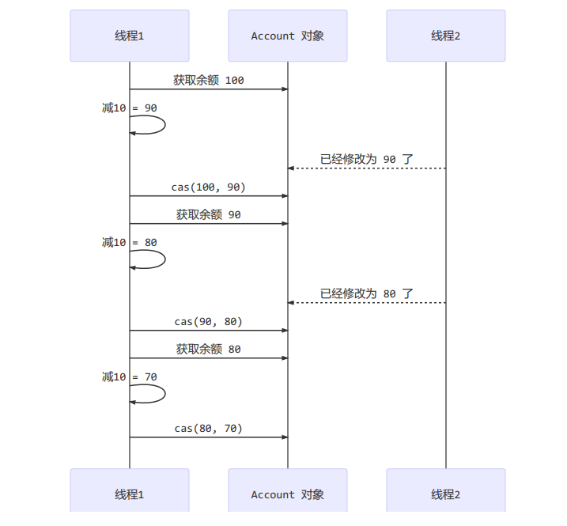

# 共享模型之无锁

## 本章内容

- CAS 与 volatile
- 原子整数
- 原子引用
- 原子累加器
- Unsafe

## CAS 举例

```java
public class CASDemo {

    public static void main(String[] args) {
        Account.demo(new AccountCAS(10000));
    }
}

class AccountUnsafe implements Account {
    private Integer balance;

    public AccountUnsafe(Integer balance) {
        this.balance = balance;
    }
    @Override
    public Integer getBalance() {
        return balance;
    }

    @Override
    public void withdraw(Integer amount) {
        balance -= amount;
    }
}

class AccountCAS implements Account {
    private final AtomicInteger balance;

    public AccountCAS(Integer balance) {
        this.balance = new AtomicInteger(balance);
    }
    @Override
    public Integer getBalance() {
        return balance.get();
    }

    @Override
    public void withdraw(Integer amount) {
        while (true) {
            int pre = balance.get();
            int next = Math.max(0, (pre - amount));
            if (balance.compareAndSet(pre, next)) {
                break;
            }
        }
        // 以上代码可以用优化
        balance.getAndAdd(-1 * amount);
    }
}

interface Account {
    Integer getBalance();

    void withdraw(Integer amount);

    static void demo(Account account) {
        List<Thread> ts = new ArrayList<>();

        long start = System.nanoTime();

        for (int i = 0; i < 1000; i++) {
            ts.add(new Thread(() -> account.withdraw(10)));

        }
        ts.forEach(Thread::start);
        for (Thread thread : ts) {
            try {
                thread.join();
            } catch (InterruptedException e) {
                e.printStackTrace();
            }
        }
        long end = System.nanoTime();
        System.out.println(account.getBalance() + " cost: " + (end -start) /10000000 + "ms");
    }
}
```

## CAS 与 volatile

前面看到的 AtomicInteger 的解决方法，内部并没有用锁来保护共享变量的线程安全。

```java
 public void withdraw(Integer amount) {
        while (true) {
            int pre = balance.get();
            int next = Math.max(0, (pre - amount));
            if (balance.compareAndSet(pre, next)) {
                break;
            }
        }
    }
```

其中关键的是 compareAndSet，它的简称就是 CAS (也有 Compare And Swap 的说法)，它必须时原子操作。

  
   
compareAndSet 在设值时会将当前线程之前拿到的变量值与最新的变量值相比较，不一致则此次操作作废

注意：其实 CAS 的底层是 lock cmpxchg 指令 (x86 架构)，在单核 CPU 和多核 CPU 下都能保证比较交换的原子性

- 在多核状态下，某个核执行到带 lock 指令时，CPU 会让总线锁住，当这个核把此指令执行完毕，再开启总线。这个过程中不会被线程的调度机制所打断，保证了多个线程对内存操作的准确性，是原子的。

### volatile

获取共享变量时，为了保证该变量的可见性，需要使用 volatile 修饰.

它可以用来修饰成员变量和静态成员变量，可以避免线程从自己的工作缓冲中查找变量的值，保证必须到主内存中获取它的值，线程操作 volatile 变量都是直接操作主内存，即一个线程对 volatile 变量的修改，对另一个线程可见。

- volatile 仅仅保证了共享变量的可见性，让其他线程能够看到最新值，但不能解决指令交错问题（不能保证原子性）

CAS 必须借助 volatile 才能读到共享变量的最新值来实现**比较并交换**的效果

### 为什么无锁效率高

- 无锁情况下，即使重试失败，线程始终高速运行，没有停歇，而 synchronized 会线程在没有获得锁的时候，发生上下文切换，进入阻塞
- 打个比喻：线程就好像高速跑道上的赛车，高速运行时，速度超快，一旦发生上下文切换，就好比赛车要减速、熄火，等待被唤醒又得重新打火、启动、加速，代价比较大
- 但无锁情况下，因为线程要保持运行，需要额外 CPU 的支持， CPU 在这里就好比高速跑道，没有额外的跑道，线程想高速运行也无从谈起，虽然不会进入阻塞，但由于没有分到时间片，仍然会进入可运行状态，还是会导致上下文切换。所以必须是多核 CPU 且线程数小于 CPU 核心数时，CAS 才能发挥优势

### CAS 的特点

结合 CAS 和 volatile 可以实现五所并发，适用于线程数少、多核 CPU 的场景下。

- CAS 是基于乐观锁的思想：最乐观的估计，不怕别的线程来修改共享变量，就算改了也没有关系，我吃点亏再重试
- synchronized 是基于悲观锁的思想：最悲观的估计，得防着其他线程来修改共享变量，我上了锁其他人都别想改，我改完了解开锁，其他人才有机会
- CAS 体现的是无锁并发、无阻塞并发
  - 因为没有使用 synchronized，所以线程不会陷入阻塞，这是效率提升的因素之一
  - 但如果竞争激烈，可以想到重试必然频繁发生，反而效率会受影响

## 原子整数

JUC并发包提供了：

- AtomicInteger
- AtomicBoolean
- AtomicLong

以 AtomicInteger 为例

```java
AtomicInteger i = new AtomicInteger();
// 获取并自增 类似 i++
System.out.println(i.getAndIncrement());
// 自增并获取 类似 ++i
System.out.println(i.incrementAndGet());
// 自减并获取 类似 --i
System.out.println(i.decrementAndGet());
// 获取并自减 类似 i--
System.out.println(i.getAndDecrement());
// 获取并加值
System.out.println(i.getAndAdd(5));
// 加值并获取
System.out.println(i.addAndGet(-5));
// 获取并更新
// 其中函数中的操作能保证原子性，但函数需要无副作用
System.out.println(i.getAndUpdate(p -> p - 2));
// 更新并获取
System.out.println(i.updateAndGet(p -> p + 2));
// 获取并计算
// p = i, x = 10
// 其中函数中的操作能保证原子性，但函数需要无副作用
// getAndUpdate 如果在 lambda 中引用了外部的局部变量，要保证变量是 final
// getAndAccumulate 可以通过参数 x 来引用外部的局部变量，且因其不在 lambda 中故不必是 final
System.out.println(i.getAndAccumulate(10, (p, x) -> p + x));
// 计算并获取
System.out.println(i.accumulateAndGet(-10, (p, x) -> p + x));
```

## 原子引用

为什么需要原子引用类型

因为除了共享变量除了基本类型，还有可能是引用类型

- AtomicReference
- AtomicMarkableReference
- AtomicStampedReference

### 安全实现-使用CAS

```java
public class AtomicReferenceCASDemo {

    public static void main(String[] args) {

        DecimalAccount.demo(new DecimalAccountCAS(new BigDecimal("1000")));

    }
}

class DecimalAccountCAS implements DecimalAccount {
    AtomicReference<BigDecimal> ref;

    public DecimalAccountCAS(BigDecimal balance) {
        this.ref = new AtomicReference<>(balance);
    }
    @Override    
    public BigDecimal getBalance() {
        return ref.get();
    }

    @Override
    public void withdraw(BigDecimal amount) {
        while (true) {
            BigDecimal prev = ref.get();
            BigDecimal next = prev.subtract(amount);
            if (ref.compareAndSet(prev, next)) {
                break;
            }
        }
    }
}

interface DecimalAccount {
    BigDecimal getBalance();

    void withdraw(BigDecimal amount);

    static void demo(DecimalAccount account) {
        List<Thread> ts = new ArrayList<>();

        long start = System.nanoTime();

        for (int i = 0; i < 1000; i++) {
            ts.add(new Thread(() -> account.withdraw(BigDecimal.TEN)));

        }
        ts.forEach(Thread::start);
        for (Thread thread : ts) {
            try {
                thread.join();
            } catch (InterruptedException e) {
                e.printStackTrace();
            }
        }
        long end = System.nanoTime();
        System.out.println(account.getBalance() + " cost: " + (end -start) /10000000 + "ms");
    }
}
```

### ABA 问题及解决

ABA 问题

```java
static AtomicReference<String> ref = new AtomicReference<>("A");
public static void main (String[]args) throws InterruptedException {
    log.debug("main start...");
    // 获取值 A
    // 这个共享变量被它线程修改过？
    String prev = ref.get();
    other();
    sleep(1);
    // 尝试改为 C
    log.debug("change A->C {}", ref.compareAndSet(prev, "C"));
}
private static void other () {
    new Thread(() -> {
        log.debug("change A->B {}", ref.compareAndSet(ref.get(), "B"));
    }, "t1").start();
    sleep(0.5);
    new Thread(() -> {
        log.debug("change B->A {}", ref.compareAndSet(ref.get(), "A"));
    }, "t2").start();
}
```

输出

```java
c.Test36 [main] - main start... 
c.Test36 [t1] - change A->B true 
c.Test36 [main] - change A->C true
```

主线程仅能判断出共享变量的值与初始值是否相同，不能感知到这种从 A 改为 B 又改回 A 的情况

如果主线程希望只要其他线程修改了共享变量，那么自己CAS就算失败，这时则需要加一个版本号

**AtomicStampedReference:**

```java
public class AtomicStampedReferenceDemo {

    static AtomicStampedReference<String> ref = new AtomicStampedReference<>("A", 0);

    public static void main(String[] args) {
        log.info("main start");
        // 获取值 A
        String prev = ref.getReference();
        // 获取版本号
        int stamp = ref.getStamp();
        log.info("版本:{}", stamp);
        other();
        sleep(1);
        log.info("change A -> C {}", ref.compareAndSet(prev, "C", stamp, stamp + 1));
    }

    private static void other() {
        new Thread(() -> {
            String prev = ref.getReference();
            int stamp = ref.getStamp();
            log.info("版本:{}", stamp);
            log.info("change A -> B {}", ref.compareAndSet(prev, "B", stamp, stamp + 1));
        }, "t1").start();

        new Thread(() -> {
            String prev = ref.getReference();
            int stamp = ref.getStamp();                                                                                                                                                                                   
            log.info("版本:{}", stamp);
            log.info("change B -> A {}", ref.compareAndSet(prev, "B", stamp, stamp + 1));
        }, "t2").start();
    }
}
```

输出

```java
 [main] INFO juc.code.cas.AtomicStampedReferenceDemo - main start
 [main] INFO juc.code.cas.AtomicStampedReferenceDemo - 版本:0
 [t1] INFO juc.code.cas.AtomicStampedReferenceDemo - 版本:0
 [t1] INFO juc.code.cas.AtomicStampedReferenceDemo - change A -> B true
 [t2] INFO juc.code.cas.AtomicStampedReferenceDemo - 版本:1
 [t2] INFO juc.code.cas.AtomicStampedReferenceDemo - change B -> A true
 [main] INFO juc.code.cas.AtomicStampedReferenceDemo - change A -> C false
```

AtomicStampedReference 可以给原子引用加上版本号，追踪原子引用的整个变化过程，如：A -> B -> A -> C，通过 AtomicStampedReference 可以知道引用变量中途被改了几次

但有些时候，并不需要关心引用变量被改了几次，只是单纯的关心是否被更改过，所以有了 AtomicNarkableReference
