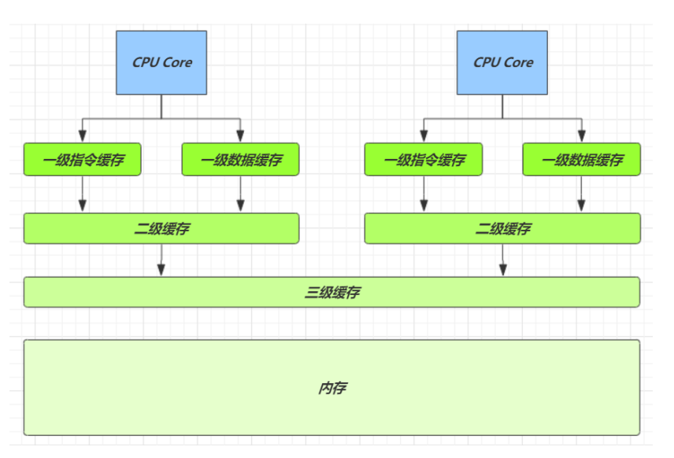
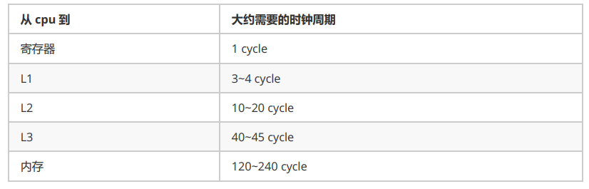
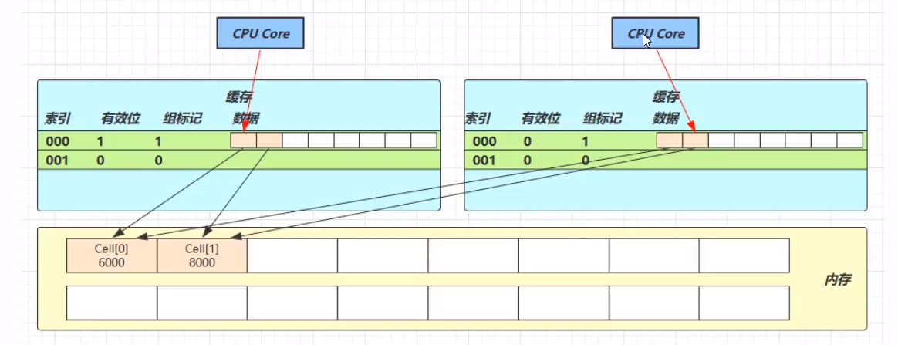

# 共享模型之无锁

## 本章内容

- CAS 与 volatile
- 原子整数
- 原子引用
- 原子累加器
- Unsafe

## CAS 举例

```java
public class CASDemo {

    public static void main(String[] args) {
        Account.demo(new AccountCAS(10000));
    }
}

class AccountUnsafe implements Account {
    private Integer balance;

    public AccountUnsafe(Integer balance) {
        this.balance = balance;
    }
    @Override
    public Integer getBalance() {
        return balance;
    }

    @Override
    public void withdraw(Integer amount) {
        balance -= amount;
    }
}

class AccountCAS implements Account {
    private final AtomicInteger balance;

    public AccountCAS(Integer balance) {
        this.balance = new AtomicInteger(balance);
    }
    @Override
    public Integer getBalance() {
        return balance.get();
    }

    @Override
    public void withdraw(Integer amount) {
        while (true) {
            int pre = balance.get();
            int next = Math.max(0, (pre - amount));
            if (balance.compareAndSet(pre, next)) {
                break;
            }
        }
        // 以上代码可以用优化
        balance.getAndAdd(-1 * amount);
    }
}

interface Account {
    Integer getBalance();

    void withdraw(Integer amount);

    static void demo(Account account) {
        List<Thread> ts = new ArrayList<>();

        long start = System.nanoTime();

        for (int i = 0; i < 1000; i++) {
            ts.add(new Thread(() -> account.withdraw(10)));

        }
        ts.forEach(Thread::start);
        for (Thread thread : ts) {
            try {
                thread.join();
            } catch (InterruptedException e) {
                e.printStackTrace();
            }
        }
        long end = System.nanoTime();
        System.out.println(account.getBalance() + " cost: " + (end -start) /10000000 + "ms");
    }
}
```

## CAS 与 volatile

前面看到的 AtomicInteger 的解决方法，内部并没有用锁来保护共享变量的线程安全。

```java
 public void withdraw(Integer amount) {
        while (true) {
            int pre = balance.get();
            int next = Math.max(0, (pre - amount));
            if (balance.compareAndSet(pre, next)) {
                break;
            }
        }
    }
```

其中关键的是 compareAndSet，它的简称就是 CAS (也有 Compare And Swap 的说法)，它必须时原子操作。

  
   
compareAndSet 在设值时会将当前线程之前拿到的变量值与最新的变量值相比较，不一致则此次操作作废

注意：其实 CAS 的底层是 lock cmpxchg 指令 (x86 架构)，在单核 CPU 和多核 CPU 下都能保证比较交换的原子性

- 在多核状态下，某个核执行到带 lock 指令时，CPU 会让总线锁住，当这个核把此指令执行完毕，再开启总线。这个过程中不会被线程的调度机制所打断，保证了多个线程对内存操作的准确性，是原子的。

### volatile

获取共享变量时，为了保证该变量的可见性，需要使用 volatile 修饰.

它可以用来修饰成员变量和静态成员变量，可以避免线程从自己的工作缓冲中查找变量的值，保证必须到主内存中获取它的值，线程操作 volatile 变量都是直接操作主内存，即一个线程对 volatile 变量的修改，对另一个线程可见。

- volatile 仅仅保证了共享变量的可见性，让其他线程能够看到最新值，但不能解决指令交错问题（不能保证原子性）

CAS 必须借助 volatile 才能读到共享变量的最新值来实现**比较并交换**的效果

### 为什么无锁效率高

- 无锁情况下，即使重试失败，线程始终高速运行，没有停歇，而 synchronized 会线程在没有获得锁的时候，发生上下文切换，进入阻塞
- 打个比喻：线程就好像高速跑道上的赛车，高速运行时，速度超快，一旦发生上下文切换，就好比赛车要减速、熄火，等待被唤醒又得重新打火、启动、加速，代价比较大
- 但无锁情况下，因为线程要保持运行，需要额外 CPU 的支持， CPU 在这里就好比高速跑道，没有额外的跑道，线程想高速运行也无从谈起，虽然不会进入阻塞，但由于没有分到时间片，仍然会进入可运行状态，还是会导致上下文切换。所以必须是多核 CPU 且线程数小于 CPU 核心数时，CAS 才能发挥优势

### CAS 的特点

结合 CAS 和 volatile 可以实现五所并发，适用于线程数少、多核 CPU 的场景下。

- CAS 是基于乐观锁的思想：最乐观的估计，不怕别的线程来修改共享变量，就算改了也没有关系，我吃点亏再重试
- synchronized 是基于悲观锁的思想：最悲观的估计，得防着其他线程来修改共享变量，我上了锁其他人都别想改，我改完了解开锁，其他人才有机会
- CAS 体现的是无锁并发、无阻塞并发
  - 因为没有使用 synchronized，所以线程不会陷入阻塞，这是效率提升的因素之一
  - 但如果竞争激烈，可以想到重试必然频繁发生，反而效率会受影响

## 原子整数

JUC并发包提供了：

- AtomicInteger
- AtomicBoolean
- AtomicLong

以 AtomicInteger 为例

```java
AtomicInteger i = new AtomicInteger();
// 获取并自增 类似 i++
System.out.println(i.getAndIncrement());
// 自增并获取 类似 ++i
System.out.println(i.incrementAndGet());
// 自减并获取 类似 --i
System.out.println(i.decrementAndGet());
// 获取并自减 类似 i--
System.out.println(i.getAndDecrement());
// 获取并加值
System.out.println(i.getAndAdd(5));
// 加值并获取
System.out.println(i.addAndGet(-5));
// 获取并更新
// 其中函数中的操作能保证原子性，但函数需要无副作用
System.out.println(i.getAndUpdate(p -> p - 2));
// 更新并获取
System.out.println(i.updateAndGet(p -> p + 2));
// 获取并计算
// p = i, x = 10
// 其中函数中的操作能保证原子性，但函数需要无副作用
// getAndUpdate 如果在 lambda 中引用了外部的局部变量，要保证变量是 final
// getAndAccumulate 可以通过参数 x 来引用外部的局部变量，且因其不在 lambda 中故不必是 final
System.out.println(i.getAndAccumulate(10, (p, x) -> p + x));
// 计算并获取
System.out.println(i.accumulateAndGet(-10, (p, x) -> p + x));
```

## 原子引用

为什么需要原子引用类型

因为除了共享变量除了基本类型，还有可能是引用类型

- AtomicReference
- AtomicMarkableReference
- AtomicStampedReference

### 安全实现-使用CAS

```java
public class AtomicReferenceCASDemo {

    public static void main(String[] args) {

        DecimalAccount.demo(new DecimalAccountCAS(new BigDecimal("1000")));

    }
}

class DecimalAccountCAS implements DecimalAccount {
    AtomicReference<BigDecimal> ref;

    public DecimalAccountCAS(BigDecimal balance) {
        this.ref = new AtomicReference<>(balance);
    }
    @Override    
    public BigDecimal getBalance() {
        return ref.get();
    }

    @Override
    public void withdraw(BigDecimal amount) {
        while (true) {
            BigDecimal prev = ref.get();
            BigDecimal next = prev.subtract(amount);
            if (ref.compareAndSet(prev, next)) {
                break;
            }
        }
    }
}

interface DecimalAccount {
    BigDecimal getBalance();

    void withdraw(BigDecimal amount);

    static void demo(DecimalAccount account) {
        List<Thread> ts = new ArrayList<>();

        long start = System.nanoTime();

        for (int i = 0; i < 1000; i++) {
            ts.add(new Thread(() -> account.withdraw(BigDecimal.TEN)));

        }
        ts.forEach(Thread::start);
        for (Thread thread : ts) {
            try {
                thread.join();
            } catch (InterruptedException e) {
                e.printStackTrace();
            }
        }
        long end = System.nanoTime();
        System.out.println(account.getBalance() + " cost: " + (end -start) /10000000 + "ms");
    }
}
```

### ABA 问题及解决

ABA 问题

```java
static AtomicReference<String> ref = new AtomicReference<>("A");
public static void main (String[]args) throws InterruptedException {
    log.debug("main start...");
    // 获取值 A
    // 这个共享变量被它线程修改过？
    String prev = ref.get();
    other();
    sleep(1);
    // 尝试改为 C
    log.debug("change A->C {}", ref.compareAndSet(prev, "C"));
}
private static void other () {
    new Thread(() -> {
        log.debug("change A->B {}", ref.compareAndSet(ref.get(), "B"));
    }, "t1").start();
    sleep(0.5);
    new Thread(() -> {
        log.debug("change B->A {}", ref.compareAndSet(ref.get(), "A"));
    }, "t2").start();
}
```

输出

```java
c.Test36 [main] - main start... 
c.Test36 [t1] - change A->B true 
c.Test36 [main] - change A->C true
```

主线程仅能判断出共享变量的值与初始值是否相同，不能感知到这种从 A 改为 B 又改回 A 的情况

如果主线程希望只要其他线程修改了共享变量，那么自己CAS就算失败，这时则需要加一个版本号

**AtomicStampedReference:**

```java
public class AtomicStampedReferenceDemo {

    static AtomicStampedReference<String> ref = new AtomicStampedReference<>("A", 0);

    public static void main(String[] args) {
        log.info("main start");
        // 获取值 A
        String prev = ref.getReference();
        // 获取版本号
        int stamp = ref.getStamp();
        log.info("版本:{}", stamp);
        other();
        sleep(1);
        log.info("change A -> C {}", ref.compareAndSet(prev, "C", stamp, stamp + 1));
    }

    private static void other() {
        new Thread(() -> {
            String prev = ref.getReference();
            int stamp = ref.getStamp();
            log.info("版本:{}", stamp);
            log.info("change A -> B {}", ref.compareAndSet(prev, "B", stamp, stamp + 1));
        }, "t1").start();

        new Thread(() -> {
            String prev = ref.getReference();
            int stamp = ref.getStamp();                                                                                                                                                                                   
            log.info("版本:{}", stamp);
            log.info("change B -> A {}", ref.compareAndSet(prev, "B", stamp, stamp + 1));
        }, "t2").start();
    }
}
```

输出

```java
 [main] INFO juc.code.cas.AtomicStampedReferenceDemo - main start
 [main] INFO juc.code.cas.AtomicStampedReferenceDemo - 版本:0
 [t1] INFO juc.code.cas.AtomicStampedReferenceDemo - 版本:0
 [t1] INFO juc.code.cas.AtomicStampedReferenceDemo - change A -> B true
 [t2] INFO juc.code.cas.AtomicStampedReferenceDemo - 版本:1
 [t2] INFO juc.code.cas.AtomicStampedReferenceDemo - change B -> A true
 [main] INFO juc.code.cas.AtomicStampedReferenceDemo - change A -> C false
```

AtomicStampedReference 可以给原子引用加上版本号，追踪原子引用的整个变化过程，如：A -> B -> A -> C，通过 AtomicStampedReference 可以知道引用变量中途被改了几次

但有些时候，并不需要关心引用变量被改了几次，只是单纯的关心是否被更改过，所以有了 AtomicNarkableReference

**AtomicNarkableReference:**

```java
public class AtomicMarkableReferenceDemo {

    public static void main(String[] args) {
        GarbageBag bag = new GarbageBag("装满了垃圾");
        AtomicMarkableReference<GarbageBag> ref = new AtomicMarkableReference<>(bag, true);
        log.info("start....");
        GarbageBag prev = ref.getReference();
        log.info(prev.toString());

        new Thread(() -> {
            log.info("other start ...");
            bag.setDesc("空垃圾袋");
            ref.compareAndSet(bag, bag, true, false);
        }).start();

        sleep(1);
        log.info("想换一个新垃圾袋");
        boolean success = ref.compareAndSet(prev, new GarbageBag("空垃圾袋"), true, false);
        log.info("结果：{}", success);
        log.info(ref.getReference().toString());

    }
}

@Getter
@Setter
@ToString
@AllArgsConstructor
class GarbageBag {
    String desc;
}
```

## 原子数组

- AtomicIntegerArray
- AtomicLongArray
- AtomicReferenceArray

```java
public class AtomicArrayDemo {

    public static void main(String[] args) {
        // 不安全数组
        demo(
                () -> new int[10],
                array -> array.length,
                (array, index) -> array[index] ++,
                array -> System.out.println(Arrays.toString(array))
        );
        // 安全数组
        demo(
                () -> new AtomicIntegerArray(10),
                AtomicIntegerArray::length,
                AtomicIntegerArray::getAndIncrement,
                array -> System.out.println(array.toString())
        );
    }

    /**
     * Supplier 供给型 () -> T
     * Function 函数型 T -> R
     * Consumer 消费型 T -> void
     *
     * @param arraySupplier 提供数组，可以使线程不安全或安全的数组
     * @param lengthFun 获取数组长度的方法
     * @param putConsumer 自增方法，回传 array, index
     * @param printConsumer 打印数组的方法
     * @param <T> 泛型
     */
    public static <T> void demo(
            Supplier<T> arraySupplier,
            Function<T, Integer> lengthFun,
            BiConsumer<T, Integer> putConsumer,
            Consumer<T> printConsumer
    ) {
        List<Thread> ts = new ArrayList<>();
        T array = arraySupplier.get();
        Integer length = lengthFun.apply(array);
        for (int i = 0; i < length; i++) {
            // 每个线程对数组操作1000次
            ts.add(new Thread(() -> {
                for (int j = 0; j < 1000; j++) {
                    putConsumer.accept(array, j % length);
                }
            }));
        }
        ts.forEach(Thread::start);
        for (Thread t : ts) {
            try {
                t.join();
            } catch (InterruptedException e) {
                e.printStackTrace();
            }
        }
        printConsumer.accept(array);
    }
}
```

输出

```java
[991, 991, 991, 990, 991, 991, 992, 992, 991, 991]
[1000, 1000, 1000, 1000, 1000, 1000, 1000, 1000, 1000, 1000]
```

## 字段更新器

- AtomicReferenceFieldUpdater
- AtomicIntegerUpdater
- AtomicLongFieldUpdater

利用字段更新器，可以针对对象的某个域( Field ) 进行原子操作，只能配合 volatile 修饰的字段使用，否则会出现异常

```java
Exception in thread "main" java.lang.IllegalArgumentException: Must be volatile type
```

```java
public class AtomicFieldUpdaterDemo {

    private volatile int field;

    public static void main(String[] args) {

        AtomicIntegerFieldUpdater<AtomicFieldUpdaterDemo> updater = AtomicIntegerFieldUpdater.newUpdater(AtomicFieldUpdaterDemo.class, "field");
        AtomicFieldUpdaterDemo demo = new AtomicFieldUpdaterDemo();

        boolean res = updater.compareAndSet(demo, 0, 10);
        System.out.println(res);

        res = updater.compareAndSet(demo, 0, 20);
        System.out.println(res);

    }
}
```

## 原子累加器

与 AtomicLong 性能比较

```java
public class LongAdderDemo {

    public static void main(String[] args) {
        for (int i = 0; i < 5; i++) {
            demo(() -> new AtomicLong(0), AtomicLong::getAndIncrement);
        }
        System.out.println();
        for (int i = 0; i < 5; i++) {
            demo(LongAdder::new, LongAdder::increment);
        }
    }

    public static <T> void demo(Supplier<T> supplier, Consumer<T> action) {
        T adder = supplier.get();
        long start = System.nanoTime();
        List<Thread> ts = new ArrayList<>();
        for (int i = 0; i < 40; i++) {
            ts.add(new Thread(() -> {
                for (int j = 0; j < 500000; j++) {
                    action.accept(adder);
                }
            }));
        }
        ts.forEach(Thread::start);
        for (Thread t : ts) {
            try {
                t.join();
            } catch (InterruptedException e) {
                e.printStackTrace();
            }
        }
        long end = System.nanoTime();
        System.out.println(adder + "cost:" + (end -start) / 1000000);
    }
}
```

输出

```java
20000000 cost:395
20000000 cost:384
20000000 cost:356
20000000 cost:410
20000000 cost:403
20000000 cost:69
20000000 cost:82
20000000 cost:84
20000000 cost:103
20000000 cost:112
```

性能提升的原因很简单，就是在竞争时，设置多个累加单元，Thread-0 累加 cell[0]，而 Thread-1 累加 cell[1]... 最后将结果汇总。这样在累加时操作不同的 cell 变量，因此减少了 CAS 重试失败，从而提高性能

LongAdder 是并发大师 Doug lea的作品，设计的非常精巧

LongAAdder 类有几个关键域

```java
// 累加单元数组，懒惰初始化
transient volatile Cell[] cells;
// 基础值，如果没有竞争，则使用 cas 累加这个域
transient volatile long base;
// 在 cells 创建或扩容时，置为1，表示加锁
transient volatile int cellsBusy;
```

cas 锁

```java
public class LockCas {
    private AtomicInteger state = new AtomicInteger();

    public void lock() {
        while(true) {
            if(state.compareAndSet(0, 1)){
                break;
            }

        }
    }

    public void unlock() {
        state.set(0);
    }
}
```

### CPU 缓存结构

  

速度比较

  

因为 CPU 与内存的速度差异很大，需要靠预读数据至缓存来提升效率

而缓存以缓存行为单位，每个缓存行对应着一块内存看来，一般是 64 byte( 8 个 long)

缓存的加入会造成数据副本的产生，即同一份数据会缓存在不同核心的缓存行中

CPU 要保证数据的一致性，如果某个 CPU 核心更改了数据，其他 CPU 核心对应的整个缓存行必须失效

### 伪共享

```java
// 防止缓存行伪共享
@sun.misc.Contended
static final class Cell {
    volatile long value;
    Cell(long x) { value = x; }
    // 最重要的方法，用来 CAS 方式进行累加
    final boolean cas(long prev, long next) { 
        return UNSAFE.compareAndSwapLong(this, valueOffset, prev, next);
    }
}
```

 

因为 Cell 是数组形式，在内存中是连续存储的，一个 Cell 为 24 字节（16字节的对象头和8字节的value），因此缓存行可以存下2个的cell对象。这样问题来了：

- Core-0 要修改 Cell[0]
- Core-1 要修改 Cell[1]

无论谁修改成功，都会导致对方 core 的缓存行失效，比如 Core-0 中 cell[0] = 6000, cell[1] = 8000, 要累加 cell[0] = 6001, cell[1] =8000, 这时会让 core-1 的缓存行失效

@sun.misc.Contended 用来解决这个问题，它的原理是在使用此注解的对象或字段的前后各增加128字节大小的 padding，从而让 CPU 将对象预读至缓存时占用不同的缓存行，这样，不会造成对方缓存行的失效

## Unsafe

Unsafe 对象提供了非常底层的，操作内存、线程的方法，Unsafe 对象不能直接调用，只能通过反射获取

Unsafe CAS 操作

```java
public class UnsafeCASDemo {
    @Data
    static class Student {
        volatile int id;
        volatile String name;
    }

    public static void main(String[] args) throws NoSuchFieldException {
        Unsafe unsafe = UnsafeAccessor.getUnsafe();
        Field id = Student.class.getDeclaredField("id");
        Field name = Student.class.getDeclaredField("name");
        // 获得成员变量的偏移量
        long idOffset = unsafe.objectFieldOffset(id);
        long nameOffset = unsafe.objectFieldOffset(name);
        Student student = new Student();
        // 使用 cas 方法替换成员变量的值
        unsafe.compareAndSwapInt(student, idOffset, 0, 20);
        unsafe.compareAndSwapObject(student, nameOffset, null, "张三");
        System.out.println(student);
    }

}
```

输出

```java
UnsafeCASDemo.Student(id=20, name=张三)
```

使用自定义的 AtomicData 实现之前的线程安全的原子整数 Account 实现

```java
public class AtomicDataDemo {
    public static void main(String[] args) {

        Account.demo(new Account() {

            final AtomicData atomicData = new AtomicData(10000);

            @Override
            public Integer getBalance() {
                return atomicData.getValue();
            }

            @Override
            public void withdraw(Integer amount) {
                atomicData.decrease(amount);
            }
        });
    }
}

class AtomicData {

    static final Unsafe unsafe;
    private volatile int value;
    static final long DATA_OFFSET;

    static {
        unsafe = UnsafeAccessor.getUnsafe();
        try {
            DATA_OFFSET = unsafe.objectFieldOffset(AtomicData.class.getDeclaredField("value"));
        } catch (NoSuchFieldException e) {
            e.printStackTrace();
            throw new RuntimeException(e);
        }
    }

    public AtomicData(int value){
        this.value = value;
    }

    public void decrease(int amount) {
        int prev = value;
        int next = prev - amount;
        while (true) {
            if (unsafe.compareAndSwapInt(this, DATA_OFFSET, prev, next)) {
                break;
            }
        }
    }

    public int getValue() {
        return value;
    }
}
```