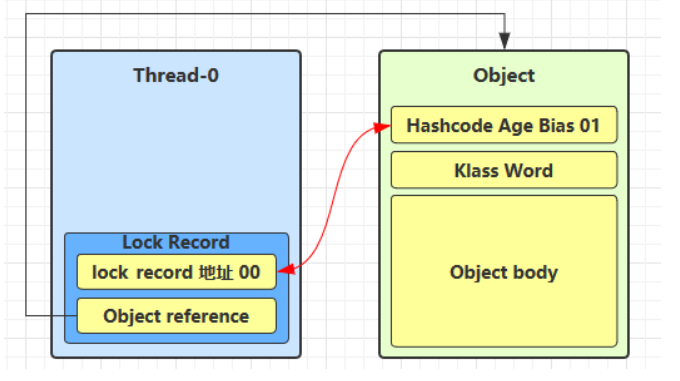

# 共享模型之管程

## 共享变量带来的问题

### Java 体现

两个线程对初始值为 0 的静态变量一个做自增，一个做自减，各做 5000 次，结果是否为 0？

```java
static int counter = 0;

    public static void main(String[] args) throws InterruptedException {
        Thread t1 = new Thread(() -> {
            for (int i = 0; i < 5000; i++) {
                counter++;
            }
        }, "t1");
        Thread t2 = new Thread(() -> {
            for (int i = 0; i < 5000; i++) {
                counter--;
            }
        }, "t2");
        t1.start();
        t2.start();
        t1.join();
        t2.join();
        log.info("{}", counter);
    }
```

### 问题分析

以上结果可能是正数、负数、零。因为 Java 中对静态变量的自增，自减并不是原子操作，需从字节码来进行分析

例如对于 i++ 而言 (i 为静态变量)，实际会产生如下的 JVM 字节码指令：

```java
getstatic   i  // 获取静态变量i的值
iconst_1       // 准备常量1
iadd           // 自增
putstatic   i  // 将修改后的值存入静态变量i
```

而对应 i-- 也是类似

```java
getstatic   i  // 获取静态变量i的值
iconst_1       // 准备常量1
isub           // 自减
putstatic   i  // 将修改后的值存入静态变量i
```

而 Java 的内存模型下，完成静态变量的自增，自减需要在主存和工作内存中进行数据交换：


在多线程的情况下会发生指令交错，出现正数、负数、零三种情况

### 临界区 Critical Section

- 一个程序运行多个线程本身是没有问题的
- 问题出在多个线程访问共享资源
  - 多个线程读共享资源其实也没有问题
  - 在多个线程对共享资源读写操作时发生指令交错，就会出现问题
- 一段代码如果存在对共享资源的多线程读写操作，称这段代码为临界区

例如：

```java
static int counter = 0;

static void increment(){
    // 临界区
    counter ++;
}
static void decrement(){
    // 临界区
    counter --;
}
```

### 竞态条件

多个线程在临界区内执行，由于代码的**执行序列**不同而导致**结果无法预测**，称之为发生了竞态条件

## synchronized 解决方案

为了避免临界区的竞态条件发生，有多种手段可以达到目的

- 阻塞式的解决方案：synchronized, Lock
- 非阻塞式的解决方案：原子变量

下面使用阻塞式的方案： synchronized 来解决上述问题，即俗称**对象锁*，它采用互斥的方式让同一时刻至多只有一个线程持有对象锁，其他线程再想要获取这个对象锁时就会阻塞。这样就能保证拥有锁的线程可以安全的执行临界区内的代码，不用担心线程上下文切换

**注意：**

虽然 Java 中的互斥和同步都可以采用 synchronized 关键字来完成，但是它们是有区别的：

- 互斥是保证临界区的竞态条件发生时，同一时刻只能有一个线程执行临界区的代码
- 同步是由于线程执行的先后、顺序不同，需要一个线程等待其他线程运行到某个点
  
### synchronized

**语法：**

```java
synchronized(对象){
    临界区
}
```

**理解：**

假如线程1拿到对象锁，当其他线程尝试获取锁时就会阻塞（BLOCKED）,线程1执行完临界区的代码后释放锁同时唤醒其他线程去争取锁

**解决：**

```java
 static int counter = 0;
    static Object lock = new Object();

    public static void main(String[] args) throws InterruptedException {
        Thread t1 = new Thread(() -> {
                for (int i = 0; i < 5000; i++) {
                    synchronized (lock){
                        counter++;
                }
            }
        }, "t1");

        Thread t2 = new Thread(() -> {
                for (int i = 0; i < 5000; i++) {
                    synchronized (lock) {
                        counter--;
                }
            }
        }, "t2");
        t1.start();
        t2.start();
        t1.join();
        t2.join();
        log.info("{}", counter);
    }
```

**思考：**

synchronized 实际是用对象锁保证了临界区内代码的原子性，临界区内的代码对外是不可分割的，不会被线程切换打断

- 如果把 synchronized(obj) 放在 for 循环外面，如何理解？
  
  ```java
  synchronized（lock){
      for (int i = 0; i < 5000; i++) {
          counter ++;
      }
  }
  ```

  synchronized 里的整个 for 循环是不可分割的，假如 t1 获得锁，会执行完 5000 次 counter ++ 操作后再释放锁。

- 如果 t1 synchronized(obj1) 而 t2 synchronized(obj2) 会怎样运作？
  
  无法保证对 counter 共享资源操作的原子性，两个线程同时执行临界区代码区获取锁时，获取的不是同一把对象锁，无法保证互斥

- 如果 t1 synchronized(obj) 而 t2 没有加会怎样？
  
  无法保证对 counter 共享资源操作的原子性，由于 t2 没有加锁，当 t1 没有释放锁（未执行完临界区代码）就发生时间片切换时，t2 执行临界区代码不会被阻塞

**总结：**

synchronized 用锁保证了临界区代码的原子性，会给临界区的代码加一个锁，当一个线程要执行 synchronized 内的代码（临界区内的代码）时，先要尝试获取这个锁，如果这个锁已经被其他线程获得，那么当前线程就会阻塞（BLOCKED）,等会持有锁的线程释放锁后被唤醒，再去尝试获取锁

**面向对象改进：**

```java
class Room {
    private int counter;
    
    public void increment() {
        synchronized (this) {
            counter++;
        }
    }

    public void decrement() {
        synchronized (this) {
            counter--;
        }
    }

    public int getCounter() {
        synchronized (this) {
            return counter;
        }
    }
}

  public static void main(String[] args) throws InterruptedException {
        Room room = new Room();
        Thread t1 = new Thread(() -> {
            for (int i = 0; i < 5000000; i++) {
                room.increment();
            }
        }, "t1");

        Thread t2 = new Thread(() -> {
            for (int i = 0; i < 5000000; i++) {
                room.decrement();
            }
        }, "t2");
        t1.start();
        t2.start();
        t1.join();
        t2.join();
        log.info("{}", room.getCounter());
    }
```

## 方法上的 synchronized

```java
class Test{
    public synchronized void test(){

    }
}

等价于

class Test{
    public void test(){
        synchronized(this){

        }
    }
}
```

```java
class Test{
    public synchronized static void test(){

    }
}

等价于

class Test{
    public static void test(){
        synchronized(this){

        }
    }
}
```

### 所谓的“线程八锁”

其实就是考察 synchronized 锁住的是哪个对象

**情况1：**

```java
  static class Number{
        public synchronized void a() {
            log.info("1");
        }
        public synchronized void b() {
            log.info("2");
        }
    }

    public static void main(String[] args) {
        Number number = new Number();
        new Thread(number::a).start();
        new Thread(number::b).start();
    }
```

结果：12 | 21

**情况2：**

```java
    static class Number{
        public synchronized void a() {
            sleep(1);
            log.info("1");
        }
        public synchronized void b() {
            log.info("2");
        }
    }

    public static void main(String[] args) {
        Number number = new Number();
        new Thread(() ->{
            log.info("begin");
            number.a();
        }).start();
        new Thread(() ->{
            log.info("begin");
            number.b();
        }).start();
    }
```

结果：1s 2 | 2 1s 1

**情况3：**

```java
    static class Number{
        public synchronized void a() {
            sleep(1);
            log.info("1");
        }
        public synchronized void b() {
            log.info("2");
        }

        public void c() {
            log.info("3");
        }
    }

    public static void main(String[] args) {
        Number number = new Number();
        new Thread(() ->{
            log.info("begin");
            number.a();
        }).start();
        new Thread(() ->{
            log.info("begin");
            number.b();
        }).start();
        new Thread(() ->{
            log.info("begin");
            number.c();
        }).start();
    }
```

结果：3 1s 12 | 23 1s 1 | 32 1s 1

**情况4：**

```java
  static class Number{
        public synchronized void a() {
            sleep(1);
            log.info("1");
        }
        public synchronized void b() {
            log.info("2");
        }
    }

    public static void main(String[] args) {
        Number n1 = new Number();
        Number n2 = new Number();
        new Thread(() ->{
            log.info("begin");
            n1.a();
        }).start();
        new Thread(() ->{
            log.info("begin");
            n2.b();
        }).start();
    }
```

结果：2 1s 1

**情况5：**

```java
static class Number{
        public synchronized static void a() {
            sleep(1);
            log.info("1");
        }
        public synchronized void b() {
            log.info("2");
        }
    }

    public static void main(String[] args) {
        Number number = new Number();
        new Thread(() ->{
            log.info("begin");
            number.a();
        }).start();
        new Thread(() ->{
            log.info("begin");
            number.b();
        }).start();
    }
```

结果：2 1s 1

**情况6：**

```java
  static class Number{
        public synchronized static void a() {
            sleep(1);
            log.info("1");
        }
        public synchronized static void b() {
            log.info("2");
        }
    }

    public static void main(String[] args) {
        Number number = new Number();
        new Thread(() ->{
            log.info("begin");
            number.a();
        }).start();
        new Thread(() ->{
            log.info("begin");
            number.b();
        }).start();
    }
```

结果：1s 12 | 2 1s 1

**情况7：**

```java
    static class Number{
        public synchronized static void a() {
            sleep(1);
            log.info("1");
        }
        public synchronized void b() {
            log.info("2");
        }
    }

    public static void main(String[] args) {
        Number n1 = new Number();
        Number n2 = new Number();
        new Thread(() ->{
            log.info("begin");
            n1.a();
        }).start();
        new Thread(() ->{
            log.info("begin");
            n2.b();
        }).start();
    }
```

结果：2 1s 1

**情况8：**

```java
   static class Number{
        public synchronized static void a() {
            sleep(1);
            log.info("1");
        }
        public synchronized static void b() {
            log.info("2");
        }
    }

    public static void main(String[] args) {
        Number n1 = new Number();
        Number n2 = new Number();
        new Thread(() ->{
            log.info("begin");
            n1.a();
        }).start();
        new Thread(() ->{
            log.info("begin");
            n2.b();
        }).start();
    }
```

结果：1s 12 | 2 1s 1

## 变量的线程安全分析

### 成员变量和静态变量是否线程安全

- 如果它们没有共享，则线程安全
- 如果它们被共享了，根据它们的状态是否能够改变，又分为两种情况
  - 如果只有读操作，则线程安全
  - 如果有读写，则这段代码是临界区，需要考虑线程安全

### 局部变量是否线程安全

- 局部变量是线程安全的
- 但局部变量引用的对象则未必
  - 如果该对象没有逃离方法的作用范围，它是线程安全的
  - 如果该对象逃离方法的作用范围，需要考虑线程安全

### 局部变量线程安全分析

```java
public static void test(){
    int i = 10;
    i++;
}
```

每个线程调用 test() 方法会在每个线程的栈帧中创建多份，因此不存在共享

```java
0: bipush       10
2: istore_0
3: iinc         0, 1
6: return
```


成员变量举例

```java
public class ThreadUnsafe {
    List<String> list = new ArrayList<>();
    public void method1(int loopNumber) {
        for (int i = 0; i < loopNumber; i++) {
            // 临界区 会产生竟态条件
            method2();
            method3();
        }
    }

    private void method2() {
        list.add("1");
    }

    private void method3() {
        list.remove(0);
    }

    public static void main(String[] args) {
        ThreadUnsafe tu = new ThreadUnsafe();
        for (int i = 0; i < 2; i++) {
            new Thread(() -> tu.method1(200), "Thread" + i).start();
        }
    }
}
```

out:

```java
Exception in thread "Thread0" Exception in thread "Thread1" java.lang.ArrayIndexOutOfBoundsException: -1
	at java.util.ArrayList.remove(ArrayList.java:507)
	at juc.code.ThreadUnsafe.method3(ThreadUnsafe.java:22)
	at juc.code.ThreadUnsafe.method1(ThreadUnsafe.java:13)
	at juc.code.ThreadUnsafe.lambda$main$0(ThreadUnsafe.java:28)
	at java.lang.Thread.run(Thread.java:748)
```

其中一种情况是，如果线程2还未 add，线程1 remove 会报错

分析：

- 无论哪个线程中的menthod2 引用的都是同一个对象的list成员变量
- mehtod3 同理


将list修改为局部变量可解决上述问题

```java
class ThreadSafe {
    public void method1(int loopNumber) {
        List<String> list = new ArrayList<>();
        for (int i = 0; i < loopNumber; i++) {
            // 临界区 会产生竟态条件
            method2();
            method3();
        }
    }

    private void method2() {
        list.add("1");
    }

    private void method3() {
        list.remove(0);
    }
}
```

分析：

- list 是局部变量，每个线程调用时会创建其不同实例，没有共享
- 而 method2 的参数是从 method1 中传递过来，与 method1 引用同一个对象 
- method3同理


### 方法访问修饰符带来的思考

如果把 method2 和 method3 的方法修改为 public 会不会产生线程安全问题？

- 情况1： 有其他线程调用 method2 和 method3
  
  不会产生线程安全问题。其他线程调用时需要传递其他线程实例 list 的引用，并没有线程共享实例 list
  
- 情况2： 在情况1 的基础上，为 ThreadSafe 类添加子类，子类覆盖 method2 或 method3 方法，即
  
```java
@Slf4j
public class ThreadSafe {
    public final void method1(int loopNumber) {
        List<String> list = new ArrayList<>();
        for (int i = 0; i < loopNumber; i++) {
            // 临界区 会产生竟态条件
            method2(list);
            method3(list);
            log.info("list size:{}", list.size());
        }
    }

    public void method2(List<String> list) {
        list.add("1");
    }

    public void method3(List<String> list) {
        list.remove(0);
    }

    public static void main(String[] args) {
        ThreadSafeSub tu = new ThreadSafeSub();
        for (int i = 0; i < 3; i++) {
            new Thread(() -> tu.method1(200), "Thread" + i).start();
        }
    }
}

class ThreadSafeSub extends ThreadSafe {

    @Override
    public void method3(List<String> list) {
        new Thread(() -> list.remove(0)).start();
    }
} 
```

从这个例子可以看出 private 或 final 提供安全的意义所在，开闭原则中的【闭】

## 常见线程安全类

- String
- Integer
- StringBuffer
- Random
- Vector
- HashTable
- java.util.concurrent 包下的类

这里的线程安全是指多个线程用它们同一个实例的方法时，是线程安全的。

```java
HashTable table = new HashTable();

new Threa(() -> {
    table.put("key", "value1");
}).start();

new Threa(() -> {
    table.put("key", "value2");
}).start();
```

- 它们的每个方法是原子的
- 但是它们多个方法的组合不是原子的

### 线程安全类方法的组合

分析下面是否线程安全

```java
HashTable table = new HashTable();
// 线程1、线程2

if(table.get("key") == null){
    table.put("key", value);
}
```

不安全，线程1 get 判断为 null 时，还未 put value1 时发生线程切换，线程2 get 判断也为 null，并 put value2，线程1 切换回来后再put value1 将 value2 覆盖

### 不可变类线程安全性

String、Integer 等都是不可类，因为其内部的状态不可变，因此它们的方法都是线程安全的

### 实例分析

- 例1
  
```java
public class MyServlet extends HttpServlet {
    // 是否安全？不安全
    Map<String,Object> map = new HashMap<>();
    // 是否安全？安全
    String S1 = "...";
    // 是否安全？安全
    final String S2 = "...";
    // 是否安全？不安全
    Date D1 = new Date();
    // 是否安全？不安全
    final Date D2 = new Date();
 
 public void doGet(HttpServletRequest request, HttpServletResponse response) {
     // 使用上述变量
 }
}
```

- 例2
  
```java
public class MyServlet extends HttpServlet {
    // 是否安全？不安全
    private UserService userService = new UserServiceImpl();
 
 public void doGet(HttpServletRequest request, HttpServletResponse response) {
    userService.update(...);
 }
}
public class UserServiceImpl implements UserService {
    // 记录调用次数
    private int count = 0;
 
    public void update() {
    // ...
    count++;
    }
}
```

- 例3
  
```java
public class MyServlet extends HttpServlet {
    // 是否安全 安全
    private UserService userService = new UserServiceImpl();

    public void doGet(HttpServletRequest request, HttpServletResponse response) {
        userService.update(...);
    }
}
public class UserServiceImpl implements UserService {
    // 是否安全 安全
    private UserDao userDao = new UserDaoImpl();

    public void update() {
        userDao.update();
    }
}
public class UserDaoImpl implements UserDao {
    public void update() {
        String sql = "update user set password = ? where username = ?";
        // 是否安全 安全
        try (Connection conn = DriverManager.getConnection("","","")){
            // ...
        } catch (Exception e) {
            // ...
        }
    }
}
```

- 例4
  
```java
public class Test {

    public void bar() {
        // 是否安全
        SimpleDateFormat sdf = new SimpleDateFormat("yyyy-MM-dd HH:mm:ss");
        foo(sdf);
    }

    public foo(SimpleDateFormat sdf);


    public static void main(String[] args) {
        new Test().bar();
    }

```

其中 foo 的行为是不确定的，可能导致不安全的发生，称之为**外星方法**

```java
 public void foo(SimpleDateFormat sdf) {
        String dateStr = "1999-10-11 00:00:00";
        for (int i = 0; i < 20; i++) {
            new Thread(() -> {
                try {
                    sdf.parse(dateStr);
                } catch (ParseException e) {
                    e.printStackTrace();
                }
            }).start();
        }
    }
```

- 例5

```java
private static Integer i = 0;

public static void main(String[] args) thro
    List<Thread> list = new ArrayList<>();
    for (int j = 0; j < 2; j++) {
        Thread thread = new Thread(() -> {
            for (int k = 0; k < 5000; k++) 
                synchronized (i) {
                    i++;
                }
            }
        }, "" + j);
        list.add(thread);
    }
    list.stream().forEach(t -> t.start());
    list.stream().forEach(t -> {
        try {
            t.join();
        } catch (InterruptedException e) {
            e.printStackTrace();
        }
    });
    log.debug("{}", i);
}
```

## Monitor 概念

### Java 对象头

以32为虚拟机为例

普通对象


数组对象


其中 Mark Word 结构包括：对象哈希码、对象分代年龄、锁的状态


### Monitor(锁)

Monitor 被翻译为监视器或管程

每个 Java 对象都可以关联一个 Monitor 对象，如果使用 synchronized 给对象上锁（重量级）之后，该对象头的 Mark Word 中就被设置指向 Monitor 对象的指针

Monitor 结构如下


- 刚开始 Monitor 中 Owner 为 null
- 当 Thread-2 执行 synchronized(obj) 就会将 Monitor 的所有者 Owner 置为 Thread-2，Monitor 中只能有一个 Owner
- 在 Thread-2 上锁的过程中，如果 Thread-3，Thread-4，Thread-5 也来执行 synchronized(obj)，就会进入 EntryList 阻塞 (BLOCKED)
- Thread-2 执行完同步代码块的内容，然后唤醒 EntryList 中等待的线程来竞争锁，竞争的时候是非公平的
- WaitSet 中的 Thread-0，Thread-1 是之前获得过锁，但条件不满足进入 WAITING 状态的线程，在 wait-notify 会分析

**注意：**

- synchronized必须是进入同一个对象的 Monitor 才有上述的效果
- 不加 synchronized 的对象不会关联监视器，不遵从以上规则

## synchronized 原理

```java
static final Object lock = new Object();
static int counter = 0;

public static void main(String[] args) {
    synchronized (lock) {
    counter++;
    }
}
```

对应的字节码为


## synchronized 原理进阶

### 轻量级锁

轻量级锁的使用场景：如果一个对象虽然有多线程要加锁，但加锁的时间是错开的(也就是没有竞争)，那么可以使用轻量级锁来优化

轻量级锁对使用者是透明的，即语法仍然是 synchronized

假设两个方法同步块，利用同一个对象加锁

```java
static final Object obj = new Object();
public static void method1() {
    synchronized( obj ){
        // 同步块A
        method2();
    }
}
public static void method2() {
    synchronized( obj ){
        // 同步块B
    }
}
```

- 创建锁记录 (Lock Record) 对象，每个线程的栈帧都会包含一个锁记录的结构，内部可以存储锁定对象的 Mark Word


- 让锁记录中 Object reference 指向锁对象，并尝试用 cas 替换 Object 的 Mark Word，将 Mark Word 的值存入锁记录



- 如果 cas 替换成功了，对象头中存储了**锁记录地址的状态 00**，表示由该线程给对象加锁，这时图示如下
  


- 如果 cas 失败，有两种情况
  - 如果是其它线程已经持有了该 Object 的轻量级锁，这时表明有竞争，进入锁膨胀过程
  - 如果是自己执行了 synchronized 锁重入，那么再加一条 Lock Record 作为重入的计数


- 当退出 synchronized 代码块（解锁时），如果有取值为 null 的锁记录，表示有重入，这时重置锁记录，表示重入计数减一


- 当退出 synchronized 代码块（解锁时）锁记录的值不为 null，这时使用 cas 将 Mark Word 的值恢复给对象头
  - 成功，则解锁成功
  - 失败，说明轻量级锁进行了锁膨胀或已经升级为重量级锁，进入重量级锁解锁流程

### 锁膨胀

如果尝试加轻量级锁的过程中，CAS 操作无法成功，这时一种情况就是有其它线程为此对象加上了轻量级锁（有竞争），这时需要进行锁膨胀，将轻量级锁变为重量级锁。

```java
static Object obj = new Object();
public static void method1() {
    synchronized( obj ){
        // 同步块
    }
}
```
- 当 Thread-1 进行轻量级加锁时，Thread-0 已经对此对象加了轻量级锁


- 这时 Thread-1 加轻量级锁失败，进入锁膨胀流程
  - 即为 Object 对象申请 Monitor 锁，让 Object 指向重量级锁地址
  - 然后自己进入 Monitor 的 EntryList BLOCKED


- 当 Thread-0 退出同步块解锁时，尝试使用 cas 将 Mark Word 的值恢复给对象头，必然会失败，这时会进入重量级解锁流程，即按照 Monitor 地址找到 Monitor 对象，设置 Owner 为null，唤醒 EntryList 中 BLOCKED 线程

### 自旋优化

重量级锁竞争的时候，还可以使用自旋来进行优化，如果当前线程自旋成功（即这时候持锁线程已经退出了同步块，释放了锁），这时当前线程就可以避免阻塞

自旋成功的情况


自旋失败的情况


- 自旋会占用 CPU 的时间，单核 CPU 自旋就是浪费，多喝 CPU 自旋才能发挥优势
- 在 Java 6 之后自旋锁时自适应的，比如对象刚刚的一次自旋操作成功过，那么认为这次自旋成功的可能性高，就会多自旋几次；反之，就少自旋甚至不自旋。
- Java 7 之后不能控制是否开启自旋功能

### 偏向锁

轻量级锁在没有竞争时（就自己这个线程），每次重入仍然需要 CAS 操作

Java 6 之后引入了偏向锁来进一步优化：只有第一次使用 CAS 将线程 ID 设置到对象的 Mark word 头，之后发现这个线程 ID 是自己的就表示没有竞争，不同重新 CAS。以后只要不发生竞争，这个对象就归该线程所有

例如：

```java
static final Object obj = new Object();
public static void method1() {
    synchronized( obj ){
        // 同步块A
        method2();
    }
}
public static void method2() {
    synchronized( obj ){
        // 同步块B
        method3();
    }
}
public static void method3() {
    synchronized( obj ){
        // 同步块C
    }
}
```


#### 偏向状态

64 位虚拟机对象头格式


一个对象创建时：

- 如果开启了偏向锁(默认开启)，那么对象创建后，markword 值为0x05 即为最后3位为101，这时它的 thread、epoch、age 都为0
- 偏向锁是默认延迟的，不会在程序启动时立即生效，如果向避免延迟，可以加 JVM 参数 -XX:BiasedLockStartupDelay=0 来禁用延迟
- 如果没有开启偏向锁，那么对象创建后，markword 值为0x01 即最后3位为001，这时它的 hashcode、age都为0，第一次用到 hashcode 才会赋值

处于偏向锁的对象解锁后，线程 id 仍存储于对象头中

#### 撤销 - 调用对象 hashcode

调用了对象的 hashcode，但偏向锁的对象 Mark Word 中存储的是线程 id，如果调用 hashcode 会导致偏向锁被撤销

- 轻量级锁会在锁记录中记录 hashcode
- 重量级锁会在 Monitor 中记录 hashcode

#### 撤销 - 其他线程使用对象

当有其他线程使用偏向锁对象时，会将偏向锁升级为轻量级锁

#### 撤销 - 调用 wait/notify

#### 批量重定向

如果对象虽然被多个线程访问，但没有竞争，这时偏向线程 t1 的对象仍有机会重新偏向 t2， 重偏向会重置对象的 Thread ID

当撤销偏向锁预知超过20次后，jvm 会觉得偏向错了，于是会给这些对象加锁时重新偏向至加锁线程

#### 批量撤销

当撤销偏向锁阈值超过40次后，jvm 会觉得确实偏向错了，根本就不该偏向，于是整个类的所有对象都会变为不可偏向的，新建的对象也是不可偏向的

| 文章 | 链接 |
| --- | --- |
| 死磕Synchronized底层实现 | https://github.com/farmerjohngit/myblog/issues/12 |
| ynchronized — 从打印Java对象头说起 | https://www.cnblogs.com/LemonFive/p/11246086.html |
| ynchronized — 偏向锁批量重偏向与批量撤销 | https://www.cnblogs.com/LemonFive/p/11248248.html |
| 偏向锁论文 | https://www.oracle.com/technetwork/java/biasedlocking-oopsla2006-wp-149958.pdf |

## wait notify

API 介绍

- obj.wait() 让进入 Object Monitor 的线程到 waitSet 等待
- obj.notify() 在 Object 上正在 waitSet 等待的线程中挑一个唤醒
- obj.notifyAll() 让 object 上正在 waitSet 等待的线程全部唤醒

它们都是线程之间进行协作的手段，都属于 Object 对象的方法。必须获得此对象的锁，才能调用这几个方法。

```java
final static Object obj = new Object();

    public static void main(String[] args) {
        new Thread(() -> {
            synchronized (obj){
                log.info("执行...");
                try {
                    obj.wait();
                } catch (Exception e) {
                    e.printStackTrace();
                }
                log.info("其他代码...");
            }
        }, "t1").start();

        new Thread(() -> {
            synchronized (obj){
                log.info("执行...");
                try {
                    obj.wait();
                } catch (Exception e) {
                    e.printStackTrace();
                }
                log.info("其他代码...");
            }
        }, "t2").start();

        sleep(2);
        log.info("唤醒 obj 上其他线程");
        synchronized (obj) {
            // 唤醒 obj 上一个线程
            obj.notify();
            // 唤醒 obj 上全部线程
//            obj.notifyAll();
        }
    }
```

notify 的一种结果：

```java
[t1] INFO juc.code.waitnotify.WaitNotifyDemo1 - 执行...
[t2] INFO juc.code.waitnotify.WaitNotifyDemo1 - 执行...
[main] INFO juc.code.waitnotify.WaitNotifyDemo1 - 唤醒 obj 上其他线程
[t1] INFO juc.code.waitnotify.WaitNotifyDemo1 - 其他代码...
```

notifyAll 的结果：

```java
[t1] INFO juc.code.waitnotify.WaitNotifyDemo1 - 执行...
[t2] INFO juc.code.waitnotify.WaitNotifyDemo1 - 执行...
[main] INFO juc.code.waitnotify.WaitNotifyDemo1 - 唤醒 obj 上其他线程
[t2] INFO juc.code.waitnotify.WaitNotifyDemo1 - 其他代码...
[t1] INFO juc.code.waitnotify.WaitNotifyDemo1 - 其他代码...
```

wait() 方法会释放对象的锁，让线程进入 Monitor 的WaitSet 等待区，从而让其他线程就机会获取对象的锁，无限制等待，直到被 notify为止。

wait(long n) 有时限的等待到 n 毫秒后结束等待进入 EntryList，或是被 notify

### sleep 和 wait 的区别

- sleep 是 Thread 方法，而 wait 是 Object 的方法
- sleep 不需要强制和 synchronized 配合使用，但 wait 需要 synchronized 一起用
- sleep 在睡眠的同时，不会释放对象锁，但 wait 在等待的时候会释放对象锁

## wait notify 的正确姿势

### step 1

```java
public class WaitNotifyDemo2 {

    static final Object room = new Object();
    static boolean hasCigarette = false;
    static boolean hasTakeout = false;

    public static void main(String[] args) {
        new Thread(() -> {
            synchronized (room) {
                log.debug("有烟没？[{}]", hasCigarette);
                if (!hasCigarette) {
                    log.debug("没烟，先歇会！");
                    try {
                        room.wait();
                    } catch (Exception e) {
                        e.printStackTrace();
                    }
                }
                log.debug("有烟没？[{}]", hasCigarette);
                if (hasCigarette) {
                    log.debug("可以开始干活了");
                } else {
                    log.debug("没干成活...");
                }
            }
        }, "小南").start();

        new Thread(() -> {
            synchronized (room) {
                Thread thread = Thread.currentThread();
                log.debug("外卖送到没？[{}]", hasTakeout);
                while (!hasTakeout) {
                    log.debug("没外卖，先歇会！");
                    try {
                        room.wait();
                    } catch (InterruptedException e) {
                        e.printStackTrace();
                    }
                }
                log.debug("外卖送到没？[{}]", hasTakeout);
                if (hasTakeout) {
                    log.debug("可以开始干活了");
                } else {
                    log.debug("没干成活...");
                }
            }
        }, "小女").start();

        sleep(1);
        new Thread(() -> {
            synchronized (room) {
                hasTakeout = true;
                log.debug("外卖到了噢！");
                room.notify();
            }
        }, "送外卖的").start();
    }
}
```

- notify 只能随机唤醒一个 WaitSet 中的线程，这时如果有其他线程也在等待，那么可能就唤醒不了正确的线程，称之为**虚假唤醒**
- 解决方法：改为 notifyAll

### step 2

改为

```java
 new Thread(() -> {
            synchronized (room) {
                hasTakeout = true;
                log.debug("外卖到了噢！");
                room.notifyAll();
            }
        }, "送外卖的").start();
```

- 用 notifyAll 仅解决某个线程的唤醒问题，但使用 if + wait 判断仅有一次机会，一旦条件不成立，就没有重新判断的机会了
- 解决方法：用 while + wait，当条件不成立，再次 wait

### step3

将 if 改为 while

```java
 while (!hasCigarette) {
                    log.debug("没烟，先歇会！");
                    try {
                        room.wait();
                    } catch (Exception e) {
                        e.printStackTrace();
                    }
                }
```

只有线程被唤醒了才会继续 while 循环，不唤醒就是 wait，不占用 cpu 时间片

总结

```java
synchronized(lock){
    while(条件不成立){
        lock.wait();
    }
    // 继续
}

// 另一个线程

synchronized(lock){
    lock.notifyAll();
}
```