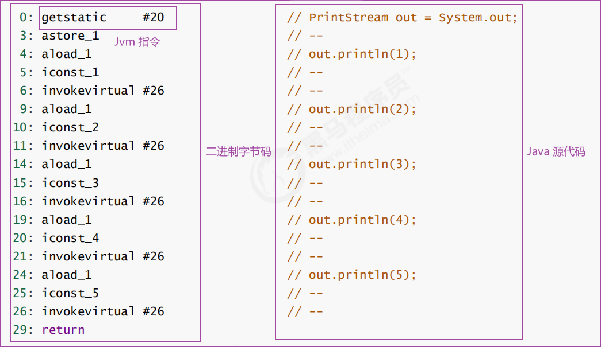

# 内存结构

## 程序计数器(Program Counter Register)

### 定义

程序计数器是存放下一条指令所在的单元的地址的地方

### 作用

当执行一条指令时，首先需要根据PC中存放的指令地址，将指令由内存取到指令寄存器中，此过程称为“取指令”。与此同时，PC中的地址或自动加1或由转移指针给出下一条指令的地址。此后经过分析指令，执行指令。完成第一条指令的执行，而后根据PC取出第二条指令的地址，如此循环，执行每一条指令

程序计数器会将 jvm 指令交给解释器解释为机器码，再将机器码将给 cpu 执行

### 特点

- 每个线程私有
- 不会存在内存溢出
