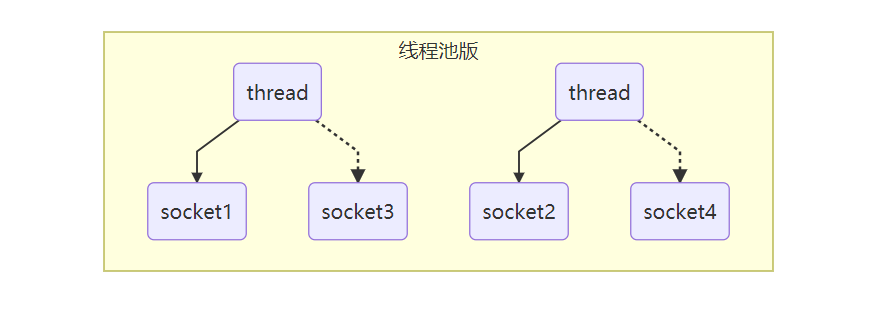
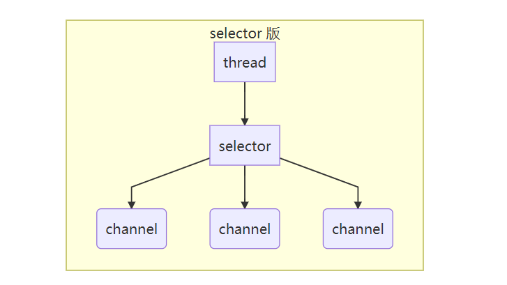

# NIO 基础

non-blocking io 非阻塞 IO

## 三大组件

### Channel & Buffer

channel 有点类似于stream，它就是读写数据的双向通道，可以从 channel 将数据读入 buffer，也可以从 buffer 将数据读入 channel，而之前的 stream 要么是输入，要么是输出，channel 比 straam 更为底层

常见的 Channel：

- FileChannel (文件)
- DatagramChannel (UDP)
- SocketChannel (TCP 客户端、服务器都可以用)
- ServerSocketChannel (TCP 服务器用)
  
Buffer 则用来缓冲读写数据，常见的 buffer：

- ByteBuffer
  - MappedByteBuffer
  - DirectByteBuffer
  - HeapByteBuffer
- ShortBuffer
- IntBuffer
- LongBuffer
- FloatBuffer
- DoubleBuffer
- CharBuffer
  
### Selector

selector 单从字面意思不好意思理解，需要结合服务器的设计演化来理解它的用途

#### 多线程版设计

**多线程版的缺点：**

- 内存占用高 (一个线程占用1M，1000个线程占用1G)
- 线程上下文切换成本高
- 只适合连接数少的场景

#### 线程池版设计

**线程池版缺点：**

- 阻塞模式下，线程仅能处理一个 socket 连接
- 仅适合短连接的场景

### Selector 版设计

selector 的作用就是配置一个线程来管理多个 channel，获取这些 channel 上发生的事件，这些 channel 工作在非阻塞模式下，不会让线程吊死在一个 channel 上。适合连接数特别多，但流量低的场景 (low traffic)

调用 selector 的 select() 会阻塞直到 channel 发生了读写就绪事件，这些事件发生，select 方法就会返回这些事件交给 thread 处理

## 