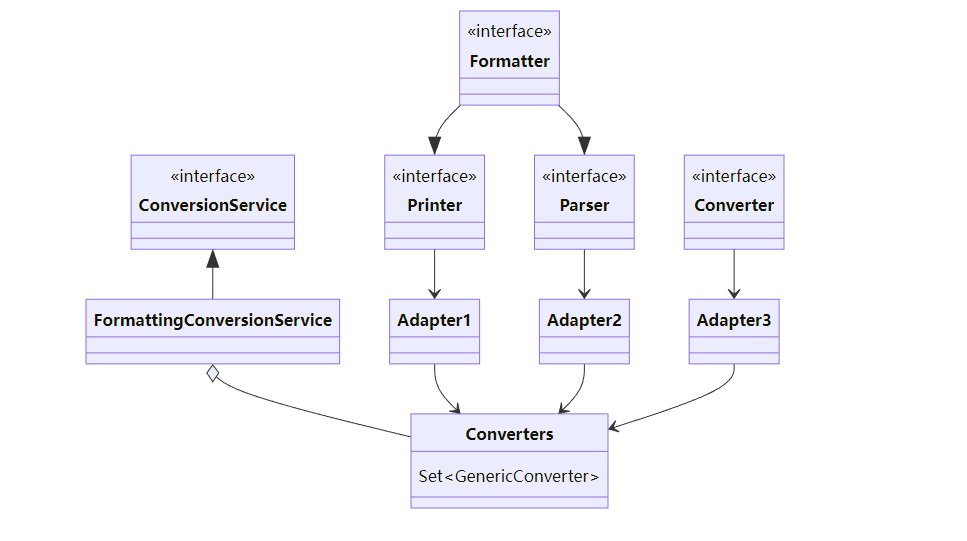
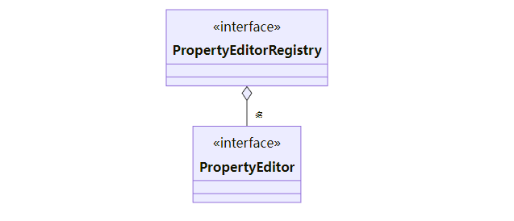
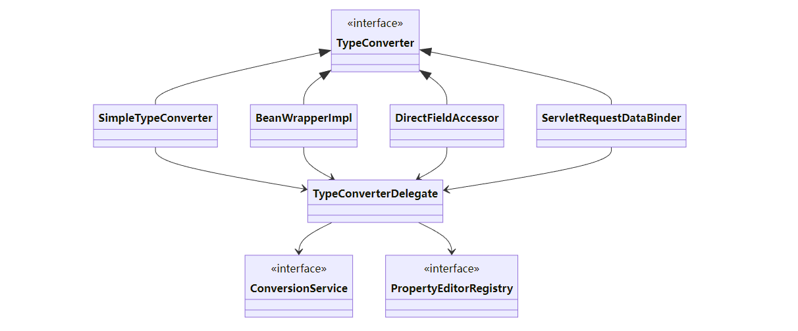

# Web

## 对象绑定与类型转换

### 底层第一套转换接口与实现

  

- Printer 把其它类型转为 String
- Parser 把 String 转为其它类型
- Formatter 综合 Printer 与 Parser 功能
- Converter 把类型 S 转为类型 T
- Printer、Parser、Converter 经过适配转换成 GenericConverter 放入 Converters 集合
- FormattingConversionService 利用其它们实现转换

### 底层第二套转换接口

  

- PropertyEditor 把 String 与其它类型相互转换
- PropertyEditorRegistry 可以注册多个 PropertyEditor 对象
- 与第一套接口直接可以通过 FormatterPropertyEditorAdapter 来进行适配

### 高层接口与实现

  

- 它们都实现了 TypeConverter 这个高层转换接口，在转换时，会用到 TypeConverter Delegate 委派ConversionService 与 PropertyEditorRegistry 真正执行转换（Facade 门面模式）
  - 首先看是否有自定义转换器, @InitBinder 添加的即属于这种 (用了适配器模式把 Formatter 转为需要的 PropertyEditor)
  - 再看有没有 ConversionService 转换
  - 再利用默认的 PropertyEditor 转换
  - 最后有一些特殊处理
- SimpleTypeConverter 仅做类型转换
- BeanWrapperImpl 为 bean 的属性赋值，当需要时做类型转换，走 Property
- DirectFieldAccessor 为 bean 的属性赋值，当需要时做类型转换，走 Field
- ServletRequestDataBinder 为 bean 的属性执行绑定，当需要时做类型转换，根据 directFieldAccess 选择走 Property 还是 Field，具备校验与获取校验结果功能

