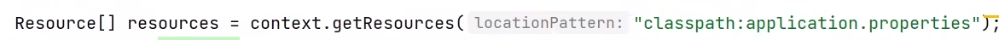

# 容器与 Bean

## BeanFactory 与 ApplicationContext

  

BeanFactory 是 ApplicationContext 的父接口

BeanFactory 才是 Spring 的核心容器，主要的 ApplicationContext 的实现都组合了它的功能

- BeanFactory能干点啥
  - 表面上只有 getBean
  - 实际上控制反转、基本的依赖注入、直至 Bean 的生命周期的各种功能，都由它的实现类提供

  

- ApplicationContext
  
ApplicationContext 的扩展功能主要体现在它的四个父接口上

  

> MessageSource - 用于处理国际化资源
>
> ResourcePatternResolver - 根据通配符匹配资源，解析为 Resource 对象
>
> EnvironmentCapable - 处理环境信息（如读取环境变量、*.yml、*.properties 中的变量）
>
> ApplicationEventPublisher - 事件发布功能

  

  

  

  

  

BeanFactory 不会做的事

1. 不会主动添加 BeanFactory 后置处理器
2. 不会主动添加 Bean 后置处理器
3. 不会主动初始化单例
4. 不会解析 ${}、#{}
